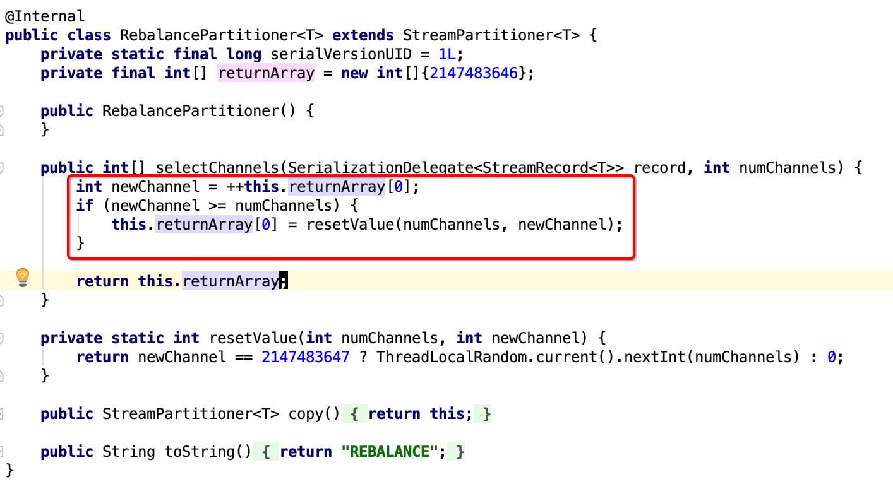

#### DataStream的partition----分区

##### 1,  Random partitoning: 随机分区

* dataStream.shuffle()
* 大致过程如下：如果下一区间分区数假设说是5，那么我随机random的从0-4中取出一个值，就确定了分区数
* 具体可以看类ShufflePartitioner内部代码

##### 2,  ReBalancing

* dataStream.rebalance()
* 代码如下：简单来说就是每次加上1，如果不超过最大分区， 那么就设置到这个分区上，如果超过了最大分区，那么从0开始，再慢慢加1，这样子是从头到尾分一遍后，再从头到尾再分，一直到分完为止
* 

##### 3,  Rescaling:

> 有一个很大的好处：网络压力小

* dataStream.rescale() 
* 如果上游2个并发，下游4个并发，那么会先把上游的1个并发结果发给下游的2个并发，另外的一个并发分配给下游的剩余两个并发
* 如果上游有4个并发，下游有2个并发，那么会把上游的2个并发结果发给下游的1个并发，剩下的两个并发结果发给下游剩下的1个并发

* rescaling和rebalance的区别是：rebalance会产生全量重分区，rescaling不会

##### 4, Custom partitioning：自定义分区

* dataStream.partitionCustom(partitioner, 0)//这里的0是只根据第一个值传递到自定义的分区类，然后根据我们自定义的规则进行分区
* 看代码im.ivanl001.a04_flink_partition.Flink_partitioner_custom

##### 5, Broadingcasting：广播，每个分区会发送一份

> 参考04-51CTO学院-09-Advanced.md文件中的内容