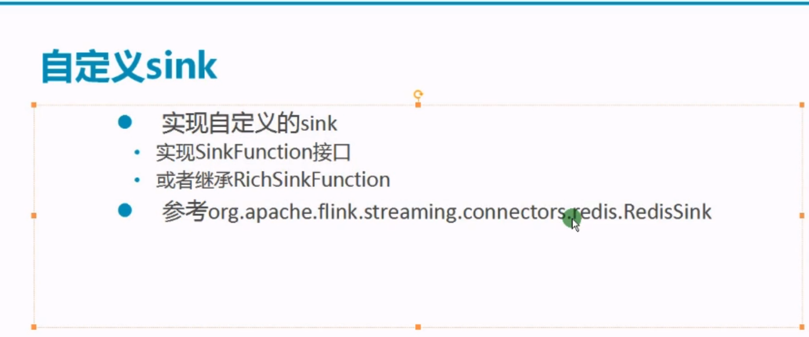

####  DataStream的sink

##### 1, writeAsText

##### 2, print()

##### 3, addSink[kafka, redis]

##### 4, 自带sink

redisSink

* 这个maven依赖下载不了，先不看了，回家换个网络再试试

5, 自定义sink

#### DataSet的sink

##### 1, writeAsText

##### 2, writeAsCSV

##### 3, print()

