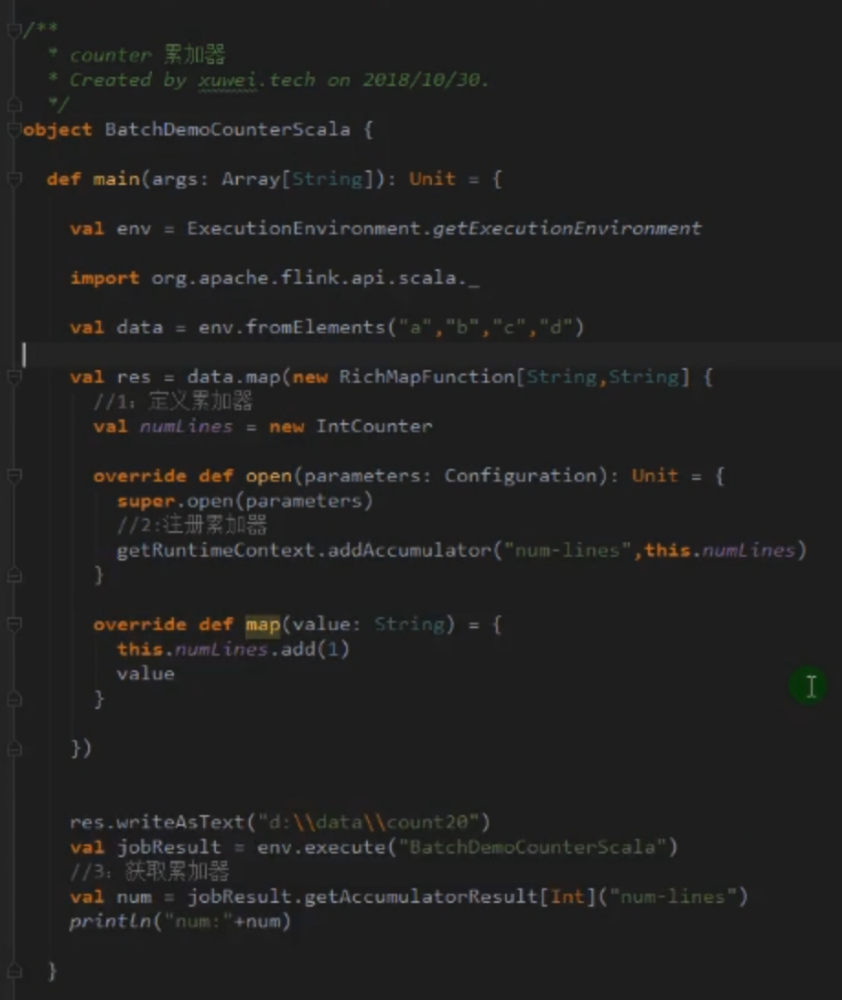
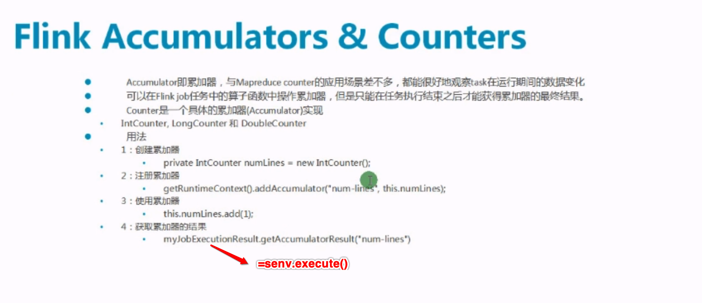
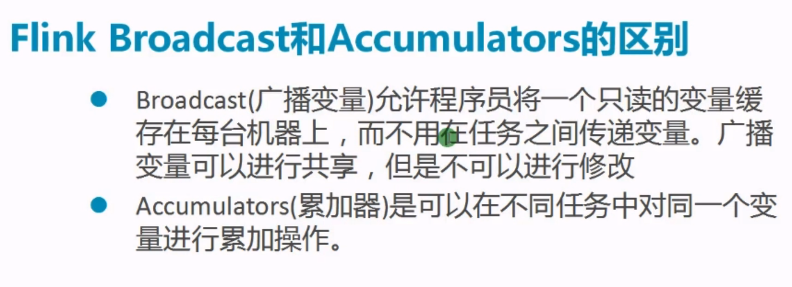
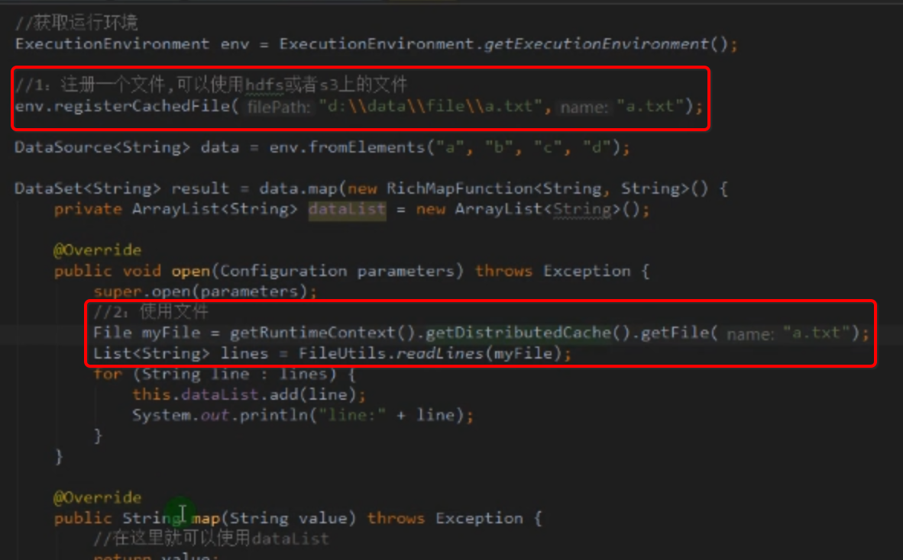

#### 1, 广播变量

在flink中有两种概念的broadcast

##### 1.1, 流处理中叫做广播， dataStream.broadcast()

* 类似于storm的allgrouping，就是分区的时候每个分区发送一份

##### 1.2, 批处理中叫做广播变量

* 广播变量允许编程人员在每台机器上只保存1个只读的缓存变量，而不是传送变量的副本给tasks
* 广播便变量创建后可以传递给集群上的任何函数， 而不需要多次传递给集群节点，但是需要记住：广播变量不应该被修改， 这样才能保证每个节点上获取的都是一样
* 简单理解：就是广播变量是一个公共的共享变量， 我们可以把一个dataset的数据集广播出去，然后不同的task节点都能获取到，这个数据在这个节点上只会存在一份。如果不使用broadcast， 则需要在每个节点的每个task都需要拷贝一份数据，比较浪费内存。
* 但是有两点需要注意
  * 广播出去的变量存在于每个节点的内存中， 所以这个数据集不能太大。因为广播出去的数据会常驻内存， 知道执行程序结束
  * 广播变量在初始化广播出去之后不支持修改， 这样才能保证每个节点的数据都是一致的

> 所以个人感觉广播变量适合放那些老死都不会变，并且数据经常被引用但是不大的数据，比如说国家省份信息，银行和编码对应关系等等

* 另外：withBroadcastSet是作用于前面的算子的，如果withBroadcastSet后面有一个算子需要使用，需要在后面的算子的后面重新withBroadcastSet哈。也就是说withBroadcastSet和算子是一一对应的，暂且这么理解

```java
package im.ivanl001.a04_flink_advanced;

import org.apache.flink.api.common.functions.RichMapFunction;
import org.apache.flink.api.java.DataSet;
import org.apache.flink.api.java.ExecutionEnvironment;
import org.apache.flink.api.java.tuple.Tuple2;
import org.apache.flink.api.java.tuple.Tuple3;
import org.apache.flink.configuration.Configuration;

import java.util.ArrayList;
import java.util.HashMap;
import java.util.List;
import java.util.Map;

/**
 * #author      : ivanl001
 * #creator     : 2019-05-14 17:45
 * #description : 广播变量的使用
 *
 * 案例说明：我数据库中存有用户与用户省份id的对应信息，如果我想要找到对应的省份， 就需要和表关联，这个时候就可以把省份表做一个广播变量，这样子多个task也是使用的同一份数据，节省内存吧
 **/
public class Flink_advanced_broadcast {
    
    public static void main(String[] args) throws Exception {

        ExecutionEnvironment benv = ExecutionEnvironment.getExecutionEnvironment();

        ArrayList<Tuple2<Integer, String>> theData = new ArrayList<>();
        theData.add(new Tuple2<>(1, "shanghai"));
        theData.add(new Tuple2<>(2, "beijing"));
        theData.add(new Tuple2<>(3, "guangzhou"));
        theData.add(new Tuple2<>(4, "shenzhen"));
        
        DataSet<Tuple2<Integer, String>> theDataset = benv.fromCollection(theData);

        ArrayList<Tuple2<String, Integer>> myData = new ArrayList<>();
        myData.add(new Tuple2<>("ivanl001", 1));
        myData.add(new Tuple2<>("ivanl002", 2));
        myData.add(new Tuple2<>("ivanl003", 3));
        myData.add(new Tuple2<>("ivanl004", 4));
        myData.add(new Tuple2<>("ivanl005", 1));
        myData.add(new Tuple2<>("ivanl006", 2));
        myData.add(new Tuple2<>("ivanl007", 3));
        myData.add(new Tuple2<>("ivanl008", 4));


        DataSet<Tuple2<String, Integer>> myDataset = benv.fromCollection(myData);

        //假设说用户信息很多，也在很多地方会用到省份表，那么就可以把省份表做成广播变量，每个节点只保存一份，而不用每次都需要传递到每个task一份
        myDataset.map(new RichMapFunction<Tuple2<String, Integer>, Tuple3<Integer, String, String>>() {

            List<Object> theList = new ArrayList<>();
            HashMap<Integer, String> theMap = new HashMap<>();

            @Override
            public void open(Configuration parameters) throws Exception {

                super.open(parameters);
                this.theList = getRuntimeContext().getBroadcastVariable("province");
                for (Object obj : theList) {
                    Tuple2<Integer, String> tuple2 = (Tuple2<Integer, String>) obj;
                    theMap.put(tuple2.f0, tuple2.f1);
                }
                System.out.println(theMap);
            }

            @Override
            public Tuple3<Integer, String, String> map(Tuple2<String, Integer> value) throws Exception {
                //这里就可以用map做相应的处理即可
                return new Tuple3<Integer, String, String>(value.f1, value.f0, theMap.get(value.f1));
            }
        }).withBroadcastSet(theDataset, "province").print();
    }
}
```


#### 2, 累加器

* 分布式累加，可以计算不同节点上的总和
* 只有在任务结束之后才能获取到累加器的最终结果
* 








#### 3, 计数器(累加器的具体实现)

* 教程里没说具体的， 就先不管了


#### 4, 分布式缓存-distributed cach

> 程序执行时候，flink自动将注册的文件或者目录复制到所有的taskmanager节点的本地文件系统，用户可以通过这个指定的名称查找文件或者目录，然后从taskmanager节点的本地文件系统访问。这个时候只有磁盘IO没有网络IO，提高效率。





