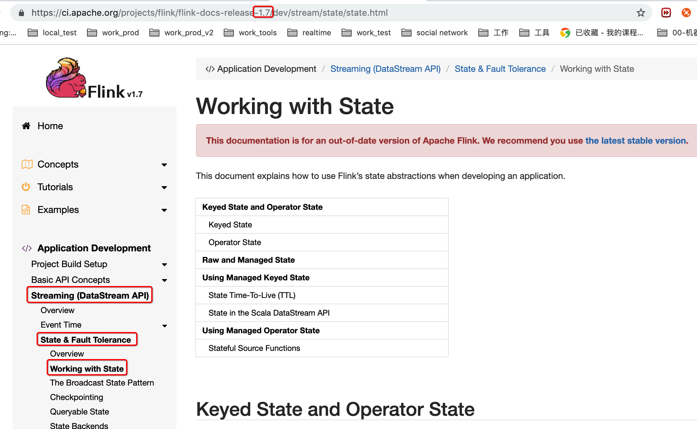
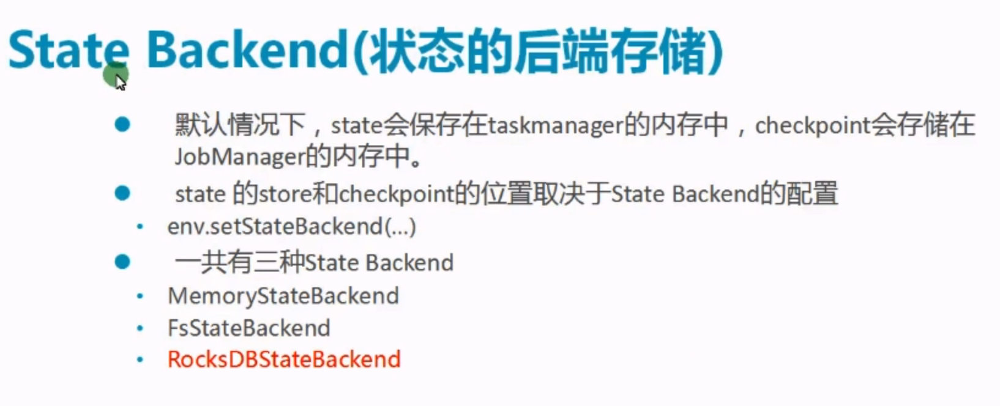
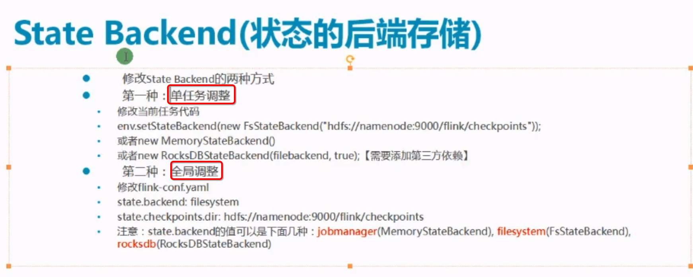
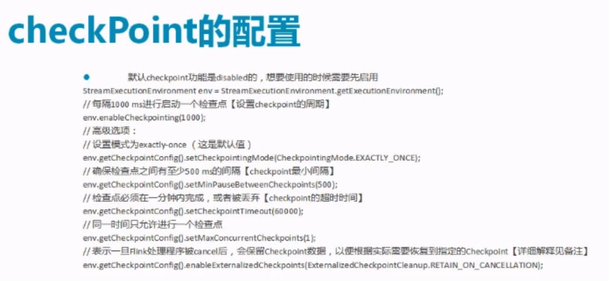

#### 5, state

https://ci.apache.org/projects/flink/flink-docs-release-1.7/dev/stream/state/state.html

state默认是保存在节点的java的堆内存中，而checkpoint是把某一时刻的所有的state都存储下来，相当于一个全局的状态快照

##### 5.1, keystate

ValueState<T>

ListState<T>

ReducingState<T>

MapState<T>

##### 5.2, operatorstate

ListState<T>

#### 6, checkpoint

> 状态保存之后(默认保存在堆内存)，如果程序意外死亡，是需要进行容错处理的，容错处理可以直接使用checkpoint即可, checkpoint有不同的语义，包括最少一次，仅一次等等，checkpoint也要指定状态保存的方式等等

> state.checkpoints.num-retained: 4//保存多个检查点

#### 7, 重启策略

##### 7.1, fixed delay

* 固定间隔，每个设定的时间就重启一次
* 启用了checkpoint，默认是固定间隔重启策略

##### 7.2, failure rate

* 失败率

##### 7.3, no restart

* 不重启
* 在未启动checkpoint的时候默认是不重启策略

#### 8, savepoint

