#### 9, window

##### 9.1, window分类

###### 第一种分类：

* timewindow

* countwindow

###### 第二种分类：

* tumbling windows：滚动窗口（没有重叠）

* sliding windows：滑动窗口（有重叠）

* session windows: 会话窗口（类似web编程里面的session， 以不活动间隙作为分割）

  

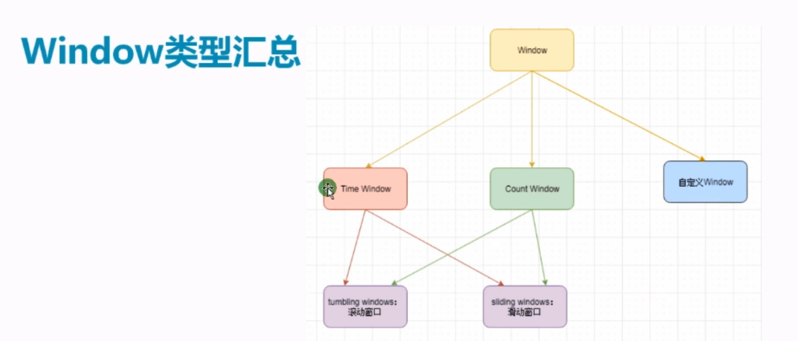

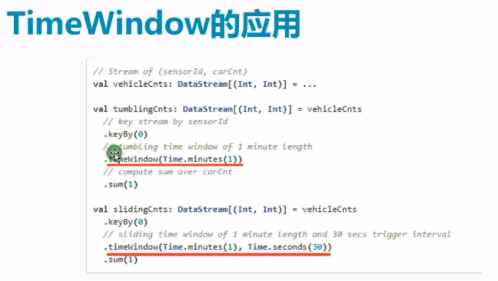

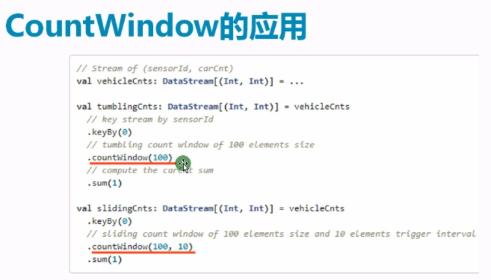

##### 9.2, window聚合分类

###### 增量聚合

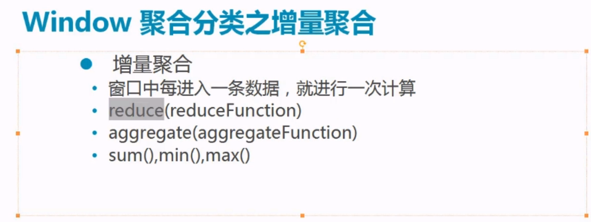

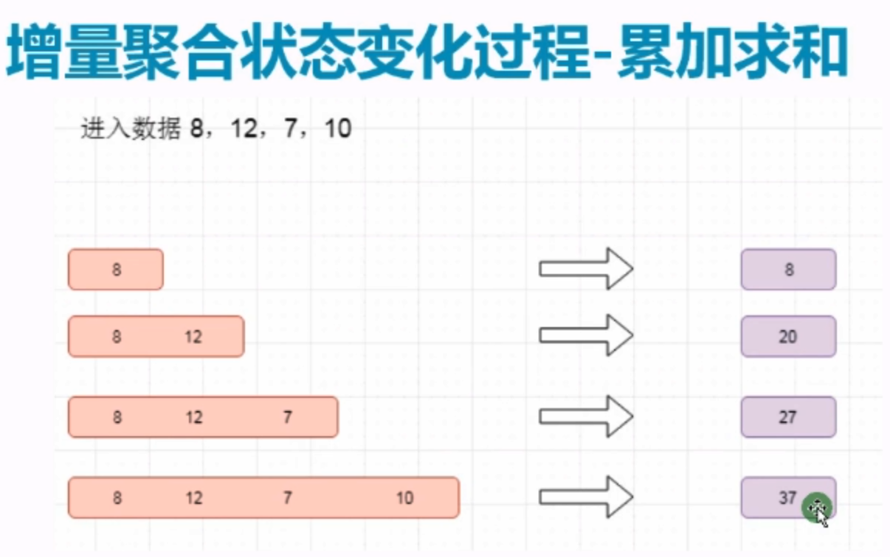

###### 全量聚合

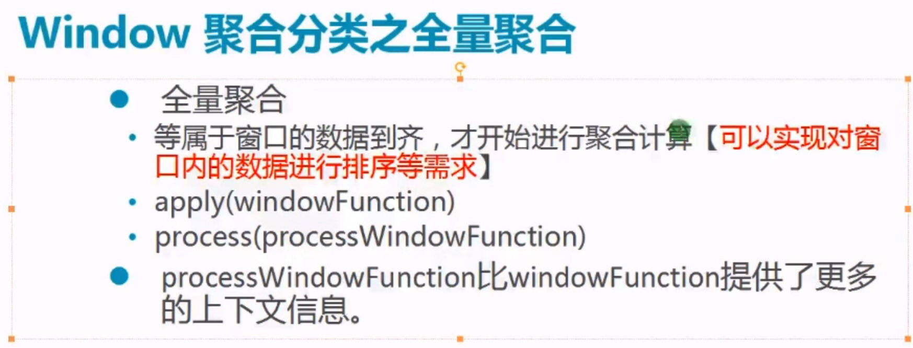

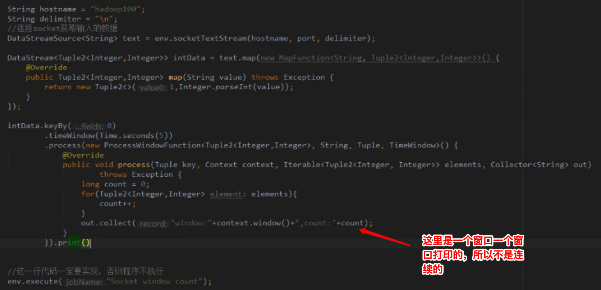

#### 10, time

##### 10.1, event time

* 事件产生事件，比如说日志产生时间

##### 10.2, ingest time

* 事件进入flink的时间

##### 10.3, processing time

* 事件被处理的时间

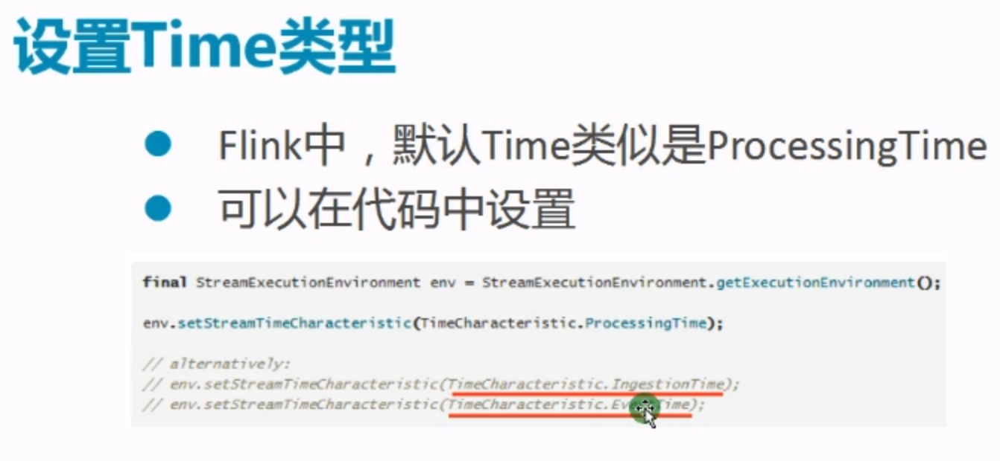

#### 11, watermark

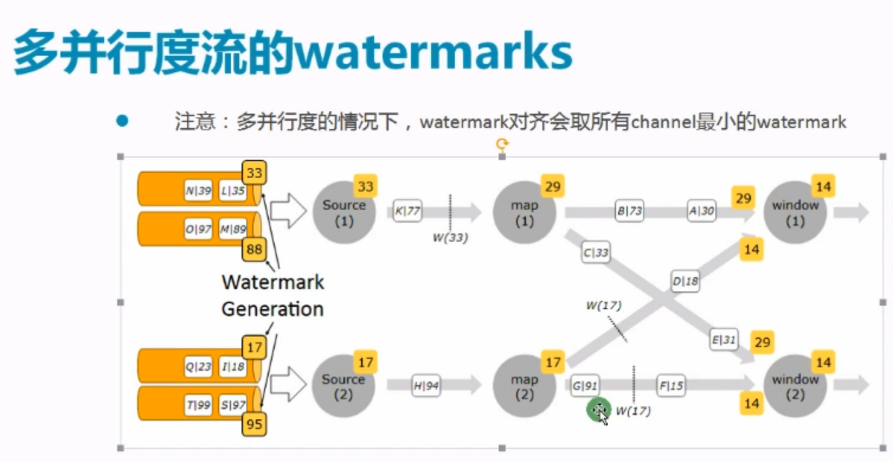

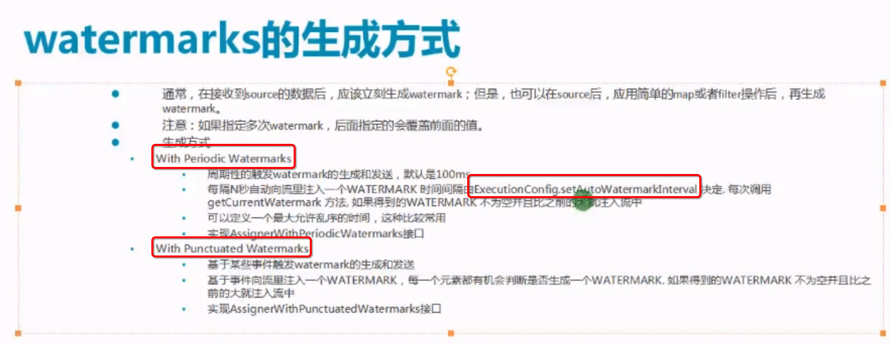

具体的使用方法：

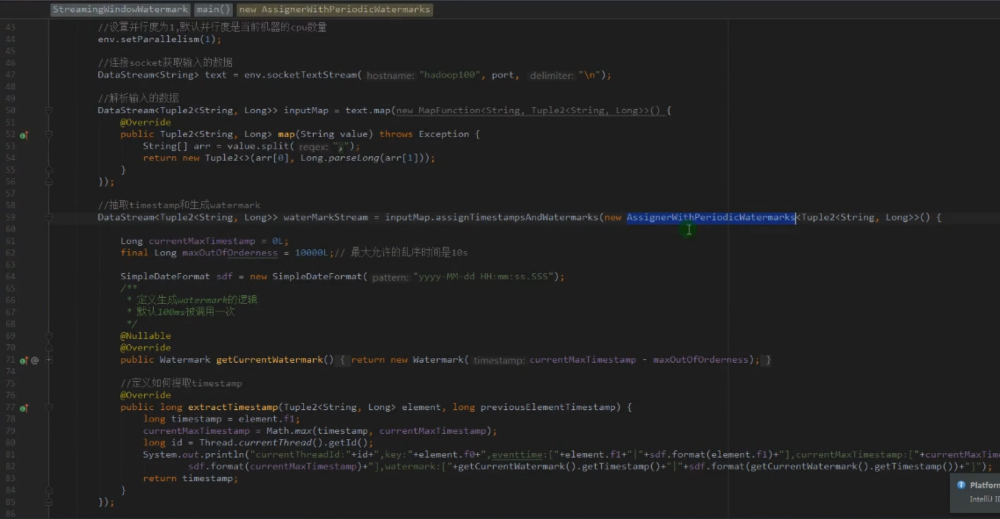

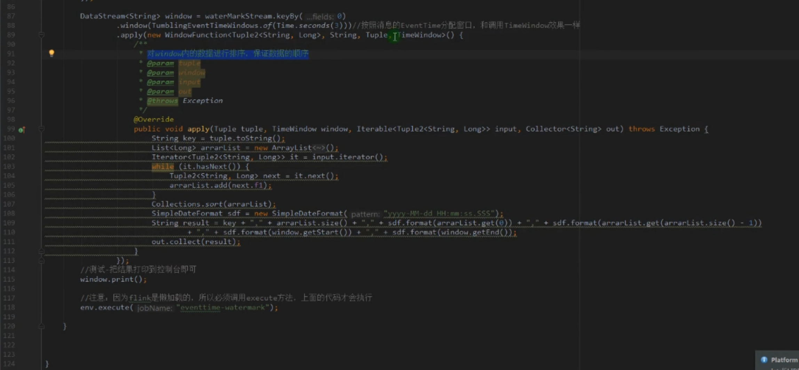