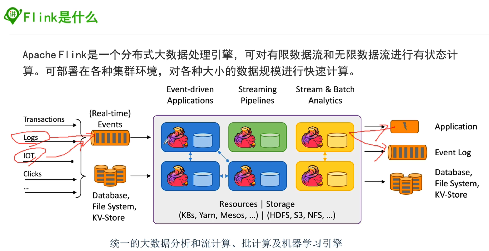
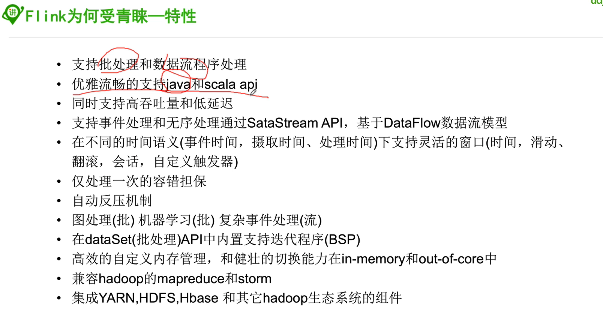
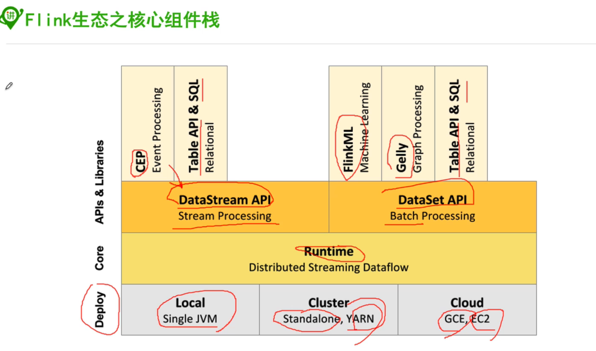
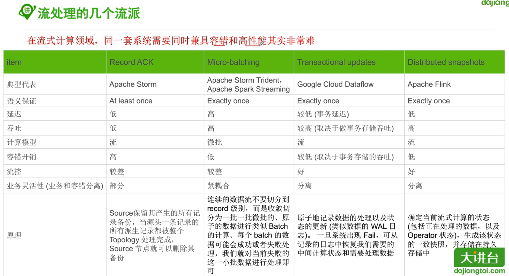
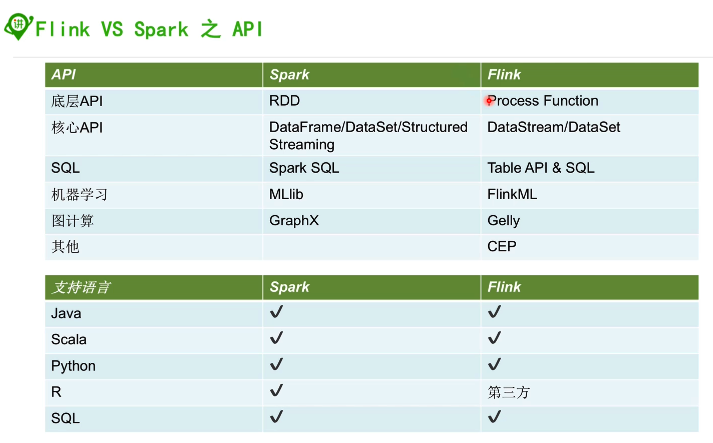

> 如果上流生产能力和下流处理能力不协调应该如何解决？

用消息队列，可以进行数据堆积。如果观察到数据发生堆积，就代表需要下流进行扩容，及时进行扩容，不会对数据产生特别大的影响

> flinkx

基于flink的一款分布式数据同步工具，地址：https://github.com/DTStack/flinkx

#### 1, flink是什么

#### 2, flink特性

* 支持事件处理和无序处理
* 仅处理一次容错担保
* 自动反压机制

全部如下：

#### 3, flink核心组件

* runtime

#### 4, 分类和比较

#### 5, flink项目构建

java版本：https://ci.apache.org/projects/flink/flink-docs-release-1.7/dev/projectsetup/java_api_quickstart.html

scala版本：https://ci.apache.org/projects/flink/flink-docs-release-1.7/dev/projectsetup/scala_api_quickstart.html

- 项目中有批处理和流处理， 分别简单学习一下即可

#### 6, 自学方法github代码

https://github.com/apache/flink

- 这里面有很多flink的代码，可以用来学习，也有很多examples

#### 7, flink的分层架构

##### 3.1, processFunction

https://ci.apache.org/projects/flink/flink-docs-release-1.7/dev/stream/operators/process_function.html

##### 3.2, core api

- datastream api
- dataset api

##### 3.3, table api & sql

#### 8, flink的编程流程

