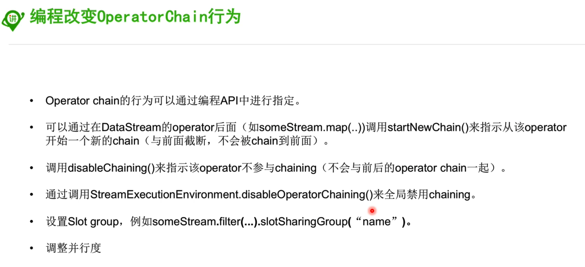

#### 1, window

##### 1.1, window分类

###### 第一种分类：

- timewindow

- countwindow

###### 第二种分类：

- tumbling windows：滚动窗口（没有重叠）
- sliding windows：滑动窗口（有重叠）
- session windows: 会话窗口（类似web编程里面的session， 以不活动间隙作为分割）

#### 2, time

##### 2.1, event time

- 事件产生事件，比如说日志产生时间

##### 2.2, ingest time

- 事件进入flink的时间

##### 2.3, processing time

- 事件被处理的时间

#### 3, stateful operation

##### 3.1, operator state

一对一的操作所对应的状态

##### 3.2, keyed state

一对多的操作对应的状态

#### 4, checkpoints

> 在某一时刻， 将所有的state的状态做一个快照， 存储到statebackend里面去

#### 5, savepoint

#### 6, 运行时

##### 两个不同的operator纵向的合并成一个task，叫做operatorchain

##### 两个不同的operator横向的分享一个slot，就叫做共享slot

source并行1，flatmap并行6， 那那么flatmap就会共享source的slot

