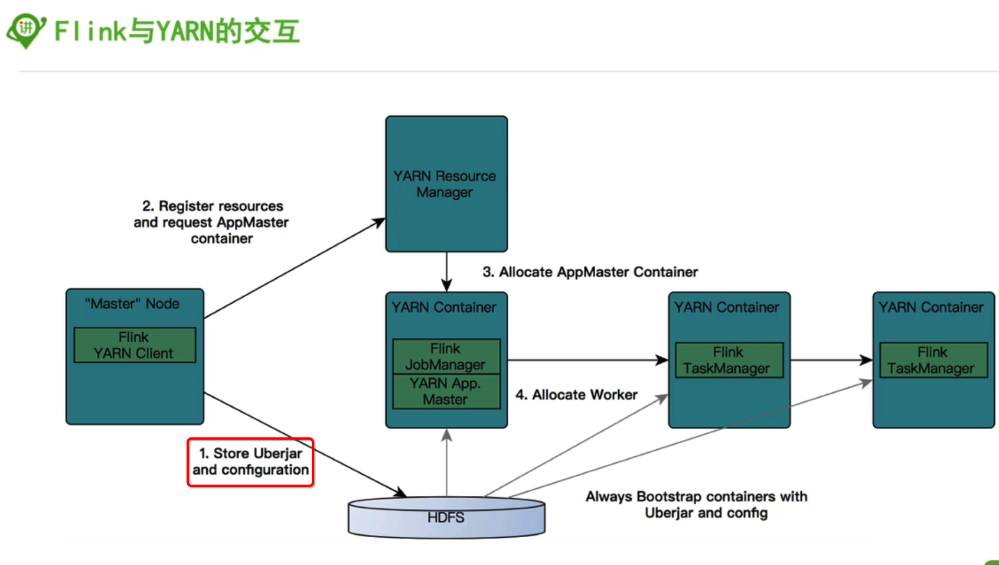
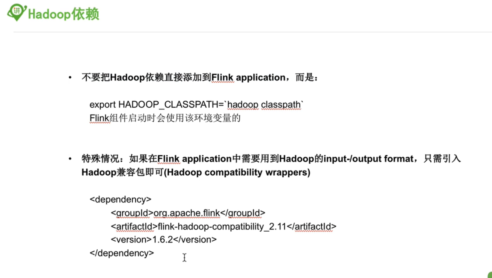

#### 1，部署

具体的部署方案参考00部署那节哈

本来配置了standalone，后来配置了on-yarn模式后，再重新调会到standalone就不行了， 先不管了，先用on-yarn模式吧， on-yarn的ha模式因为虚拟机资源不够用，所以还是先不用ha模式

standalone不管用可能是因为hdfs端口的问题， 把配置文件中的9000改成8020就好了

#### 2，hadoop依赖：

#### 3，编译

编译过一次， 网络等问题，没成功， 算了， 先不管了， 如果有需要编译， 请看教程

