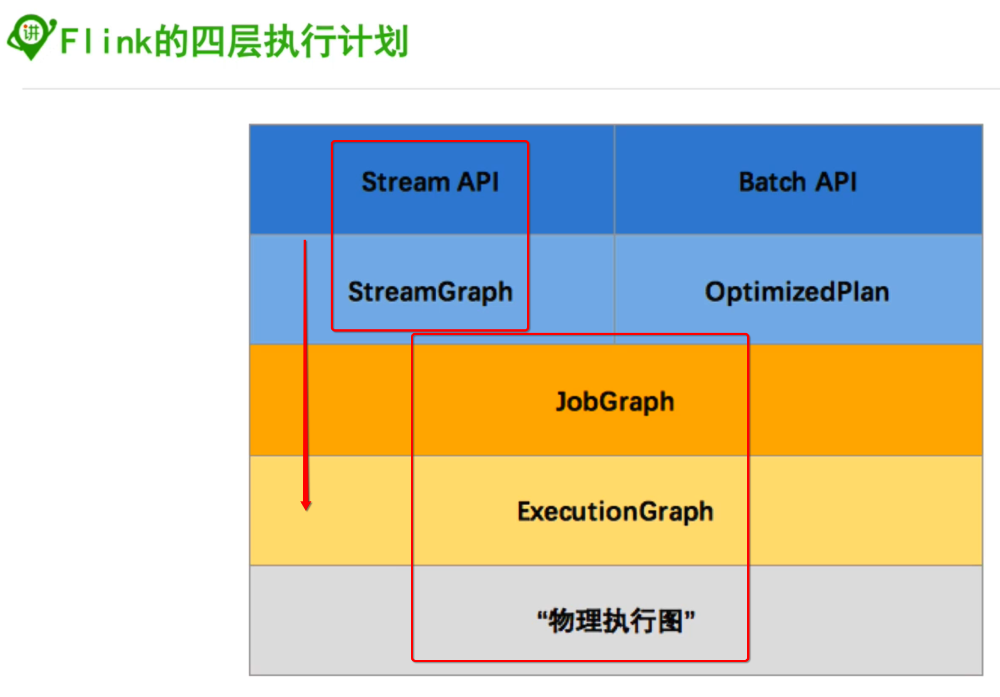
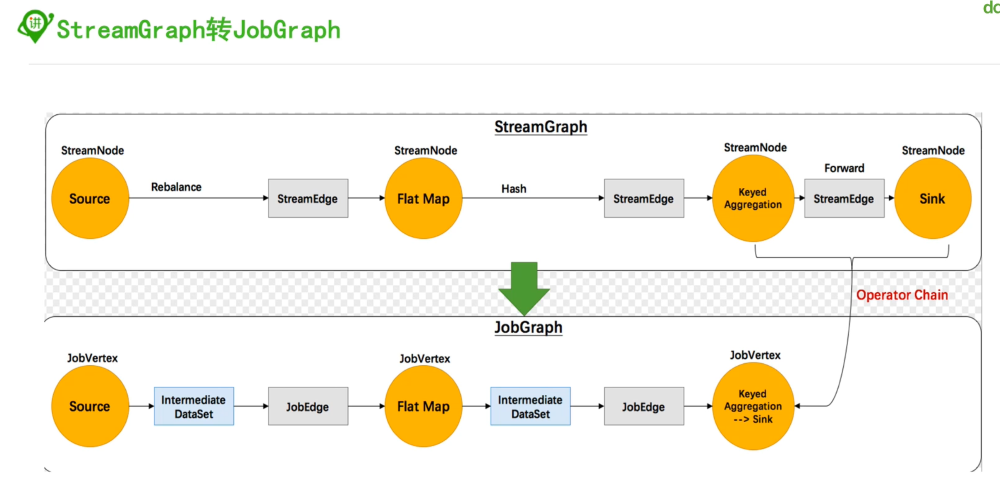

#### 1, 执行Graph




##### 1.1, 首先在clinet端生成streamGraph


##### 1.2, 然后在client端把StreamGraph转换成JobGraph，把可以合并的组成oparator-chain




##### 1.3,然后JobManager根据JobGraph生成ExecutionGraph，处理并行化的内容


#### 2, source

略

参考如下两节内容即可：

“03-若泽数据-03-flink-source”

“03-若泽数据-04-flink-source-自定义”


#### 3, Transformation


#### 4, sink

略，无特别多的内容

参考

“04-51CTO学院-07-sink”即可


#### 5, execution的参数


##### 5.1, senv.setBufferTimeout(100);

* 默认数据不会一条一条进行flush并传递到下一算子
* 100是两个flush之间的时间间隔，默认就是100ms
* 如果设置成-1，代表缓存满了才会flush，不管中间间隔多久
* 如果设置成接近较小的数，可以减少延迟，但是会降低吞吐
* 如果设置的比较大，延迟会高，但是吞吐会比较大


#### 6, 分区


​      

#### 7, time

* eventtime

  * 一般情况下都是使用这个

  * > env.setStreamTimeCharacteristic(TimeCharacteristic.EventTime);

* ingesttime

* processingtime

  * 不设置的情况下默认是这个

* 


#### 8, watermark和timestamp


##### watermark有两种：


> 注意：只有基于eventtime的流处理程序才需要指定时间戳和watermark

##### 8.0, 设置时间戳的代码

```java
//2, 设置时间和水印
env.setStreamTimeCharacteristic(TimeCharacteristic.EventTime);

DataStream<Transcript> input1=env.fromElements(TRANSCRIPTS).assignTimestampsAndWatermarks(new AscendingTimestampExtractor<Transcript>() {
  @Override
  public long extractAscendingTimestamp(Transcript element) {
    return element.time;
  }
});

DataStream<Student> input2=env.fromElements(STUDENTS).assignTimestampsAndWatermarks(new AscendingTimestampExtractor<Student>() {
  @Override
  public long extractAscendingTimestamp(Student element) {
    return element.time;
  }
});
```


##### 8.1,  TimeStamp和Watermark直接Source中生成，默认，直接继承SourceFunction或者RichSourceFunction, 重写run方法，比较少，基本不用


##### 8.2, timestamp assigner/watermark generator


* 上图中国呢的MytimestampsAndWatermarks类是通过如下方式继承自定义出来的
* 
* 
* 

* 
* 
* 

#### 9, 迭代

* 直接看代码

```java
package im.ivanl001.a07_flink_iterative;

import org.apache.flink.api.common.functions.FilterFunction;
import org.apache.flink.api.common.functions.MapFunction;
import org.apache.flink.streaming.api.datastream.DataStream;
import org.apache.flink.streaming.api.datastream.DataStreamSource;
import org.apache.flink.streaming.api.datastream.IterativeStream;
import org.apache.flink.streaming.api.datastream.SingleOutputStreamOperator;
import org.apache.flink.streaming.api.environment.StreamExecutionEnvironment;

/**
 * #author      : ivanl001
 * #creator     : 2019-05-17 20:31
 * #description : 作用就是判断是否是大于等于5， 如果是，表示满足条件，如果不是，需要迭代加1， 直到满足大于等于5这个条件为止，最后打印出来
 **/
public class Flink_Iterative {


    public static void main(String[] args) throws Exception {

        //1, 获取流运行环境
        StreamExecutionEnvironment senv = StreamExecutionEnvironment.getExecutionEnvironment();
        DataStreamSource<Long> longDataStreamSource = senv.generateSequence(1, 10);

//        longDataStreamSource.print();
//        System.out.println("================111====================");

        //2, 创建迭代头
        IterativeStream<Long> iterate = longDataStreamSource.iterate();

        //3, 进行迭代逻辑
        SingleOutputStreamOperator<Long> data = iterate.map(new MapFunction<Long, Long>() {
            @Override
            public Long map(Long value) throws Exception {
                return value+1;
            }
        });

        //4, 迭代过滤条件，满足条件的赋予下面的那个迭代中
        SingleOutputStreamOperator<Long> step = data.filter(new FilterFunction<Long>() {
            @Override
            public boolean filter(Long value) throws Exception {
                return value < 5;
            }
        });

        //5, 满足条件的数据进行迭代，直到关闭
        DataStream<Long> longDataStream = iterate.closeWith(step);

        //6, 把最终满足条件的过滤出来放行即可
        DataStream<Long> resultDS = data.filter(new FilterFunction<Long>() {
            @Override
            public boolean filter(Long value) throws Exception {
                return value >= 5;
            }
        });

        //6, 如果迭代结束,后续操作
        resultDS.print();

        //7, 执行
        senv.execute("iterative");
    }
}
```

#### 10，任务链和资源组


