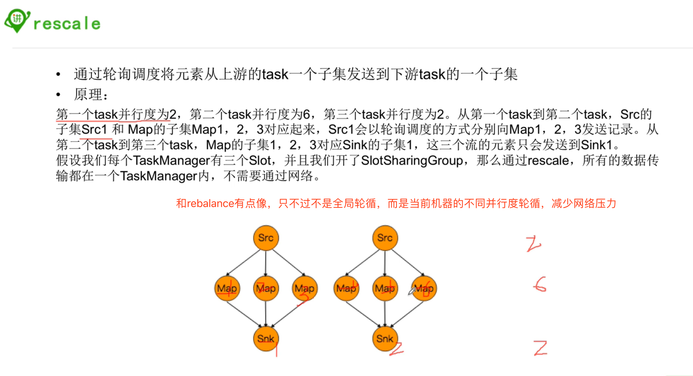

#### 6, transformations

##### 6.1, keyby 

```java
//1, 第一种方式：直接下标，但是注意一下：这里的返回值的key是Tuple，这是固定的哈
KeyedStream<Tuple4, Tuple> keyedStream01 = data.keyBy(0);
keyedStream01.print();

//2, 第二种方式：这里key的返回值可以是string哈
KeyedStream<Tuple4<String, String, String, String>, String> keyedStream02 = data.keyBy(new KeySelector<Tuple4<String, String, String, String>, String>() {
  @Override
  public String getKey(Tuple4<String, String, String, String> value) throws Exception {
    return value.f0;
  }
});
keyedStream02.print();
```


##### 6.2, keyby之后的聚合操作：reduce和process

* reduce的返回值必须是输入值这个比较坑。。。只能更新部分字段

* process是底层的聚合操作，可以进行更加丰富的操作，如果有需要可以自己定义返回值等

```java
//reduce的返回值必须是输入值这个比较坑。。。不太合理
keyedStream.reduce(new ReduceFunction<Tuple4<String, String, String, Integer>>() {
            @Override
            public Tuple4<String, String, String, Integer> reduce(Tuple4<String, String, String, Integer> value1, Tuple4<String, String, String, Integer> value2) throws Exception {
                value1.f3 += value2.f3;
                return value1;
            }
        }).print();


//这里可以定义返回值， 那么就可以丢弃那些不需要的字段，如下，只返回了key和value两个值
keyedStream.process(new KeyedProcessFunction<String, Tuple4<String,String,String,Integer>, Object>() {
  @Override
  public void processElement(Tuple4<String, String, String, Integer> value, Context ctx, Collector<Object> out) throws Exception {
    System.out.println(ctx.getCurrentKey());
    out.collect(new Tuple2<String, Integer>(ctx.getCurrentKey(), value.f3));
  }
}).print();
```


##### 6.3, intervalJoin

- 流的聚合操作是要有时间间隔的

- 能够进行intervalJoin的两个stream应该要是keyedStream
- 

```java
package im.ivanl001.a03_flink_transform_java;

import org.apache.flink.api.java.functions.KeySelector;
import org.apache.flink.api.java.tuple.Tuple5;
import org.apache.flink.streaming.api.TimeCharacteristic;
import org.apache.flink.streaming.api.datastream.DataStream;
import org.apache.flink.streaming.api.datastream.KeyedStream;
import org.apache.flink.streaming.api.environment.StreamExecutionEnvironment;
import org.apache.flink.streaming.api.functions.co.ProcessJoinFunction;
import org.apache.flink.streaming.api.functions.timestamps.AscendingTimestampExtractor;
import org.apache.flink.streaming.api.windowing.time.Time;
import org.apache.flink.util.Collector;

/**
 * #author      : ivanl001
 * #creator     : 2019-05-19 05:58
 * #description : 这个是教程里面的一个案例
 **/
public class Flink_transformations09_intervalJoin {


    public static void main(String[] args) throws Exception {

        //1, 获取流环境
        final StreamExecutionEnvironment env=StreamExecutionEnvironment.getExecutionEnvironment();

        //2, 设置时间和水印
        env.setStreamTimeCharacteristic(TimeCharacteristic.EventTime);

        DataStream<Transcript> input1=env.fromElements(TRANSCRIPTS).assignTimestampsAndWatermarks(new AscendingTimestampExtractor<Transcript>() {
            @Override
            public long extractAscendingTimestamp(Transcript element) {
                return element.time;
            }
        });

        DataStream<Student> input2=env.fromElements(STUDENTS).assignTimestampsAndWatermarks(new AscendingTimestampExtractor<Student>() {
            @Override
            public long extractAscendingTimestamp(Student element) {
                return element.time;
            }
        });

        //3, 分别把datastream转换成keyeddstream
        KeyedStream<Transcript,String> keyedStream=input1.keyBy(new KeySelector<Transcript, String>() {
            @Override
            public String getKey(Transcript value) throws Exception {
                return value.id;
            }
        });

        KeyedStream<Student,String>  otherKeyedStream=input2.keyBy(new KeySelector<Student, String>() {
            @Override
            public String getKey(Student value) throws Exception {
                return value.id;
            }
        });

        //4, 进行实时流的连接，具体between可以见源码注解
        //e1.timestamp + lowerBound <= e2.timestamp <= e1.timestamp + upperBound
        // key1 == key2 && leftTs - 2 < rightTs < leftTs + 2
        keyedStream.intervalJoin(otherKeyedStream)
                .between(Time.milliseconds(-2), Time.milliseconds(2))
                .upperBoundExclusive()
                .lowerBoundExclusive()
                .process(new ProcessJoinFunction<Transcript, Student, Tuple5<String,String,String,String,Integer>>() {

                    @Override
                    public void processElement(Transcript transcript, Student student, Context ctx, Collector<Tuple5<String, String, String, String, Integer>> out) throws Exception {
                        out.collect(Tuple5.of(transcript.id,transcript.name,student.class_,transcript.subject,transcript.score));
                    }

                }).print();

        env.execute();

    }

    public static final Transcript[] TRANSCRIPTS = new Transcript[] {
            new Transcript("1","张三","语文",100,System.currentTimeMillis()),
            new Transcript("2","李四","语文",78,System.currentTimeMillis()),
            new Transcript("3","王五","语文",99,System.currentTimeMillis()),
            new Transcript("4","赵六","语文",81,System.currentTimeMillis()),
            new Transcript("5","钱七","语文",59,System.currentTimeMillis()),
            new Transcript("6","马二","语文",97,System.currentTimeMillis())
    };

    public static final Student[] STUDENTS = new Student[] {
            new Student("1","张三","class1",System.currentTimeMillis()),
            new Student("2","李四","class1",System.currentTimeMillis()),
            new Student("3","王五","class1",System.currentTimeMillis()),
            new Student("4","赵六","class2",System.currentTimeMillis()),
            new Student("5","钱七","class2",System.currentTimeMillis()),
            new Student("6","马二","class2",System.currentTimeMillis())
    };

    private static class Transcript{
        private String id;
        private String name;
        private String subject;
        private int score;
        private long time;
        public Transcript(String id, String name, String subject, int score, long time) {
            this.id = id;
            this.name = name;
            this.subject = subject;
            this.score = score;
            this.time = time;
        }
        public String getId() {
            return id;
        }
        public void setId(String id) {
            this.id = id;
        }
        public String getName() {
            return name;
        }
        public void setName(String name) {
            this.name = name;
        }
        public String getSubject() {
            return subject;
        }
        public void setSubject(String subject) {
            this.subject = subject;
        }
        public int getScore() {
            return score;
        }
        public void setScore(int score) {
            this.score = score;
        }
        public long getTime() {
            return time;
        }
        public void setTime(long time) {
            this.time = time;
        }
    }

    private static class Student{
        private String id;
        private String name;
        private String class_;
        private long time;
        public Student(String id, String name, String class_, long time) {
            this.id = id;
            this.name = name;
            this.class_ = class_;
            this.time = time;
        }
        public String getId() {
            return id;
        }
        public void setId(String id) {
            this.id = id;
        }
        public String getName() {
            return name;
        }
        public void setName(String name) {
            this.name = name;
        }
        public String getClass_() {
            return class_;
        }
        public void setClass_(String class_) {
            this.class_ = class_;
        }
        public long getTime() {
            return time;
        }
        public void setTime(long time) {
            this.time = time;
        }
    }
}
```

##### 6.4, connect

* union和connect类似，不过比connect要简单， 之前也已经看过，这里就不再说了
* connect的一个很大的好处是一个线程可以做两个运算， 提高性能，节省资源

```java
package im.ivanl001.a03_flink_transform_java;

import org.apache.flink.streaming.api.datastream.ConnectedStreams;
import org.apache.flink.streaming.api.datastream.DataStream;
import org.apache.flink.streaming.api.environment.StreamExecutionEnvironment;
import org.apache.flink.streaming.api.functions.co.CoFlatMapFunction;
import org.apache.flink.util.Collector;

/**
 * #author      : ivanl001
 * #creator     : 2019-05-19 06:17
 * #description :
 **/
public class Flink_transformations09_connect {

    public static void main(String[] args) throws Exception {

        //1, 获取流环境
        final StreamExecutionEnvironment env=StreamExecutionEnvironment.getExecutionEnvironment();

        //2, 准备数据
        DataStream<Long> someStream = env.generateSequence(0,10);
        DataStream<String> otherStream = env.fromElements(WORDS);

        //3, 进行连接
        ConnectedStreams<Long, String> connectedStreams = someStream.connect(otherStream);

        //4, 连接后的数据进行分别处理
        DataStream<String> result=connectedStreams.flatMap(new CoFlatMapFunction<Long, String, String>() {

            @Override
            public void flatMap1(Long value, Collector<String> out) throws Exception {
                out.collect(value.toString());
            }

            @Override
            public void flatMap2(String value, Collector<String> out) {
                for (String word: value.split("\\W+")) {
                    out.collect(word);
                }
            }
        });

        //5, 执行
        result.print();
        env.execute();
    }

    public static final String[] WORDS = new String[] {
            "And thus the native hue of resolution",
            "Is sicklied o'er with the pale cast of thought;",
            "And enterprises of great pith and moment,",
            "With this regard, their currents turn awry,",
            "And lose the name of action.--Soft you now!",
            "The fair Ophelia!--Nymph, in thy orisons",
            "Be all my sins remember'd."
    };
}
```

##### 6.5, split和select

- 根据规则把一个数据流切分成多个流
- select和split配合使用，选择被切分后的流

```scala
//原来还可以这么用，厉害
val splitedStream = senv.addSource(new Custom_Source).split(new OutputSelector[Long] {
  override def select(out: Long): lang.Iterable[String] = {
    val list = new util.ArrayList[String]()
    if(out%2==1){
      list.add("even")
    }else{
      list.add("odd")
    }
    list
  }
})

splitedStream.select("even").print()
```

##### 6.6, project

* 简单理解就是缩减字段啦


```java
package im.ivanl001.a03_flink_transform_java;

import org.apache.flink.api.java.tuple.Tuple2;
import org.apache.flink.api.java.tuple.Tuple4;
import org.apache.flink.streaming.api.datastream.DataStream;
import org.apache.flink.streaming.api.datastream.DataStreamSource;
import org.apache.flink.streaming.api.environment.StreamExecutionEnvironment;

/**
 * #author      : ivanl001
 * #creator     : 2019-05-19 06:22
 * #description :
 **/
public class Flink_transformations11_project {

    public static void main(String[] args) throws Exception {

        //1, 流运行环境
        final StreamExecutionEnvironment env=StreamExecutionEnvironment.getExecutionEnvironment();

        //2, 准备数据
        DataStreamSource<Tuple4<String,String,String,Integer>> input=env.fromElements(TRANSCRIPT);

        //3, project操作
        DataStream<Tuple2<String, Integer>> out = input.project(1,3);

        //4, 打印运行
        out.print();
        env.execute();

    }

    public static final Tuple4[] TRANSCRIPT = new Tuple4[] {
            Tuple4.of("class1","张三","语文",100),
            Tuple4.of("class1","李四","语文",78),
            Tuple4.of("class1","王五","语文",99),
            Tuple4.of("class2","赵六","语文",81),
            Tuple4.of("class2","钱七","语文",59),
            Tuple4.of("class2","马二","语文",97)
    };
}

/*结果如下：

7> (马二,97)
6> (钱七,59)
2> (张三,100)
5> (赵六,81)
4> (王五,99)
3> (李四,78)
*/

```

##### 6.7, 分区

可参考“04-51CTO学院-06-partition”小节





##### 6.8, max, maxby等

* 不同的地方：
* 从下面的对比可以看到：maxby会更新整条数据后返回，但是max会只更新最大的那个值，整条数据的其他内容还会保持和第一条不变，如下面的第二个字段， 
* 如果用maxBy(3)， 那么第二个字段会进行适当的更新，
* 但是如果用的是max(3)， 那么第二个字段根本不会更新，都是保持和第一条一样的。只会更新max(3)中指定的第四个元素的值哦

```java
//使用数据
Tuple4.of("class1", "ivanl001", "a", 110),
Tuple4.of("class1", "ivanl003", "a", 121),
Tuple4.of("class1", "ivanl004", "a", 1431),

Tuple4.of("class2", "ivanl002", "a", 113),
Tuple4.of("class2", "ivanl006", "a", 1531),
Tuple4.of("class2", "ivanl007", "a", 1221),

Tuple4.of("class3", "ivanl005", "a", 151)
  
//对上述数据的第一个元素进行keyBy，然后maxBy(3)
3> (class1,ivanl001,a,110)
3> (class1,ivanl003,a,121)
3> (class1,ivanl004,a,1431)

1> (class2,ivanl002,a,113)
1> (class2,ivanl006,a,1531)
1> (class2,ivanl006,a,1531)

6> (class3,ivanl005,a,151)

  
  
//对上述数据的第一个元素进行keyBy，然后max(3)
3> (class1,ivanl001,a,110)
3> (class1,ivanl001,a,121)
3> (class1,ivanl001,a,1431)

1> (class2,ivanl002,a,113)
1> (class2,ivanl002,a,1531)
1> (class2,ivanl002,a,1531)

6> (class3,ivanl005,a,151)

```

