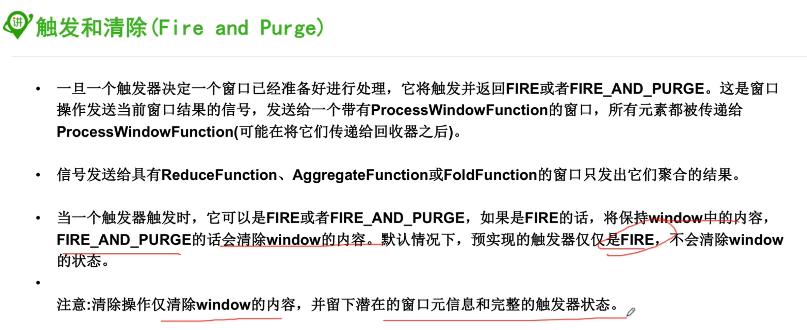

### 1, 什么是窗口

* flink中Batch是Streaming的一个特例，其底层是一个流式引擎。而Window就是Streaming到batch的一个桥梁

* Window是一种切割无限数据集为有限块并进行相应处理的一种处理手段

### 2, Window分类

#### 2.1, Keyed window

* 多任务并行的

#### 2.2, non-keyed window

* 单任务窗口，并行度为1


### 3, window生命周期

#### 3.1,创建

* 属于该窗口的第一个元素到达时候创建该窗口

#### 3.2, 逻辑

* window函数中会定义应用该window中内容的计算逻辑

#### 3.3, 触发

* Trigger触发器

#### 3.4, 驱逐器

* 用于清楚窗口中的元素

#### 3.5, 销毁

* 当时间超过窗口的结束时间戳+用户指定的延迟时间的时候， 窗口将会被移除(允许1分钟的时延)


### 4, window assigner并分类

#### 4.1, 什么是窗口分配器

> 窗口分配器， 当决定了是否keyby之后， window是没有构建的， 需要制定一个窗口分配器用于决定元素如何分配到窗口中去


#### 4.2, 根据assigner的窗口分类

根据窗口分配器的不同，可以把窗口细分如下几类：

##### 4.2.1, Count-based window

###### 01, Tumbling window

* 数量翻滚窗口

###### 02, Sliding window

* 数量滑动窗口

##### 4.2.2, Time-based window

>  注意：时间窗口是前包后不包， [start time, end time)

###### 01, Tumbling window

* 时间翻滚窗口
* 

###### 02, Sliding window

* 时间滑动窗口
* 

###### 03, Session window

* 时间session窗口，很少用
* 
* 


##### 4.2.3, Global window

* 所有相同key的所有元素都被分配到同一个全局window
* 但是不会自己触发，需要自定义触发器才能出发哦
* 

### 5, 预定义的keyed window

> 预定义的就是把窗口和分配器以另外一种更加简洁的方式的api
>
> 可以把下面的api和上面的api进行对比，发现， 不需要使用.window(…), 而是直接使用.timeWindow()或者需要的其他简单方式直接调用即可


### 6, 预定义的non-keyed window


### 7, 窗口函数

#### 7.1, 什么是窗口函数

* 简单来说，就是作用在window上的operator，也即是作用在窗口上的算子
* 

#### 7.2, 有哪些窗口函数


##### 7.2.1, reduce等窗口上的聚合函数

* 这个是累加的, 增量计算
* ReduceFunction
* 这个函数的相对AggregateFunction相对简单点，但是灵活性比较小， 不能更深入的定义我们想要的计算

```java
package im.ivanl001.a08_flink_window;

import org.apache.flink.api.common.functions.ReduceFunction;
import org.apache.flink.api.java.tuple.Tuple4;
import org.apache.flink.streaming.api.datastream.DataStreamSource;
import org.apache.flink.streaming.api.datastream.SingleOutputStreamOperator;
import org.apache.flink.streaming.api.environment.StreamExecutionEnvironment;

import java.util.stream.Stream;

/**
 * #author      : ivanl001
 * #creator     : 2019-07-19 16:58
 * #description :
 **/
public class Flink_window_reduce_on_window {

    public static void main(String[] args) throws Exception {

        StreamExecutionEnvironment senv = StreamExecutionEnvironment.getExecutionEnvironment();

        DataStreamSource<Tuple4<String, String, String, Integer>> theStreamSource = senv.fromElements(theData);

        //求各个班级的英语总分
        //这里有一点需要注意：因为count是2才会激活窗口并发送到后面，所以最后如果是奇数的话， 最后一个数字是计算不到里面的哦

        //reduce聚合
        SingleOutputStreamOperator<Tuple4<String, String, String, Integer>> reduceResult = theStreamSource.keyBy(0).countWindow(2).reduce(new ReduceFunction<Tuple4<String, String, String, Integer>>() {
            @Override
            public Tuple4 reduce(Tuple4<String, String, String, Integer> value1, Tuple4<String, String, String, Integer> value2) throws Exception {
                return new Tuple4<>(value1.f0, value1.f1, value1.f2, value1.f3 + value2.f3);
            }
        });

        //sum等聚合
        /*SingleOutputStreamOperator<Tuple4<String, String, String, Integer>> reduceResult = theStreamSource.keyBy(0).countWindow(2).sum(3);*/

        reduceResult.print();

        senv.execute("reduce_on_window");

    }

    public static final Tuple4[] theData = new Tuple4[]{
            Tuple4.of("class1", "ivanl001", "english", 110),
            Tuple4.of("class1", "ivanl003", "english", 121),
            Tuple4.of("class1", "ivanl004", "english", 1431),

            Tuple4.of("class2", "ivanl002", "english", 113),
            Tuple4.of("class2", "ivanl006", "english", 1531),
            Tuple4.of("class2", "ivanl007", "english", 1221),

            Tuple4.of("class3", "ivanl005", "english", 151)
    };
}
```

##### 7.2.2, AggregateFunction

* 更灵活，可以自定义更多的算法

```java
package im.ivanl001.a08_flink_window;

import org.apache.flink.api.common.functions.AggregateFunction;
import org.apache.flink.api.common.functions.ReduceFunction;
import org.apache.flink.api.java.tuple.Tuple2;
import org.apache.flink.api.java.tuple.Tuple4;
import org.apache.flink.streaming.api.datastream.DataStreamSource;
import org.apache.flink.streaming.api.datastream.SingleOutputStreamOperator;
import org.apache.flink.streaming.api.environment.StreamExecutionEnvironment;

/**
 * #author      : ivanl001
 * #creator     : 2019-07-19 17:25
 * #description :
 **/
public class Flink_window02_AggregateFunction_on_window {

    public static void main(String[] args) throws Exception {

        StreamExecutionEnvironment senv = StreamExecutionEnvironment.getExecutionEnvironment();

        DataStreamSource<Tuple4<String, String, String, Integer>> theStreamSource = senv.fromElements(theData);

        //求各个班级的英语平均分
        //这里有一点需要注意：因为count是2才会激活窗口并发送到后面，所以最后如果是奇数的话， 最后一个数字是计算不到里面的哦
        SingleOutputStreamOperator<Double> reduceResult = theStreamSource.keyBy(0).countWindow(2).aggregate(new IMAggregate());

        reduceResult.print();

        senv.execute("reduce_on_window");

    }

    public static class IMAggregate implements AggregateFunction<Tuple4<String, String, String, Integer>, Tuple2<Long, Long>, Double> {

        @Override
        public Tuple2<Long, Long> createAccumulator() {
            //这个是累加器，用来保存中间状态， 第一个保存分数总和，第二个保存个数
            return new Tuple2<>(0L, 0L);
        }

        @Override
        public Tuple2<Long, Long> add(Tuple4<String, String, String, Integer> value, Tuple2<Long, Long> accumulator) {
            return new Tuple2<>(accumulator.f0+value.f3, accumulator.f1+1L);
        }

        @Override
        public Double getResult(Tuple2<Long, Long> accumulator) {
            return (double)accumulator.f0/accumulator.f1;
        }

        @Override
        public Tuple2<Long, Long> merge(Tuple2<Long, Long> a, Tuple2<Long, Long> b) {
            return new Tuple2<>(a.f0+b.f0, a.f1+b.f1);
        }
    }


    public static final Tuple4[] theData = new Tuple4[]{
            Tuple4.of("class1", "ivanl001", "english", 110),
            Tuple4.of("class1", "ivanl003", "english", 121),
            Tuple4.of("class1", "ivanl004", "english", 1431),

            Tuple4.of("class2", "ivanl002", "english", 113),
            Tuple4.of("class2", "ivanl006", "english", 1531),
            Tuple4.of("class2", "ivanl007", "english", 1221),

            Tuple4.of("class3", "ivanl005", "english", 151)
    };
}
```


##### 7.2.3, ProcessWindowFunction等

- 

```java
package im.ivanl001.a08_flink_window;

import org.apache.flink.api.java.tuple.Tuple;
import org.apache.flink.api.java.tuple.Tuple2;
import org.apache.flink.api.java.tuple.Tuple4;
import org.apache.flink.streaming.api.datastream.DataStreamSource;
import org.apache.flink.streaming.api.datastream.SingleOutputStreamOperator;
import org.apache.flink.streaming.api.environment.StreamExecutionEnvironment;
import org.apache.flink.streaming.api.functions.windowing.ProcessWindowFunction;
import org.apache.flink.streaming.api.windowing.windows.GlobalWindow;
import org.apache.flink.util.Collector;

/**
 * #author      : ivanl001
 * #creator     : 2019-07-19 17:51
 * #description :
 **/
public class Flink_window03_ProcessWindowFunction {

    public static void main(String[] args) throws Exception {

        StreamExecutionEnvironment senv = StreamExecutionEnvironment.getExecutionEnvironment();

        DataStreamSource<Tuple4<String, String, String, Integer>> theStreamSource = senv.fromElements(theData);

        //求各个班级的英语平均分
        //这里有一点需要注意：因为count是2才会激活窗口并发送到后面，所以最后如果是奇数的话， 最后一个数字是计算不到里面的哦
        SingleOutputStreamOperator<Double> processResult = theStreamSource.keyBy(0).countWindow(2).process(new ProcessWindowFunction<Tuple4<String, String, String, Integer>, Double, Tuple, GlobalWindow>() {
            @Override
            public void process(Tuple tuple, Context context, Iterable<Tuple4<String, String, String, Integer>> elements, Collector<Double> out) throws Exception {

                long sum = 0;
                long count = 0;
                String key = null;

                for (Tuple4<String, String, String, Integer> tuple4 : elements) {
                    sum += tuple4.f3;
                    count += 1;
                    key = tuple4.f0;
                }

                out.collect((double) sum / count);
            }
        });

        processResult.print();


        senv.execute("reduce_on_window");
    }
    
    public static final Tuple4[] theData = new Tuple4[]{
            Tuple4.of("class1", "ivanl001", "english", 110),
            Tuple4.of("class1", "ivanl003", "english", 121),
            Tuple4.of("class1", "ivanl004", "english", 1431),

            Tuple4.of("class2", "ivanl002", "english", 113),
            Tuple4.of("class2", "ivanl006", "english", 1531),
            Tuple4.of("class2", "ivanl007", "english", 1221),

            Tuple4.of("class3", "ivanl005", "english", 151)
    };
}
```

##### 7.2.4, 混用


```java
package im.ivanl001.a08_flink_window;

import org.apache.flink.api.common.functions.ReduceFunction;
import org.apache.flink.api.java.tuple.Tuple;
import org.apache.flink.api.java.tuple.Tuple4;
import org.apache.flink.streaming.api.datastream.DataStreamSource;
import org.apache.flink.streaming.api.datastream.SingleOutputStreamOperator;
import org.apache.flink.streaming.api.environment.StreamExecutionEnvironment;
import org.apache.flink.streaming.api.functions.windowing.ProcessWindowFunction;
import org.apache.flink.streaming.api.windowing.windows.GlobalWindow;
import org.apache.flink.util.Collector;

/**
 * #author      : ivanl001
 * #creator     : 2019-07-19 19:22
 * #description :
 **/
public class Flink_window04_reduce_and_processWindowFunction_together {

    public static void main(String[] args) throws Exception {

        StreamExecutionEnvironment senv = StreamExecutionEnvironment.getExecutionEnvironment();

        DataStreamSource<Tuple4<String, String, String, Integer>> theStreamSource = senv.fromElements(theData);

        //求各个班级的英语总分
        //这里有一点需要注意：因为count是2才会激活窗口并发送到后面，所以最后如果是奇数的话， 最后一个数字是计算不到里面的哦

        //reduce聚合
        SingleOutputStreamOperator<Tuple4<String, String, String, Integer>> reduceResult = theStreamSource.keyBy(0).countWindow(2).reduce(new IMReduceFunction(), new IMProcessWindowFunction());

        reduceResult.print();

        senv.execute("reduce_on_window");

    }

    public static class IMProcessWindowFunction extends ProcessWindowFunction<Tuple4<String, String, String, Integer>, Tuple4<String, String, String, Integer>, Tuple, GlobalWindow>{

        @Override
        public void process(Tuple tuple, Context context, Iterable<Tuple4<String, String, String, Integer>> elements, Collector<Tuple4<String, String, String, Integer>> out) throws Exception {
            Tuple4<String, String, String, Integer> tuple4 = elements.iterator().next();
            out.collect(tuple4);
        }
    }

    public static class IMReduceFunction implements ReduceFunction<Tuple4<String, String, String, Integer>> {

        @Override
        public Tuple4<String, String, String, Integer> reduce(Tuple4<String, String, String, Integer> value1, Tuple4<String, String, String, Integer> value2) throws Exception {
            return new Tuple4<>(value1.f0, value1.f1, value1.f2, value1.f3 + value2.f3);
        }
    }

    public static final Tuple4[] theData = new Tuple4[]{
            Tuple4.of("class1", "ivanl001", "english", 110),
            Tuple4.of("class1", "ivanl003", "english", 121),
            Tuple4.of("class1", "ivanl004", "english", 1431),

            Tuple4.of("class2", "ivanl002", "english", 113),
            Tuple4.of("class2", "ivanl006", "english", 1531),
            Tuple4.of("class2", "ivanl007", "english", 1221),

            Tuple4.of("class3", "ivanl005", "english", 151)
    };
}
```


### 8, 触发器

#### 8.1, 触发器概念





### 9, 驱逐器Evictor


### 10, 窗口延迟


### 11, 窗口化操作结果


