### 1, cogroup和join

* 这两个和intervaljoin不同的地方是：这两个是处理dataStream的， 而intervaljoin是处理keyStream的
* 

#### 1.1, cogroup


>  简单来说，就是两个dataStream通过cogroup组合，相当于两张表通过full outer join进行连接，然后相同的key会被放到同一个窗口中去，在这个窗口里，通过参数的两个数组可以分别取出相同的key来自不同流的各个数据。即一个窗口中的所有数据的key必然是相同的,而且只需要调用一次内部的coGroup即可一次性取出所有相同key的所有元素
>
> 具体看代码

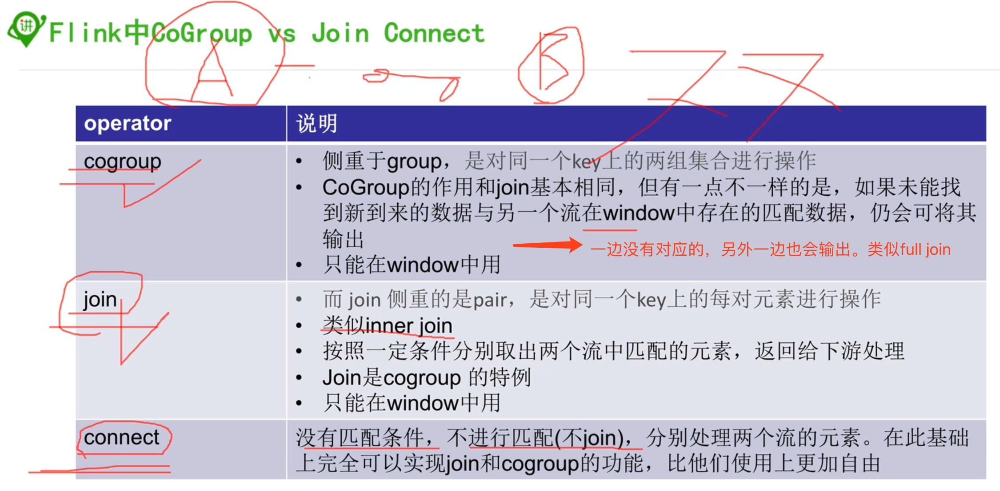

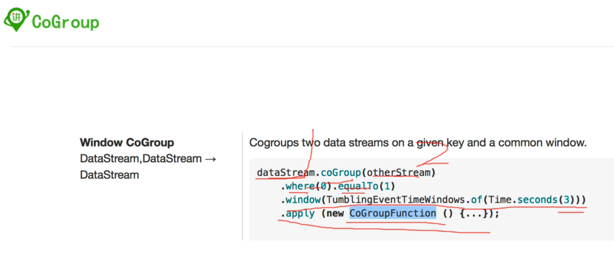


```java
package im.ivanl001.a08_flink_window;

import org.apache.flink.api.common.functions.CoGroupFunction;
import org.apache.flink.api.common.functions.MapFunction;
import org.apache.flink.api.java.functions.KeySelector;
import org.apache.flink.streaming.api.datastream.DataStreamSource;
import org.apache.flink.streaming.api.datastream.SingleOutputStreamOperator;
import org.apache.flink.streaming.api.environment.StreamExecutionEnvironment;
import org.apache.flink.streaming.api.windowing.assigners.ProcessingTimeSessionWindows;
import org.apache.flink.streaming.api.windowing.time.Time;
import org.apache.flink.streaming.api.windowing.triggers.CountTrigger;
import org.apache.flink.util.Collector;
import scala.Tuple2;

/**
 * #author      : ivanl001
 * #creator     : 2019-07-20 09:06
 * #description : cogroup，只能作用在windows上，类似于full outer join
 *              简单来说，就是两个dataStream通过cogroup组合，相当于两张表通过full outer join进行连接，然后相同的key会被放到同一个窗口中去，在这个窗口里，通过参数的两个数组可以分别取出相同的key来自不同流的各个数据。即一个窗口中的所有数据的key必然是相同的,而且只需要调用一次内部的coGroup即可一次性取出所有相同key的所有元素
 **/
public class Flink_window05_Cogroup {

    public static void main(String[] args) throws Exception {

        StreamExecutionEnvironment senv = StreamExecutionEnvironment.getExecutionEnvironment();
        DataStreamSource<String> localSocket9 = senv.socketTextStream("localhost", 9999);
        DataStreamSource<String> localSocket8 = senv.socketTextStream("localhost", 8888);

        SingleOutputStreamOperator<Tuple2<String, String>> mapStream9 = localSocket9.map(new MapFunction<String, Tuple2<String, String>>() {
            @Override
            public Tuple2<String, String> map(String value) throws Exception {
                String[] arr = value.split("\\W+");
                return new Tuple2<>(arr[0], arr[1]);
            }
        });

        SingleOutputStreamOperator<Tuple2<String, String>> mapStream8 = localSocket8.map(new MapFunction<String, Tuple2<String, String>>() {
            @Override
            public Tuple2<String, String> map(String value) throws Exception {
                String[] arr = value.split("\\W+");
                return new Tuple2<>(arr[0], arr[1]);
            }
        });

        mapStream9.coGroup(mapStream8).where(new KeySelector<Tuple2<String, String>, String>() {
            @Override
            public String getKey(Tuple2<String, String> value) throws Exception {
                return value._1;
            }
        }).equalTo(new KeySelector<Tuple2<String, String>, String>() {
            @Override
            public String getKey(Tuple2<String, String> value) throws Exception {
                return value._1;
            }
        }).window(ProcessingTimeSessionWindows.withGap(Time.seconds(30)))
//                .trigger(CountTrigger.of(1))
                .apply(new CoGroupFunction<Tuple2<String, String>, Tuple2<String, String>, String>() {
                    @Override
                    public void coGroup(Iterable<Tuple2<String, String>> first, Iterable<Tuple2<String, String>> second, Collector<String> out) throws Exception {

                        //在这里，相同的key会进入到相同到线程里面，也就是说， 这里每个循环里面的key总是相同的
                        //也就是说，有多少个不同的key就会有多少个不同的window？这样理解对吗
                        StringBuilder stringBuilder = new StringBuilder();

                        stringBuilder.append("first data: \n");
                        for (Tuple2<String, String> item : first) {
                            stringBuilder.append("key:" + item._1 + ", value:" + item._2 + "\n");
                        }

                        stringBuilder.append("second data: \n");
                        for (Tuple2<String, String> item : second) {
                            stringBuilder.append("key:" + item._1 + ", value:" + item._2 + "\n");
                        }

                        out.collect(stringBuilder.toString());
                    }
                }).print();
        senv.execute();
    }
}
```

#### 1.2, join

> 简单来说，就是两个dataStream通过join组合，然后使用window，最后 也是相同的key都是在一个window中，但是内部的join函数是每匹配一次就会调用一次，如下，可以看到，join中内部的参数是一个数据，而不是一个数据数组
>
> 具体看代码

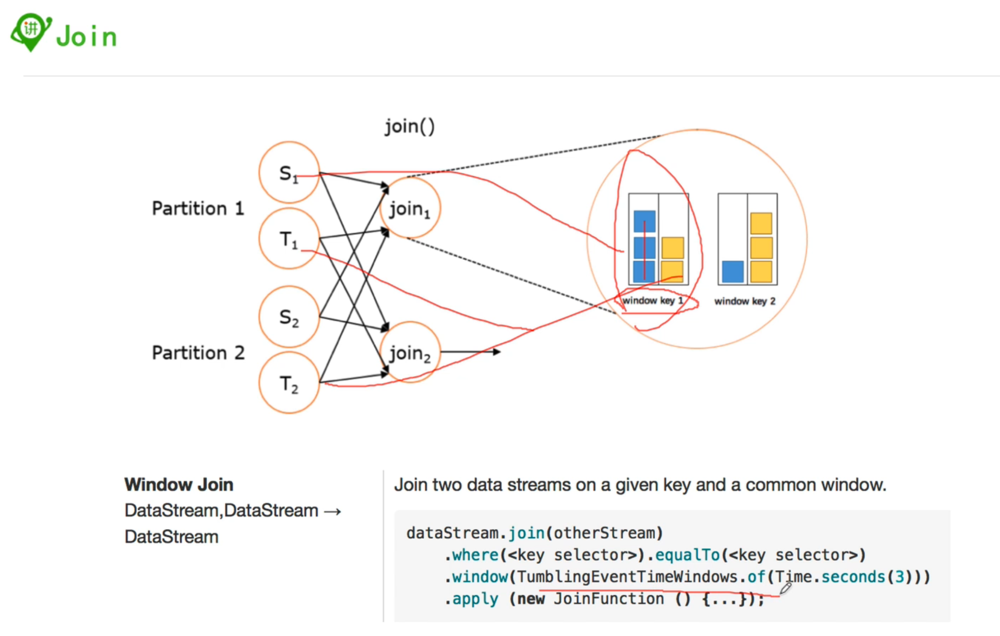


```java
package im.ivanl001.a08_flink_window;

import org.apache.flink.api.common.functions.CoGroupFunction;
import org.apache.flink.api.common.functions.JoinFunction;
import org.apache.flink.api.common.functions.MapFunction;
import org.apache.flink.api.java.functions.KeySelector;
import org.apache.flink.streaming.api.datastream.DataStreamSource;
import org.apache.flink.streaming.api.datastream.SingleOutputStreamOperator;
import org.apache.flink.streaming.api.environment.StreamExecutionEnvironment;
import org.apache.flink.streaming.api.windowing.assigners.ProcessingTimeSessionWindows;
import org.apache.flink.streaming.api.windowing.time.Time;
import org.apache.flink.streaming.api.windowing.triggers.CountTrigger;
import org.apache.flink.util.Collector;
import scala.Tuple2;

/**
 * #author      : ivanl001
 * #creator     : 2019-07-20 09:39
 * #description : join
 *              也是相同的key都是在一个window中，但是内部的join函数是每匹配一次就会调用一次，如下，可以看到，join中内部的参数是一个数据，而不是一个数据数组
 **/
public class Flink_window05_Join {
    public static void main(String[] args) throws Exception {

        StreamExecutionEnvironment senv = StreamExecutionEnvironment.getExecutionEnvironment();
        DataStreamSource<String> localSocket9 = senv.socketTextStream("localhost", 9999);
        DataStreamSource<String> localSocket8 = senv.socketTextStream("localhost", 8888);

        SingleOutputStreamOperator<Tuple2<String, String>> mapStream9 = localSocket9.map(new MapFunction<String, Tuple2<String, String>>() {
            @Override
            public Tuple2<String, String> map(String value) throws Exception {
                String[] arr = value.split("\\W+");
                return new Tuple2<>(arr[0], arr[1]);
            }
        });

        SingleOutputStreamOperator<Tuple2<String, String>> mapStream8 = localSocket8.map(new MapFunction<String, Tuple2<String, String>>() {
            @Override
            public Tuple2<String, String> map(String value) throws Exception {
                String[] arr = value.split("\\W+");
                return new Tuple2<>(arr[0], arr[1]);
            }
        });

        mapStream9.join(mapStream8).where(new KeySelector<Tuple2<String, String>, String>() {
            @Override
            public String getKey(Tuple2<String, String> value) throws Exception {
                return value._1;
            }
        }).equalTo(new KeySelector<Tuple2<String, String>, String>() {
            @Override
            public String getKey(Tuple2<String, String> value) throws Exception {
                return value._1;
            }
        }).window(ProcessingTimeSessionWindows.withGap(Time.seconds(10)))
//                .trigger(CountTrigger.of(1))
                .apply(new JoinFunction<Tuple2<String,String>, Tuple2<String,String>, String>() {
                    @Override
                    public String join(Tuple2<String, String> first, Tuple2<String, String> second) throws Exception {
                        return first._1 + "---" + first._2 + "---" + second._1 + "---" + second._2;
                    }
                }).print();
        senv.execute();
    }
}
```

### 2, ProcessFunction

 ```java
package im.ivanl001.a08_flink_window;

import org.apache.flink.api.common.state.ValueState;
import org.apache.flink.api.common.state.ValueStateDescriptor;
import org.apache.flink.api.java.functions.KeySelector;
import org.apache.flink.api.java.tuple.Tuple2;
import org.apache.flink.configuration.Configuration;
import org.apache.flink.streaming.api.TimeCharacteristic;
import org.apache.flink.streaming.api.datastream.DataStream;
import org.apache.flink.streaming.api.environment.StreamExecutionEnvironment;
import org.apache.flink.streaming.api.functions.ProcessFunction;
import org.apache.flink.streaming.api.functions.source.SourceFunction;
import org.apache.flink.streaming.api.functions.timestamps.AscendingTimestampExtractor;
import org.apache.flink.util.Collector;

import java.text.SimpleDateFormat;

/**
 * #author      : ivanl001
 * #creator     : 2019-07-20 11:06
 * #description :
 **/
public class Flink_window07_ProcessFunction {

    public static void main(String[] args) throws Exception {

        final StreamExecutionEnvironment env=StreamExecutionEnvironment.getExecutionEnvironment();

        //env.addSource(new SimpleSourceFunction()).print();

        env.setStreamTimeCharacteristic(TimeCharacteristic.EventTime);

        // the source data stream
        DataStream<OptLog> stream=env
                .addSource(new SimpleSourceFunction())
                .assignTimestampsAndWatermarks(new AscendingTimestampExtractor<OptLog>() {
                    @Override
                    public long extractAscendingTimestamp(OptLog element) {
                        return element.opTs;
                    }
                });

        stream.print();

        // apply the process function onto a keyed stream
        DataStream<Tuple2<String, Long>> result = stream
                .keyBy(new KeySelector<OptLog, String>() {

                    @Override
                    public String getKey(OptLog value) throws Exception {
                        return value.userName;
                    }
                })
                .process(new CountWithTimeoutFunction());

        result.print();

        env.execute();
    }

    /**
     * 按key计数，如果某个key在30秒之内没有新的数据到来就发出(key,count)
     */
    public static class CountWithTimeoutFunction extends ProcessFunction<OptLog, Tuple2<String, Long>> {

        /** The state that is maintained by this process function */
        //1, 首先是一个状态类，这个类中需要传入我们的模型以方便状态类记录器状态
        private ValueState<CountWithTimestamp> state;

        //2, 在打开的时候获取状态类
        @Override
        public void open(Configuration parameters) throws Exception {
            state = getRuntimeContext().getState(new ValueStateDescriptor<>("myState", CountWithTimestamp.class));
        }

        //3, 处理状态类
        @Override
        public void processElement(OptLog optLog, Context ctx, Collector<Tuple2<String, Long>> out)
                throws Exception {

            // retrieve the current count
            //3.1, 首先根据方法中的对象，创建我们的模型类
            CountWithTimestamp myModel = state.value();
            if (myModel == null) {
                myModel = new CountWithTimestamp();
                myModel.key = optLog.userName;
            }

            // update the state's count
            //3.2, 模型类创建后，做需要的处理
            myModel.count++;
            // set the state's timestamp to the record's assigned event time timestamp
            myModel.lastModified = ctx.timestamp();

            //---这里是打印个时间，方便测试而已
            SimpleDateFormat sdf = new SimpleDateFormat("yyyy-MM-dd HH:mm:ss");
            String timeStr = sdf.format(ctx.timestamp());
            System.out.println("key:" + optLog.userName + ", 修改时间：" + timeStr);


            // write the state back
            // state是一个类，这个类需要传入你的模型，这里是更新这个state，因为上面已经修改过类，需要把状态写进去
            //3.3, 把模型类写入到状态类中去
            state.update(myModel);

            // schedule the next timer 30 seconds from the current event time
            //3.4, 设计时间激活， 这里的意思是会定时30s，30s后会自动的跳用下面的onTimer方法
            //注意：这里如果在未激活前，重新进行了注册，会直接覆盖前面的激活，也即是说，前面的激活都会失效，只会有最后一个能激活
            ctx.timerService().registerEventTimeTimer(myModel.lastModified + 30000);
        }


        @Override
        public void onTimer(long timestamp, OnTimerContext ctx, Collector<Tuple2<String, Long>> out)
                throws Exception {

            // get the state for the key that scheduled the timer
            CountWithTimestamp result = state.value();

            // check if this is an outdated timer or the latest timer
            if (timestamp == result.lastModified + 30000) {

                // emit the state on timeout
                SimpleDateFormat sdf = new SimpleDateFormat("yyyy-MM-dd HH:mm:ss");
                String timeStr = sdf.format(ctx.timestamp());
                System.out.println("key:" + result.key + ", 当前改时间：" + timeStr);

                out.collect(new Tuple2<String, Long>(result.key, result.count));
            }
        }
    }

    private static class SimpleSourceFunction implements SourceFunction<OptLog> {
        private long num = 0L;
        private volatile boolean isRunning = true;
        @Override
        public void run(SourceContext<OptLog> sourceContext) throws Exception {
            while (isRunning) {
                int randomNum=(int)(1+Math.random()*(5-1+1));
                sourceContext.collect(OptLog.of(nameArray[randomNum-1],randomNum,System.currentTimeMillis()));
                num++;
                Thread.sleep(10000);
            }
        }
        @Override
        public void cancel() {
            isRunning = false;
        }

    }


    /**
     * The data type stored in the state
     */
    public static class CountWithTimestamp {
        public String key;
        public long count;
        public long lastModified;
    }

    /**
     * 操作日志
     */
    public static class OptLog{
        /**
         * 用户名
         */
        private String userName;
        /**
         * 操作类型
         */
        private int opType;
        /**
         * 时间戳
         */
        private long opTs;

        public OptLog(String userName, int opType, long opTs) {
            this.userName = userName;
            this.opType = opType;
            this.opTs = opTs;
        }

        public static OptLog of(String userName, int opType, long opTs){
            return new OptLog(userName,opType,opTs);
        }

        public String getUserName() {
            return userName;
        }

        public void setUserName(String userName) {
            this.userName = userName;
        }

        public int getOpType() {
            return opType;
        }

        public void setOpType(int opType) {
            this.opType = opType;
        }

        public long getOpTs() {
            return opTs;
        }

        public void setOpTs(long opTs) {
            this.opTs = opTs;
        }

        @Override
        public String toString() {
            return "OptLog{" +
                    "userName='" + userName + '\'' +
                    ", opType=" + opType +
                    ", opTs=" + opTs +
                    '}';
        }
    }

    public static final String[] nameArray = new String[] {
            "张三",
            "李四",
            "王五",
            "赵六",
            "钱七"
    };
}
 ```

### 3, CoprocessFunction

* coprocessFunction 和coflatmap一样，是处理两个流的哈，所以可以通过这个实现join，有更高的灵活性

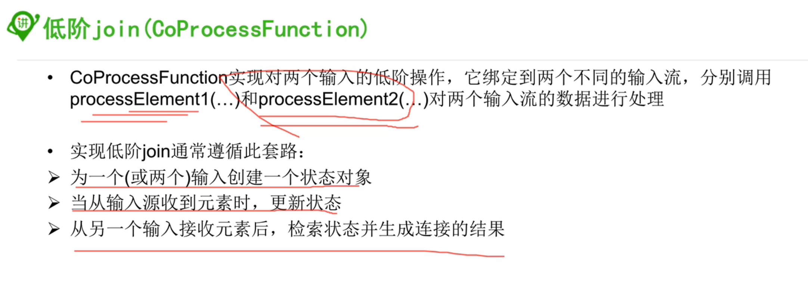

### 4, KeyProcessFunction


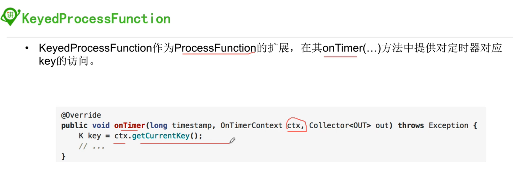

### 5, TimerService

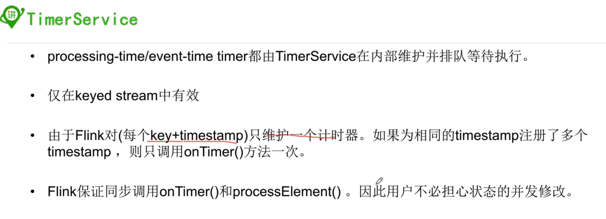

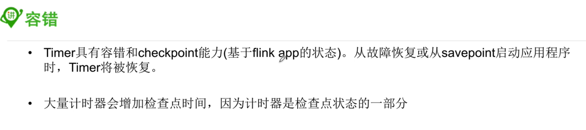

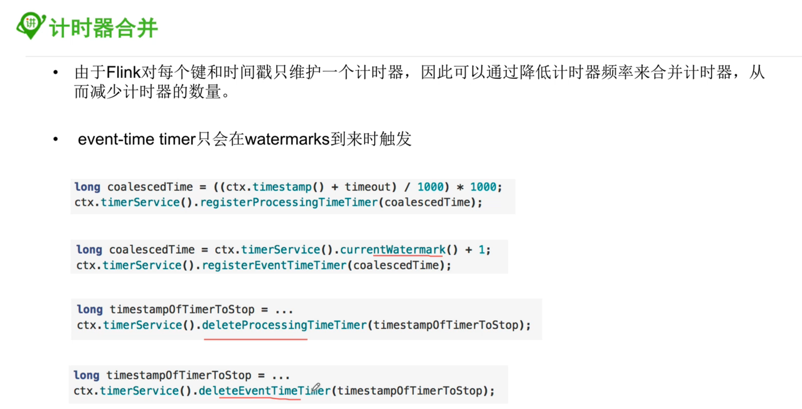

### 6, 异步IO

* 具体案例看如下代码

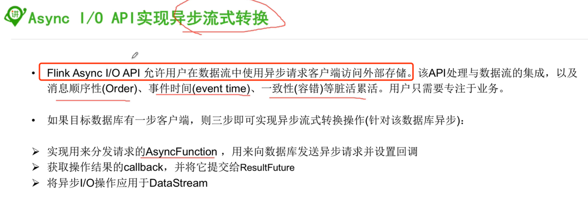

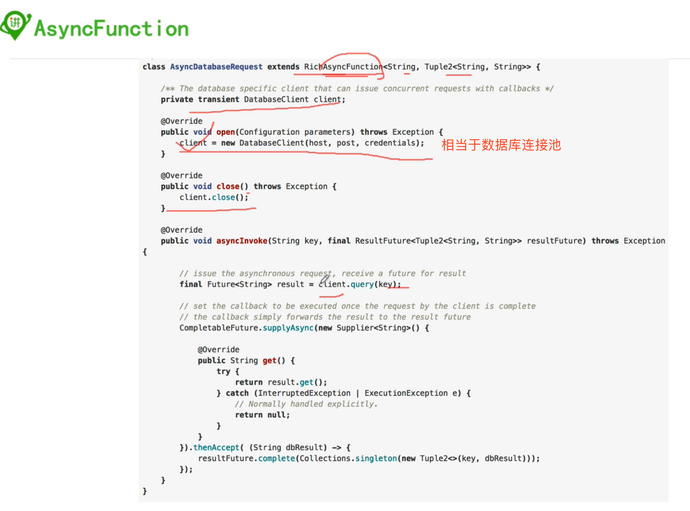

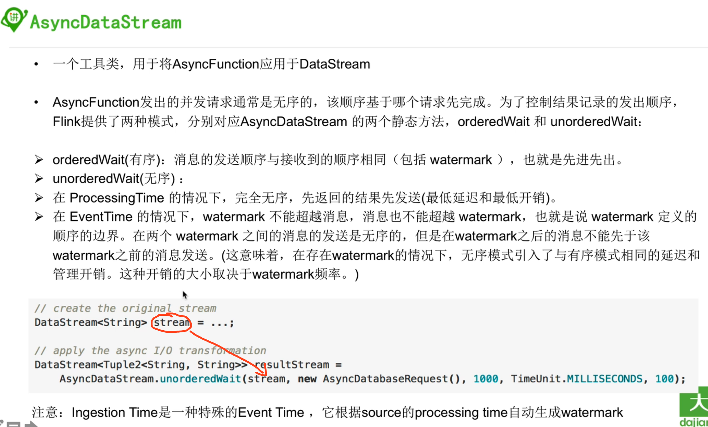

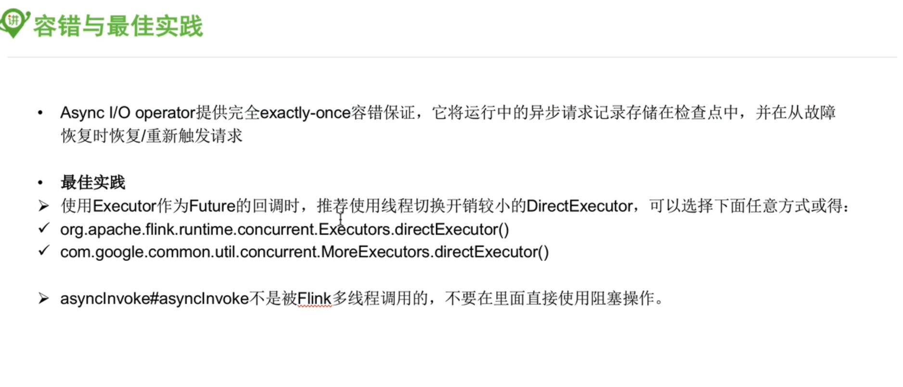

* 这里是官方案例，用作模拟

```java
/*
 * Licensed to the Apache Software Foundation (ASF) under one or more
 * contributor license agreements.  See the NOTICE file distributed with
 * this work for additional information regarding copyright ownership.
 * The ASF licenses this file to You under the Apache License, Version 2.0
 * (the "License"); you may not use this file except in compliance with
 * the License.  You may obtain a copy of the License at
 *
 *    http://www.apache.org/licenses/LICENSE-2.0
 *
 * Unless required by applicable law or agreed to in writing, software
 * distributed under the License is distributed on an "AS IS" BASIS,
 * WITHOUT WARRANTIES OR CONDITIONS OF ANY KIND, either express or implied.
 * See the License for the specific language governing permissions and
 * limitations under the License.
 */

package im.ivanl001.a08_flink_window;

import org.apache.flink.api.common.functions.FlatMapFunction;
import org.apache.flink.api.java.tuple.Tuple2;
import org.apache.flink.api.java.utils.ParameterTool;
import org.apache.flink.configuration.Configuration;
import org.apache.flink.runtime.state.filesystem.FsStateBackend;
import org.apache.flink.streaming.api.CheckpointingMode;
import org.apache.flink.streaming.api.TimeCharacteristic;
import org.apache.flink.streaming.api.checkpoint.ListCheckpointed;
import org.apache.flink.streaming.api.datastream.AsyncDataStream;
import org.apache.flink.streaming.api.datastream.DataStream;
import org.apache.flink.streaming.api.environment.StreamExecutionEnvironment;
import org.apache.flink.streaming.api.functions.async.AsyncFunction;
import org.apache.flink.streaming.api.functions.async.ResultFuture;
import org.apache.flink.streaming.api.functions.async.RichAsyncFunction;
import org.apache.flink.streaming.api.functions.source.SourceFunction;
import org.apache.flink.util.Collector;
import org.apache.flink.util.ExecutorUtils;
import org.slf4j.Logger;
import org.slf4j.LoggerFactory;

import java.util.ArrayList;
import java.util.Collections;
import java.util.List;
import java.util.concurrent.*;

/**
 * Example to illustrates how to use {@link AsyncFunction}.
 */
/**
 * #author      : ivanl001
 * #creator     : 2019-07-20 14:51
 * #description : 异步IO相关
 **/
public class Flink_window08_AsyncIO {

    private static final Logger LOG = LoggerFactory.getLogger(AsyncIOExample.class);

    private static final String EXACTLY_ONCE_MODE = "exactly_once";
    private static final String EVENT_TIME = "EventTime";
    private static final String INGESTION_TIME = "IngestionTime";
    private static final String ORDERED = "ordered";


    public static void main(String[] args) throws Exception {

        // obtain execution environment
        //1, 获取环境
        StreamExecutionEnvironment env = StreamExecutionEnvironment.getExecutionEnvironment();

        // parse parameters
        //2, 解析参数
        final ParameterTool params = ParameterTool.fromArgs(args);

        final String statePath;
        final String cpMode;
        final int maxCount;
        final long sleepFactor;
        final float failRatio;
        final String mode;
        final int taskNum;
        final String timeType;
        final long shutdownWaitTS;
        final long timeout;

        try {
            // check the configuration for the job
            statePath = params.get("fsStatePath", null);
            cpMode = params.get("checkpointMode", "exactly_once");
            maxCount = params.getInt("maxCount", 100000);
            sleepFactor = params.getLong("sleepFactor", 100);
            failRatio = params.getFloat("failRatio", 0.001f);
            mode = params.get("waitMode", "ordered");
            taskNum = params.getInt("waitOperatorParallelism", 1);
            timeType = params.get("eventType", "EventTime");
            shutdownWaitTS = params.getLong("shutdownWaitTS", 20000);
            timeout = params.getLong("timeout", 10000L);
        } catch (Exception e) {
            printUsage();

            throw e;
        }

        StringBuilder configStringBuilder = new StringBuilder();

        final String lineSeparator = System.getProperty("line.separator");

        configStringBuilder
                .append("Job configuration").append(lineSeparator)
                .append("FS state path=").append(statePath).append(lineSeparator)
                .append("Checkpoint mode=").append(cpMode).append(lineSeparator)
                .append("Max count of input from source=").append(maxCount).append(lineSeparator)
                .append("Sleep factor=").append(sleepFactor).append(lineSeparator)
                .append("Fail ratio=").append(failRatio).append(lineSeparator)
                .append("Waiting mode=").append(mode).append(lineSeparator)
                .append("Parallelism for async wait operator=").append(taskNum).append(lineSeparator)
                .append("Event type=").append(timeType).append(lineSeparator)
                .append("Shutdown wait timestamp=").append(shutdownWaitTS);

        LOG.info(configStringBuilder.toString());

        if (statePath != null) {
            // setup state and checkpoint mode
            env.setStateBackend(new FsStateBackend(statePath));
        }

        //保证一次
        if (EXACTLY_ONCE_MODE.equals(cpMode)) {
            env.enableCheckpointing(1000L, CheckpointingMode.EXACTLY_ONCE);
        }
        //至少一次
        else {
            env.enableCheckpointing(1000L, CheckpointingMode.AT_LEAST_ONCE);
        }

        // enable watermark or not
        //开启watermark功能
        if (EVENT_TIME.equals(timeType)) {
            env.setStreamTimeCharacteristic(TimeCharacteristic.EventTime);
        }
        else if (INGESTION_TIME.equals(timeType)) {
            env.setStreamTimeCharacteristic(TimeCharacteristic.IngestionTime);
        }

        // create input stream of an single integer
        // 添加自定义输入流
        DataStream<Integer> inputStream = env.addSource(new SimpleSource(maxCount));

        // create async function, which will *wait* for a while to simulate the process of async i/o
        //创建异步函数，会默认休眠一下才会开始，以模拟异步IO，具体看函数内部
        AsyncFunction<Integer, String> function =
                new SampleAsyncFunction(sleepFactor, failRatio, shutdownWaitTS);

        // add async operator to streaming job
        DataStream<String> result;
        if (ORDERED.equals(mode)) {
            result = AsyncDataStream.orderedWait(
                    inputStream,
                    function,
                    timeout,
                    TimeUnit.MILLISECONDS,
                    20).setParallelism(taskNum);
        }
        else {
            result = AsyncDataStream.unorderedWait(
                    inputStream,
                    function,
                    timeout,
                    TimeUnit.MILLISECONDS,
                    20).setParallelism(taskNum);
        }

        // add a reduce to get the sum of each keys.
        result.flatMap(new FlatMapFunction<String, Tuple2<String, Integer>>() {
            private static final long serialVersionUID = -938116068682344455L;

            @Override
            public void flatMap(String value, Collector<Tuple2<String, Integer>> out) throws Exception {
                out.collect(new Tuple2<>(value, 1));
            }
        }).keyBy(0).sum(1).print();

        // execute the program
        env.execute("Async IO Example");
    }

    /**
     * A checkpointed source.
     */
    private static class SimpleSource implements SourceFunction<Integer>, ListCheckpointed<Integer> {
        private static final long serialVersionUID = 1L;

        private volatile boolean isRunning = true;
        private int counter = 0;
        private int start = 0;

        @Override
        public List<Integer> snapshotState(long checkpointId, long timestamp) throws Exception {
            return Collections.singletonList(start);
        }

        @Override
        public void restoreState(List<Integer> state) throws Exception {
            for (Integer i : state) {
                this.start = i;
            }
        }

        public SimpleSource(int maxNum) {
            this.counter = maxNum;
        }

        @Override
        public void run(SourceContext<Integer> ctx) throws Exception {
            while ((start < counter || counter == -1) && isRunning) {
                synchronized (ctx.getCheckpointLock()) {
                    ctx.collect(start);
                    ++start;

                    // loop back to 0
                    if (start == Integer.MAX_VALUE) {
                        start = 0;
                    }
                }
                Thread.sleep(10L);
            }
        }

        @Override
        public void cancel() {
            isRunning = false;
        }
    }

    /**
     * An sample of {@link AsyncFunction} using a thread pool and executing working threads
     * to simulate multiple async operations.
     *
     * <p>For the real use case in production environment, the thread pool may stay in the
     * async client.
     */
    private static class SampleAsyncFunction extends RichAsyncFunction<Integer, String> {
        private static final long serialVersionUID = 2098635244857937717L;

        private transient ExecutorService executorService;

        /**
         * The result of multiplying sleepFactor with a random float is used to pause
         * the working thread in the thread pool, simulating a time consuming async operation.
         */
        private final long sleepFactor;

        /**
         * The ratio to generate an exception to simulate an async error. For example, the error
         * may be a TimeoutException while visiting HBase.
         */
        private final float failRatio;

        private final long shutdownWaitTS;

        SampleAsyncFunction(long sleepFactor, float failRatio, long shutdownWaitTS) {
            this.sleepFactor = sleepFactor;
            this.failRatio = failRatio;
            this.shutdownWaitTS = shutdownWaitTS;
        }

        @Override
        public void open(Configuration parameters) throws Exception {
            super.open(parameters);

            executorService = Executors.newFixedThreadPool(30);

            //这里是模拟，在实际开发中，这里是打开数据库连接
        }

        @Override
        public void close() throws Exception {
            super.close();
            ExecutorUtils.gracefulShutdown(shutdownWaitTS, TimeUnit.MILLISECONDS, executorService);

            //这里是模拟，在实际开发中， 这里是关闭数据库连接
        }

        @Override
        public void asyncInvoke(final Integer input, final ResultFuture<String> resultFuture) {

            System.out.println("接受到到key是：" + input);

//			CompletableFuture.completedFuture()

            executorService.submit(() -> {

                //这里是模拟，在实际的开发中，这里需要是查询逻辑，处理，并发送
                //resultFuture.complete(new ArrayList<>(0));

                // wait for while to simulate async operation here
                long sleep = (long) (ThreadLocalRandom.current().nextFloat() * sleepFactor);

                try {
                    Thread.sleep(sleep);

                    if (ThreadLocalRandom.current().nextFloat() < failRatio) {
                        resultFuture.completeExceptionally(new Exception("wahahahaha..."));
                    } else {
                        resultFuture.complete(
                                Collections.singletonList("key-" + (input % 10)));
                    }
                } catch (InterruptedException e) {
                    resultFuture.complete(new ArrayList<>(0));
                }
            });
        }
    }

    private static void printUsage() {
        System.out.println("To customize example, use: AsyncIOExample [--fsStatePath <path to fs state>] " +
                "[--checkpointMode <exactly_once or at_least_once>] " +
                "[--maxCount <max number of input from source, -1 for infinite input>] " +
                "[--sleepFactor <interval to sleep for each stream element>] [--failRatio <possibility to throw exception>] " +
                "[--waitMode <ordered or unordered>] [--waitOperatorParallelism <parallelism for async wait operator>] " +
                "[--eventType <EventTime or IngestionTime>] [--shutdownWaitTS <milli sec to wait for thread pool>]" +
                "[--timeout <Timeout for the asynchronous operations>]");
    }
}
```

### 7, 异步IO原理

* 这里不记录，如果有需要看教程吧

