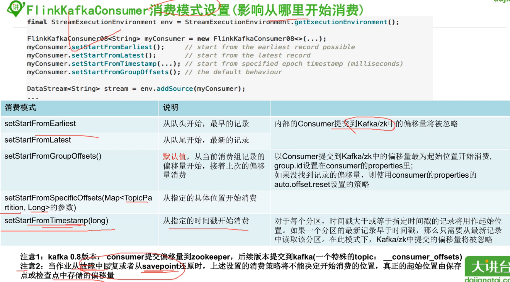

### 1, source分类

#### 1.1, 预定义source

#### 1.2, 自定义source

#### 1.3, 其他包依赖source


### 2, 预定义source

* 这里不再赘述，如果有需要参考之前的文章：
* 03-若泽数据-03-flink-source.md
* 04-51CTO学院-04-source.md


### 3, 自定义source

自定义数据源的三种方式：

1, 实现SourceFunction接口（非并发）

2, 实现ParallelSourceFunction（并发）

3, 继承RichParallelSourceFunction（并发）


### 4, kafka-flink-source

#### 4.1.1, 依赖使用

* 下面这个依赖是除了kafka本身的依赖之外还需要引入的依赖
* 嗯，好像kafka不需要再引入了
* 


#### 4.1.2, 不同版本的继承关系


#### 4.1.3, 0.10版本集成接口


##### 接口


##### 接口中的反序列化的方案：


##### 接口中的反序列化预带的方案：


##### 接口集成方案演示：


#### 4.2, flink集成kafka消费模式

在flink的kafka中，会有如下几个地方会影响到消费模式：

1, kafka本身的消费模式

2, savepoint

3, checkpoint


具体的可以参考如下图片内容：




#### 4.3, flink接受kafka消息的代码

```java
package im.ivanl001.streaming.a00_flink_source;

import org.apache.flink.api.common.serialization.SimpleStringSchema;
import org.apache.flink.api.common.typeinfo.TypeInformation;
import org.apache.flink.streaming.api.environment.StreamExecutionEnvironment;
import org.apache.flink.streaming.connectors.kafka.FlinkKafkaConsumer010;
import org.apache.flink.streaming.util.serialization.KeyedDeserializationSchema;

import java.io.IOException;
import java.util.Properties;

/**
 * #author      : ivanl001
 * #creator     : 2019-07-23 18:29
 * #description : flink从kafka中读取信息
 **/
public class Flink_source_kafka {
    
    public static void main(String[] args) throws Exception {

        //1, 获取运行环境
        StreamExecutionEnvironment senv = StreamExecutionEnvironment.getExecutionEnvironment();
        senv.setParallelism(3);

        //2, 获取参数

        //3, 设置事件时间

        //4.1, 启用检查点以使用状态

        //4.2, 设置状态到存储方式

        //4.3, 设置重启策略以使得检查点可用

        //5, 创建kafka源，使用kafka源接受消息
        //5.0, 首先是kafka的基本配置信息
        Properties properties = new Properties();
        properties.setProperty("bootstrap.servers", "centos01:9092");
        properties.setProperty("group.id", "test");
        //5.1, kafka源
        FlinkKafkaConsumer010<String> consumer01 = new FlinkKafkaConsumer010<String>("kafka_flink", new SimpleStringSchema(), properties);


        //6, 获取流
        senv.addSource(consumer01).setParallelism(3).print();

        //7, 做相关到操作

        //8, 执行程序
        senv.execute("kafka_flink_test");
    }
    
    //这里是自定义的序列化器，可以用这种，也可以不用这种
    public static class IMDeserialization implements KeyedDeserializationSchema<String>{

        @Override
        public String deserialize(byte[] messageKey, byte[] message, String topic, int partition, long offset) throws IOException {
            return new String(message);
        }

        @Override
        public boolean isEndOfStream(String nextElement) {
            return false;
        }

        @Override
        public TypeInformation<String> getProducedType() {
            return TypeInformation.of(String.class);
        }
    }
}
```


### 5, kafka-flink-sink

#### 5.1, producer的继承关系


#### 5.2, 0.10版本集成接口


#### 5.3, 接口中序列化的方案


#### 5.4, 写入分区


#### 5.5, 写入容错等级


#### 5.6, flink写入到kafka的代码

```java
package im.ivanl001.streaming.a99_flink_sink;

import org.apache.flink.api.common.functions.RichMapFunction;
import org.apache.flink.api.common.serialization.SimpleStringSchema;
import org.apache.flink.streaming.api.datastream.DataStreamSource;
import org.apache.flink.streaming.api.datastream.SingleOutputStreamOperator;
import org.apache.flink.streaming.api.environment.StreamExecutionEnvironment;
import org.apache.flink.streaming.connectors.kafka.FlinkKafkaConsumer010;
import org.apache.flink.streaming.connectors.kafka.FlinkKafkaProducer010;

import java.util.Properties;

/**
 * #author      : ivanl001
 * #creator     : 2019-07-23 18:33
 * #description : 从flink里面写入到kafka中去,为了有消息可以用于写入， 我们先从kafka的一个主题中读取，然后写入到另外一个主题哈
 **/
public class Flink_sink_kafka {

    public static void main(String[] args) throws Exception {

        //1, 获取运行环境
        StreamExecutionEnvironment senv = StreamExecutionEnvironment.getExecutionEnvironment();
        
        //2, 获取参数

        //3, 设置事件时间

        //4.1, 启用检查点以使用状态

        //4.2, 设置状态到存储方式

        //4.3, 设置重启策略以使得检查点可用

        //5, 创建kafka源，使用kafka源接受消息
        //5.0, 首先是kafka的基本配置信息
        Properties properties = new Properties();
        properties.setProperty("bootstrap.servers", "centos01:9092");
        properties.setProperty("group.id", "test");
        //5.1, kafka源
        FlinkKafkaConsumer010<String> consumer01 = new FlinkKafkaConsumer010<String>("kafka_flink", new SimpleStringSchema(), properties);
        
        //6, 获取流, 转换成datastream流
        DataStreamSource<String> stringDataStreamSource = senv.addSource(consumer01).setParallelism(3);
        SingleOutputStreamOperator<String> mapResult = stringDataStreamSource.map(new RichMapFunction<String, String>() {
            @Override
            public String map(String value) throws Exception {
                System.out.println(getRuntimeContext().getIndexOfThisSubtask() + " :接受到消息：" + value);
                return "接受到消息并转发到kafka--"+value;
            }
        });
        
        //7, 创建producer
        FlinkKafkaProducer010<String> myProducer = new FlinkKafkaProducer010<String>(
                "centos01:9092",            // broker list
                "flink_kafka",                  // target topic
                new SimpleStringSchema());   // serialization schema

        //8, 写出到kafka
        myProducer.setWriteTimestampToKafka(true);
        // versions 0.10+ allow attaching the records' event timestamp when writing them to Kafka;
        // this method is not available for earlier Kafka versions
        mapResult.addSink(myProducer);

        //9, 执行程序
        senv.execute("kafka_flink_test");
    }
}
```

