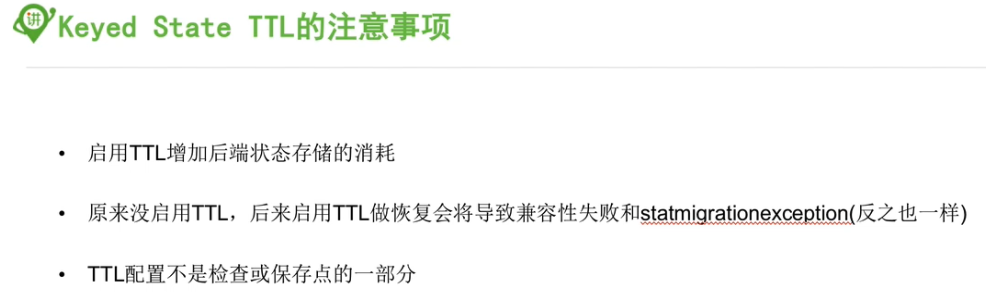
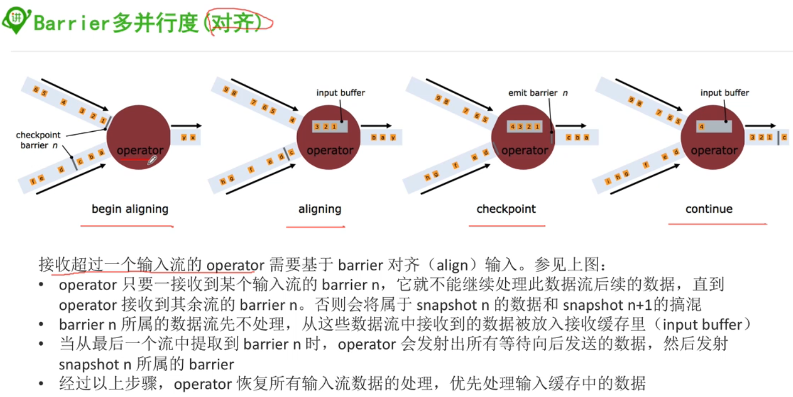

### 1, 状态基本概念

状态：一个具体的task或者operator某时刻在内存中的状态，例如某个属性的值的大小

checkpoint：检查点，是一个特定的时刻， job的全局的状态快照， 即包含了一个job下所有的task或者operator的某时刻的状态


### 2, 状态的分类

#### 2.1, Operator State

* 普通dataStream流上的状态，绑定到特定的operator并行实例
* 每个operator的并行实例维护一个状态
* 与key无关
* 一个并行度为3的source是有3个状态的
* 支持的数据类型
  * ListState<T>
  * BroadcaseState

#### 2.2, Keyed State

* keyStream上状态
* 这个是分区状态，是一个key对应的状态，也就是keyed state
* 支持的数据类型：
  * 

#### 2.3, Broadcast State(1.5开始)


### 3, 状态的表现形式


### 4, OperatorState

#### 4.1, 案例

```java
package im.ivanl001.A10_flink_state_checkpoint;

import org.apache.flink.api.common.functions.FlatMapFunction;
import org.apache.flink.api.common.functions.RichFlatJoinFunction;
import org.apache.flink.api.common.functions.RichFlatMapFunction;
import org.apache.flink.api.common.state.ListState;
import org.apache.flink.api.common.state.ListStateDescriptor;
import org.apache.flink.api.common.typeinfo.TypeHint;
import org.apache.flink.api.common.typeinfo.TypeInformation;
import org.apache.flink.api.java.tuple.Tuple2;
import org.apache.flink.configuration.Configuration;
import org.apache.flink.runtime.state.FunctionInitializationContext;
import org.apache.flink.runtime.state.FunctionSnapshotContext;
import org.apache.flink.streaming.api.CheckpointingMode;
import org.apache.flink.streaming.api.TimeCharacteristic;
import org.apache.flink.streaming.api.checkpoint.CheckpointedFunction;
import org.apache.flink.streaming.api.datastream.DataStream;
import org.apache.flink.streaming.api.environment.CheckpointConfig;
import org.apache.flink.streaming.api.environment.StreamExecutionEnvironment;
import org.apache.flink.util.Collector;

import java.util.ArrayList;
import java.util.List;

/**
 * #author      : ivanl001
 * #creator     : 2019-07-20 19:38
 * #description : OperatorState的案例
 *
 *
 * 想知道两次事件1之间，一共发生多少次其他事件，分别是什么事件
 *
 * 事件流：1 2 3 4 5 1 3 4 5 6 7 1 4 5 3 9 9 2 1...
 * 输出：
 *      (4,2 3 4 5)
 *      (5,3 4 5 6 7)
 *      (6,4 5 6 9 9 2)
 *
 *
 **/
public class Flink_State_OperatorState {

    public static void main(String[] args) throws Exception {

        //1, 获取环境并设置时间为事件时间
        StreamExecutionEnvironment senv = StreamExecutionEnvironment.getExecutionEnvironment();
        senv.setStreamTimeCharacteristic(TimeCharacteristic.EventTime);

        //2, 设置checkpoint
        senv.enableCheckpointing(60000L);
        CheckpointConfig checkpointConfig = senv.getCheckpointConfig();
        checkpointConfig.setCheckpointingMode(CheckpointingMode.EXACTLY_ONCE);
        checkpointConfig.setMinPauseBetweenCheckpoints(30000L);
        checkpointConfig.setCheckpointTimeout(10000L);
        checkpointConfig.setFailOnCheckpointingErrors(true);
        checkpointConfig.enableExternalizedCheckpoints(CheckpointConfig.ExternalizedCheckpointCleanup.DELETE_ON_CANCELLATION);

        //3, 获取数据
        DataStream<Long> inputStream = senv.fromElements(1L, 2L, 3L, 4L, 5L, 1L, 3L, 4L, 5L, 6L, 7L, 1L, 4L, 5L, 3L, 9L, 9L, 2L, 1L);

        //4, 进行计算
        inputStream.flatMap(new CountWithOperatorState())
                .setParallelism(1)//注意：这里的并行度不能大于1，否则数据分发，就算不出来了
                .print();

        //5, 执行
        senv.execute();
    }

    static class CountWithOperatorState extends RichFlatMapFunction<Long, Tuple2<Integer, String>> implements CheckpointedFunction {

        //这里存储的也是一个状态，就是我们需要计算的状态，但是这个是原始状态，由我们自己维护
        private List<Long> listBufferElements;

        @Override
        public void open(Configuration parameters) throws Exception {
            super.open(parameters);
            listBufferElements = new ArrayList<>();
        }

        @Override
        public void flatMap(Long value, Collector<Tuple2<Integer, String>> out) throws Exception {
            if (value == 1) {
                if (listBufferElements.size() > 0) {
                    StringBuffer buffer = new StringBuffer();
                    for (Long item : listBufferElements) {
                        buffer.append(item + " ");
                    }
                    out.collect(Tuple2.of(listBufferElements.size(), buffer.toString()));
                    listBufferElements.clear();
                }else{

                }
            } else {
                //如果不是1，那么
                listBufferElements.add(value);
            }
        }

        //这里存储的是一个状态，这个是托管状态，由flink进行维护，我们只需要记录进去就好了
        private transient ListState<Long> checkPointCountList;

        @Override
        public void initializeState(FunctionInitializationContext context) throws Exception {

            //1, 获取到状态信息
            ListStateDescriptor<Long> listStateDescriptor = new ListStateDescriptor<Long>("checkPointCountList", TypeInformation.of(new TypeHint<Long>() {}));
            //
            checkPointCountList = context.getOperatorStateStore().getListState(listStateDescriptor);

            //2, 如果是从快照中恢复的，需要把状态中到数据重新添加到buffer中
            if (context.isRestored()) {
                for (Long item : checkPointCountList.get()) {
                    listBufferElements.add(item);
                }
            }
        }

        //这里就是需要进行快照的时候存储状态，所以需要把我们需要的状态记录托管起来
        @Override
        public void snapshotState(FunctionSnapshotContext context) throws Exception {
            checkPointCountList.clear();
            for (Long item : listBufferElements) {
                checkPointCountList.add(item);
            }
        }
    }
  
    //这里是使用ListCheckpointed的演示
    static class CountWithOperatorState01 extends RichFlatMapFunction<Long, Tuple2<Integer, String>> implements ListCheckpointed {

        @Override
        public void flatMap(Long value, Collector<Tuple2<Integer, String>> out) throws Exception {
            
        }

        @Override
        public List snapshotState(long checkpointId, long timestamp) throws Exception {
            //存储到快照中的操作
            return null;
        }

        @Override
        public void restoreState(List state) throws Exception {
            //这里不需要再取，内部已经取出来了， 直接用即可
        }
    }
}
```

#### 4.2, 知识点：重新分配redistributed

```java
checkPointCountList = context.getOperatorStateStore().getListState(listStateDescriptor);
```

上面的获取状态是利用getListState，其实还有其他的方法，不同的方法对应不同的重新分配策略


#### 4.3, 知识点：创建state的两种方式

##### 4.3.1, 继承CheckpointedFunction，参考代码

我们在上面的案例中CountWithOperatorState是继承CheckpointedFunction的，当然这只是其中一种


##### 4.3.1, 继承ListCheckpointed，和上面的区别就是这里默认指定了重新分配的策略是getListState


### 5, KeyedState

#### 5.1, 案例

```java
package im.ivanl001.A10_flink_state_checkpoint;

import org.apache.flink.api.common.functions.FlatMapFunction;
import org.apache.flink.api.common.functions.RichFlatMapFunction;
import org.apache.flink.api.common.state.ValueState;
import org.apache.flink.api.common.state.ValueStateDescriptor;
import org.apache.flink.api.common.typeinfo.TypeHint;
import org.apache.flink.api.common.typeinfo.TypeInformation;
import org.apache.flink.api.java.tuple.Tuple;
import org.apache.flink.api.java.tuple.Tuple2;
import org.apache.flink.configuration.Configuration;
import org.apache.flink.streaming.api.datastream.DataStream;
import org.apache.flink.streaming.api.environment.StreamExecutionEnvironment;
import org.apache.flink.util.Collector;

/**
 * #author      : ivanl001
 * #creator     : 2019-07-20 20:54
 * #description :
 **/
public class Flink_State02_KeyedState {

    public static void main(String[] args) throws Exception {

        //1, 获取运行环境
        StreamExecutionEnvironment senv = StreamExecutionEnvironment.getExecutionEnvironment();

        //2, 准备实验数据
        DataStream<Tuple2<Long,Long>> inputStream = senv.fromElements(
                Tuple2.of(1L,4L),
                Tuple2.of(2L,3L),
                Tuple2.of(3L,1L),
                Tuple2.of(1L,2L),
                Tuple2.of(3L,2L),
                Tuple2.of(1L,2L),
                Tuple2.of(2L,2L),
                Tuple2.of(2L,9L)
        );

        //3, 进行运算
        inputStream.keyBy(0)
                .flatMap(new CountWithKeyedState())
                .setParallelism(1)
                .print();

        //4, 执行
        senv.execute();
    }

    //这里和之前的那个processFunction的案例有点类似
    static class CountWithKeyedState extends RichFlatMapFunction<Tuple2<Long, Long>, Tuple2<Long, Long>> {

        private transient ValueState<Tuple2<Long, Long>> sumState;

        //这里这是用了状态，但是没有使用状态来容错
        @Override
        public void open(Configuration parameters) throws Exception {
            super.open(parameters);

            ValueStateDescriptor<Tuple2<Long, Long>> descriptor = new ValueStateDescriptor<Tuple2<Long, Long>>("avgState", TypeInformation.of(new TypeHint<Tuple2<Long, Long>>() {}));

            //设置KeyedState的TTL-time to live
            StateTtlConfig stateTtlConfig = StateTtlConfig
                    .newBuilder(Time.seconds(1))
                    .setUpdateType(StateTtlConfig.UpdateType.OnCreateAndWrite)
                    .setStateVisibility(StateTtlConfig.StateVisibility.NeverReturnExpired)
                    .build();
            descriptor.enableTimeToLive(stateTtlConfig);
            
            sumState = getRuntimeContext().getState(descriptor);
        }

        @Override
        public void flatMap(Tuple2<Long, Long> value, Collector<Tuple2<Long, Long>> out) throws Exception {
            Tuple2<Long, Long> theSum = sumState.value();

            if (null == theSum) {
                theSum = Tuple2.of(0L, 0L);
            }

            theSum.f0 += 1;
            theSum.f1 += value.f1;

            sumState.update(theSum);

            if (theSum.f0 >= 3) {
                out.collect(Tuple2.of(value.f0, theSum.f1 / theSum.f0));
                sumState.clear();
            }
        }
    }
}
```


#### 5.2, 知识点：重新分配redistributed

* 这个重新分配是自动的，不需要我们手动干预


#### 5.3, keyedState的TTL(Time To Live)

* 上面代码中也有

* ```java
  ValueStateDescriptor<Tuple2<Long, Long>> descriptor = new ValueStateDescriptor<Tuple2<Long, Long>>("avgState", TypeInformation.of(new TypeHint<Tuple2<Long, Long>>() {}));
  
              //设置KeyedState的TTL-time to live
              StateTtlConfig stateTtlConfig = StateTtlConfig
                      .newBuilder(Time.seconds(1))
                      .setUpdateType(StateTtlConfig.UpdateType.OnCreateAndWrite)
                      .setStateVisibility(StateTtlConfig.StateVisibility.NeverReturnExpired)
                      .build();
              descriptor.enableTimeToLive(stateTtlConfig);
              
  
              sumState = getRuntimeContext().getState(descriptor);
  ```

##### TTL的使用


##### TTL的相关配置


##### TTL的清理策略


* 如果想要使用非默认清理策略，也就是第二种，如下设置：

* ```java
  StateTtlConfig stateTtlConfig = StateTtlConfig
                      .newBuilder(Time.seconds(1))
                      .setUpdateType(StateTtlConfig.UpdateType.OnCreateAndWrite)
                     .setStateVisibility(StateTtlConfig.StateVisibility.NeverReturnExpired)
                      .cleanupFullSnapshot()
                      .build();
  ```

##### TTL注意事项



### 6, BroadcastState

* 在流处理里面是没有广播状态的，只有广播变量


### 7, 容错机制checkpointing

上面讲的都是状态，状态存在的目的就是容错

Flink的容错机制就是checkpointing

#### 7.0, 完整的代码

```java
//1, 启用checkpointing
senv.enableCheckpointing(60000);
//如果checkpointing失败了，是不是把任务直接失败，还是任务正常跑
senv.getCheckpointConfig().setFailOnCheckpointingErrors(true);
//检查点模式：保证一次
senv.getCheckpointConfig().setCheckpointingMode(CheckpointingMode.EXACTLY_ONCE);
//下一个检查点在上一个检查点结束多久后才会开始
senv.getCheckpointConfig().setMinPauseBetweenCheckpoints(30000L);
//检查点在指定时间内未完成是否指定为超时
senv.getCheckpointConfig().setCheckpointTimeout(100000L);
//作业job被手动取消的时候，是否删除检查点
senv.getCheckpointConfig().enableExternalizedCheckpoints(CheckpointConfig.ExternalizedCheckpointCleanup.RETAIN_ON_CANCELLATION);


//2, 设置检查点后台存储，这一步也可以在配置文件中直接配置，代码中会覆盖配置文件
//如果是rocksDB，需要引入外部依赖哦
StateBackend stateBackend = new RocksDBStateBackend("hdfs://centos01:40010/flink/checkpoints", true);
senv.setStateBackend(stateBackend);


//3, 配置重启策略
senv.setRestartStrategy(RestartStrategies.fixedDelayRestart(3, 10));
```


#### 7.1, checkpointing的启用

* 具体可看7.0代码


#### 7.2, 选择checkpointing的后台存储

* 具体可看7.0代码

##### 7.2.0, 三种状态的后台存储方式


##### 7.2.1, 内存存储: MemoryStateBackend


##### 7.2.2, 文件存储: FsStateBackend


##### 7.2.3, RocksDB存储：通常会用这个


##### 7.2.4, 三种比较


##### 7.2.5, 可以直接配置文件中配置，代码中就可以不用写


#### 7.3, 配置重启策略

* 具体可看7.0代码


### 8, checkpointing原理





### 9, Savepoint

External Checkpoint：

```java
//作业job被手动取消的时候，是否删除检查点
senv.getCheckpointConfig().enableExternalizedCheckpoints(CheckpointConfig.ExternalizedCheckpointCleanup.RETAIN_ON_CANCELLATION);
```


### 10, 测试

https://ci.apache.org/projects/flink/flink-docs-release-1.7/dev/stream/testing.html

