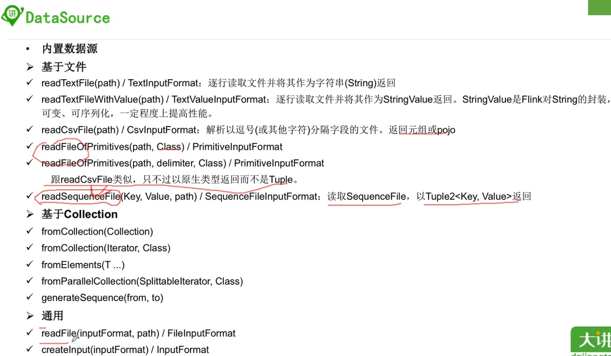
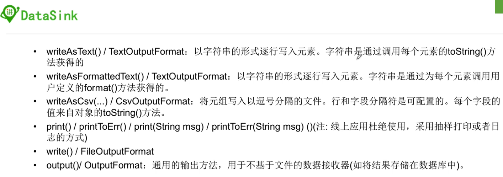
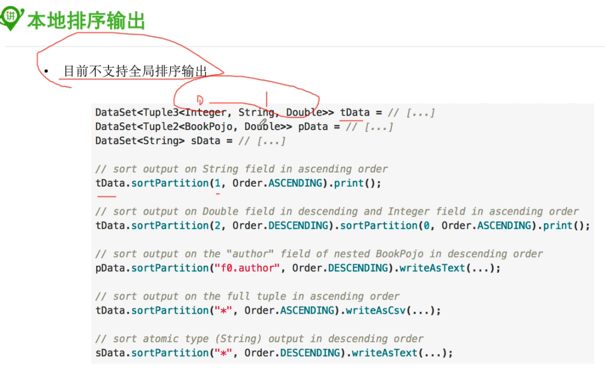

### 1, 入门案例

```java
package im.ivanl002.batch.a01_flink_batch_simple_java;

import org.apache.flink.api.common.functions.FlatMapFunction;
import org.apache.flink.api.common.functions.ReduceFunction;
import org.apache.flink.api.java.DataSet;
import org.apache.flink.api.java.ExecutionEnvironment;
import org.apache.flink.api.java.operators.DataSource;
import org.apache.flink.api.java.tuple.Tuple2;
import org.apache.flink.util.Collector;

/**
 * #author      : ivanl001
 * #creator     : 2019-07-22 09:41
 * #description :
 **/
public class Flink_batch_test {

    public static void main(String[] args) throws Exception {

        //1, 获取批处理运行环境
        ExecutionEnvironment env = ExecutionEnvironment.getExecutionEnvironment();

        //2, 获取数据
        DataSource<String> stringDataSource = env.fromElements("Ivanl001 is the king of world! and he is cool gay", "ivanl002 is the king of China.");

        //3, 开始处理
        DataSet<Tuple2<String, Integer>> resultSet =  stringDataSource
                .flatMap(new IMFlatMapFunction())
                //批处理里面没有keyby，而是用groupby取代
                .groupBy(0)
                //注意：这里用reduce处理也可以
                //.reduce(new IMReduceFunction());
                //注意：这里用sum也行，但是sum只能求和，而不能有复杂的逻辑，reduce里面更加随意，可以按照自己想要的逻辑实现
                .sum(1);

        //4, 打印
        resultSet.print();
    }

    public static class IMReduceFunction implements ReduceFunction<Tuple2<String, Integer>>{
        @Override
        public Tuple2<String, Integer> reduce(Tuple2<String, Integer> value1, Tuple2<String, Integer> value2) throws Exception {
            return new Tuple2<String, Integer>(value1.f0, value1.f1+value2.f1);
        }
    }

    public static class IMFlatMapFunction implements FlatMapFunction<String, Tuple2<String, Integer>> {

        @Override
        public void flatMap(String value, Collector<Tuple2<String, Integer>> out) throws Exception {
            String[] words = value.split("\\s");
            for (String word : words) {
                out.collect(new Tuple2<>(word, 1));
            }
        }
    }
}
```


### 2, 数据源DataSource

* 更详细的内容，比如csv的分隔符，遍历目录等， 参考文件：03-若泽数据-03-flink-source.md




```java
val env  = ExecutionEnvironment.getExecutionEnvironment

// read text file from local files system
val localLines = env.readTextFile("file:///path/to/my/textfile")

// read text file from a HDFS running at nnHost:nnPort
val hdfsLines = env.readTextFile("hdfs://nnHost:nnPort/path/to/my/textfile")

// read a CSV file with three fields
val csvInput = env.readCsvFile[(Int, String, Double)]("hdfs:///the/CSV/file")

// read a CSV file with five fields, taking only two of them
val csvInput = env.readCsvFile[(String, Double)](
  "hdfs:///the/CSV/file",
  includedFields = Array(0, 3)) // take the first and the fourth field

// CSV input can also be used with Case Classes
case class MyCaseClass(str: String, dbl: Double)
val csvInput = env.readCsvFile[MyCaseClass](
  "hdfs:///the/CSV/file",
  includedFields = Array(0, 3)) // take the first and the fourth field

// read a CSV file with three fields into a POJO (Person) with corresponding fields
val csvInput = env.readCsvFile[Person](
  "hdfs:///the/CSV/file",
  pojoFields = Array("name", "age", "zipcode"))

// create a set from some given elements
val values = env.fromElements("Foo", "bar", "foobar", "fubar")

// generate a number sequence
val numbers = env.generateSequence(1, 10000000)

// read a file from the specified path of type SequenceFileInputFormat
val tuples = env.readSequenceFile(classOf[IntWritable], classOf[Text],
 "hdfs://nnHost:nnPort/path/to/file")
```


### 3, 输出Sink




### 4, 输出排序

* 这个其实就是一个dataset的算子，transformation




