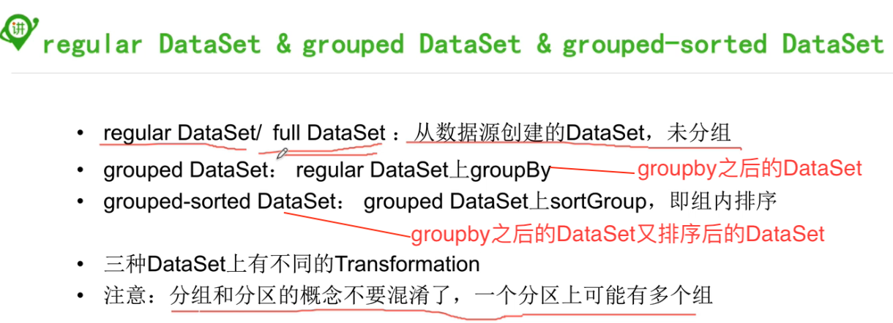
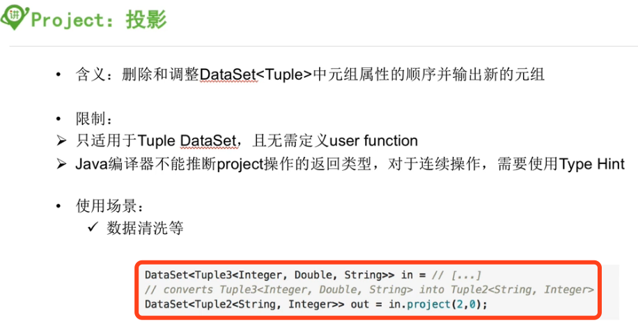
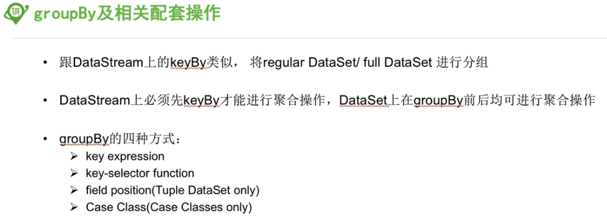
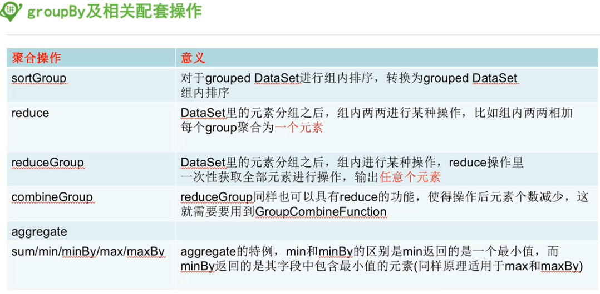
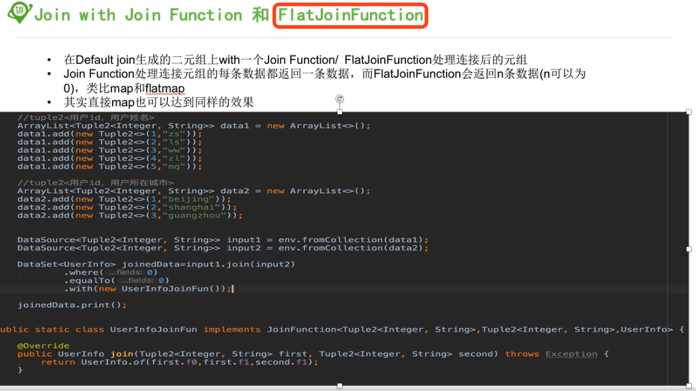

### 1, 理解概念

分区：把数据分成多份，发到每个服务器上，利用分布式的优势进行计算

分组：在每个分区上，把数据按照规律分开



### 2, transformations

> 对于未涉及到的内容，可以参考：
>
> 04-51CTO学院-05-transformation.md

#### 2.1, map和flatmap基本和DataStream的类似

#### 2.2, MapPartition

* 类似map，一次处理一个分区的数据
* 这个和spark的mappartition是一个意思哈
* 如果在进行map处理的时候需要获取第三方资源连接，建议使用mappartition
* 为啥不继承Rich方法， 在open 里面开启，在close里面关闭嘛，不是更好吗？？？？
* scala

```scala
def main(args: Array[String]): Unit = {

  val benv = ExecutionEnvironment.getExecutionEnvironment

  val list = ListBuffer[String]()
  list.append("ivanl001 is the king of world!")
  list.append("ivanl002 is the king of world!")

  benv.fromCollection(list).mapPartition(ite => {
    val res = ListBuffer[String]()
    print("开启数据库")
    while (ite.hasNext){
      val words = ite.next().split("\\s")
      for (word <- words){
        println("处理数据：" + word)        
        res.append(word)
      }
    }
    print("关闭数据库")
    res
  }).print( )

  //benv.execute("mappartition")
}
```


* java

```java
ExecutionEnvironment benv = ExecutionEnvironment.getExecutionEnvironment();

ArrayList<String> list = new ArrayList<>();
list.add("ivanl001 is the king of world!");
list.add("ivanl002 is the king of world!");
list.add("ivanl003 is the king of world!");
list.add("ivanl004 is the king of world!");
list.add("ivanl005 is the king of world!");

benv.fromCollection(list).mapPartition(new MapPartitionFunction<String, String>() {
  @Override
  public void mapPartition(Iterable<String> values, Collector<String> out) throws Exception {

    System.out.println("ivanl----");
    System.out.println("在这里开启数据库等连接");

    for (String value : values) {
      System.out.println("hhhhh:" + value);
      for (String word: value.split("\\s")){
        out.collect(word);
      }
    }
    System.out.println("在这里关闭数据库等连接");
  }
}).distinct().print();
```

#### 2.3, filter

#### 2.4, project

投影，可以删减字读，也可以字段重新排序



#### 2.5, groupby

* 等同与datastream的keyby



#### 2.6, groupby相关的配套操作



#### 2.7, joinFunction和FlatJoinFunction

#### 