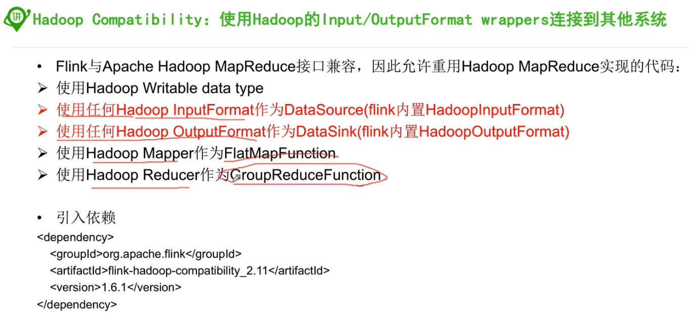
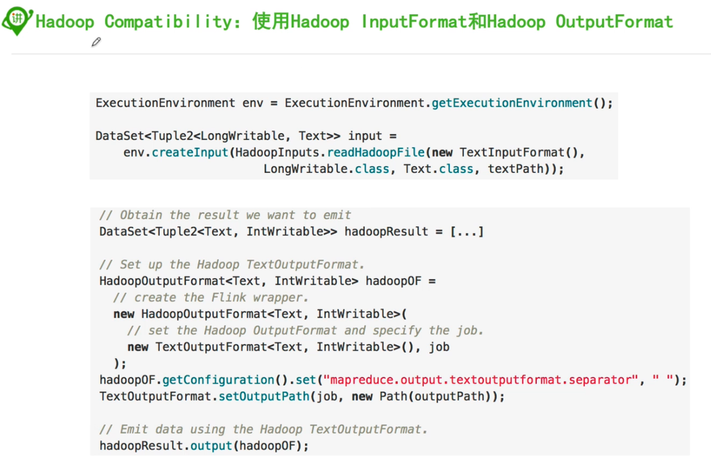

### 1, 批处理容错

```java
package im.ivanl002.batch.a04_flink_FaultTolerance;

import org.apache.flink.api.common.functions.MapFunction;
import org.apache.flink.api.common.restartstrategy.RestartStrategies;
import org.apache.flink.api.common.time.Time;
import org.apache.flink.api.java.DataSet;
import org.apache.flink.api.java.ExecutionEnvironment;

import java.util.concurrent.TimeUnit;

/**
 * #author      : ivanl001
 * #creator     : 2019-07-22 20:52
 * #description :
 **/
public class Flink_FaultTolerance {

    public static void main(String[] args) throws Exception {

        //1, 获取运行环境
        ExecutionEnvironment benv = ExecutionEnvironment.getExecutionEnvironment();

        //在没有容错的情况下是直接报错的
        //延迟重试的容错策略-------!!!!!!!!!!!!不知道为什么，没有失败重试，而是直接退出程序了!!!!!!!!!!!!!!!!
//        benv.setRestartStrategy(RestartStrategies.fixedDelayRestart(2, Time.of(10, TimeUnit.SECONDS)));
        
        //这个也不管用
        benv.setRestartStrategy(RestartStrategies.failureRateRestart(2, Time.of(1, TimeUnit.HOURS), Time.of(10, TimeUnit.SECONDS)));

        //2, 准备数据
        DataSet<String> dataSet = benv.fromElements("1", "2", "3", "", "5");

        //3, 进行操作
        dataSet.map(new MapFunction<String, Integer>() {
            @Override
            public Integer map(String value) throws Exception {
                return Integer.parseInt(value);
            }
        }).print();
    }
}
```


### 2, 与hadoop的兼容






### 3, flink与hbase的交互


