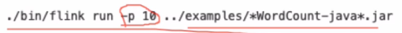
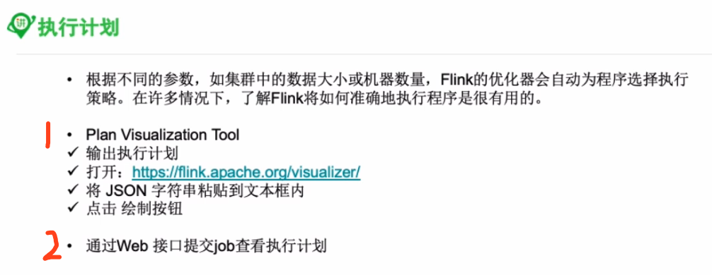
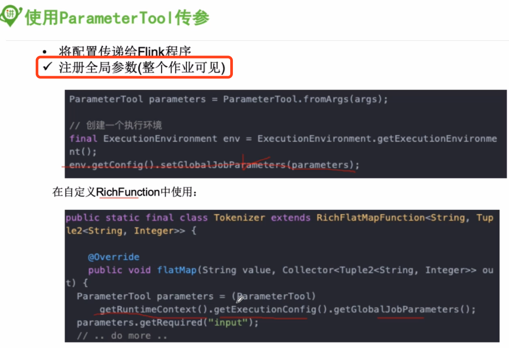
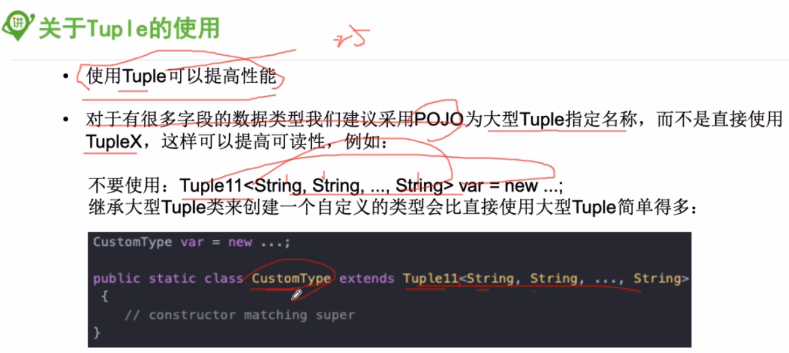
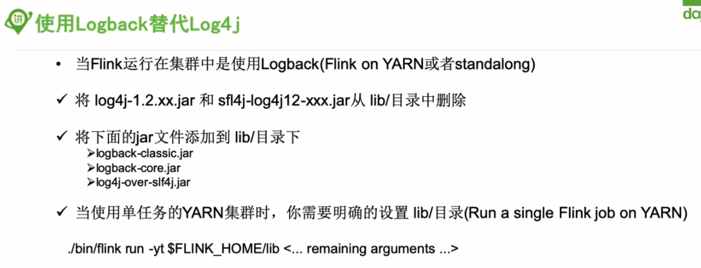
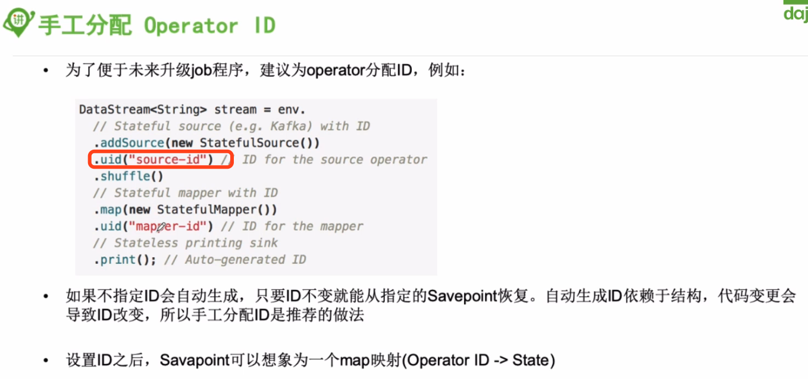
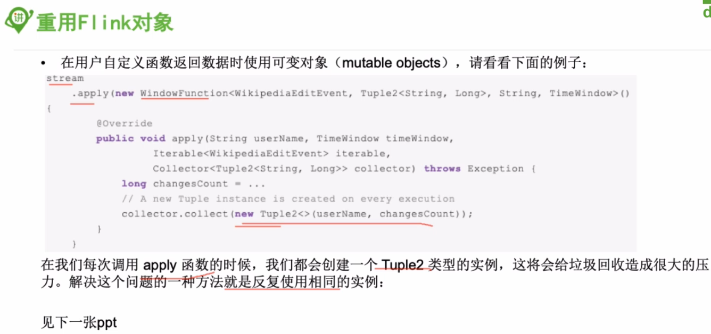
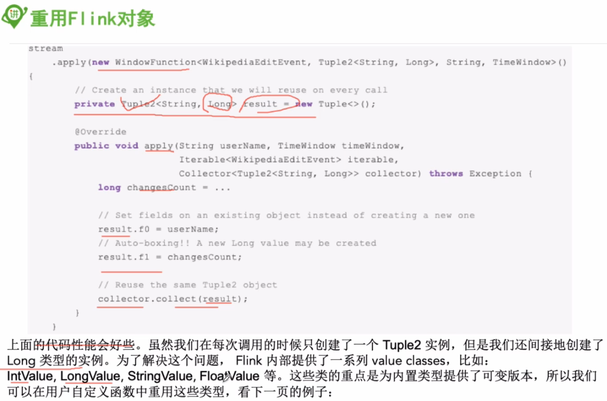
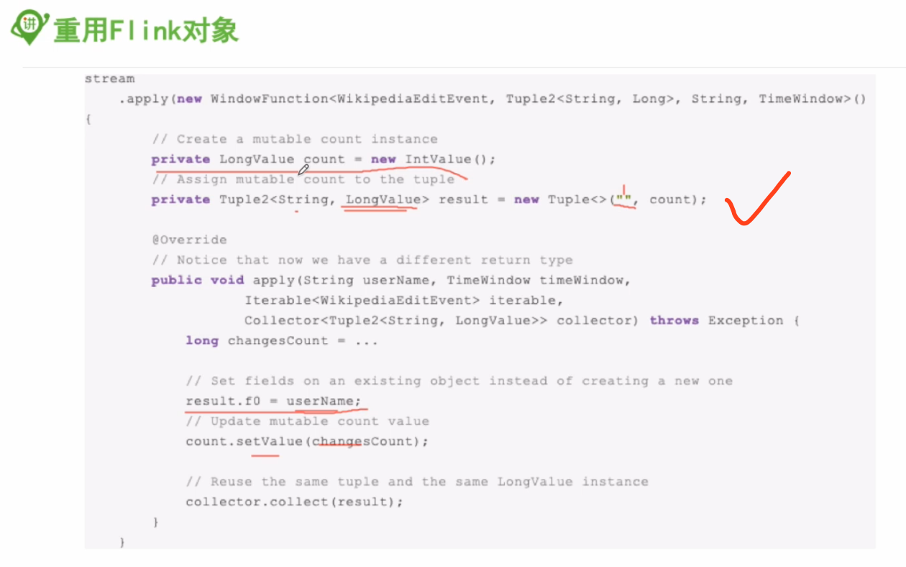

### 1, flink的序列化

* 看教程吧，感觉不重要，也听的不太懂，略

### 2, Execution管理

```java
StreamExecutionEnvironment senv = StreamExecutionEnvironment.getExecutionEnvironment();
```

#### 2.1, 获取配置，设置配置等

```java
senv.getConfig().setParallelism(3);
```

#### 2.2, 打包设置主类


#### 2.3, 设置并行度

第一种算子级别设置

第二种代码环境级别设置，如senv.getConfig().setParallelism(3);

第三种客户端级别，即在启动job的时候通过-p设置并行度



第四种是系统级别，在flink-conf.yaml中设置

#### 2.4, 设置最大并行度，默认也可以

第一种算子级别设置

第二种代码环境级别设置

客户端级别和系统级别是没法设置的，只有上面两种


#### 2.5, 查看执行计划

* 第一种方式需要在代码中senv.getExecutionPlan();
* 第二种是直接web页面提交jar包，据说很少用



### 3, flink最佳实践
















