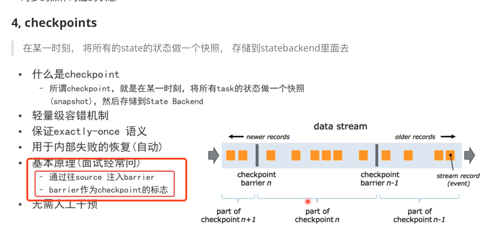

##### 1，窗口操作中，timeWindow和timeWindowAll区别是什么

##### 2， 其实不太明白一个地方：并发的话， 好像是把同一条消息同时发给多个并发线程？

不是应该把多条消息分发给多个线程吗？？？

是的，上面的猜测是对的， 自定义的打印数字的那个Custom_Source如果是多并行度，肯定会重复的接受到

但是kafka一个topic会有多个分区，然后每个分区一个并行度，就能保证不重复消费，暂时还没有全部理解，但是大概知道意思了

##### 3，sum和reduce的区别

sum是直接返回结果，reduce是多次运算，迭代返回结果

比如说要计算1，1，3，4的和，用sum直接得到9，用reduce是分别得到2，5，9，最后的结果是9

这些都是针对流数据窗口区间进行求和或者批处理进行计算哈

##### 4，CoMap, CoFlatMap是做什么的

connect后的数据需要map，但是是两种不同类型的数据，所以需要用CoMap代替map，或者CoFlatMap代替flatmap，以实现对一个数据中不同类型的数据的不同处理

5，flink的自动反压机制是如何处理的，面试的时候可以发挥

生态系统：

1，运行系统上来说：单机，集群：独立集群和yarn集群等

2，数据连接上来说：source和sink， source可以连接各个数据源，比如kafka，redis，hadoop，文件系统等等， 也可以自定义数据源， sink可以写入到各个数据库， 比如redis，kafka等等

3，本身生态上来说：即可以处理批处理，又可以处理流数据，保证高吞吐，低延迟，又能保证数据有序， 消费一次，同时提供sql等

4， 

 

checkpoint原理多理解一下方便面试回答

operator-chain和slot共享的理解：

大致可以如下理解：

比如说，快递传送带， 如果同一个方向， 有三个独立的传送带a(安全检查1), b(安全检查2), c(安全检查3)， 在需要的时候， 把三个传送带改成一个传送带c(全部安全检查)是不是就节省了中间a到b和b到c的人工运输，这样子就叫做operator-chain

比如说， 传送带很宽， 如果都是小物体， 那么同时放上三排，是不是比放一排更好， 这个就叫做槽位共享。

不过以上也只是简单的比喻，有些地方可能也不是很合适。

