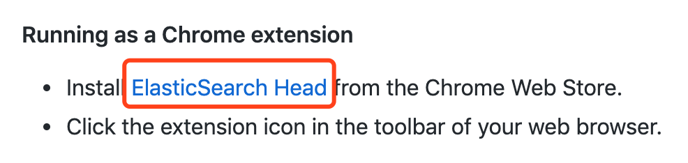
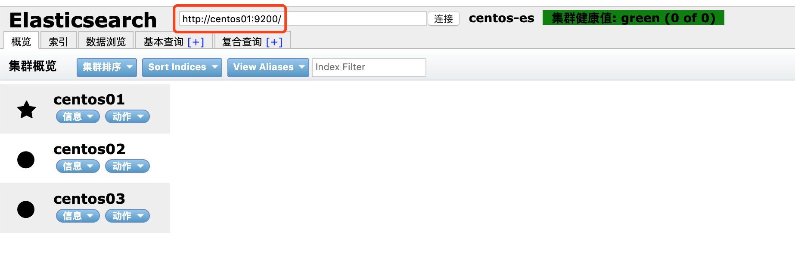

> ### 只允许普通用户操作，不允许root用户
>
> 注意：因为elasticsearch有远程执行脚本的功能所以容易中木马病毒，所以不允许用root用户启动，root用户是起不来的，赋权限，用一般的用户启动
>
> 要配置network.host才能别的机器或者网卡访问，否则只能是127.0.0.1或者localhost访问，这里配置成自己的局域网ip
>
> 注意配置yml结尾的配置文件都需要冒号后面加空格才行


参考：

https://www.jianshu.com/p/4467cfe4e651


```shell
su ivanl001 
/usr/local/es/bin/elasticsearch > /dev/null 2>&1 & 
su root

/usr/local/kibana/bin/kibana > /dev/null 2>&1 & 
```


> [http://centos01:9200/](http://centos01:9200/)
>
> [http://centos02:9200/](http://centos02:9200/)
>
> [http://centos03:9200/](http://centos03:9200/)
>
> 也可以直接在服务器上请求：
>
> curl 127.0.0.1:9200
>
> http://centos01:5601


接受到类似如下json即代表搭建ok

```json
{
  "name" : "centos01",
  "cluster_name" : "centos-es",
  "version" : {
    "number" : "2.2.1",
    "build_hash" : "d045fc29d1932bce18b2e65ab8b297fbf6cd41a1",
    "build_timestamp" : "2016-03-09T09:38:54Z",
    "build_snapshot" : false,
    "lucene_version" : "5.4.1"
  },
  "tagline" : "You Know, for Search"
}
```


[TOC]


## elasticsearch-5.2.2的安装

### 1, 下载elasticsearch-5.2.2.tar.gz安装包

https://www.elastic.co/cn/downloads/past-releases/elasticsearch-5-2-2

### 2, 创建非root用户ivanl001并修改密码

> useradd elk
>
> echo elk | passwd --stdin elk
>
> 
>
> useradd ivanl001
>
> echo ivanl001 | passwd --stdin ivanl001

### 3,  解压缩zip包

* 解压到/usr/local/目录下, 创建软链，并添加环境变量等等

```shell
tar -zxvf /root/elasticsearch-5.2.2.tar.gz -C /usr/local/
ln -s /usr/local/elasticsearch-5.2.2/ /usr/local/es
```

### 4, 修改配置文件

> vim /usr/local/es/config/elasticsearch.yml

```yml
# ======================== Elasticsearch Configuration =========================
#
# NOTE: Elasticsearch comes with reasonable defaults for most settings.
#       Before you set out to tweak and tune the configuration, make sure you
#       understand what are you trying to accomplish and the consequences.
#
# The primary way of configuring a node is via this file. This template lists
# the most important settings you may want to configure for a production cluster.
#
# Please consult the documentation for further information on configuration options:
# https://www.elastic.co/guide/en/elasticsearch/reference/index.html
#
# ---------------------------------- Cluster -----------------------------------
#
# Use a descriptive name for your cluster:
#
cluster.name: centos-es
#
# ------------------------------------ Node ------------------------------------
#
# Use a descriptive name for the node:
#
# 这里注意：不同的机器是不一样的哈
node.name: centos01
#
# Add custom attributes to the node:
#
#node.attr.rack: r1
#
# ----------------------------------- Paths ------------------------------------
#
# Path to directory where to store the data (separate multiple locations by comma):
#
path.data: /usr/local/es/data
#
# Path to log files:
#
path.logs: /usr/local/es/logs
#
# ----------------------------------- Memory -----------------------------------
#
# Lock the memory on startup:
#
# 这里生产上需要重新调研是否需要关闭
# 这里是为了防止某个报错所以关闭
bootstrap.memory_lock: false
bootstrap.system_call_filter: false
#
# Make sure that the heap size is set to about half the memory available
# on the system and that the owner of the process is allowed to use this
# limit.
#
# Elasticsearch performs poorly when the system is swapping the memory.
#
# ---------------------------------- Network -----------------------------------
#
# Set the bind address to a specific IP (IPv4 or IPv6):
#
# 这里是填写各自机器的ip
# network.host: 192.168.147.101
# 这里是允许访问的ip地址，最好允许所有，如果指定了，那么只有从指定ip才能进行访问
network.host: 0.0.0.0
#
# Set a custom port for HTTP:
#
#http.port: 9200
#
# For more information, consult the network module documentation.
#
# --------------------------------- Discovery ----------------------------------
#
# Pass an initial list of hosts to perform discovery when new node is started:
# The default list of hosts is ["127.0.0.1", "[::1]"]
#
discovery.zen.ping.unicast.hosts: ["192.168.147.101","192.168.147.102", "192.168.147.103"]
#
# Prevent the "split brain" by configuring the majority of nodes (total number of master-eligible nodes / 2 + 1):
#
#discovery.zen.minimum_master_nodes: 3
#
# For more information, consult the zen discovery module documentation.
#
# ---------------------------------- Gateway -----------------------------------
#
# Block initial recovery after a full cluster restart until N nodes are started:
#
#gateway.recover_after_nodes: 3
#
# For more information, consult the gateway module documentation.
#
# ---------------------------------- Various -----------------------------------
#
# Require explicit names when deleting indices:
#
#action.destructive_requires_name: true
#
#
```

### 5, 修改文件所属者

```shell
chown -R ivanl001:ivanl001 /usr/local/elasticsearch-5.2.2/
chown -R ivanl001:ivanl001 /usr/local/es

chown -R elk:elk /usr/local/elasticsearch-5.2.2/
chown -R elk:elk /usr/local/es
```

### 6, 分发到不同的机器上

* 我自己的命令，可以自己在自己机器上分发即可

```shell
imrsync /usr/local/es/config/elasticsearch.yml
```

### 7, 配置系统资源

> 默认这样开启的话，会有类似如下报错：
>
> 所以需要编辑如下三个文件：
>
> /etc/security/limits.conf
>
> /etc/security/limits.d/90-nproc.conf
>
> /etc/sysctl.conf

```txt
[2019-07-25T09:26:00,149][ERROR][o.e.b.Bootstrap          ] [centos01] node validation exception
bootstrap checks failed
max file descriptors [4096] for elasticsearch process is too low, increase to at least [65536]
max virtual memory areas vm.max_map_count [65530] is too low, increase to at least [262144]
```

```shell
vim /etc/security/limits.conf
# 添加如下内容:
* soft nofile 65536
* hard nofile 65536

vim /etc/sysctl.conf
# 添加如下内容
vm.max_map_count=655360

sysctl -p
```


### 8, 启动

```shell
su ivanl001 
/usr/local/es/bin/elasticsearch > /dev/null 2>&1 & 
su root


su elk
/usr/local/es/bin/elasticsearch > /dev/null 2>&1 & 
su root
```


### 9, 启动验证

> [http://centos01:9200/](http://centos01:9200/)
>
> [http://centos02:9200/](http://centos02:9200/)
>
> [http://centos03:9200/](http://centos03:9200/)
>
> 也可以直接在服务器上请求：
>
> curl 127.0.0.1:9200

接受到类似如下json即代表搭建ok

```json
{
  "name" : "centos01",
  "cluster_name" : "centos-es",
  "version" : {
    "number" : "2.2.1",
    "build_hash" : "d045fc29d1932bce18b2e65ab8b297fbf6cd41a1",
    "build_timestamp" : "2016-03-09T09:38:54Z",
    "build_snapshot" : false,
    "lucene_version" : "5.4.1"
  },
  "tagline" : "You Know, for Search"
}
```


## 添加UI界面插件

### 1, 找到github上源码

https://github.com/mobz/elasticsearch-head

### 2, 看下面使用方法中有chrome插件，直接添加即可



### 3, 地址如下, 简单配置即可

> 注意：在

https://chrome.google.com/webstore/detail/elasticsearch-head/ffmkiejjmecolpfloofpjologoblkegm/




## IK分词器安装使用

### 1, 找到github主页

https://github.com/medcl/elasticsearch-analysis-ik


### 2, 根据文档README.md, 选择合适版本下载ik

Versions

| IK version | ES version       |
| ---------- | ---------------- |
| master     | 7.x -> master    |
| 6.x        | 6.x              |
| 5.x        | 5.x              |
| 1.10.6     | 2.4.6            |
| 1.9.5      | 2.3.5            |
| 1.8.1      | 2.2.1            |
| 1.7.0      | 2.1.1            |
| 1.5.0      | 2.0.0            |
| 1.2.6      | 1.0.0            |
| 1.2.5      | 0.90.x           |
| 1.1.3      | 0.20.x           |
| 1.0.0      | 0.16.2 -> 0.19.0 |

https://github.com/medcl/elasticsearch-analysis-ik/releases


### 3, 解压后放到/usr/local/es/plugins/中

### 4, 把分词器目录名改为ik

### 5, 更改ik目录的所属者

```shell
chown -R ivanl001:ivanl001 /usr/local/es/plugins/ik
```

### 6, 重启es 

```shell
su ivanl001 
/usr/local/es/bin/elasticsearch > /dev/null 2>&1 & 
```


### 7, 使用测试

```shell
# 创建index
curl -XPUT http://centos01:9200/myindex

# 给mytype创建mapping，指定使用的分词器为ik
# ik_max_word 和 ik_smart 什么区别?
# ik_max_word: 会将文本做最细粒度的拆分，比如会将“中华人民共和国国歌”拆分为“中华人民共和国,中华人民,中华,华人,人民共和国,人民,人,民,共和国,共和,和,国国,国歌”，会穷尽各种可能的组合，适合 Term Query；
# ik_smart: 会做最粗粒度的拆分，比如会将“中华人民共和国国歌”拆分为“中华人民共和国,国歌”，适合 Phrase 查询。
curl -XPOST http://centos01:9200/myindex/mytype/_mapping -H 'Content-Type:application/json' -d'
{
        "properties": {
            "content": {
                "type": "text",
                "analyzer": "ik_max_word",
                "search_analyzer": "ik_smart"
            }
        }

}'


# 然后插入数据
curl -XPOST http://centos01:9200/myindex/mytype/1 -H 'Content-Type:application/json' -d'
{"content":"美国留给伊拉克的是个烂摊子吗"}
'
# 然后插入数据
curl -XPOST http://centos01:9200/myindex/mytype/2 -H 'Content-Type:application/json' -d'
{"content":"公安部：各地校车将享最高路权"}
'
# 然后插入数据
curl -XPOST http://centos01:9200/myindex/mytype/3 -H 'Content-Type:application/json' -d'
{"content":"中韩渔警冲突调查：韩警平均每天扣1艘中国渔船"}
'
# 然后插入数据
curl -XPOST http://centos01:9200/myindex/mytype/4 -H 'Content-Type:application/json' -d'
{"content":"中国驻洛杉矶领事馆遭亚裔男子枪击 嫌犯已自首"}
'

# 查询数据即可，从下面结果可以看到已经生效
curl -XPOST http://centos01:9200/myindex/mytype/_search  -H 'Content-Type:application/json' -d'
{
    "query" : { "match" : { "content" : "中国" }},
    "highlight" : {
        "pre_tags" : ["<tag1>", "<tag2>"],
        "post_tags" : ["</tag1>", "</tag2>"],
        "fields" : {
            "content" : {}
        }
    }
}
'

# 结果：
{
	"took": 41,
	"timed_out": false,
	"_shards": {
		"total": 5,
		"successful": 5,
		"failed": 0
	},
	"hits": {
		"total": 2,
		"max_score": 0.5347766,
		"hits": [{
			"_index": "index",
			"_type": "mytype",
			"_id": "4",
			"_score": 0.5347766,
			"_source": {
				"content": "中国驻洛杉矶领事馆遭亚裔男子枪击 嫌犯已自首"
			},
			"highlight": {
				"content": ["<tag1>中国</tag1>驻洛杉矶领事馆遭亚裔男子枪击 嫌犯已自首"]
			}
		}, {
			"_index": "index",
			"_type": "mytype",
			"_id": "3",
			"_score": 0.27638745,
			"_source": {
				"content": "中韩渔警冲突调查：韩警平均每天扣1艘中国渔船"
			},
			"highlight": {
				"content": ["中韩渔警冲突调查：韩警平均每天扣1艘<tag1>中国</tag1>渔船"]
			}
		}]
	}
}
```


## Kibana的安装

### 1, 下载对应版本的kibana

> 比如es是6.8.0，那么 Kibana最好也是6.8.6, 不然可能安装好了启动不了
>
> 因为es的版本中有些基础概念变化较大，比如说type等

https://www.elastic.co/downloads/past-releases/


## 2, 解压到指定目录

```shell
tar -zxvf kibana-6.8.6-linux-x86_64.tar.gz -C /usr/local/

# 创建软链
ln -s /usr/local/kibana-6.8.6-linux-x86_64/ /usr/local/kibana
```


### 3, 解除ip限制

```shell
vim /usr/local/kibana/config/kibana.yml 

# 允许所以ip访问，默认是localhost
server.host: 0.0.0.0
```


### 4, 启动kibana

```shell
/usr/local/kibana/bin/kibana > /dev/null 2>&1 & 
```


### 5, 访问kibana

http://centos01:5601


