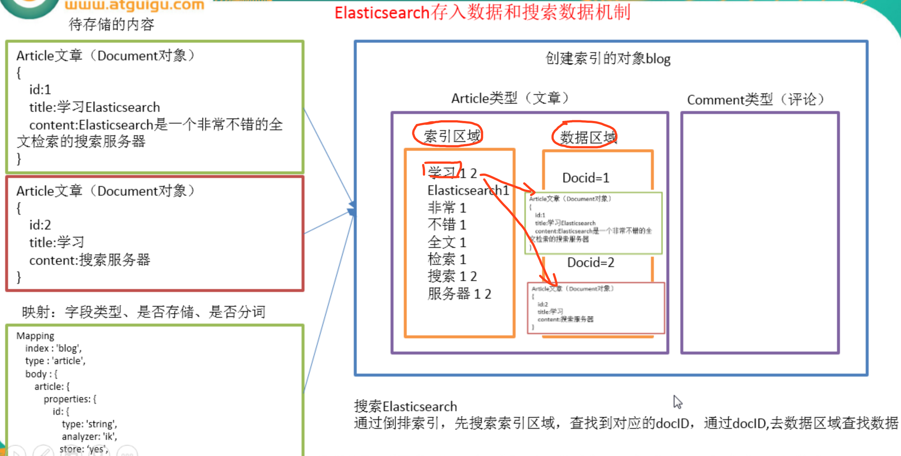

[toc]

## 1, ES的核心概念

### 1.1 近实时(NRT-near real time)

近实时，两个意思，从写入数据到数据可以被搜索到有一个小延迟（大概1秒）；基于es执行搜索和分析可以达到秒级。

### 1.2 Cluster（集群）

集群包含多个节点，每个节点属于哪个集群是通过一个配置（集群名称，默认是elasticsearch）来决定的，对于中小型应用来说，刚开始一个集群就一个节点很正常

### 1.3 Node（节点）

集群中的一个节点，节点也有一个名称（默认是随机分配的），节点名称很重要（在执行运维管理操作的时候），默认节点会去加入一个名称为“elasticsearch”的集群，如果直接启动一堆节点，那么它们会自动组成一个elasticsearch集群，当然一个节点也可以组成一个elasticsearch集群。

### 1.4, Index（索引-数据库）

> 早期版本相当于database
>
> 6.x版本中相当于table

### 1.5, Type（类型-表）

> 早期版本一个index下可以有多个type
>
> 但是在6.x版本下，一个index下只能有一个type，那么index和type相当于同级于table了

### 1.6, Document（文档-行）

文档是es中的最小数据单元，一个document可以是一条客户数据，一条商品分类数据，一条订单数据，通常用JSON数据结构表示，每个index下的type中，都可以去存储多个document

### 1.7, Field（字段-列）

Field是Elasticsearch的最小单位。一个document里面有多个field，每个field就是一个数据字段。

### 1.7.8 mapping（映射-约束）

数据如何存放到索引对象上，需要有一个映射配置，包括：数据类型、是否存储、是否分词等。

这样就创建了一个名为blogIndexTypeMapping MappingDocument analyzerMapping 

 

### 1.7.9 elasticsearch与数据库的类比

| 关系型数据库（比如Mysql） | 非关系型数据库（Elasticsearch） |
| ------------------------- | ------------------------------- |
| 数据库Database            | 索引Index                       |
| 表Table                   | 类型Type                        |
| 数据行Row                 | 文档Document                    |
| 数据列Column              | 字段Field                       |
| 约束 Schema               | 映射Mapping                     |

## 2, ES存入和搜索机制

