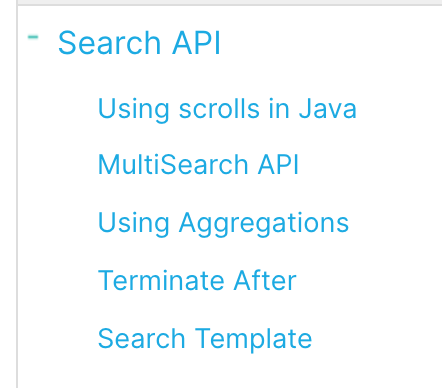

> 本文大部分是参考官网www.elastic.co的es的5.2.2的官方文档写的

## 1, TransportClient

* client是javaAPI操作es的入口，客户端，任何操作都需要先获取client

```java
package org.elasticsearch.a00.TransportClient;

import org.elasticsearch.action.index.IndexRequestBuilder;
import org.elasticsearch.action.index.IndexResponse;
import org.elasticsearch.client.transport.TransportClient;
import org.elasticsearch.common.settings.Settings;
import org.elasticsearch.common.transport.InetSocketTransportAddress;
import org.elasticsearch.common.xcontent.XContentBuilder;
import org.elasticsearch.rest.RestStatus;
import org.elasticsearch.transport.client.PreBuiltTransportClient;

import java.io.IOException;
import java.net.InetAddress;
import java.net.UnknownHostException;
import java.util.Date;

import static org.elasticsearch.common.xcontent.XContentFactory.jsonBuilder;

/**
 * #author      : ivanl001
 * #creator     : 2019-07-29 11:05
 *
 * #description : https://www.elastic.co/guide/en/elasticsearch/client/java-api/5.2/transport-client.html
 *
 * es的api的入口类，通过创建Client进行数据的增删改查
 *
 * Clientedit
 * You can use the Java client in multiple ways:

 * Perform standard index, get, delete and search operations on an existing cluster
 * Perform administrative tasks on a running cluster
 * Obtaining an elasticsearch Client is simple. The most common way to get a client is by creating a TransportClient that
 * connects to a cluster.
 * 
 **/
public class a01_es_client {

    public static void main(String[] args) throws IOException {

        //1, 创建client对象
        TransportClient client = new PreBuiltTransportClient(
                Settings.builder()
                        .put("cluster.name", "centos-es")
                        .put("client.transport.sniff", true)
                        .build())
                .addTransportAddress(new InetSocketTransportAddress(InetAddress.getByName("centos01"), 9300))
                .addTransportAddress(new InetSocketTransportAddress(InetAddress.getByName("centos02"), 9300))
                .addTransportAddress(new InetSocketTransportAddress(InetAddress.getByName("centos03"), 9300));

        //2, 使用client对象进行增删改查操作
        //System.out.println(client);
        /*//这里既可以用默认的工具类，也可以自己写json串的哦
        XContentBuilder builder = jsonBuilder()
                .startObject()
                .field("content", "中国")
                .field("age", 10)
                .endObject();
        String json = builder.string();*/

        //3, 操作完毕关闭client对象
        client.close();

    }
}
```


## 2, Administration

* 管理员权限，也就是通过这个权限进行索引的创建， type的创建，map的设置等等

```java
package org.elasticsearch.a01.Indices;

import org.elasticsearch.action.admin.indices.create.CreateIndexResponse;
import org.elasticsearch.action.admin.indices.delete.DeleteIndexRequestBuilder;
import org.elasticsearch.action.admin.indices.delete.DeleteIndexResponse;
import org.elasticsearch.client.IndicesAdminClient;
import org.elasticsearch.client.transport.TransportClient;
import org.elasticsearch.common.settings.Settings;
import org.elasticsearch.common.transport.InetSocketTransportAddress;
import org.elasticsearch.transport.client.PreBuiltTransportClient;

import java.net.InetAddress;
import java.net.UnknownHostException;

/**
 * #author      : ivanl001
 * #creator     : 2019-07-29 12:23
 *
 * #description : https://www.elastic.co/guide/en/elasticsearch/client/java-api/5.2/java-admin-indices.html
 *
 **/
public class a01_es_administration {

    public static void main(String[] args) throws UnknownHostException {

        //就算是管理者，也是从client入手的，具体看TransportClient章节
        //1, 先创建client
        TransportClient client = new PreBuiltTransportClient(Settings.builder().put("cluster.name", "centos-es").build())
                .addTransportAddress(new InetSocketTransportAddress(InetAddress.getByName("centos01"), 9300))
                .addTransportAddress(new InetSocketTransportAddress(InetAddress.getByName("centos01"), 9300))
                .addTransportAddress(new InetSocketTransportAddress(InetAddress.getByName("centos01"), 9300));

        //2, 通过client创建对象
        IndicesAdminClient indices = client.admin().indices();

        //3，创建index
        /*CreateIndexResponse response = indices.prepareCreate("twitter")
                //have specific settings associated with it.
                .setSettings(Settings.builder()
                        .put("index.number_of_shards", 3)
                        .put("index.number_of_replicas", 2)
                        .build())
                //add a new type while creating an index:
                //创建index的时候直接添加type
                .addMapping("tweet", "{\n" +
                        "    \"tweet\": {\n" +
                        "      \"properties\": {\n" +
                        "        \"message\": {\n" +
                        "          \"type\": \"string\"\n" +
                        "        }\n" +
                        "      }\n" +
                        "    }\n" +
                        "  }")
                .get();*/


        //上面是创建index的时候直接添加type
        //下面的代码是给已有的index添加type
        /*client.admin().indices().preparePutMapping("twitter")
                .setType("user")
                .setSource("{\n" +
                        "  \"properties\": {\n" +
                        "    \"name\": {\n" +
                        "      \"type\": \"string\"\n" +
                        "    }\n" +
                        "  }\n" +
                        "}")
                .get();

        // You can also provide the type in the source document
        client.admin().indices().preparePutMapping("twitter")
                .setType("user")
                .setSource("{\n" +
                        "    \"user\":{\n" +
                        "        \"properties\": {\n" +
                        "            \"name\": {\n" +
                        "                \"type\": \"string\"\n" +
                        "            }\n" +
                        "        }\n" +
                        "    }\n" +
                        "}")
                .get();*/


        //删除index
        DeleteIndexResponse deleteIndexRequestBuilder = indices.prepareDelete("ctv").get();
        System.out.println(deleteIndexRequestBuilder.isAcknowledged());

        //4,
        client.close();
        //创建index之后就往里插入type和document了,看后面的章节
    }
}
```

## 3, Document

* 这个是doc的相关操作，主要包括创建索引，增删改查等
* 其实创建索引就是相当于增加doc

### 3.1, index

```java
package org.elasticsearch.a02.DocumentAPIs;

import com.alibaba.fastjson.JSON;
import org.elasticsearch.action.index.IndexResponse;
import org.elasticsearch.client.transport.TransportClient;
import org.elasticsearch.common.settings.Settings;
import org.elasticsearch.common.transport.InetSocketTransportAddress;
import org.elasticsearch.common.xcontent.XContentBuilder;
import org.elasticsearch.rest.RestStatus;
import org.elasticsearch.transport.client.PreBuiltTransportClient;

import java.io.IOException;
import java.net.InetAddress;
import java.net.UnknownHostException;
import java.util.Date;
import java.util.HashMap;
import java.util.Map;

import static org.elasticsearch.common.xcontent.XContentFactory.jsonBuilder;

/**
 * #author      : ivanl001
 * #creator     : 2019-07-29 11:41
 * #description : https://www.elastic.co/guide/en/elasticsearch/client/java-api/5.2/java-docs-index.html
 *
 **/
public class a01_es_index {


    public static void main(String[] args) throws IOException {

        //1, 创建client对象
        TransportClient client = new PreBuiltTransportClient(
                Settings.builder()
                        .put("cluster.name", "centos-es")
                        .put("client.transport.sniff", true)
                        .build())
                .addTransportAddress(new InetSocketTransportAddress(InetAddress.getByName("centos01"), 9300))
                .addTransportAddress(new InetSocketTransportAddress(InetAddress.getByName("centos02"), 9300))
                .addTransportAddress(new InetSocketTransportAddress(InetAddress.getByName("centos03"), 9300));

        //2, 创建索引
        //第一种方式：setSource是添加jsonBuilder
        /*IndexResponse indexResponse = client.prepareIndex("twitter", "tweet")
                .setSource(jsonBuilder()
                        .startObject()
                        .field("user", "kimchy")
                        .field("postDate", new Date())
                        .field("message", "trying out Elasticsearch")
                        .endObject())
                .get();*/


        //第二种方式：setSource是json串
        /*String json = "{" +
                "\"user\":\"kimchy\"," +
                "\"postdate\":\"2013-01-30\"," +
                "\"message\":\"trying out elasticsearch\"" +
                "}";
        IndexResponse indexResponse = client.prepareIndex("twitter", "tweet")
                .setSource(json)
                .get();*/

        //第三种方式：jsonBuilder转换成json串，注意：jsonBuilder转换成字符串是string()方法，而不是.toString()
        /*IndexResponse indexResponse = client.prepareIndex("twitter", "tweet")
                .setSource(jsonBuilder()
                        .startObject()
                        .field("user", "kimchy")
                        .field("postDate", new Date())
                        .field("message", "trying out Elasticsearch")
                        .endObject().string())
                .get();*/

        //第四种方式：map方式
        Map<String, Object> jsonMap = new HashMap<String, Object>();
        jsonMap.put("user","ivanl002");
        jsonMap.put("postDate",new Date());
        jsonMap.put("message","trying out Elasticsearch and I know It's awesome!");
        String jsonString = JSON.toJSONString(jsonMap);
        IndexResponse indexResponse = client.prepareIndex("twitter", "tweet", "2")
                .setSource(jsonString)
                .get();


        // Index name
        String _index = indexResponse.getIndex();
        // Type name
        String _type = indexResponse.getType();
        // Document ID (generated or not)
        String _id = indexResponse.getId();
        // Version (if it's the first time you index this document, you will get: 1)
        long _version = indexResponse.getVersion();
        // status has stored current instance statement.
        RestStatus status = indexResponse.status();
        System.out.println("index:" + _index + ", type:" + _type + ", id:" + _id + ", version:" + _version + ", status:" + status);


        //3, 操作完毕关闭client对象
        client.close();
    }
}
```

### 3.2, get

```java
package org.elasticsearch.a02.DocumentAPIs;

import org.elasticsearch.action.get.GetRequestBuilder;
import org.elasticsearch.action.get.GetResponse;
import org.elasticsearch.client.transport.TransportClient;
import org.elasticsearch.common.settings.Settings;
import org.elasticsearch.common.transport.InetSocketTransportAddress;
import org.elasticsearch.index.get.GetField;
import org.elasticsearch.transport.client.PreBuiltTransportClient;

import java.net.InetAddress;
import java.net.UnknownHostException;
import java.util.Iterator;
import java.util.Map;
import java.util.Set;

/**
 * #author      : ivanl001
 * #creator     : 2019-07-29 11:42
 * #description :
 *
 * https://www.elastic.co/guide/en/elasticsearch/client/java-api/5.2/java-docs-get.html
 *
 **/
public class a02_es_get {

    public static void main(String[] args) throws UnknownHostException {

        //1，创建client对象
        TransportClient client = new PreBuiltTransportClient(
                Settings.builder().put("cluster.name", "centos-es").build())
                .addTransportAddress(new InetSocketTransportAddress(InetAddress.getByName("centos01"), 9300))
                .addTransportAddress(new InetSocketTransportAddress(InetAddress.getByName("centos02"), 9300))
                .addTransportAddress(new InetSocketTransportAddress(InetAddress.getByName("centos03"), 9300));

        //2, 使用client进行获取操作
        GetResponse response = client.prepareGet("twitter", "tweet", "AWw5vXokqT9gSR33OKwI").get();


        /*System.out.println(response.isSourceEmpty());
        System.out.println(response.getSource().size());*/

        Map<String, Object> source = response.getSource();
        Iterator<Map.Entry<String, Object>> iterator = source.entrySet().iterator();
        while (iterator.hasNext()) {
            Map.Entry<String, Object> next = iterator.next();
            System.out.println("key是："+ next.getKey() + "，value是:" + next.getValue());
        }

        client.close();
    }
}
```

### 3.3, delete

```java
package org.elasticsearch.a02.DocumentAPIs;

import org.elasticsearch.action.delete.DeleteResponse;
import org.elasticsearch.client.transport.TransportClient;
import org.elasticsearch.common.settings.Settings;
import org.elasticsearch.common.transport.InetSocketTransportAddress;
import org.elasticsearch.transport.client.PreBuiltTransportClient;

import java.net.InetAddress;
import java.net.UnknownHostException;

/**
 * #author      : ivanl001
 * #creator     : 2019-07-29 14:01
 * #description : https://www.elastic.co/guide/en/elasticsearch/client/java-api/5.2/java-docs-delete.html
 **/
public class a03_es_delete {

    public static void main(String[] args) throws UnknownHostException {

        //1，创建client对象
        TransportClient client = new PreBuiltTransportClient(
                Settings.builder().put("cluster.name", "centos-es").build())
                .addTransportAddress(new InetSocketTransportAddress(InetAddress.getByName("centos01"), 9300))
                .addTransportAddress(new InetSocketTransportAddress(InetAddress.getByName("centos02"), 9300))
                .addTransportAddress(new InetSocketTransportAddress(InetAddress.getByName("centos03"), 9300));

        //2, 删除
        DeleteResponse response = client.prepareDelete("twitter", "tweet", "AWw5v8Q_qT9gSR33OKwJ").get();
        //OK代表删除成功，NOT_FOUND代表查无此id
//        System.out.println(response.status());

        //3, 关闭客户端
        client.close();
    }
}
```

### 3.4, deleteByQuery

* 这个是通过查询删除，就是能查出来的都会删掉

```java
package org.elasticsearch.a02.DocumentAPIs;

import org.elasticsearch.action.ActionListener;
import org.elasticsearch.action.delete.DeleteResponse;
import org.elasticsearch.client.transport.TransportClient;
import org.elasticsearch.common.settings.Settings;
import org.elasticsearch.common.transport.InetSocketTransportAddress;
import org.elasticsearch.index.query.QueryBuilders;
import org.elasticsearch.index.reindex.BulkIndexByScrollResponse;
import org.elasticsearch.index.reindex.DeleteByQueryAction;
import org.elasticsearch.transport.client.PreBuiltTransportClient;

import java.net.InetAddress;
import java.net.UnknownHostException;

/**
 * #author      : ivanl001
 * #creator     : 2019-07-29 14:06
 * #description : https://www.elastic.co/guide/en/elasticsearch/client/java-api/5.2/java-docs-delete-by-query.html
 **/
public class a04_es_deleteByQuery {

    public static void main(String[] args) throws UnknownHostException {

        //1，创建client对象
        TransportClient client = new PreBuiltTransportClient(
                Settings.builder().put("cluster.name", "centos-es").build())
                .addTransportAddress(new InetSocketTransportAddress(InetAddress.getByName("centos01"), 9300))
                .addTransportAddress(new InetSocketTransportAddress(InetAddress.getByName("centos02"), 9300))
                .addTransportAddress(new InetSocketTransportAddress(InetAddress.getByName("centos03"), 9300));

        //2, 根据查询结果删除, 这个是同步的
        //查询的api后面会讲
        /*BulkIndexByScrollResponse response = DeleteByQueryAction.INSTANCE.newRequestBuilder(client)
                        .filter(QueryBuilders.matchQuery("postDate", "1564379951602"))
                        .source("twitter")
                        .get();
        //1代表删除成功，0代表失败
        long deleted = response.getDeleted();
        System.out.println(deleted);*/

        //------------这个是异步的，执行的时候报错了，先不管了------------
        //As it can be a long running operation, if you wish to do it asynchronously, you can call execute instead of get and provide a listener like:
        DeleteByQueryAction.INSTANCE.newRequestBuilder(client)
                .filter(QueryBuilders.matchQuery("postDate", "1564379951602"))
                .source("twitter")
                .execute(new ActionListener<BulkIndexByScrollResponse>() {
                    @Override
                    public void onResponse(BulkIndexByScrollResponse response) {
                        long deleted = response.getDeleted();
                        System.out.println("是否删除成功：" + deleted);
                    }
                    @Override
                    public void onFailure(Exception e) {
                        // Handle the exception
                        System.out.println("删除失败");
                    }
                });
      
        //3, 关闭客户端
        client.close();
    }
}
```

### 3.5, update

```java
package org.elasticsearch.a02.DocumentAPIs;

import org.elasticsearch.action.index.IndexRequest;
import org.elasticsearch.action.update.UpdateRequest;
import org.elasticsearch.client.transport.TransportClient;
import org.elasticsearch.common.settings.Settings;
import org.elasticsearch.common.transport.InetSocketTransportAddress;
import org.elasticsearch.script.Script;
import org.elasticsearch.script.ScriptService;
import org.elasticsearch.script.ScriptType;
import org.elasticsearch.transport.client.PreBuiltTransportClient;

import java.io.IOException;
import java.net.InetAddress;
import java.net.UnknownHostException;
import java.util.concurrent.ExecutionException;

import static org.elasticsearch.common.xcontent.XContentFactory.jsonBuilder;

/**
 * #author      : ivanl001
 * #creator     : 2019-07-29 14:15
 * #description : https://www.elastic.co/guide/en/elasticsearch/client/java-api/5.2/java-docs-update.html
 **/
public class a05_es_update {

    public static void main(String[] args) throws IOException, ExecutionException, InterruptedException {

        //1，创建client对象
        TransportClient client = new PreBuiltTransportClient(
                Settings.builder().put("cluster.name", "centos-es").build())
                .addTransportAddress(new InetSocketTransportAddress(InetAddress.getByName("centos01"), 9300))
                .addTransportAddress(new InetSocketTransportAddress(InetAddress.getByName("centos02"), 9300))
                .addTransportAddress(new InetSocketTransportAddress(InetAddress.getByName("centos03"), 9300));


        //第一种方式：You can either create an UpdateRequest and send it to the client:
        /*UpdateRequest updateRequest = new UpdateRequest();
        updateRequest.index("twitter");
        updateRequest.type("tweet");
        //id必须是已经存在的
        updateRequest.id("AWw5upfohi2_G13CpRlQ");
        updateRequest.doc(jsonBuilder()
                .startObject()
                .field("user", "ivanl001")
                .endObject());
        client.update(updateRequest).get();*/


        //第二种方式：Or you can use prepareUpdate() method:
        /*client.prepareUpdate("twitter", "tweet", "AWw5upfohi2_G13CpRlQ")
                .setDoc(jsonBuilder()
                        .startObject()
                        .field("message", "ivanl001 is the king of world!")
                        .endObject())
                .get();*/


        //第三种方式：⚠️前两种必须要存在，否则报错，这一种upsert，如果不存在会插入，存在会更新
        //如果没有会插入indexRequest
        IndexRequest indexRequest = new IndexRequest("twitter", "tweet", "1")
                .source(jsonBuilder()
                        .startObject()
                        .field("name", "Joe Smith")
                        .field("message", "The world is awesome!")
                        .endObject());
        //如果有，会更新message字段
        UpdateRequest updateRequest = new UpdateRequest("twitter", "tweet", "1")
                .doc(jsonBuilder()
                        .startObject()
                        .field("message", "Are you kidding? ")
                        .endObject())
                .upsert(indexRequest);
        client.update(updateRequest).get();

        //3, 关闭客户端
        client.close();
    }
}
```

### 3.6, multiGet

```java
package org.elasticsearch.a02.DocumentAPIs;

import org.elasticsearch.action.get.GetResponse;
import org.elasticsearch.action.get.MultiGetItemResponse;
import org.elasticsearch.action.get.MultiGetResponse;
import org.elasticsearch.client.transport.TransportClient;
import org.elasticsearch.common.settings.Settings;
import org.elasticsearch.common.transport.InetSocketTransportAddress;
import org.elasticsearch.transport.client.PreBuiltTransportClient;

import java.net.InetAddress;
import java.net.UnknownHostException;

/**
 * #author      : ivanl001
 * #creator     : 2019-07-29 14:28
 * #description : https://www.elastic.co/guide/en/elasticsearch/client/java-api/5.2/java-docs-multi-get.html
 **/
public class a06_es_multiGet {

    public static void main(String[] args) throws UnknownHostException {
        //1，创建client对象
        TransportClient client = new PreBuiltTransportClient(
                Settings.builder().put("cluster.name", "centos-es").build())
                .addTransportAddress(new InetSocketTransportAddress(InetAddress.getByName("centos01"), 9300))
                .addTransportAddress(new InetSocketTransportAddress(InetAddress.getByName("centos02"), 9300))
                .addTransportAddress(new InetSocketTransportAddress(InetAddress.getByName("centos03"), 9300));

        MultiGetResponse multiGetItemResponses = client.prepareMultiGet()
                .add("twitter", "tweet", "1")
                .add("twitter", "tweet", "2", "3", "4")
                .add("another", "type", "foo")
                .get();


        for (MultiGetItemResponse itemResponse : multiGetItemResponses) {
            GetResponse response = itemResponse.getResponse();
            if (response.isExists()) {
                //直接转成json串了
                String json = response.getSourceAsString();
                System.out.println(json);
            }
        }

        //3, 关闭客户端
        client.close();
    }
}
```

### 3.7, bulk

* 这个没怎么研究，就大致看了下

```java
package org.elasticsearch.a02.DocumentAPIs;

import org.elasticsearch.action.bulk.BulkRequestBuilder;
import org.elasticsearch.action.bulk.BulkResponse;
import org.elasticsearch.client.transport.TransportClient;
import org.elasticsearch.common.settings.Settings;
import org.elasticsearch.common.transport.InetSocketTransportAddress;
import org.elasticsearch.transport.client.PreBuiltTransportClient;

import java.io.IOException;
import java.net.InetAddress;
import java.net.UnknownHostException;
import java.util.Date;

import static org.elasticsearch.common.xcontent.XContentFactory.jsonBuilder;

/**
 * #author      : ivanl001
 * #creator     : 2019-07-29 14:34
 * #description : https://www.elastic.co/guide/en/elasticsearch/client/java-api/5.2/java-docs-bulk.html
 *
 * index and delete several documents
 *
 **/
public class a07_es_bulk {

    public static void main(String[] args) throws IOException {

        //1，创建client对象
        TransportClient client = new PreBuiltTransportClient(
                Settings.builder().put("cluster.name", "centos-es").build())
                .addTransportAddress(new InetSocketTransportAddress(InetAddress.getByName("centos01"), 9300))
                .addTransportAddress(new InetSocketTransportAddress(InetAddress.getByName("centos02"), 9300))
                .addTransportAddress(new InetSocketTransportAddress(InetAddress.getByName("centos03"), 9300));


        BulkRequestBuilder bulkRequest = client.prepareBulk();

        // either use client#prepare, or use Requests# to directly build index/delete requests
        bulkRequest.add(client.prepareIndex("twitter", "tweet", "3")
                .setSource(jsonBuilder()
                        .startObject()
                        .field("user", "ivanl003")
                        .field("postDate", new Date())
                        .field("message", "again? trying out Elasticsearch")
                        .endObject()
                )
        );

        bulkRequest.add(client.prepareIndex("twitter", "tweet", "4")
                .setSource(jsonBuilder()
                        .startObject()
                        .field("user", "ivanl004")
                        .field("postDate", new Date())
                        .field("message", "another post")
                        .endObject()
                )
        );

        BulkResponse bulkResponse = bulkRequest.get();
        if (bulkResponse.hasFailures()) {
            // process failures by iterating through each bulk response item

        }

        //3, 关闭客户端
        client.close();
    }
}
```


## 4, search

* search的内容暂时没怎么仔细研究，先放着，用到的之后再慢慢增加

### 4.1, 简单search

```java
package org.elasticsearch.a03.Search;

import org.elasticsearch.action.search.SearchResponse;
import org.elasticsearch.action.search.SearchType;
import org.elasticsearch.client.transport.TransportClient;
import org.elasticsearch.common.settings.Settings;
import org.elasticsearch.common.transport.InetSocketTransportAddress;
import org.elasticsearch.index.query.QueryBuilder;
import org.elasticsearch.index.query.QueryBuilders;
import org.elasticsearch.search.SearchHit;
import org.elasticsearch.search.SearchHits;
import org.elasticsearch.transport.client.PreBuiltTransportClient;

import java.net.InetAddress;
import java.net.UnknownHostException;
import java.util.Iterator;

import static org.elasticsearch.index.query.QueryBuilders.regexpQuery;

/**
 * #author      : ivanl001
 * #creator     : 2019-07-29 14:40
 * #description : https://www.elastic.co/guide/en/elasticsearch/client/java-api/5.2/java-search.html
 **/
public class a01_es_search_basic {

    public static void main(String[] args) throws UnknownHostException {

        //1，创建client对象
        TransportClient client = new PreBuiltTransportClient(
                Settings.builder().put("cluster.name", "centos-es").build())
                .addTransportAddress(new InetSocketTransportAddress(InetAddress.getByName("centos01"), 9300))
                .addTransportAddress(new InetSocketTransportAddress(InetAddress.getByName("centos02"), 9300))
                .addTransportAddress(new InetSocketTransportAddress(InetAddress.getByName("centos03"), 9300));

        // 第一种：查找所有的数据，因为没有限定条件，MatchAll on the whole cluster with all default options
        /*SearchResponse response = client.prepareSearch().get();
        SearchHits hits = response.getHits();
        System.out.println(hits.getTotalHits());
        Iterator<SearchHit> iterator = hits.iterator();
        while (iterator.hasNext()) {
            SearchHit next = iterator.next();
            String sourceAsString = next.getSourceAsString();
            System.out.println(sourceAsString);
        }*/


        //第二种：
        /*QueryBuilder qb = regexpQuery(
                "name.first",
                "s.*y");*/
        SearchResponse response = client.prepareSearch("twitter")//这里可以填写多个index，但是index必须存在
                .setTypes("tweet", "another_type")//这里的type不存在也没关系，反正不报错
                .setSearchType(SearchType.DFS_QUERY_THEN_FETCH)
                .setQuery(regexpQuery("user", "ivanl00.*"))
                //.setQuery(QueryBuilders.termQuery("user", "ivanl001"))                 // Query
                //.setPostFilter(QueryBuilders.rangeQuery("id").from(1).to(4))     // Filter
                .setFrom(0).setSize(60).setExplain(true)
                .get();
        SearchHits hits = response.getHits();
        System.out.println("一共有："+hits.getTotalHits());
        Iterator<SearchHit> iterator = hits.iterator();
        while (iterator.hasNext()) {
            SearchHit next = iterator.next();
            String sourceAsString = next.getSourceAsString();
            System.out.println(sourceAsString);
        }


        //3, 关闭客户端
        client.close();

    }
}
```

### 4.2, 其余搜索相关内容学习地址：

https://www.elastic.co/guide/en/elasticsearch/client/java-api/5.2/index.html

