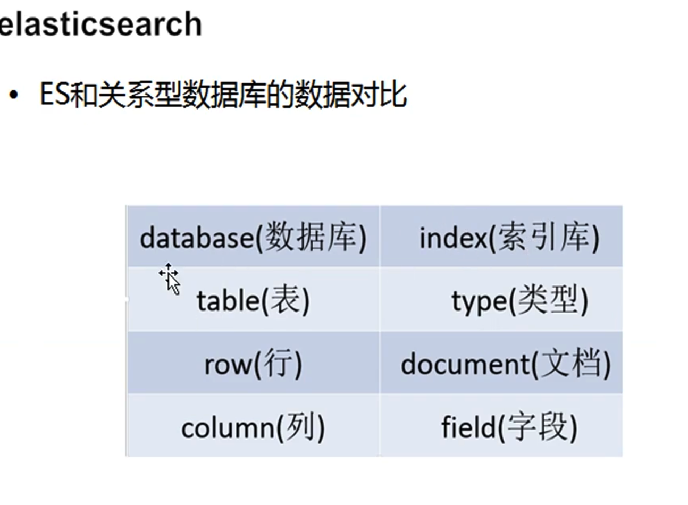
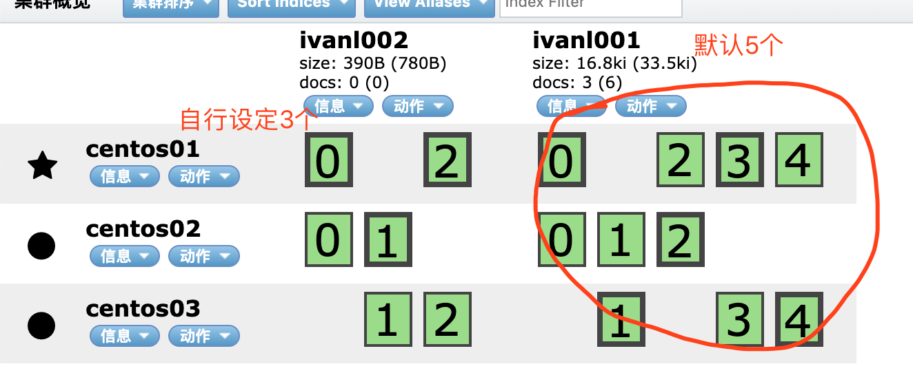

[TOC]

#### 1, Rest操作

•REST的操作分为以下几种

–GET：获取对象的当前状态；

–PUT：改变对象的状态；

–POST：创建对象；

–DELETE：删除对象；

–HEAD：获取头信息。

#### 2, 具体使用

##### 2.1, 创建索引库

* centos01:9200后面跟的就是index，也就是索引，对应关系数据库中的数据库

> curl -XPUT http://centos01:9200/ivanl001/

返回：{"acknowledged":true,"shards_acknowledged":true}

##### 2.2, 插入或更新数据

###### 2.2.1, XPOST: 创建对象

* 会自动的根据url中的字段创建type

```shell
curl -XPOST http://centos01:9200/ivanl001/employee -d '
{
 "first_name" : "bin",
 "age" : 33,
 "about" : "I love to go rock climbing",
 "interests": [ "sports", "music" ]
}'

# 返回{"_index":"ivanl001","_type":"employee","_id":"AWw4hqcv-5itlYInCkil","_version":1,"result":"created","_shards":{"total":2,"successful":2,"failed":0},"created":true}
```

* 会根据文档自动的增加字段

```shell
curl -XPOST http://centos01:9200/ivanl001/employee -d '
{
 "first_name" : "pablo2",
 "age" : 33,
 "about" : "I love to go rock climbing",
 "interests": [ "sports", "music" ],
 "sex": "man"
}'

# 返回
# {"_index":"ivanl001","_type":"employee","_id":"AWw4iEpC-5itlYInCkim","_version":1,"result":"created","_shards":{"total":2,"successful":2,"failed":0},"created":true}
```

###### 2.2.2, XPUT: 改变对象的状态

* 指定id, 如果没有会自动插入。对于post，可以不指定id，但是对于put，必须要给定id，不然报错

```shell
curl -XPUT http://centos01:9200/ivanl001/employee/1 -d '
{
 "first_name" : "god bin",
 "last_name" : "pang",
 "age" : 42,
 "about" : "I love to go rock climbing",
 "interests": [ "sports", "music" ]
}'

# 返回
# {"_index":"ivanl001","_type":"employee","_id":"1","_version":1,"result":"created","_shards":{"total":2,"successful":2,"failed":0},"created":true}
```

* 如果已经存在，会更新，一定要有id

```shell
curl -XPUT http://centos01:9200/ivanl001/employee/1 -d '
{
 "first_name" : "god bin",
 "last_name" : "pang",
 "age" : 40,
 "about" : "I love to go rock climbing",
 "interests": [ "sports", "music" ]
}'

# 返回
# {"_index":"ivanl001","_type":"employee","_id":"1","_version":2,"result":"updated","_shards":{"total":2,"successful":2,"failed":0},"created":false}
```

* 其实用xpost也是可以进行更新的

```shell
curl -XPOST http://centos01:9200/ivanl001/employee/1 -d '
{
 "first_name" : "god bin",
 "last_name" : "pang",
 "age" : 999,
 "about" : "I love to go rock climbing",
 "interests": [ "sports", "music" ]
}'

# 返回
# {"_index":"ivanl001","_type":"employee","_id":"1","_version":3,"result":"updated","_shards":{"total":2,"successful":2,"failed":0},"created":false}
```

##### 2.3, XGET获取对象

###### 2.3.1, 根据id获取

```shell
curl -XGET http://centos01:9200/ivanl001/employee/1?pretty

# 返回
{
  "_index" : "ivanl001",
  "_type" : "employee",
  "_id" : "1",
  "_version" : 3,
  "found" : true,
  "_source" : {
    "first_name" : "god bin",
    "last_name" : "pang",
    "age" : 999,
    "about" : "I love to go rock climbing",
    "interests" : [
      "sports",
      "music"
    ]
  }
}
```

###### 2.3.2, 根据字段获取

```shell
curl -XGET http://centos01:9200/ivanl001/employee/_search?q=first_name="bin"

# 返回
{
	"took": 68,
	"timed_out": false,
	"_shards": {
		"total": 5,
		"successful": 5,
		"failed": 0
	},
	"hits": {
		"total": 2,
		"max_score": 0.7002405,
		"hits": [{
			"_index": "ivanl001",
			"_type": "employee",
			"_id": "AWw4hqcv-5itlYInCkil",
			"_score": 0.7002405,
			"_source": {
				"first_name": "bin",
				"age": 33,
				"about": "I love to go rock climbing",
				"interests": ["sports", "music"]
			}
		}, {
			"_index": "ivanl001",
			"_type": "employee",
			"_id": "1",
			"_score": 0.25316024,
			"_source": {
				"first_name": "god bin",
				"last_name": "pang",
				"age": 999,
				"about": "I love to go rock climbing",
				"interests": ["sports", "music"]
			}
		}]
	}
}
```

```shell
curl -XGET http://centos01:9200/ivanl001/employee/_search?pretty -d '
{
 "query":
  {"match":
   {"first_name":"bin"}
  }
}'

# 返回
{
  "took" : 51,
  "timed_out" : false,
  "_shards" : {
    "total" : 5,
    "successful" : 5,
    "failed" : 0
  },
  "hits" : {
    "total" : 2,
    "max_score" : 0.6931472,
    "hits" : [
      {
        "_index" : "ivanl001",
        "_type" : "employee",
        "_id" : "AWw4hqcv-5itlYInCkil",
        "_score" : 0.6931472,
        "_source" : {
          "first_name" : "bin",
          "age" : 33,
          "about" : "I love to go rock climbing",
          "interests" : [
            "sports",
            "music"
          ]
        }
      },
      {
        "_index" : "ivanl001",
        "_type" : "employee",
        "_id" : "1",
        "_score" : 0.25811607,
        "_source" : {
          "first_name" : "god bin",
          "last_name" : "pang",
          "age" : 999,
          "about" : "I love to go rock climbing",
          "interests" : [
            "sports",
            "music"
          ]
        }
      }
    ]
  }
}

```

```shell
curl -XGET http://centos01:9200/ivanl001/employee/_search?pretty -d '
{
 "query":
  {"multi_match":
   {
    "query":"bin",
    "fields":["last_name","first_name"],
    "operator":"and"
   }
  }
}'
```

###### 2.3.3, 复杂的逻辑关系

```shell
curl -XGET http://centos01:9200/ivanl001/employee/_search?pretty -d '
{
 "query":
  {"bool" :
   {
    "must" : 
     {"match":
      {"first_name":"bin"}
     },
    "must_not" : 
     {"match":
      {"age":33}
     }
   }
  }
}'
```

##### 2.4, 更新配置

###### 2.4.1, 更新副本数和切片数

* number_of_replicas：副本数
* 如下会有2个副本，一共是3个

```shell
curl -XPUT 'http://centos01:9200/ivanl001/' -d'{"settings":{"number_of_replicas":2}}'
```

* number_of_shards:切片数，相当于kafka的分区

```shell
curl -XPUT 'http://centos01:9200/ivanl001/' -d'{"settings":{"number_of_shards":3,"number_of_replicas":1}}'

# 报错：索引已经存在
{"error":{"root_cause":[{"type":"index_already_exists_exception","reason":"index [ivanl001/Jvpri4MBTnKpIl13JcZtoA] already exists","index_uuid":"Jvpri4MBTnKpIl13JcZtoA","index":"ivanl001"}],"type":"index_already_exists_exception","reason":"index [ivanl001/Jvpri4MBTnKpIl13JcZtoA] already exists","index_uuid":"Jvpri4MBTnKpIl13JcZtoA","index":"ivanl001"},"status":400}

# 那我们重新建立一个新的索引
curl -XPUT 'http://centos01:9200/ivanl002/' -d'{"settings":{"number_of_shards":3,"number_of_replicas":1}}'

# 返回
{"acknowledged":true,"shards_acknowledged":true}
```



##### 2.5, 其他的全部rest api

```shell
file
segment（段，多个document组成）
document（一条记录，一个对象实例）
field（对象的属性）
term（项，分词之后的词条）


# yes
curl -XPUT http://centos01:9200/ivanl001/
# yes 
curl -XDELETE http://centos01:9200/test2/
curl -XDELETE http://centos01:9200/test3/

#document：yes 
curl -XPOST http://centos01:9200/ivanl001/employee -d '
{
 "first_name" : "bin",
 "age" : 33,
 "about" : "I love to go rock climbing",
 "interests": [ "sports", "music" ]
}'

curl -XPOST http://centos01:9200/ivanl001/employee -d '
{
 "first_name" : "gob bin",
 "age" : 43,
 "about" : "I love to go rock climbing",
 "interests": [ "sports", "music" ]
}'

curl -XPOST http://centos01:9200/ivanl001/employee/2 -d '
{
 "first_name" : "bin",
 "age" : 45,
 "about" : "I love to go rock climbing",
 "interests": [ "sports", "music" ]
}'


#add field yes

curl -XPOST http://centos01:9200/ivanl001/employee -d '
{
 "first_name" : "pablo2",
 "age" : 33,
 "about" : "I love to go rock climbing",
 "interests": [ "sports", "music" ],
 "sex": "man"
}'

curl -XPOST http://centos01:9200/ivanl001/employee/1 -d '
{
 "first_name" : "pablo2",
 "age" : 35,
 "about" : "I love to go rock climbing",
 "interests": [ "sports", "music" ],
 "sex": "man"
}'


----------------------------------------


#put：yes


curl -XPUT http://centos01:9200/ivanl001/employee/1 -d '
{
 "first_name" : "god bin",
 "last_name" : "pang",
 "age" : 42,
 "about" : "I love to go rock climbing",
 "interests": [ "sports", "music" ]
}'

curl -XPUT http://centos01:9200/ivanl001/employee -d '
{
 "first_name" : "god bin",
 "last_name" : "bin",
 "age" : 45,
 "about" : "I love to go rock climbing",
 "interests": [ "sports", "music" ]
}'


curl -XPUT http://centos01:9200/ivanl001/employee/2 -d '
{
 "first_name" : "god bin",
 "last_name" : "bin",
 "age" : 45,
 "about" : "I love to go rock climbing",
 "interests": [ "sports", "music" ]
}'

curl -XPUT http://centos01:9200/ivanl001/employee/1 -d '
{
 "first_name" : "god bin",
 "last_name" : "pang",
 "age" : 40,
 "about" : "I love to go rock climbing",
 "interests": [ "sports", "music" ]
}'


#根据document的id来获取数据：(without pretty)
curl -XGET http://centos01:9200/ivanl001/employee/1?pretty

#根据field来查询数据：
curl -XGET http://centos01:9200/ivanl001/employee/_search?q=first_name="bin"

#根据field来查询数据：match
curl -XGET http://centos01:9200/ivanl001/employee/_search?pretty -d '
{
 "query":
  {"match":
   {"first_name":"bin"}
  }
}'


#对多个field发起查询：multi_match
curl -XGET http://centos01:9200/ivanl001/employee/_search?pretty -d '
{
 "query":
  {"multi_match":
   {
    "query":"bin",
    "fields":["last_name","first_name"],
    "operator":"and"
   }
  }
}'


#多个term对多个field发起查询:bool（boolean） 
# 组合查询，must，must_not,should 
#  must + must : 交集
#  must +must_not ：差集
#  should+should  : 并集

# first_name=bin，而且age=33
curl -XGET http://centos01:9200/ivanl001/employee/_search?pretty -d '
{
 "query":
  {"bool" :
   {
    "must" : 
     {"match":
      {"first_name":"bin"}
     },
    "must" : 
     {"match":
      {"age":33}
     }
   }
  }
}'

# first_name=bin，但是age!=33
curl -XGET http://centos01:9200/ivanl001/employee/_search?pretty -d '
{
 "query":
  {"bool" :
   {
    "must" : 
     {"match":
      {"first_name":"bin"}
     },
    "must_not" : 
     {"match":
      {"age":33}
     }
   }
  }
}'


# first_name!=bin, 而且age!=33
curl -XGET http://centos01:9200/ivanl001/employee/_search?pretty -d '
{
 "query":
  {"bool" :
   {
    "must_not" : 
     {"match":
      {"first_name":"bin"}
     },
    "must_not" : 
     {"match":
      {"age":33}
     }
   }
  }
}'


##查询first_name=bin的，而且年龄不在20岁到33岁之间的
curl -XGET http://centos01:9200/ivanl001/employee/_search -d '
{
 "query":
  {"bool" :
   {
   "must" :
    {"term" : 
     { "first_name" : "bin" }
    }
   ,
   "must_not" : 
    {"range":
     {"age" : { "from" : 20, "to" : 33 }
    }
   }
   }
  }
}'


#修改配置
curl -XPUT 'http://centos01:9200/test2/' -d'{"settings":{"number_of_replicas":2}}'

curl -XPUT 'http://centos01:9200/test3/' -d'{"settings":{"number_of_shards":3,"number_of_replicas":3}}'

curl -XPUT 'http://centos01:9200/test4/' -d'{"settings":{"number_of_shards":6,"number_of_replicas":4}}'


curl -XPOST http://192.168.215.101:9200/ivanl001/person/_mapping -d'
{
    "person": {
        "properties": {
            "content": {
                "type": "string",
                "store": "no",
                "term_vector": "with_positions_offsets",
                "analyzer": "ik_max_word",
                "search_analyzer": "ik_max_word",
                "include_in_all": "true",
                "boost": 8
            }
        }
    }
}'
```

