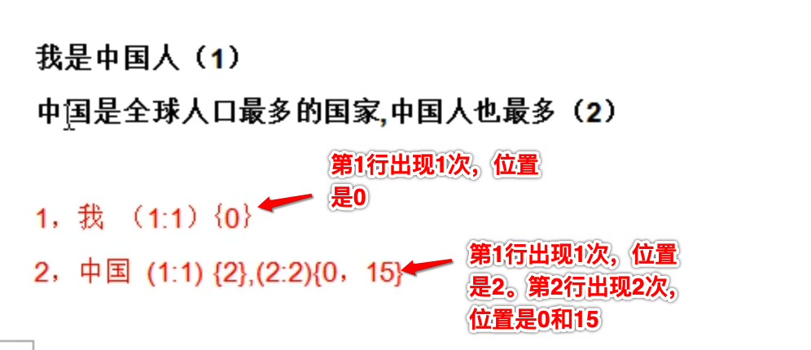
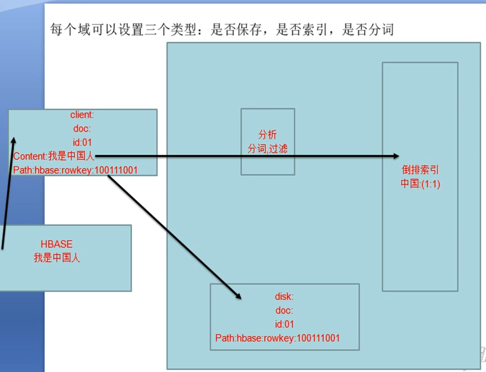

[toc]

###  1, 正排索引

> 从句子找单词

我是中国人

拆词：我，是， 中国，中国人， 人

这样正排索引切分后，词量反而会增加， 虽然速度变快了， 但是存储却多了

### 2, 倒排索引

> 从单词找句子

我是中国人

 不进行拆开了，不是从句子找词语，而是从词语找句子，因为`句子是无穷多多，但是词语是有限的。`

把所有词语都先放出来，然后从需要查找的内容中找到这些词语即可！如下：

> 这样的话，文章或者内容再多也没关系，索引量总是不会超过最大值

### 3, ElasticSearch底层是封装的Lucene, 而Lucene的原理就是倒排索引

是否保存

是否索引

是否分词

### 4, ElasticSearch主要用途

全文检索

结构化检索

数据分析

### 5, 分布式

横向扩展，提高计算能力

纵向延伸，解决单点故障，保证HA

横向上：每台都是master节点，然后如果同时工作的时候，会临时选择工作中一个节点作为代理leader，然后负责数据汇集。

纵向上：会有一个主节点，另外一个是从(备)节点。主节点负责数据计算，从节点负责数据备份。此外，从节点除了数据备份保证ha之外，它还可以分担主节点的查询压力。主节点负责动态计算，从节点负责静态查询。

### 6, es和solr的比较

solr在搜索静态数据的时候比较厉害

数据量大的话es比较牛

