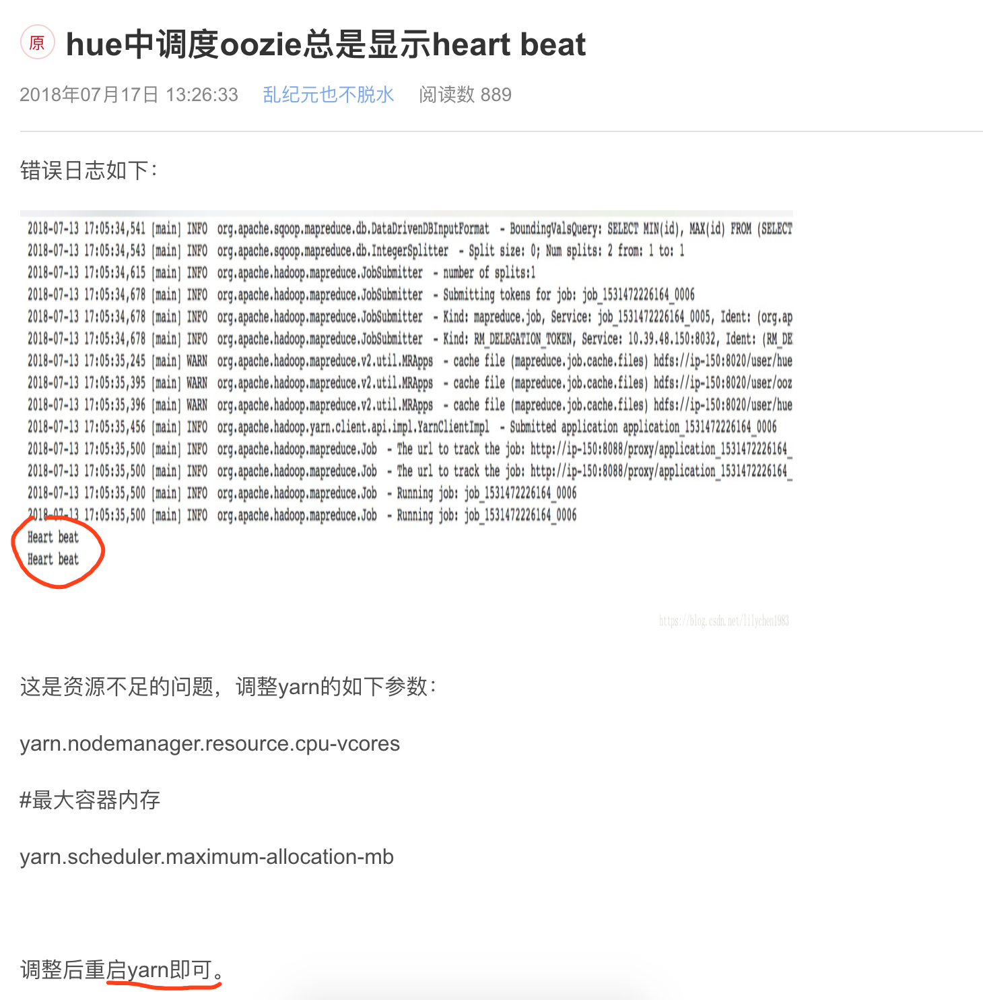
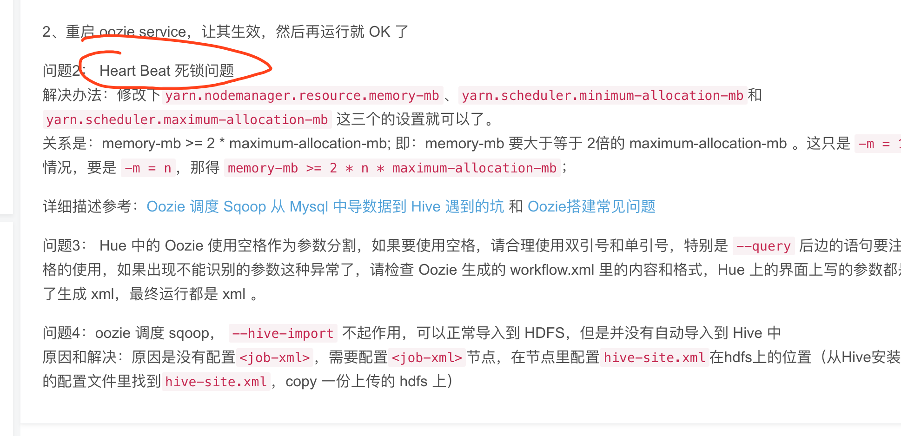

## Oozie 调度 Sqoop 从 Mysql 中导数据到 Hive 遇到的坑

https://izhangzhihao.github.io/2017/12/25/Heart-Beat/


分析发现 数据再导入hdfs的时候成功了，但是在往 hive 写数据的时候中断了，这里找到的解决办法如下

https://blog.csdn.net/weixin_39198774/article/details/79814313


下面的那些命令， 在hue中只能这个执行成功

```shell
import --connect jdbc:mysql://centos01:3306/ivanl001 --username root --password ,. --target-dir /sqoop-003 --fields-terminated-by ',' --table bankcardbin  --split-by id --m 1 
```

所以如果要让hive中导入，那么就先导入到hive的hdfs目录，然后手动的创建hive表ok！！！


## 1, sqoop

* sqoop是一个简单的大数据系统的数据迁移工具


## 2, sqoop的基本命令


### 2.1, sqoop从mysql导入到hdfs(hive)中

```shell
# 显示数据库
sqoop-list-databases --connect jdbc:mysql://report-system.cbb0nles4v8i.us-east-1.rds.amazonaws.com:3306/ --username admin --password Jde27dePlWbx32aMTr
sqoop-list-databases --connect jdbc:mysql://db-zt.opvalue.com:3306/ --username azazie --password azazie
sqoop-list-databases --connect jdbc:mysql://azaziedbslave.cbb0nles4v8i.us-east-1.rds.amazonaws.com:3306/ --username azdatagram --password GbC8h7u5EW2u


azdatagram
GbC8h7u5EW2u


# 显示数据库中的表
sqoop-list-tables --connect jdbc:mysql://centos01:3306/hive --username root --password ,.
sqoop-list-tables --connect jdbc:mysql://db-zt.opvalue.com:3306/azazie --username azazie --password azazie
sqoop-list-tables --connect jdbc:mysql://azaziedbslave.cbb0nles4v8i.us-east-1.rds.amazonaws.com:3306/ --username azdatagram --password GbC8h7u5EW2u


# 导入到HDFS指定目录, \表示和下面的是一行，转义而已
# --split-by代表用来切片的字段，-m为1的话其实不用指定分片字段
# -m代表指定maptask，如果有多个maptask，那会生成多个文件，没有reduce阶段哦
/opt/cloudera/parcels/CDH/bin/sqoop import \
--connect jdbc:mysql://db-zt.opvalue.com:3306/azazie \
--username azazie \
--password azazie \
--target-dir /azazie \
--fields-terminated-by ',' \
--table order_info  \
--split-by order_id \
--m 1


/opt/cloudera/parcels/CDH/bin/sqoop import \
--connect jdbc:mysql://azaziedbslave.cbb0nles4v8i.us-east-1.rds.amazonaws.com:3306/azazie \
--username azdatagram  \
--password GbC8h7u5EW2u \
--target-dir /azazie/goods \
--fields-terminated-by ',' \
--table goods  \
--split-by goods_id \
--m 1


/opt/cloudera/parcels/CDH/bin/sqoop import \
--connect jdbc:mysql://azaziedbslave.cbb0nles4v8i.us-east-1.rds.amazonaws.com:3306/azazie \
--username azdatagram  \
--password GbC8h7u5EW2u \
--target-dir /azazie/order_info \
--fields-terminated-by ',' \
--table order_info  \
--split-by order_id \
--m 1


/opt/cloudera/parcels/CDH/bin/sqoop import \
--connect jdbc:mysql://centos01:3306/userdb \
--username root \
--password ,. \
--target-dir /queryresult \
--fields-terminated-by ',' \
--table emp  \
--split-by id \
--m 1


/opt/cloudera/parcels/CDH/bin/sqoop import \
--connect jdbc:mysql://centos01:3306/ivanl001 \
--username root \
--password ,. \
--target-dir /sqoop-test \
--fields-terminated-by ',' \
--table bankcardbin  \
--split-by id \
--m 1


# 导入到hive中, 
# --hive-database：指定hive的数据库
/opt/cloudera/parcels/CDH/bin/sqoop import --connect jdbc:mysql://centos01:3306/userdb --username root --password ,. --table emp_add --split-by id --hive-import --hive-database 'ivanl001' --fields-terminated-by ',' --m 1

# 导入限定1: 限定条件限定
/opt/cloudera/parcels/CDH/bin/sqoop import --connect jdbc:mysql://centos01:3306/userdb --username root --password ,. --table emp --split-by id --hive-import --hive-database 'ivanl001' --fields-terminated-by ',' --m 1 --where "id>1203"

/opt/cloudera/parcels/CDH/bin/sqoop import --connect jdbc:mysql://centos01:3306/ivanl001 --username root --password ,. --table bankcardbin --split-by id --hive-import --hive-database 'ivanl001' --fields-terminated-by ',' --m 1


# 导入限定2: 查询限定
# and $CONDITIONS这是为了防止没有限定条件时候出错而已， 相当于and 1=1
# Cannot specify --query and --table together.
# --target-dir 这里必须要填，但是好想并没有实际用途
/opt/cloudera/parcels/CDH/bin/sqoop import --connect jdbc:mysql://centos01:3306/userdb --username root --password ,. --query 'select id,name,deg from emp where id < 1203 and $CONDITIONS'  --split-by id --hive-import --hive-database 'ivanl001' --hive-table 'emp' --fields-terminated-by ',' --m 1 --target-dir /user/hive/warehouse/ivanl001.db/order/


# 增量导入1： append模式
/opt/cloudera/parcels/CDH/bin/sqoop import --connect jdbc:mysql://centos01:3306/userdb --username root --password ,. --table emp --m 1 --incremental append --check-column id --last-value 1205 --hive-import --hive-database 'ivanl001' --fields-terminated-by ','

# 增量导入2: lastmodified-时间戳增量,这里就不在演示了
--incremental lastmodified --check-column created --last-value '2012-02-01 11:0:00' 
```


### 2.2, sqoop从hdfs(hive)中导出到mysql

```shell
  
# 导出hdfs目录文件到mysql
# 注意：刚开始把,写错了， 就导出失败，所以一定要注意标点符号什么的
/opt/cloudera/parcels/CDH/bin/sqoop export \
--connect jdbc:mysql://centos01:3306/userdb \
--username root \
--password ,. \
--table emp_add  \
--m 1 \
--input-fields-terminated-by ',' \
--export-dir /queryresult/test


# 导出hive表中数据到mysql
# 其实就是把hive在hdfs目录下的文件导出出去，和hdfs导出的方式是一样的
/opt/cloudera/parcels/CDH/bin/sqoop export \
--connect jdbc:mysql://centos01:3306/userdb \
--username root \
--password ,. \
--table emp_add  \
--m 1 \
--input-fields-terminated-by ',' \
--export-dir /user/hive/warehouse/ivanl001.db/emp_add


```


3, hue中sqoop命令失败，报错：

```java
java.lang.RuntimeException: Could not load db driver class: com.mysql.jdbc.Driver
```

解决办法：

* 1，先将mysql-connector-java.jar上传到hdfs：/user/oozie/share/lib/lib_timstamp/sqoop

* 2，然后重启oozie服务。



这是资源不足的问题，调整yarn的如下参数：

yarn.nodemanager.resource.cpu-vcores

\#最大容器内存

yarn.scheduler.maximum-allocation-mb

调整后重启yarn即可。


https://blog.csdn.net/afanyusong/article/details/79162559

