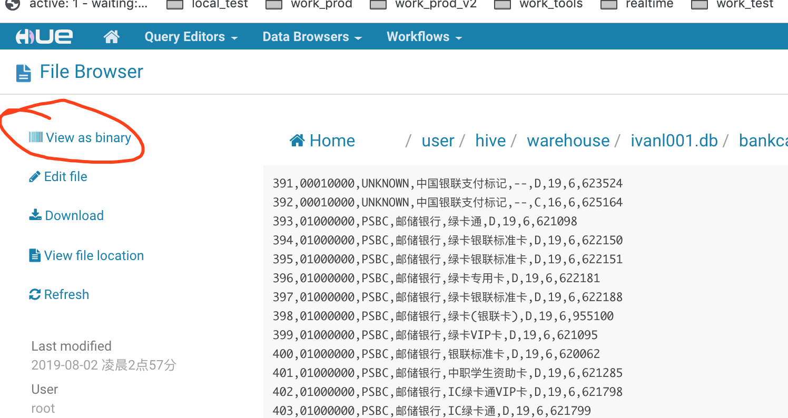

官方手册：


http://sqoop.apache.org/docs/1.4.6/SqoopUserGuide.html


### 1, 密码加密


### 2, 选择导入数据

* 可以选择导入数据的那些字段，也可以重新排序
* columns后面的排序是什么样的，hdfs中就是什么样子的
* 默认会用逗号分隔
* -m是一个mapper，如果不加，会有多个文件输出

```shell
sqoop import \
--connect jdbc:mysql://centos01:3306/ivanl001 \
--username root \
--password ,. \
--table bankcardbin \
--columns 'cardType,id,bankCode,bankName,cardName' \
--where 'id < 400' \
--target-dir /user/ivanl001/bankcardbin01 \
--direct \
-m 1
```

* ⚠️注意：如果不指定目录，会默认在/user/root目录下创建和表同名的目录，然后放进去

```shell
sqoop import \
--connect jdbc:mysql://centos01:3306/ivanl001 \
--username root \
--password ,. \
--table bankcardbin \
--columns 'cardType,id,bankCode,bankName,cardName' \
--where 'id < 400' \
--direct \
-m 1
```


### 3, 通过查询导入数据

* 

```shell
# 官方案例
$ sqoop import \
  --query 'SELECT a.*, b.* FROM a JOIN b on (a.id == b.id) WHERE $CONDITIONS' \
  --split-by a.id \
  -m 1 \
  --target-dir /user/ivanl001/bankcardbin01
```


```shell
# ⚠️注意：双引号的时候记得在$CONDITIONS加右斜杠：
#  "SELECT * FROM x WHERE a='foo' AND \$CONDITIONS"
# 有--query的时候，不能指定--table了
sqoop import \
--connect jdbc:mysql://centos01:3306/ivanl001 \
--username root \
--password ,. \
--query 'select id, bankCode, bankName, cardName, cardType from ivanl001.bankcardbin where id < 500 and $CONDITIONS' \
--split-by id \
--target-dir /user/ivanl001/bankcardbin02 \
--direct \
-m 1


sqoop import \
--connect jdbc:mysql://centos01:3306/ivanl001 \
--username root \
--password ,. \
--query 'select id, bankCode, bankName, cardName, cardType from ivanl001.bankcardbin where id < 500 and $CONDITIONS' \
--split-by id \
--target-dir /user/ivanl001/bankcardbin02 \
--direct \
-m 1
```


### 4, 并发度和其他

* 默认-m是4，也就是有4个mapper，有4个输出文件哦

If a table does not have a primary key defined and the `--split-by <col>` is not provided, then import will fail unless the number of mappers is explicitly set to one with the `--num-mappers 1` option or the `--autoreset-to-one-mapper` option is used. The option `--autoreset-to-one-mapper` is typically used with the import-all-tables tool to automatically handle tables without a primary key in a schema.

* --skip-dist-cache： 如果是oozie的话，它第一次任务执行就会把jar包拷贝到本地缓存起来，下次重用，所以后面就不需要重新缓存了，可以设置跳过磁盘缓存
* --direct：mysql的提供的`mysqldump` tool来导出数据，而不用jdbc，速度会比较快
* —append：追加，可以写进已经存在的目录
* --relaxed-isolation： 控制事务级别
* 


### 5, 类型映射

Sqoop is expecting comma separated list of mapping in form <name of column>=<new type>. For example:

```
$ sqoop import ... --map-column-java id=String,value=Integer
```

Sqoop will rise exception in case that some configured mapping will not be used.


### 6, 增量导入

| Argument               | Description                                                  |
| ---------------------- | ------------------------------------------------------------ |
| `--check-column (col)` | Specifies the column to be examined when determining which rows to import. (the column should not be of type CHAR/NCHAR/VARCHAR/VARNCHAR/ LONGVARCHAR/LONGNVARCHAR) |
| `--incremental (mode)` | Specifies how Sqoop determines which rows are new. Legal values for `mode` include `append` and `lastmodified`. |
| `--last-value (value)` | Specifies the maximum value of the check column from the previous import. |


You should specify `append` mode when importing a table where new rows are continually being added with increasing row id values. You specify the column containing the row’s id with `--check-column`. Sqoop imports rows where the check column has a value greater than the one specified with `--last-value`.

An alternate table update strategy supported by Sqoop is called `lastmodified` mode. You should use this when rows of the source table may be updated, and each such update will set the value of a last-modified column to the current timestamp. Rows where the check column holds a timestamp more recent than the timestamp specified with `--last-value` are imported.

At the end of an incremental import, the value which should be specified as `--last-value` for a subsequent import is printed to the screen. When running a subsequent import, you should specify `--last-value` in this way to ensure you import only the new or updated data. This is handled automatically by creating an incremental import as a saved job, which is the preferred mechanism for performing a recurring incremental import. See the section on saved jobs later in this document for more information.

### 7, 文件格式

 `--as-textfile`

`--as-sequencefile`


By default, data is not compressed. You can compress your data by using the deflate (gzip) algorithm with the `-z` or `--compress` argument, or specify any Hadoop compression codec using the `--compression-codec` argument. This applies to SequenceFile, text, and Avro files.


### 8, hive相关

**Table 8. Hive arguments:**

| Argument                     | Description                                                  |
| ---------------------------- | ------------------------------------------------------------ |
| `--hive-home <dir>`          | Override `$HIVE_HOME`  ，hive的安装目录，一般是安装多个版本的时候用 |
| `--hive-import`              | Import tables into Hive (Uses Hive’s default delimiters if none are set.) |
| `--hive-overwrite`           | Overwrite existing data in the Hive table.                   |
| `--create-hive-table`        | If set, then the job will fail if the target hive            |
|                              | table exits. By default this property is false.              |
| `--hive-table <table-name>`  | Sets the table name to use when importing to Hive.           |
| `--hive-drop-import-delims`  | Drops *\n*, *\r*, and *\01* from string fields when importing to Hive. |
| `--hive-delims-replacement`  | Replace *\n*, *\r*, and *\01* from string fields with user defined string when importing to Hive. |
| `--hive-partition-key`       | Name of a hive field to partition are sharded on             |
| `--hive-partition-value <v>` | String-value that serves as partition key for this imported into hive in this job. |
| `--map-column-hive <map>`    | Override default mapping from SQL type to Hive type for configured columns. |


* 默认是保存text, 在hdfs上有，view as text, 注意不要开成二进制了
* 
* --as-textfile \
* 

```shell
# 如果不知懂数据库，默认是导入到/user/hive/warehouse/，也就是根目录下
# 默认textfile，空格隔开
sqoop import \
--connect jdbc:mysql://centos01:3306/ivanl001 \
--username root \
--password ,. \
--table bankcardbin \
--split-by id \
--hive-import \
-m 1


# 然后我们可以指定数据库，也就是目录，分隔符是指定为,
# 这个就算表已经存在，也可以导入，会多个文件
# --directk是使用msyql默认的dump，速度快，但是导入到hive好像不能用，会报错：

#19/08/02 11:02:42 INFO mapreduce.Job: Task Id : attempt_1564651787080_0019_m_000000_1, Status : FAILED
#Error: java.io.IOException: Cannot run program "mysqldump": error=2, No such file or directory

# 先不管了
#
sqoop import \
--connect jdbc:mysql://centos01:3306/ivanl001 \
--username root \
--password ,. \
--table bankcardbin \
--split-by id \
--hive-import \
--hive-database 'ivanl001' \
--fields-terminated-by ',' \
--m 1


# 目录应该只是中间做缓冲的时候用，之后还是从这个目录拷贝到hiv表所在到位置
sqoop import \
--connect jdbc:mysql://centos01:3306/ivanl001 \
--username root \
--password ,. \
--query 'select id, bankCode, bankName, cardName, cardType from ivanl001.bankcardbin where id < 500 and $CONDITIONS' \
--split-by id \
--target-dir /user/ivanl001/bankcardbin01 \
--hive-import \
--hive-database 'ivanl001' \
--hive-table 'bankcardbin_opt' \
--fields-terminated-by ',' \
-m 1

# 然后可以通过这种方式进行增量查询
sqoop import \
--connect jdbc:mysql://centos01:3306/ivanl001 \
--username root \
--password ,. \
--query 'select id, bankCode, bankName, cardName, cardType from ivanl001.bankcardbin where id > 500 and $CONDITIONS' \
--split-by id \
--target-dir /user/ivanl001/bankcardbin01 \
--hive-import \
--hive-database 'ivanl001' \
--hive-table 'bankcardbin_opt' \
--fields-terminated-by ',' \
-m 1


sqoop import --connect jdbc:mysql://centos01:3306/ivanl001 --username root --password ,. --query 'select id, bankCode, bankName, cardName, cardType from ivanl001.bankcardbin where id > 500 and $CONDITIONS' --split-by id --target-dir /user/ivanl001/bankcardbin01 --hive-import --hive-database 'ivanl001' --hive-table 'bankcardbin_opt' --fields-terminated-by ',' -m 1


# ----------------下面是单分区的导入方式--非动态单分区导入----------------
sqoop import \
--connect jdbc:mysql://centos01:3306/ivanl001 \
--username root \
--password ,. \
--query 'select id, bankName, cardName, bankCode from ivanl001.bankcardbin where cardtype="P" and $CONDITIONS' \
--split-by id \
--target-dir /user/ivanl001/bankcardbin \
--hive-import \
--hive-database 'ivanl001' \
--hive-table 'bankcardbin_part_two' \
--hive-partition-key 'cardtype' \
--hive-partition-value 'P' \
--fields-terminated-by ' ' \
-m 1

# --------------------------多级的话，就直接手动添加分区，然后导入文件到目录即可，按照hdfs的目录导入方式即可，而不是hive------------------


```


保存空字符串到hive中：

Sqoop will by default import NULL values as string `null`. Hive is however using string `\N` to denote `NULL` values and therefore predicates dealing with `NULL` (like `IS NULL`) will not work correctly. You should append parameters `--null-string` and `--null-non-string` in case of import job or `--input-null-string` and `--input-null-non-string` in case of an export job if you wish to properly preserve `NULL` values. Because sqoop is using those parameters in generated code, you need to properly escape value `\N` to `\\N`:

```shell
$ sqoop import  ... --null-string '\\N' --null-non-string '\\N'
```


```shell
# 主命令：import
# 二级命令：
sqoop import --connect jdbc:mysql://centos01:3306/ivanl001 --table user --username root --password ,.

# 

/opt/cloudera/parcels/CDH/bin/sqoop import --connect jdbc:mysql://centos01:3306/ivanl001 --username root --password ,. --table  --split-by id --hive-import --hive-database 'ivanl001' --fields-terminated-by ',' --m 1 --as-textfile


#
sqoop import --connect jdbc:mysql://centos01:3306/ivanl001 --username root --password ,. --table order --split-by id --hive-import --hive-database 'ivanl001' --fields-terminated-by ',' --m 1 --as-textfile --where "<10"


CREATE TABLE IF NOT EXISTS ivanl001.order (
`id` string,
`order_no` string,
`saru_lruid` string,
`rugr_lruid` string,
`belong_rugr_lruid` string,
`total_amount` string,
`pay_status` string
) 
PARTITIONED BY (day int);


sqoop import --connect jdbc:mysql://centos01:3306/ivanl001 --username root --password ,. --query 'select id, order_no, saru_lruid, rugr_lruid, belong_rugr_lruid, total_amount, pay_status, create_time from ivanl001.order
where create_time >= "2017-12-12 00:00:00" and create_time < "2017-12-13 00:00:00" and $CONDITIONS' --split-by id --hive-import --hive-database 'ivanl001' --hive-table 'order' --fields-terminated-by ',' --m 1 --target-dir /user/hive/warehouse/ --as-textfile --hive-overwrite --hive-partition-key 'day' --hive-partition-value '20171213'


```

