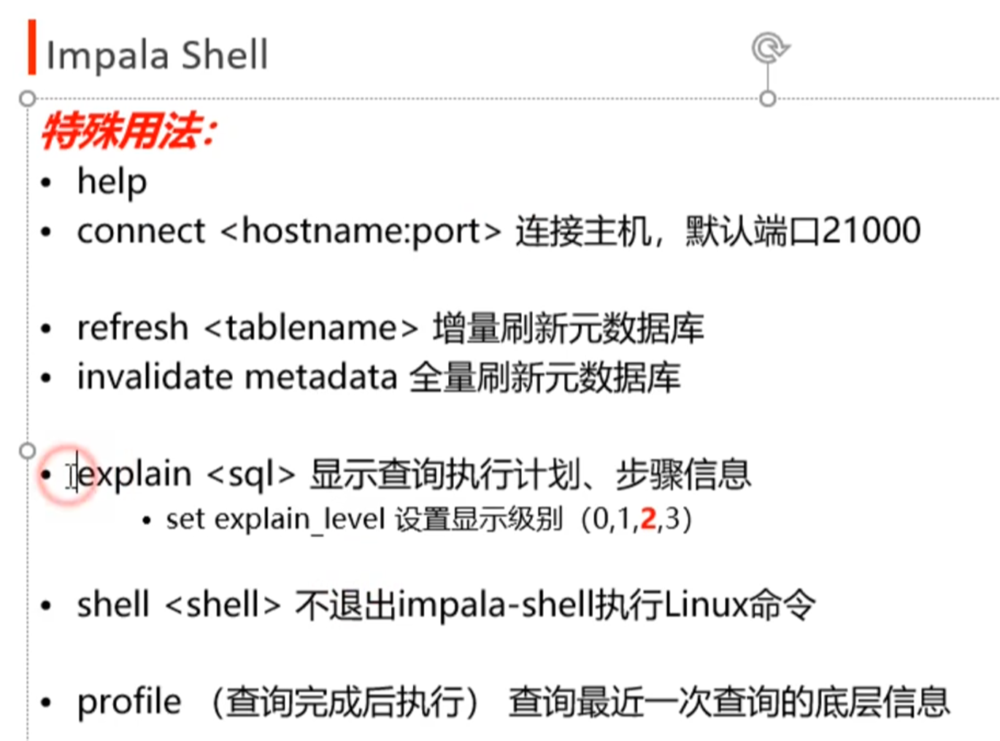
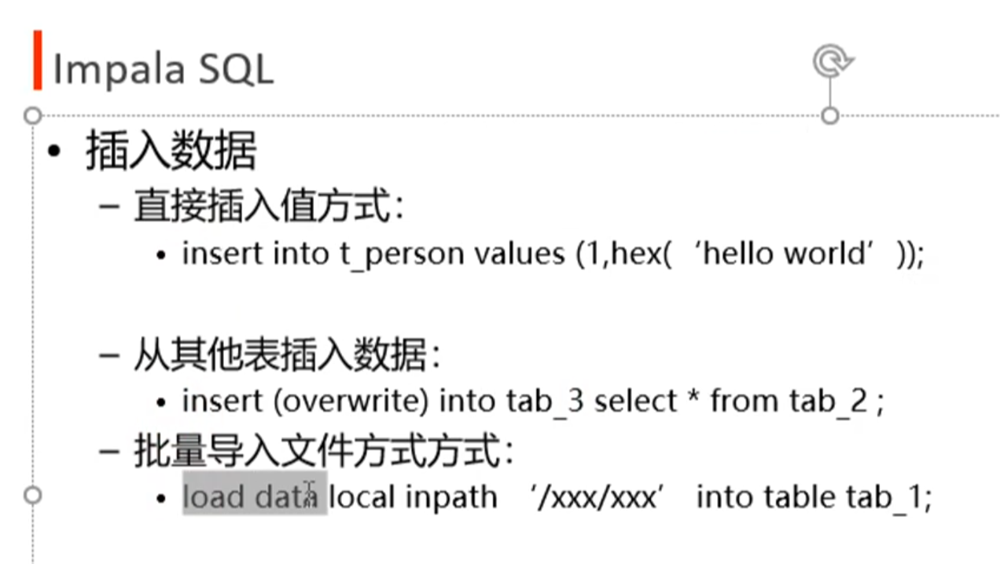

hive

冷启动：先规划，后运行


## 1, impala


和es有点像，都是无主模型

* 每台都是master节点，然后如果同时工作的时候，会临时选择工作中一个节点作为代理leader，然后负责数据汇集。


## 2, impala安装部署

* 添加impala服务添加了两次！！！！哎。。。心累


## 3, impala的使用

```shell
# 注意：要在Impala Deamon安装的机器上才能启动，也就是我们的centos02，centos03
impala-shell

# 这个是启动一个可以打印执行计算的shell
impala-shell -p 

# shell外查询
impala-shell -q "select * from ivanl001.emp_add"


# 输出的结果格式化输出
impala-shell -B -q "select * from ivanl001.emp_add"

# 更新元数据表
invalidate metadata;

# 解释sql语句
explain select * from ivanl001.emp;

# 设置解释级别
set explain-level 3
```

 








## 4, impala整合hbase


## 5, 优化


