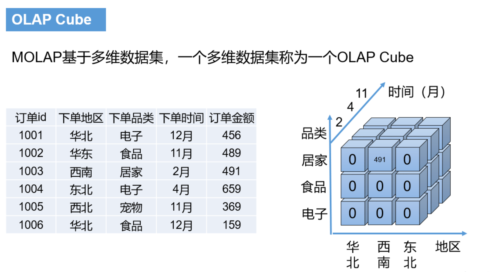
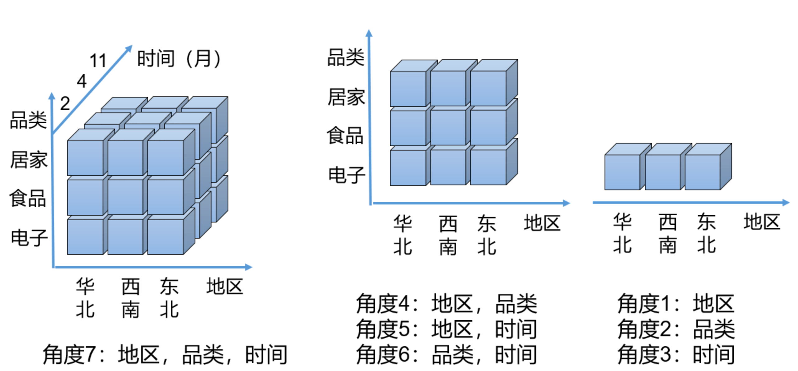
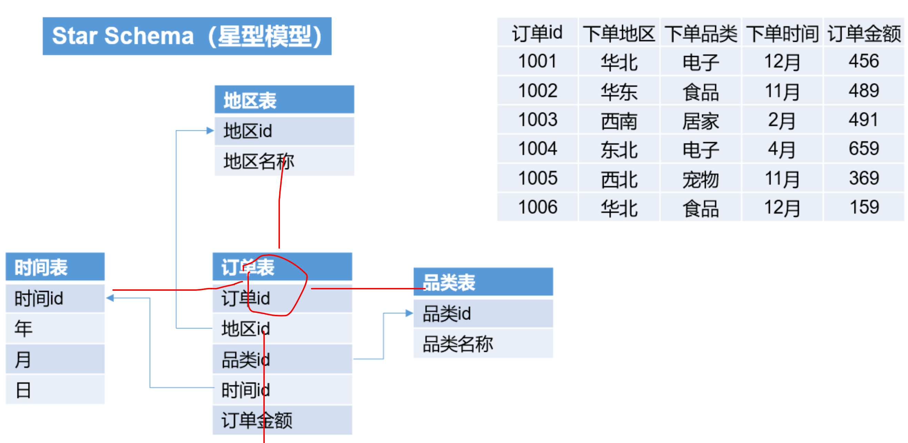
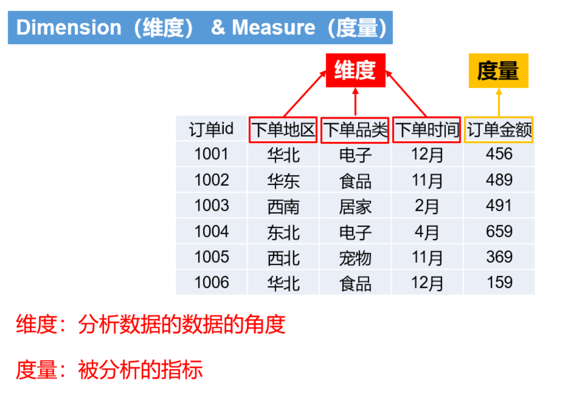

[toc]

## 1, OLAP的分类

### 1.1, ROLAP

> relational online analytics process
>
> 关系型在线分析
>
> 比如hive，或者数据库中进行读取分析， 不需要预处理

1.2, MOLAP

> multidimensional online analytics process
>
> 多维度在线分析
>
> 比如kylin， 从维度角度进行分析，需要预处理

## 2, kyiln的术语

### 2.1, cube

### 2.2, cuboid

> cube是由cuboid组成的， 比如说， 上面的左边的那张表是由很多个cuboid组成，也就是下面的这种，然后这些所有的cuboid组成的叫做一个cube。

### 2.3, star schema(星型模型)

### 2.4, 维度和度量

## 3, kylin使用注意

### 3.1, kylin的cube数据存储在hbase中，所以必须要有hbase

### 3.2, kylin可以集成BI可视化工具

> ODBC: Tableau, Excel, PowerBI
>
> JDBC: Saiku, BIRT等Java工具
>
> RestAPI: javaScript, web等网页
>
> kylin团队还贡献了zeppin， zeppin也可以用来访问kylin服务

