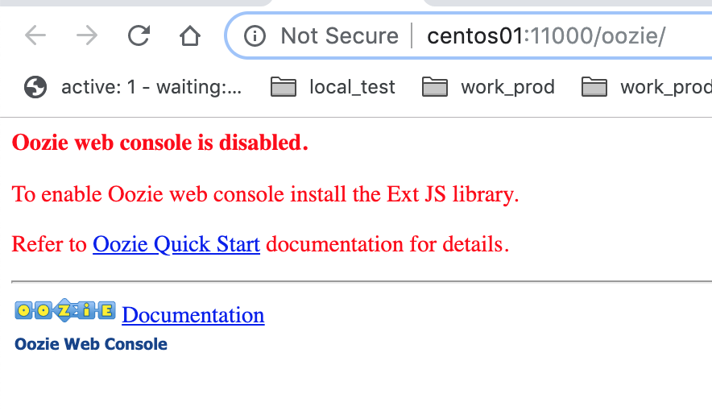
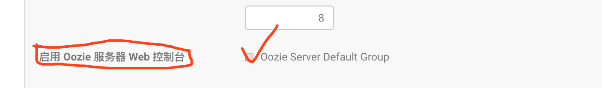

## 1, oozie页面被禁用



## 2, 解决办法：

### 2.1, 下载ext-2.2.zip

```shell
wget http://archive.cloudera.com/gplextras/misc/ext-2.2.zip
```

### 2.2, 解压后放到/var/lib/oozie

```shell
unzip ext-2.2.zip -d /var/lib/oozie
```

### 2.3, 修改所属者

```shell
chown oozie:oozie -R ext-2.2/
```

### 2.4, oozie启用web配置

* 这一步不做好像也是ok的



### 2.5, cdh中重启oozie


