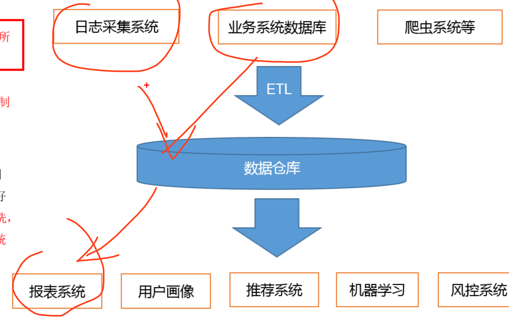
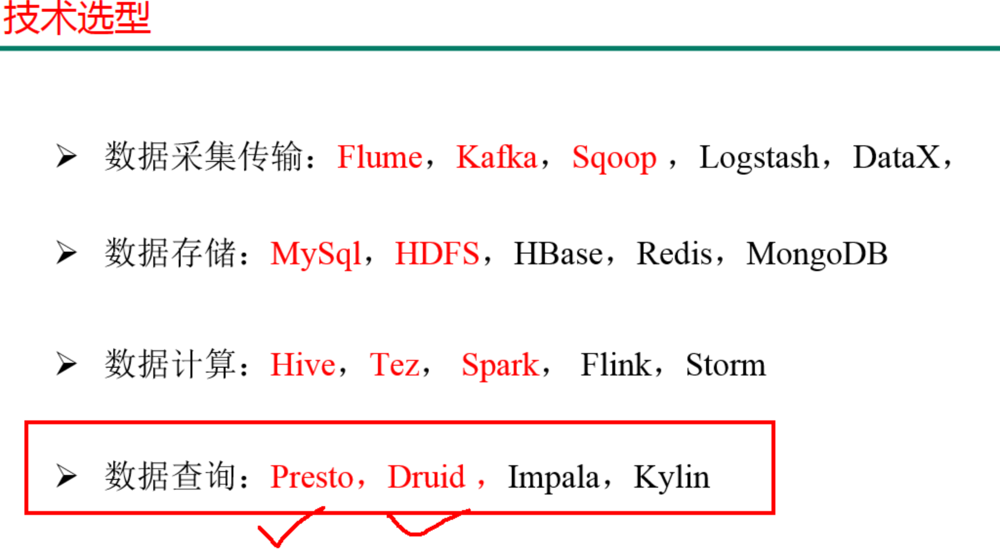
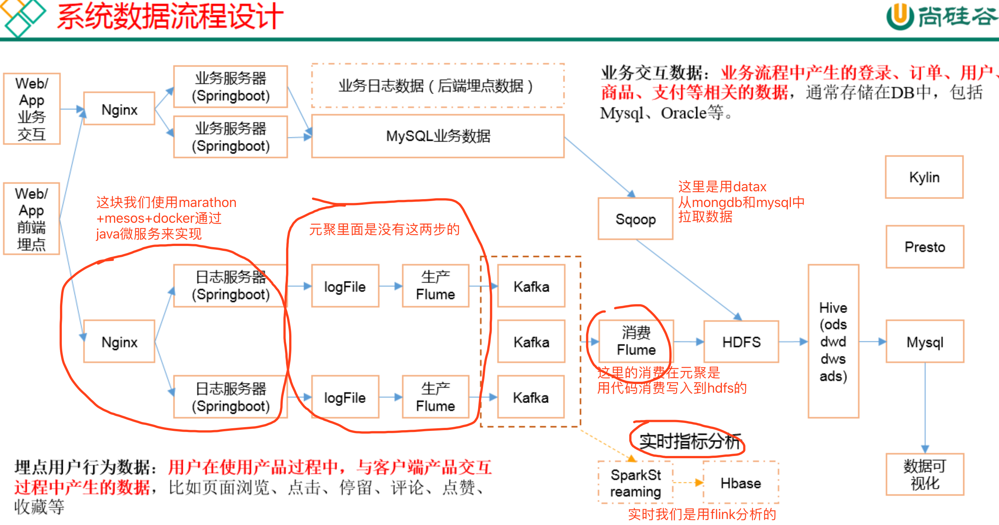
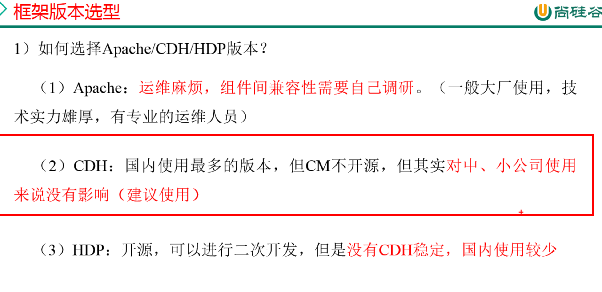
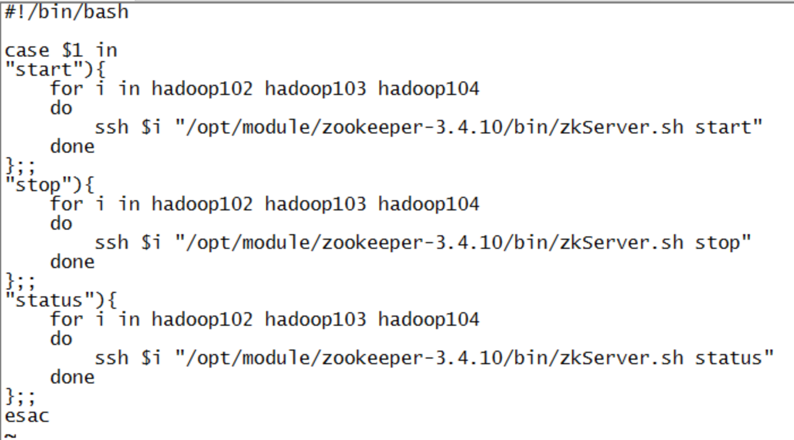
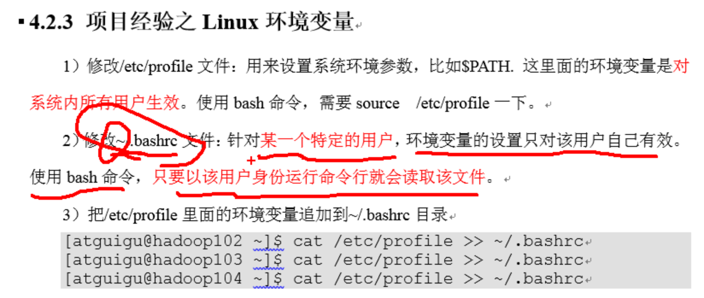

##    1, 流程

`日志采集系统`(log日志和埋点事件)

`业务系统数据库`（mysql和mongodb等）

通过`ETL`进入到`数据仓库`

然后通过分析处理做成 `报表系统`



## 2, 技术选型

数据采集传输：通过`flume+kafka`搜集日志文件，`java程序+kafka`搜集埋点事件，`datax`搜集数据库数据

数据存储：`HDFS+hbase`作为底层存储，分析之后的数据需要展示的存储到`mysql`，`redis`中

数据计算： 离线计算使用`hive`， 实时计算使用`flink`

数据查询：presto








## 3, 服务器上服务的规划注意

* mysql注意要做主从备份
* hdfs，yarn和hbase要做高可用
* hive就是一个客户端， 一台服务器就可以
* hdfs的nn，yarn的resource manager是比较耗费资源的
* 客户端类型的服务，比如hive，presto的web页面等，最好单独放在一个服务器上


## 4, logback日志的使用

### 4.1, 添加maven依赖

```xml
<dependency>
  <groupId>ch.qos.logback</groupId>
  <artifactId>logback-core</artifactId>
  <version>1.0.13</version>
</dependency>
<dependency>
  <groupId>ch.qos.logback</groupId>
  <artifactId>logback-classic</artifactId>
  <version>1.0.13</version>
</dependency>
```

### 4.2, 在资源目录下配置logback.xml文件

* logback.xml

```xml
<?xml version="1.0" encoding="UTF-8"?>

<configuration debug="false">
    <!--定义日志文件的存储地址 勿在 LogBack 的配置中使用相对路径 -->
    <property name="LOG_HOME" value="/tmp/logs/" />

    <!-- 控制台输出 -->
    <appender name="STDOUT" class="ch.qos.logback.core.ConsoleAppender">
        <encoder class="ch.qos.logback.classic.encoder.PatternLayoutEncoder">
            <!--格式化输出：%d表示日期，%thread表示线程名，%-5level：级别从左显示5个字符宽度%msg：日志消息，%n是换行符 -->
            <pattern>%d{yyyy-MM-dd HH:mm:ss.SSS} [%thread] %-5level %logger{50} - %msg%n</pattern>
        </encoder>
    </appender>

    <!-- 按照每天生成日志文件。存储事件日志 -->
    <appender name="FILE" class="ch.qos.logback.core.rolling.RollingFileAppender">
        <!-- <File>${LOG_HOME}/app.log</File>设置日志不超过${log.max.size}时的保存路径，注意，如果是web项目会保存到Tomcat的bin目录 下 -->
        <rollingPolicy class="ch.qos.logback.core.rolling.TimeBasedRollingPolicy">
            <!--日志文件输出的文件名 -->
            <FileNamePattern>${LOG_HOME}/app-%d{yyyy-MM-dd}.log</FileNamePattern>
            <!--日志文件保留天数 -->
            <MaxHistory>30</MaxHistory>
        </rollingPolicy>
        <encoder class="ch.qos.logback.classic.encoder.PatternLayoutEncoder">
            <pattern>%msg%n</pattern>
        </encoder>
        <!--日志文件最大的大小 -->
        <triggeringPolicy class="ch.qos.logback.core.rolling.SizeBasedTriggeringPolicy">
            <MaxFileSize>10MB</MaxFileSize>
        </triggeringPolicy>
    </appender>

    <!--异步打印日志-->
    <appender name ="ASYNC_FILE" class= "ch.qos.logback.classic.AsyncAppender">
        <!-- 不丢失日志.默认的,如果队列的80%已满,则会丢弃TRACT、DEBUG、INFO级别的日志 -->
        <discardingThreshold >0</discardingThreshold>
        <!-- 更改默认的队列的深度,该值会影响性能.默认值为256 -->
        <queueSize>512</queueSize>
        <!-- 添加附加的appender,最多只能添加一个 -->
        <appender-ref ref = "FILE"/>
    </appender>

    <!-- 日志输出级别 -->
    <root level="INFO">
        <appender-ref ref="STDOUT" />
        <appender-ref ref="ASYNC_FILE" />
        <!--这个好像打印的是系统的错误-->
        <appender-ref ref="error" />
    </root>


</configuration>
```

### 4.3, 代码中使用

```java
private final static Logger logger = LoggerFactory.getLogger(AppMain.class);

//注意：是否打印跟logback.xml中配置的日志输出级别有关，比如上面我们配置的是info，那么trace和debug两个级别的内容是不会打印出来的，也不会写到文件中去
logger.trace("Hello World!");
logger.debug("How are you today?");
logger.info("I am fine.");
logger.warn("I love programming.");
logger.error("I am programming.");

```


## 5, hdfs多目录配置

> dfs.datanode.data.dir配置中直接使用逗号隔开，最好提前配置好，如果后续添加，需要重启hdfs哦


## 6, hdfs的读写测试

### 6.1, 测试HDFS写性能

* 在cdh中：/opt/cloudera/parcels/CDH/jars/hadoop-mapreduce-client-jobclient-2.6.0-cdh5.12.1-tests.jar

* 测试内容：向HDFS集群写10个128M的文件
* 测试完成后会发现hdfs的根目录下多了一些文件：在目录/benchmarks/TestDFSIO下面

```shell
# 原生
hadoop jar /opt/module/hadoop-2.7.2/share/hadoop/mapreduce/hadoop-mapreduce-client-jobclient-2.7.2-tests.jar TestDFSIO -write -nrFiles 10 -fileSize 128MB

# cdh中测试
hadoop jar /opt/cloudera/parcels/CDH/jars/hadoop-mapreduce-client-jobclient-2.6.0-cdh5.12.1-tests.jar TestDFSIO -write -nrFiles 10 -fileSize 128MB
```


写入性能如下：

可以看到，不咋地哈，虚拟机

```java
19/08/03 00:58:25 INFO fs.TestDFSIO: ----- TestDFSIO ----- : write
19/08/03 00:58:25 INFO fs.TestDFSIO:            Date & time: Sat Aug 03 00:58:25 CST 2019
19/08/03 00:58:25 INFO fs.TestDFSIO:        Number of files: 10
19/08/03 00:58:25 INFO fs.TestDFSIO: Total MBytes processed: 1280.0
19/08/03 00:58:25 INFO fs.TestDFSIO:      Throughput mb/sec: 0.9841694801355386
19/08/03 00:58:25 INFO fs.TestDFSIO: Average IO rate mb/sec: 3.8536438941955566
19/08/03 00:58:25 INFO fs.TestDFSIO:  IO rate std deviation: 6.161262399312691
19/08/03 00:58:25 INFO fs.TestDFSIO:     Test exec time sec: 380.467
19/08/03 00:58:25 INFO fs.TestDFSIO: 
```

### 6.2, 测试HDFS的读性能

* 和写入测试用的是同一个jar包

```shell
# cdh中测试
hadoop jar /opt/cloudera/parcels/CDH/jars/hadoop-mapreduce-client-jobclient-2.6.0-cdh5.12.1-tests.jar TestDFSIO -read -nrFiles 10 -fileSize 128MB
```

读取性能如下：

```java
19/08/03 01:04:09 INFO fs.TestDFSIO: ----- TestDFSIO ----- : read
19/08/03 01:04:09 INFO fs.TestDFSIO:            Date & time: Sat Aug 03 01:04:09 CST 2019
19/08/03 01:04:09 INFO fs.TestDFSIO:        Number of files: 10
19/08/03 01:04:09 INFO fs.TestDFSIO: Total MBytes processed: 1280.0
19/08/03 01:04:09 INFO fs.TestDFSIO:      Throughput mb/sec: 17.12282954758274
19/08/03 01:04:09 INFO fs.TestDFSIO: Average IO rate mb/sec: 82.3775634765625
19/08/03 01:04:09 INFO fs.TestDFSIO:  IO rate std deviation: 163.41886702019727
19/08/03 01:04:09 INFO fs.TestDFSIO:     Test exec time sec: 88.509
19/08/03 01:04:09 INFO fs.TestDFSIO: 
```


### 6.3, 删除刚才测试产生的数据

```shell
hadoop jar /opt/cloudera/parcels/CDH/jars/hadoop-mapreduce-client-jobclient-2.6.0-cdh5.12.1-tests.jar TestDFSIO -clean
```


## 7, MapReduce的性能测试

### 7.1, 生成数据

* 使用RandomWriter来产生随机数，每个节点运行10个Map任务，每个Map产生大约1G大小的二进制随机数

```shell
hadoop jar /opt/cloudera/parcels/CDH/jars/hadoop-mapreduce-examples-2.6.0-cdh5.12.1.jar randomwriter random-data
```

### 7.2, 执行Sort程序

```shell
hadoop jar /opt/cloudera/parcels/CDH/jars/hadoop-mapreduce-examples-2.6.0-cdh5.12.1.jar  sort random-data sorted-data
```

### 7.3, 验证是否排好

```shell
hadoop jar /opt/cloudera/parcels/CDH/jars/hadoop-mapreduce-examples-2.6.0-cdh5.12.1.jar testmapredsort -sortInput random-data -sortOutput sorted-data
```


## 8, hadoop参数调优(hdfs和yarn)

### 8.1, HDFS参数调优hdfs-site.xml

* dfs.namenode.handler.count=20 * log2(Cluster Size)，比如集群规模为8台时，此参数设置为60 
  * The number of Namenode RPC server threads that listen to requests from clients. If dfs.namenode.servicerpc-address is not configured then Namenode RPC server threads listen to requests from all nodes.
  * NameNode有一个工作线程池，用来处理不同DataNode的并发心跳以及客户端并发的元数据操作。对于大集群或者有大量客户端的集群来说，通常需要增大参数dfs.namenode.handler.count的默认值10。设置该值的一般原则是将其设置为集群大小的自然对数乘以20，即20logN，N为集群大小。

* 编辑日志存储路径dfs.namenode.edits.dir设置与镜像文件存储路径dfs.namenode.name.dir尽量分开，达到最低写入延迟


### 8.2, YARN参数调优yarn-site.xml

（1）情景描述：总共7台机器，每天几亿条数据，数据源->Flume->Kafka->HDFS->Hive

面临问题：数据统计主要用HiveSQL，没有数据倾斜，小文件已经做了合并处理，开启的JVM重用，而且IO没有阻塞，内存用了不到50%。但是还是跑的非常慢，而且数据量洪峰过来时，整个集群都会宕掉。基于这种情况有没有优化方案。

（2）解决办法：

内存利用率不够。这个一般是Yarn的2个配置造成的，单个任务可以申请的最大内存大小，和Hadoop单个节点可用内存大小。调节这两个参数能提高系统内存的利用率。

（a）yarn.nodemanager.resource.memory-mb

表示该节点上YARN可使用的物理内存总量，默认是8192（MB），注意，如果你的节点内存资源不够8GB，则需要调减小这个值，而YARN不会智能的探测节点的物理内存总量。

（b）yarn.scheduler.maximum-allocation-mb

单个任务可申请的最多物理内存量，默认是8192（MB）。

### 8.3, Hadoop宕机

（1）如果MR造成系统宕机。此时要控制Yarn同时运行的任务数，和每个任务申请的最大内存。调整参数：yarn.scheduler.maximum-allocation-mb（单个任务可申请的最多物理内存量，默认是8192MB）

（2）如果写入文件过量造成NameNode宕机。那么调高Kafka的存储大小，控制从Kafka到HDFS的写入速度。高峰期的时候用Kafka进行缓存，高峰期过去数据同步会自动跟上。


## 9, zk的集群启动脚本





## 10, 数据模拟jar包生成命令

```shell
java -jar /root/06-dataware/01-log-collector-1.0-SNAPSHOT-jar-with-dependencies.jar  $1 $2>> /root/06-dataware/test.log
```

* 集群的生成命令

```shell
#! /bin/bash

for i in centos01 centos02 centos03 
do
ssh $i "java -jar /root/06-dataware/01-log-collector-1.0-SNAPSHOT-jar-with-dependencies.jar  $1 $2>> /root/06-dataware/test.log &"
done

```


## 11, Flume

### 11.1, flume source

#### （1）Taildir Source相比Exec Source、Spooling Directory Source的优势

* TailDir Source：断点续传、多目录。Flume1.6以前需要自己自定义Source记录每次读取文件位置，实现断点续传。

* Exec Source可以实时搜集数据，但是在Flume不运行或者Shell命令出错的情况下，数据将会丢失。

*  Spooling Directory Source监控目录，不支持断点续传。

#### （2）batchSize大小如何设置？

答：Event 1K左右时，500-1000合适（默认为100）

* type是只有在1.7.0的时候才有TAILDIR， 所以我们这里使用spooldir哈
* 这个是TAILDIR的范例

```properties
a1.sources=r1
a1.channels=c1 c2

# configure source
a1.sources.r1.type = TAILDIR
a1.sources.r1.positionFile = /data/flume/position/data_ware_position.json
a1.sources.r1.filegroups = f1
a1.sources.r1.filegroups.f1 = /tmp/logs/app.+
a1.sources.r1.fileHeader = true
a1.sources.r1.channels = c1 c2

#interceptor
a1.sources.r1.interceptors =  i1 i2
a1.sources.r1.interceptors.i1.type = com.atguigu.flume.interceptor.LogETLInterceptor$Builder
a1.sources.r1.interceptors.i2.type = com.atguigu.flume.interceptor.LogTypeInterceptor$Builder

a1.sources.r1.selector.type = multiplexing
a1.sources.r1.selector.header = topic
a1.sources.r1.selector.mapping.topic_start = c1
a1.sources.r1.selector.mapping.topic_event = c2

# configure channel
a1.channels.c1.type = org.apache.flume.channel.kafka.KafkaChannel
a1.channels.c1.kafka.bootstrap.servers = hadoop102:9092,hadoop103:9092,hadoop104:9092
a1.channels.c1.kafka.topic = topic_start
a1.channels.c1.parseAsFlumeEvent = false
a1.channels.c1.kafka.consumer.group.id = flume-consumer

a1.channels.c2.type = org.apache.flume.channel.kafka.KafkaChannel
a1.channels.c2.kafka.bootstrap.servers = hadoop102:9092,hadoop103:9092,hadoop104:9092
a1.channels.c2.kafka.topic = topic_event
a1.channels.c2.parseAsFlumeEvent = false
a1.channels.c2.kafka.consumer.group.id = flume-consumer

```

* 这个是spooldir的范例

```properties
# 定义组件
a1.sources=r1
a1.channels=c1 c2

# 配置source， configure source
a1.sources.r1.type = spooldir
a1.sources.r1.spoolDir = /tmp/logs/
# Whether to add a header storing the absolute path filename.
a1.sources.r1.fileHeader = true
a1.sources.r1.channels = c1 c2


# interceptor
a1.sources.r1.interceptors = i1 i2
a1.sources.r1.interceptors.i1.type = com.atguigu.flume.interceptor.LogETLInterceptor$Builder
a1.sources.r1.interceptors.i2.type = com.atguigu.flume.interceptor.LogTypeInterceptor$Builder

# selector有两种：Replicating相当于广播，每个下游都会有，multiplexing相当于指定，指定的下游会有
a1.sources.r1.selector.type = multiplexing
a1.sources.r1.selector.header = topic
a1.sources.r1.selector.mapping.topic_start = c1
a1.sources.r1.selector.mapping.topic_event = c2

# configure channel
a1.channels.c1.type   = org.apache.flume.channel.kafka.KafkaChannel
a1.channels.c1.capacity = 10000
a1.channels.c1.transactionCapacity = 1000
a1.channels.c1.brokerList=centos01:9092,centos02:9092,centos03:9092
a1.channels.c1.topic=topic_start
a1.channels.c1.zookeeperConnect=centos01:2181,centos02:2181,centos03:2181
a1.channels.c1.kafka.consumer.group.id = flume-consumer
# Expecting Avro datums with FlumeEvent schema in the channel. This should be true if Flume source is writing to the channel And false if other producers are writing into the topic that the channel is using Flume source messages to Kafka can be parsed outside of Flume by using org.apache.flume.source.avro.AvroFlumeEvent provided by the flume-ng-sdk artifact
a1.channels.c1.parseAsFlumeEvent = false


a1.channels.c1.type   = org.apache.flume.channel.kafka.KafkaChannel
a1.channels.c1.capacity = 10000
a1.channels.c1.transactionCapacity = 1000
a1.channels.c1.brokerList=centos01:9092,centos02:9092,centos03:9092
a1.channels.c1.topic=topic_event
a1.channels.c1.zookeeperConnect=centos01:2181,centos02:2181,centos03:2181
a1.channels.c1.kafka.consumer.group.id = flume-consumer
# Expecting Avro datums with FlumeEvent schema in the channel. This should be true if Flume source is writing to the channel And false if other producers are writing into the topic that the channel is using Flume source messages to Kafka can be parsed outside of Flume by using org.apache.flume.source.avro.AvroFlumeEvent provided by the flume-ng-sdk artifact
a1.channels.c1.parseAsFlumeEvent = false
```


* cdh上不是1.6.0吗，为啥是用1.7.0的配置呢。啊啊啊啊啊？？？？

```shell
a1.sources=r1
a1.channels=c1 c2 
a1.sinks=k1 k2 

# configure source
a1.sources.r1.type = TAILDIR
a1.sources.r1.positionFile = /tmp/flume/posion/data_ware_position.json
a1.sources.r1.filegroups = f1
a1.sources.r1.filegroups.f1 = /tmp/logs/*.log
a1.sources.r1.fileHeader = true
a1.sources.r1.channels = c1 c2

#interceptor
a1.sources.r1.interceptors = i1 i2
a1.sources.r1.interceptors.i1.type = com.atguigu.flume.interceptor.LogETLInterceptor$Builder
a1.sources.r1.interceptors.i2.type = com.atguigu.flume.interceptor.LogTypeInterceptor$Builder

# selector
a1.sources.r1.selector.type = multiplexing
a1.sources.r1.selector.header = topic
a1.sources.r1.selector.mapping.topic_start = c1
a1.sources.r1.selector.mapping.topic_event = c2

# configure channel
a1.channels.c1.type = memory
a1.channels.c1.capacity=10000
a1.channels.c1.byteCapacityBufferPercentage=20

a1.channels.c2.type = memory
a1.channels.c2.capacity=10000
a1.channels.c2.byteCapacityBufferPercentage=20

# configure sink
# start-sink
a1.sinks.k1.type = org.apache.flume.sink.kafka.KafkaSink
a1.sinks.k1.kafka.topic = topic_start
a1.sinks.k1.kafka.bootstrap.servers = centos01:9092,centos02:9092,centos03:9092
a1.sinks.k1.kafka.flumeBatchSize = 2000
a1.sinks.k1.kafka.producer.acks = 1
a1.sinks.k1.channel = c1

# event-sink
a1.sinks.k2.type = org.apache.flume.sink.kafka.KafkaSink
a1.sinks.k2.kafka.topic = topic_event
a1.sinks.k2.kafka.bootstrap.servers = centos01:9092,centos02:9092,centos03:9092
a1.sinks.k2.kafka.flumeBatchSize = 2000
a1.sinks.k2.kafka.producer.acks = 1
a1.sinks.k2.channel = c2
```

### 11.2, flume的interceptor代码

* 如下是一个案例，com.atguigu.flume.interceptor.LogTypeInterceptor
* 写完后打包发送到cdh的flume的lib文件夹下
* 即/opt/cloudera/parcels/CDH/lib/flume-ng/lib目录下

```java
package com.atguigu.flume.interceptor;

import org.apache.flume.Context;
import org.apache.flume.Event;
import org.apache.flume.interceptor.Interceptor;

import java.nio.charset.Charset;
import java.util.ArrayList;
import java.util.List;
import java.util.Map;

/**
 * #author      : ivanl001
 * #creator     : 2019-08-03 17:57
 * #description :
 **/
public class LogTypeInterceptor implements Interceptor {
    @Override
    public void initialize() {

    }

    @Override
    public Event intercept(Event event) {

        String body = new String(event.getBody(), Charset.forName("UTF-8"));
        Map<String, String> headers = event.getHeaders();

        if (body.contains("start")){
            headers.put("topic", "topic_start");
        }else{
            headers.put("topic", "topic_event");
        }

        return event;
    }

    @Override
    public List<Event> intercept(List<Event> events) {
        List<Event> events1 = new ArrayList<>();
        for (Event e : events) {
            Event intercept = intercept(e);
            if (intercept != null) {
                events1.add(intercept);
            }
        }
        return events1;
    }

    @Override
    public void close() {

    }

    public static class Builder implements Interceptor.Builder{

        @Override
        public Interceptor build() {
            return new LogTypeInterceptor();
        }

        @Override
        public void configure(Context context) {

        }
    }
}
```


## 12, kafka压力测试

### 12.1, 生产能力测试

```shell
# 生产能力测试命令如下：
/opt/cloudera/parcels/KAFKA/bin/kafka-producer-perf-test --topic test --record-size 100 --num-records 100000 --throughput 1000 --producer-props bootstrap.servers=centos01:9092,centos01:9092,centos01:9092
```

说明：record-size是一条信息有多大，单位是字节。num-records是总共发送多少条信息。throughput 是每秒多少条信息。

结果如下：

```java
19/08/03 19:12:08 INFO producer.KafkaProducer: [Producer clientId=producer-1] Closing the Kafka producer with timeoutMillis = 9223372036854775807 ms.
100000 records sent, 999.790044 records/sec (0.10 MB/sec), 2.72 ms avg latency, 475.00 ms max latency, 1 ms 50th, 2 ms 95th, 48 ms 99th, 381 ms 99.9th.

// 参数解析：本例中一共写入10w条消息，每秒向Kafka写入了0.10MB的数据，平均是1000条消息/秒，每次写入的平均延迟为2.72毫秒，最大的延迟为475毫秒。
```


### 12.2, 消费能力测试

```shell
# 消费能力测试如下
/opt/cloudera/parcels/KAFKA/bin/kafka-consumer-perf-test --broker-list  centos01:9092,centos02:9092,centos03:9092 --topic test --fetch-size 10000 --messages 10000000 --threads 1

# --fetch-size 指定每次fetch的数据的大小
# --messages 总共要消费的消息个数

```


结果如下：

```shell
start.time, end.time, data.consumed.in.MB, MB.sec, data.consumed.in.nMsg, nMsg.sec, rebalance.time.ms, fetch.time.ms, fetch.MB.sec, fetch.nMsg.sec
2019-08-03 19:19:24:566, 2019-08-03 19:19:40:258, 9.5367, 0.6077, 100000, 6372.6740, 3123, 12569, 0.7588, 7956.0824

开始测试时间，测试结束时间，最大吞吐率9.5367MB/s，平均每秒
```


## 13, kafka机器数量计算

```java
Kafka机器数量（经验公式）= 2*（峰值生产速度副本数/100）+1
```

先要预估一天大概产生多少数据，然后用Kafka自带的生产压测（只测试Kafka的写入速度，保证数据不积压），计算出峰值生产速度。再根据设定的副本数，就能预估出需要部署Kafka的数量。

比如我们采用压力测试测出写入的速度是10M/s一台，峰值的业务数据的速度是50M/s。副本数为2。

```java
Kafka机器数量=2*（50*2/100）+ 1=3台
```


