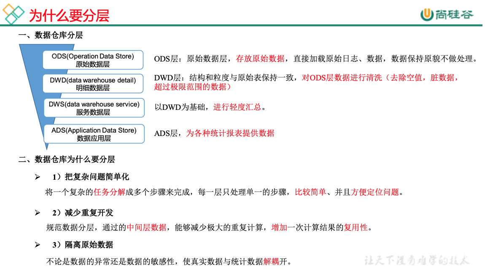

> 如下的内容都需要先搭建环境，具体的可以参考“05-CDH版数仓采集-01”，因为我是用cdh搭建的。不分内容参照“01-数据采集-01”


## 1, 数仓分层

ODS：operation data store, 元数据层

DW：data warehouse

* dwd：data warehouse detail 
* dws：data warehouse service

APP: application



## 2, ods层创表导入等

### 2.1, 创建数据库

```sql
create database gmall;
```


### 2.2,ods层创建表

* start表

```sql
drop table if exists gmall.ods_start_log;
CREATE EXTERNAL TABLE gmall.ods_start_log (`line` string)
PARTITIONED BY (`dt` string)
STORED AS
  INPUTFORMAT 'com.hadoop.mapred.DeprecatedLzoTextInputFormat'
  OUTPUTFORMAT 'org.apache.hadoop.hive.ql.io.HiveIgnoreKeyTextOutputFormat'
LOCATION '/warehouse/gmall/ods/ods_start_log';
```

* event表

```sql
drop table if exists gmall.ods_event_log;
CREATE EXTERNAL TABLE gmall.ods_event_log (`line` string)
PARTITIONED BY (`dt` string)
STORED AS
  INPUTFORMAT 'com.hadoop.mapred.DeprecatedLzoTextInputFormat'
  OUTPUTFORMAT 'org.apache.hadoop.hive.ql.io.HiveIgnoreKeyTextOutputFormat'
LOCATION '/warehouse/gmall/ods/ods_event_log';
```


### 2.3, ods层加载数据

* 加载start表

```sql
load data inpath '/flume/events/log/topic_start/2019-08-04' into table gmall.ods_start_log partition(dt='2019-08-04');
```

* 加载event表

```sql
load data inpath '/flume/events/log/topic_event/2019-08-04' into table gmall.ods_event_log partition(dt='2019-08-04');
```


### 2.4, ods层命令行自动导入

```shell
# hive -e是外部调用hive命令，可以通过这个命令在shell中执行load data命令即可
hive -e show databases;
```

```shell
#!/bin/bash
hive=/opt/cloudera/parcels/CDH-5.12.1-1.cdh5.12.1.p0.3/bin/hive

if [ -n "$1" ];
then theDate=$1
else theDate=`date -d "-1 day" +%F`
fi

echo $theDate

action="
load data inpath '/flume/events/log/topic_start/$theDate' into table gmall.ods_start_log partition(dt='$theDate');

load data inpath '/flume/events/log/topic_event/$theDate' into table gmall.ods_event_log partition(dt='$theDate');
"

echo $action

$hive -e "$action"
```


## 3, dwd层创表导入等

### 3.1, dwd层创建表

* start表

```sql
drop table if exists gmall.dwd_start_log;
CREATE EXTERNAL TABLE gmall.dwd_start_log(
`mid_id` string,
`user_id` string, 
`version_code` string, 
`version_name` string, 
`lang` string, 
`source` string, 
`os` string, 
`area` string, 
`model` string,
`brand` string, 
`sdk_version` string, 
`gmail` string, 
`height_width` string,  
`app_time` string,
`network` string, 
`lng` string, 
`lat` string, 
`entry` string, 
`open_ad_type` string, 
`action` string, 
`loading_time` string, 
`detail` string, 
`extend1` string
)
PARTITIONED BY (dt string)
location '/warehouse/gmall/dwd/dwd_start_log';
```

* event表

```mysql
# 这里选择用parquet格式，是为了学习一下而已
drop table if exists gmall.dwd_base_event_log;
CREATE EXTERNAL TABLE gmall.dwd_base_event_log(
`mid_id` string,
`user_id` string, 
`version_code` string, 
`version_name` string, 
`lang` string, 
`source` string, 
`os` string, 
`area` string, 
`model` string,
`brand` string, 
`sdk_version` string, 
`gmail` string, 
`height_width` string, 
`app_time` string, 
`network` string, 
`lng` string, 
`lat` string, 
`event_name` string, 
`event_json` string, 
`server_time` string)
PARTITIONED BY (`dt` string)
stored as parquet
location '/warehouse/gmall/dwd/dwd_base_event_log';
```


### 3.2, dwd层导入数据

* start表

```sql
SET hive.exec.dynamic.partition.mode=nonstrict;

insert overwrite table gmall.dwd_start_log
PARTITION (dt)
select 
    get_json_object(line,'$.mid') mid_id,
    get_json_object(line,'$.uid') user_id,
    get_json_object(line,'$.vc') version_code,
    get_json_object(line,'$.vn') version_name,
    get_json_object(line,'$.l') lang,
    get_json_object(line,'$.sr') source,
    get_json_object(line,'$.os') os,
    get_json_object(line,'$.ar') area,
    get_json_object(line,'$.md') model,
    get_json_object(line,'$.ba') brand,
    get_json_object(line,'$.sv') sdk_version,
    get_json_object(line,'$.g') gmail,
    get_json_object(line,'$.hw') height_width,
    get_json_object(line,'$.t') app_time,
    get_json_object(line,'$.nw') network,
    get_json_object(line,'$.ln') lng,
    get_json_object(line,'$.la') lat,
    get_json_object(line,'$.entry') entry,
    get_json_object(line,'$.open_ad_type') open_ad_type,
    get_json_object(line,'$.action') action,
    get_json_object(line,'$.loading_time') loading_time,
    get_json_object(line,'$.detail') detail,
    get_json_object(line,'$.extend1') extend1,
    dt 
from gmall.ods_start_log where dt = '2019-08-05'
```

* event表
* 该表处理的时候用到了udf和udtf函数，具体看下面的内容
* 用到的两个函数：base_analizer和flat_analizer

```mysql
set hive.exec.dynamic.partition.mode=nonstrict;

insert overwrite table gmall.dwd_base_event_log partition (dt)
select
mid_id,
user_id,
version_code,
version_name,
lang,
source,
os,
area,
model,
brand,
sdk_version,
gmail,
height_width,
app_time,
network,
lng,
lat,
event_name,
event_json,
server_time,
dt
from
(
select
split(base_analizer(line,'mid,uid,vc,vn,l,sr,os,ar,md,ba,sv,g,hw,t,nw,ln,la'),'\t')[0]   as mid_id,
split(base_analizer(line,'mid,uid,vc,vn,l,sr,os,ar,md,ba,sv,g,hw,t,nw,ln,la'),'\t')[1]   as user_id,
split(base_analizer(line,'mid,uid,vc,vn,l,sr,os,ar,md,ba,sv,g,hw,t,nw,ln,la'),'\t')[2]   as version_code,
split(base_analizer(line,'mid,uid,vc,vn,l,sr,os,ar,md,ba,sv,g,hw,t,nw,ln,la'),'\t')[3]   as version_name,
split(base_analizer(line,'mid,uid,vc,vn,l,sr,os,ar,md,ba,sv,g,hw,t,nw,ln,la'),'\t')[4]   as lang,
split(base_analizer(line,'mid,uid,vc,vn,l,sr,os,ar,md,ba,sv,g,hw,t,nw,ln,la'),'\t')[5]   as source,
split(base_analizer(line,'mid,uid,vc,vn,l,sr,os,ar,md,ba,sv,g,hw,t,nw,ln,la'),'\t')[6]   as os,
split(base_analizer(line,'mid,uid,vc,vn,l,sr,os,ar,md,ba,sv,g,hw,t,nw,ln,la'),'\t')[7]   as area,
split(base_analizer(line,'mid,uid,vc,vn,l,sr,os,ar,md,ba,sv,g,hw,t,nw,ln,la'),'\t')[8]   as model,
split(base_analizer(line,'mid,uid,vc,vn,l,sr,os,ar,md,ba,sv,g,hw,t,nw,ln,la'),'\t')[9]   as brand,
split(base_analizer(line,'mid,uid,vc,vn,l,sr,os,ar,md,ba,sv,g,hw,t,nw,ln,la'),'\t')[10]  as sdk_version,
split(base_analizer(line,'mid,uid,vc,vn,l,sr,os,ar,md,ba,sv,g,hw,t,nw,ln,la'),'\t')[11]  as gmail,
split(base_analizer(line,'mid,uid,vc,vn,l,sr,os,ar,md,ba,sv,g,hw,t,nw,ln,la'),'\t')[12]  as height_width,
split(base_analizer(line,'mid,uid,vc,vn,l,sr,os,ar,md,ba,sv,g,hw,t,nw,ln,la'),'\t')[13]  as app_time,
split(base_analizer(line,'mid,uid,vc,vn,l,sr,os,ar,md,ba,sv,g,hw,t,nw,ln,la'),'\t')[14]  as network,
split(base_analizer(line,'mid,uid,vc,vn,l,sr,os,ar,md,ba,sv,g,hw,t,nw,ln,la'),'\t')[15]  as lng,
split(base_analizer(line,'mid,uid,vc,vn,l,sr,os,ar,md,ba,sv,g,hw,t,nw,ln,la'),'\t')[16]  as lat,
split(base_analizer(line,'mid,uid,vc,vn,l,sr,os,ar,md,ba,sv,g,hw,t,nw,ln,la'),'\t')[17]  as ops,
split(base_analizer(line,'mid,uid,vc,vn,l,sr,os,ar,md,ba,sv,g,hw,t,nw,ln,la'),'\t')[18]  as server_time,
dt
from gmall.ods_event_log where dt='2019-08-05' and base_analizer(line,'mid,uid,vc,vn,l,sr,os,ar,md,ba,sv,g,hw,t,nw,ln,la')<>'' 
) sdk_log lateral view flat_analizer(ops) tmp_k as event_name, event_json;
```


### 3.3, 两个自定义hive函数：base_analizer和flat_analizer

* 两个函数：
* base_analizer是udf函数
* flat_analizer是udtf函数

#### 3.3.1, 首先加入依赖

```xml
<dependency>
  <groupId>org.apache.hive</groupId>
  <artifactId>hive-cli</artifactId>
  <version>1.1.0</version>
</dependency>
```

#### 3.3.2, udf函数代码编写

```java
package com.atguigu.udf;

import org.apache.commons.lang3.StringUtils;
import org.apache.hadoop.hive.ql.exec.UDF;
import org.json.JSONException;
import org.json.JSONObject;

/**
 * #author      : ivanl001
 * #creator     : 2019-08-05 10:04
 * #description :
 **/
public class EventBaseUDF extends UDF {

    //这个不是父类的方法，但是需要有这个方法，主要有这种形式即可
    public String evaluate(String line, String key) throws JSONException {

        // 0, 初始化返回结果串
        StringBuilder sb = new StringBuilder();

        // 1, 先对key进行切割，方便后面调用
        String[] jsonkeys = key.split(",");

        // 2, 处理获取的字符串
        if (line== null){
            return "";
        }
        String[] logContents = line.split("\\|");
        if (logContents.length != 2 || StringUtils.isBlank(logContents[1])){
            return "";
        }

        // 3, 创建json对象
        try {

            JSONObject jsonObject = new JSONObject(logContents[1]);
            //这里只获取cm字段内容分析，其他的字段作为后续处理
            JSONObject cm = jsonObject.getJSONObject("cm");
            for (int i = 0; i < jsonkeys.length; i++) {
                String jsonkey = jsonkeys[i];

                if(cm.has(jsonkey)){
                    sb.append(cm.getString(jsonkey)).append("\t");
                }else {
                    sb.append("\t");
                }
            }
            //把其他需要的字段拼接上
            sb.append(jsonObject.getString("et")).append("\t");
            sb.append(logContents[0]).append("\t");
        } catch (JSONException e) {
            e.printStackTrace();
        }
        return sb.toString();
    }


    public static void main(String[] args) throws JSONException {

        String line = "1541217850324|{\"cm\":{\"mid\":\"m7856\",\"uid\":\"u8739\",\"ln\":\"-74.8\",\"sv\":\"V2.2.2\",\"os\":\"8.1.3\",\"g\":\"P7XC9126@gmail.com\",\"nw\":\"3G\",\"l\":\"es\",\"vc\":\"6\",\"hw\":\"640*960\",\"ar\":\"MX\",\"t\":\"1541204134250\",\"la\":\"-31.7\",\"md\":\"huawei-17\",\"vn\":\"1.1.2\",\"sr\":\"O\",\"ba\":\"Huawei\"},\"ap\":\"weather\",\"et\":[{\"ett\":\"1541146624055\",\"en\":\"display\",\"kv\":{\"goodsid\":\"n4195\",\"copyright\":\"ESPN\",\"content_provider\":\"CNN\",\"extend2\":\"5\",\"action\":\"2\",\"extend1\":\"2\",\"place\":\"3\",\"showtype\":\"2\",\"category\":\"72\",\"newstype\":\"5\"}},{\"ett\":\"1541213331817\",\"en\":\"loading\",\"kv\":{\"extend2\":\"\",\"loading_time\":\"15\",\"action\":\"3\",\"extend1\":\"\",\"type1\":\"\",\"type\":\"3\",\"loading_way\":\"1\"}},{\"ett\":\"1541126195645\",\"en\":\"ad\",\"kv\":{\"entry\":\"3\",\"show_style\":\"0\",\"action\":\"2\",\"detail\":\"325\",\"source\":\"4\",\"behavior\":\"2\",\"content\":\"1\",\"newstype\":\"5\"}},{\"ett\":\"1541202678812\",\"en\":\"notification\",\"kv\":{\"ap_time\":\"1541184614380\",\"action\":\"3\",\"type\":\"4\",\"content\":\"\"}},{\"ett\":\"1541194686688\",\"en\":\"active_background\",\"kv\":{\"active_source\":\"3\"}}]}";
        String x = new EventBaseUDF().evaluate(line, "mid,uid,vc,vn,l,sr,os,ar,md,ba,sv,g,hw,nw,ln,la,t");
        System.out.println(x);
    }
}
```


#### 3.3.3, udtf函数代码编写

```java
package com.atguigu.udtf;

import org.apache.commons.lang3.StringUtils;
import org.apache.hadoop.hive.ql.exec.UDFArgumentException;
import org.apache.hadoop.hive.ql.metadata.HiveException;
import org.apache.hadoop.hive.ql.udf.generic.GenericUDTF;
import org.apache.hadoop.hive.serde2.objectinspector.ObjectInspector;
import org.apache.hadoop.hive.serde2.objectinspector.ObjectInspectorFactory;
import org.apache.hadoop.hive.serde2.objectinspector.StructObjectInspector;
import org.apache.hadoop.hive.serde2.objectinspector.primitive.PrimitiveObjectInspectorFactory;
import org.json.JSONArray;
import org.json.JSONException;

import java.util.ArrayList;
import java.util.List;

/**
 * #author      : ivanl001
 * #creator     : 2019-08-05 11:21
 * #description :
 **/
public class EventExplodeUDTF extends GenericUDTF {

    @Override
    public StructObjectInspector initialize(StructObjectInspector argOIs) throws UDFArgumentException {

        List<String> fieldNames = new ArrayList<>();
        List<ObjectInspector> fieldTypes = new ArrayList<>();

        fieldNames.add("event_name");
        fieldTypes.add(PrimitiveObjectInspectorFactory.javaStringObjectInspector);

        fieldNames.add("event_json");
        fieldTypes.add(PrimitiveObjectInspectorFactory.javaStringObjectInspector);

        return ObjectInspectorFactory.getStandardStructObjectInspector(fieldNames,fieldTypes);

    }

    @Override
    public void process(Object[] args) throws HiveException {

        // 1, 获取数据
        String input = args[0].toString();

        // 2, 基本的数据校验
        if (StringUtils.isBlank(input)){
            return;
        }

        try {
            JSONArray jsonArray = new JSONArray(input);
            for (int i = 0; i < jsonArray.length(); i++) {

                String[] results = new String[2];
                try {
                    // 获取事件名称
                    //这个是event_name
                    results[0]= jsonArray.getJSONObject(i).getString("en");
                    //这个是event_json
                    results[1] =jsonArray.getString(i);

                } catch (JSONException e) {
                    e.printStackTrace();
                    continue;
                }
              
                // 把结果写出去
                forward(results);
            }

        } catch (JSONException e) {
            e.printStackTrace();
        }
    }

    @Override
    public void close() throws HiveException {

    }

    public static void main(String[] args) {
        //这个好想没法验证对吧
    }
}
```

#### 3.3.4, 打包放入hive的lib目录下

```shell
mv /root/06-dataware/03-hiveUDF-1.0-SNAPSHOT.jar /opt/cloudera/parcels/CDH/lib/hive/lib/ 
```

#### 3.3.5, 加入jar包, 并创建临时函数

```shell
# 进入hive环境
hive
add jar /opt/cloudera/parcels/CDH/lib/hive/lib/03-hiveUDF-1.0-SNAPSHOT.jar
create temporary function base_analizer as 'com.atguigu.udf.EventBaseUDF';
create temporary function flat_analizer as 'com.atguigu.udtf.EventExplodeUDTF';
```

#### 3.3.6, 可以正常使用

```mysql
select
mid_id,
user_id,
version_code,
version_name,
lang,
source,
os,
area,
model,
brand,
sdk_version,
gmail,
height_width,
app_time,
network,
lng,
lat,
event_name,
event_json,
server_time,
dt
from
(
select
split(base_analizer(line,'mid,uid,vc,vn,l,sr,os,ar,md,ba,sv,g,hw,t,nw,ln,la'),'\t')[0]   as mid_id,
split(base_analizer(line,'mid,uid,vc,vn,l,sr,os,ar,md,ba,sv,g,hw,t,nw,ln,la'),'\t')[1]   as user_id,
split(base_analizer(line,'mid,uid,vc,vn,l,sr,os,ar,md,ba,sv,g,hw,t,nw,ln,la'),'\t')[2]   as version_code,
split(base_analizer(line,'mid,uid,vc,vn,l,sr,os,ar,md,ba,sv,g,hw,t,nw,ln,la'),'\t')[3]   as version_name,
split(base_analizer(line,'mid,uid,vc,vn,l,sr,os,ar,md,ba,sv,g,hw,t,nw,ln,la'),'\t')[4]   as lang,
split(base_analizer(line,'mid,uid,vc,vn,l,sr,os,ar,md,ba,sv,g,hw,t,nw,ln,la'),'\t')[5]   as source,
split(base_analizer(line,'mid,uid,vc,vn,l,sr,os,ar,md,ba,sv,g,hw,t,nw,ln,la'),'\t')[6]   as os,
split(base_analizer(line,'mid,uid,vc,vn,l,sr,os,ar,md,ba,sv,g,hw,t,nw,ln,la'),'\t')[7]   as area,
split(base_analizer(line,'mid,uid,vc,vn,l,sr,os,ar,md,ba,sv,g,hw,t,nw,ln,la'),'\t')[8]   as model,
split(base_analizer(line,'mid,uid,vc,vn,l,sr,os,ar,md,ba,sv,g,hw,t,nw,ln,la'),'\t')[9]   as brand,
split(base_analizer(line,'mid,uid,vc,vn,l,sr,os,ar,md,ba,sv,g,hw,t,nw,ln,la'),'\t')[10]  as sdk_version,
split(base_analizer(line,'mid,uid,vc,vn,l,sr,os,ar,md,ba,sv,g,hw,t,nw,ln,la'),'\t')[11]  as gmail,
split(base_analizer(line,'mid,uid,vc,vn,l,sr,os,ar,md,ba,sv,g,hw,t,nw,ln,la'),'\t')[12]  as height_width,
split(base_analizer(line,'mid,uid,vc,vn,l,sr,os,ar,md,ba,sv,g,hw,t,nw,ln,la'),'\t')[13]  as app_time,
split(base_analizer(line,'mid,uid,vc,vn,l,sr,os,ar,md,ba,sv,g,hw,t,nw,ln,la'),'\t')[14]  as network,
split(base_analizer(line,'mid,uid,vc,vn,l,sr,os,ar,md,ba,sv,g,hw,t,nw,ln,la'),'\t')[15]  as lng,
split(base_analizer(line,'mid,uid,vc,vn,l,sr,os,ar,md,ba,sv,g,hw,t,nw,ln,la'),'\t')[16]  as lat,
split(base_analizer(line,'mid,uid,vc,vn,l,sr,os,ar,md,ba,sv,g,hw,t,nw,ln,la'),'\t')[17]  as ops,
split(base_analizer(line,'mid,uid,vc,vn,l,sr,os,ar,md,ba,sv,g,hw,t,nw,ln,la'),'\t')[18]  as server_time,
dt
from gmall.ods_event_log where dt='2019-08-05' and base_analizer(line,'mid,uid,vc,vn,l,sr,os,ar,md,ba,sv,g,hw,t,nw,ln,la')<>'' 
) sdk_log lateral view flat_analizer(ops) tmp_k as event_name, event_json;
```

## 5, dwd层event表基础明细表

* 其实dwd层还有好多张明细表， 这里只创建导入一张，作为案例，其他的不创建了哈

### 5.1, dwd_display_log: 明细表创建

```mysql
drop table if exists gmall.dwd_display_log;
CREATE EXTERNAL TABLE gmall.dwd_display_log(
`mid_id` string,
`user_id` string,
`version_code` string,
`version_name` string,
`lang` string,
`source` string,
`os` string,
`area` string,
`model` string,
`brand` string,
`sdk_version` string,
`gmail` string,
`height_width` string,
`app_time` string,
`network` string,
`lng` string,
`lat` string,
`action` string,
`goodsid` string,
`place` string,
`extend1` string,
`category` string,
`server_time` string
)
PARTITIONED BY (dt string)
location '/warehouse/gmall/dwd/dwd_display_log/';
```

### 5.1, dwd_display_log: 明细表数据导入

```mysql
set hive.exec.dynamic.partition.mode=nonstrict;

insert overwrite table gmall.dwd_display_log partition(dt)
select 
mid_id,
user_id,
version_code,
version_name,
lang,
source,
os,
area,
model,
brand,
sdk_version,
gmail,
height_width,
app_time,
network,
lng,
lat,
get_json_object(event_json,'$.kv.action') action,
get_json_object(event_json,'$.kv.goodsid') goodsid,
get_json_object(event_json,'$.kv.place') place,
get_json_object(event_json,'$.kv.extend1') extend1,
get_json_object(event_json,'$.kv.category') category,
server_time,
dt
from gmall.dwd_base_event_log 
where dt='2019-08-05' and event_name='display';
```


## 6,  dws层

### 日活表

### 6.1, dws_uv_detail_day

```mysql
drop table if exists gmall.dws_uv_detail_day;
create external table gmall.dws_uv_detail_day
(
    `mid_id` string COMMENT '设备唯一标识',
    `user_id` string COMMENT '用户标识', 
    `version_code` string COMMENT '程序版本号', 
    `version_name` string COMMENT '程序版本名', 
    `lang` string COMMENT '系统语言', 
    `source` string COMMENT '渠道号', 
    `os` string COMMENT '安卓系统版本', 
    `area` string COMMENT '区域', 
    `model` string COMMENT '手机型号', 
    `brand` string COMMENT '手机品牌', 
    `sdk_version` string COMMENT 'sdkVersion', 
    `gmail` string COMMENT 'gmail', 
    `height_width` string COMMENT '屏幕宽高',
    `app_time` string COMMENT '客户端日志产生时的时间',
    `network` string COMMENT '网络模式',
    `lng` string COMMENT '经度',
    `lat` string COMMENT '纬度'
)
partitioned by (dt string)
stored as parquet
location '/warehouse/gmall/dws/dws_uv_detail_day';
```


```mysql
insert overwrite table gmall.dws_uv_detail_day partition(dt)
select  
    mid_id,
    concat_ws('|', collect_set(user_id)) user_id,
    concat_ws('|', collect_set(version_code)) version_code,
    concat_ws('|', collect_set(version_name)) version_name,
    concat_ws('|', collect_set(lang))lang,
    concat_ws('|', collect_set(source)) source,
    concat_ws('|', collect_set(os)) os,
    concat_ws('|', collect_set(area)) area, 
    concat_ws('|', collect_set(model)) model,
    concat_ws('|', collect_set(brand)) brand,
    concat_ws('|', collect_set(sdk_version)) sdk_version,
    concat_ws('|', collect_set(gmail)) gmail,
    concat_ws('|', collect_set(height_width)) height_width,
    concat_ws('|', collect_set(app_time)) app_time,
    concat_ws('|', collect_set(network)) network,
    concat_ws('|', collect_set(lng)) lng,
    concat_ws('|', collect_set(lat)) lat,
    dt
from gmall.dwd_start_log
where dt='2019-08-05'
group by mid_id, dt;
```


### 周活表

### 6.2, dws_uv_detail_wk

```mysql
drop table if exists gmall.dws_uv_detail_wk;
create external table gmall.dws_uv_detail_wk( 
    `mid_id` string COMMENT '设备唯一标识',
    `user_id` string COMMENT '用户标识', 
    `version_code` string COMMENT '程序版本号', 
    `version_name` string COMMENT '程序版本名', 
    `lang` string COMMENT '系统语言', 
    `source` string COMMENT '渠道号', 
    `os` string COMMENT '安卓系统版本', 
    `area` string COMMENT '区域', 
    `model` string COMMENT '手机型号', 
    `brand` string COMMENT '手机品牌', 
    `sdk_version` string COMMENT 'sdkVersion', 
    `gmail` string COMMENT 'gmail', 
    `height_width` string COMMENT '屏幕宽高',
    `app_time` string COMMENT '客户端日志产生时的时间',
    `network` string COMMENT '网络模式',
    `lng` string COMMENT '经度',
    `lat` string COMMENT '纬度',
    `monday_date` string COMMENT '周一日期',
    `sunday_date` string COMMENT  '周日日期' 
) COMMENT '活跃用户按周明细'
PARTITIONED BY (`wk_dt` string)
stored as parquet
location '/warehouse/gmall/dws/dws_uv_detail_wk/';
```


```mysql
set hive.exec.dynamic.partition.mode=nonstrict;

insert overwrite table gmall.dws_uv_detail_wk partition(wk_dt)
select  
    mid_id,
    concat_ws('|', collect_set(user_id)) user_id,
    concat_ws('|', collect_set(version_code)) version_code,
    concat_ws('|', collect_set(version_name)) version_name,
    concat_ws('|', collect_set(lang)) lang,
    concat_ws('|', collect_set(source)) source,
    concat_ws('|', collect_set(os)) os,
    concat_ws('|', collect_set(area)) area, 
    concat_ws('|', collect_set(model)) model,
    concat_ws('|', collect_set(brand)) brand,
    concat_ws('|', collect_set(sdk_version)) sdk_version,
    concat_ws('|', collect_set(gmail)) gmail,
    concat_ws('|', collect_set(height_width)) height_width,
    concat_ws('|', collect_set(app_time)) app_time,
    concat_ws('|', collect_set(network)) network,
    concat_ws('|', collect_set(lng)) lng,
    concat_ws('|', collect_set(lat)) lat,
    date_add(next_day('2019-08-05','MO'),-7),
    date_add(next_day('2019-08-05','MO'),-1),
    concat(date_add( next_day('2019-08-05','MO'),-7), '_' , date_add(next_day('2019-08-05','MO'),-1) 
)
from gmall.dws_uv_detail_day 
where dt>=date_add(next_day('2019-08-05','MO'),-7) 
and dt<=date_add(next_day('2019-08-05','MO'),-1) 
group by mid_id;
```

### 月活表

### 6.3, dws_uv_detail_mn

```mysql
drop table if exists gmall.dws_uv_detail_mn;

create external table gmall.dws_uv_detail_mn( 
    `mid_id` string COMMENT '设备唯一标识',
    `user_id` string COMMENT '用户标识', 
    `version_code` string COMMENT '程序版本号', 
    `version_name` string COMMENT '程序版本名', 
    `lang` string COMMENT '系统语言', 
    `source` string COMMENT '渠道号', 
    `os` string COMMENT '安卓系统版本', 
    `area` string COMMENT '区域', 
    `model` string COMMENT '手机型号', 
    `brand` string COMMENT '手机品牌', 
    `sdk_version` string COMMENT 'sdkVersion', 
    `gmail` string COMMENT 'gmail', 
    `height_width` string COMMENT '屏幕宽高',
    `app_time` string COMMENT '客户端日志产生时的时间',
    `network` string COMMENT '网络模式',
    `lng` string COMMENT '经度',
    `lat` string COMMENT '纬度'
) COMMENT '活跃用户按月明细'
PARTITIONED BY (`mn` string)
stored as parquet
location '/warehouse/gmall/dws/dws_uv_detail_mn/';
```


```mysql
set hive.exec.dynamic.partition.mode=nonstrict;

insert overwrite table gmall.dws_uv_detail_mn partition(mn)
select  
    mid_id,
    concat_ws('|', collect_set(user_id)) user_id,
    concat_ws('|', collect_set(version_code)) version_code,
    concat_ws('|', collect_set(version_name)) version_name,
    concat_ws('|', collect_set(lang)) lang,
    concat_ws('|', collect_set(source)) source,
    concat_ws('|', collect_set(os)) os,
    concat_ws('|', collect_set(area)) area, 
    concat_ws('|', collect_set(model)) model,
    concat_ws('|', collect_set(brand)) brand,
    concat_ws('|', collect_set(sdk_version)) sdk_version,
    concat_ws('|', collect_set(gmail)) gmail,
    concat_ws('|', collect_set(height_width)) height_width,
    concat_ws('|', collect_set(app_time)) app_time,
    concat_ws('|', collect_set(network)) network,
    concat_ws('|', collect_set(lng)) lng,
    concat_ws('|', collect_set(lat)) lat,
    date_format('2019-08-05','yyyy-MM')
from gmall.dws_uv_detail_day
where date_format(dt,'yyyy-MM') = date_format('2019-08-05','yyyy-MM')
group by mid_id;
```

## 7, ads层

### 活跃用户表

### ads_uv_count

```mysql
drop table if exists gmall.ads_uv_count;
create external table gmall.ads_uv_count( 
    `dt` string COMMENT '统计日期',
    `day_count` bigint COMMENT '当日用户数量',
    `wk_count`  bigint COMMENT '当周用户数量',
    `mn_count`  bigint COMMENT '当月用户数量',
    `is_weekend` string COMMENT 'Y,N是否是周末,用于得到本周最终结果',
    `is_monthend` string COMMENT 'Y,N是否是月末,用于得到本月最终结果' 
) COMMENT '活跃设备数'
row format delimited fields terminated by '\t'
location '/warehouse/gmall/ads/ads_uv_count/';
```


```mysql
insert into table gmall.ads_uv_count 
select '2019-08-05' dt, daycount.ct, wkcount.ct, mncount.ct,
   if(date_add(next_day('2019-08-05','MO'),-1)='2019-08-05','Y','N') ,
   if(last_day('2019-08-05')='2019-08-05','Y','N') 
from 
(
   select '2019-08-05' dt, count(*) ct
   from gmall.dws_uv_detail_day
   where dt='2019-08-05'  
) as daycount 

join

( 
   select '2019-08-05' dt, count (*) ct
   from gmall.dws_uv_detail_wk
   where wk_dt=concat(date_add(next_day('2019-08-05','MO'),-7),'_' ,date_add(next_day('2019-08-05','MO'),-1) )
) as wkcount 

on daycount.dt=wkcount.dt

join 

( 
   select '2019-08-05' dt, count (*) ct
   from gmall.dws_uv_detail_mn
   where mn=date_format('2019-08-05','yyyy-MM')  
) as mncount 

on daycount.dt=mncount.dt;
```

### 新增用户表

### dws_new_mid_day

```mysql
drop table if exists gmall.dws_new_mid_day;
create external table gmall.dws_new_mid_day
(
    `mid_id` string COMMENT '设备唯一标识',
    `user_id` string COMMENT '用户标识', 
    `version_code` string COMMENT '程序版本号', 
    `version_name` string COMMENT '程序版本名', 
    `lang` string COMMENT '系统语言', 
    `source` string COMMENT '渠道号', 
    `os` string COMMENT '安卓系统版本', 
    `area` string COMMENT '区域', 
    `model` string COMMENT '手机型号', 
    `brand` string COMMENT '手机品牌', 
    `sdk_version` string COMMENT 'sdkVersion', 
    `gmail` string COMMENT 'gmail', 
    `height_width` string COMMENT '屏幕宽高',
    `app_time` string COMMENT '客户端日志产生时的时间',
    `network` string COMMENT '网络模式',
    `lng` string COMMENT '经度',
    `lat` string COMMENT '纬度'
)  COMMENT '每日新增设备信息'
PARTITIONED BY (`dt` string)
stored as parquet
location '/warehouse/gmall/dws/dws_new_mid_day/';
```


```mysql
set hive.exec.dynamic.partition.mode=nonstrict;

insert into table gmall.dws_new_mid_day partition (dt)

select a01.mid_id, a01.user_id, a01.version_code, a01.version_name, a01.lang, a01.source, a01.os, a01.area, a01.model, a01.brand, a01.sdk_version, a01.gmail, 
a01.height_width, a01.app_time, a01.network, a01.lng, a01.lat, a01.dt
from

(select mid_id, user_id, version_code, version_name, lang, source, os, area, model, brand, sdk_version, gmail, height_width, app_time, network, lng, lat, dt
from gmall.dws_uv_detail_day
where dt = '2019-08-05') as a01 

left join 

(select mid_id, user_id, version_code, version_name, lang, source, os, area, model, brand, sdk_version, gmail, height_width, app_time, network, lng, lat, dt
from gmall.dws_new_mid_day) as a02

on a01.mid_id = a02.mid_id and a02.mid_id is null
```

