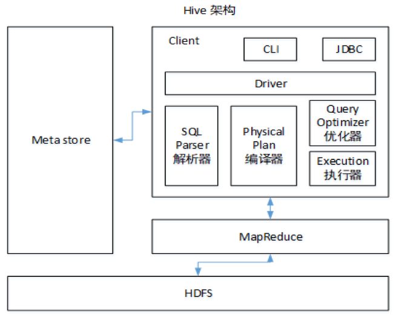

## 15.2 Hive总结

### 15.2.1 Hive的架构



### 15.2.2 Hive和数据库比较

Hive 和数据库除了拥有类似的查询语言，再无类似之处。

1）数据存储位置

Hive 存储在 HDFS 。数据库将数据保存在块设备或者本地文件系统中。

2）数据更新

Hive中不建议对数据的改写。而数据库中的数据通常是需要经常进行修改的，

3）执行延迟

Hive 执行延迟较高。数据库的执行延迟较低。当然，这个是有条件的，即数据规模较小，当数据规模大到超过数据库的处理能力的时候，Hive的并行计算显然能体现出优势。

4）数据规模

Hive支持很大规模的数据计算；数据库可以支持的数据规模较小。

### 15.2.3 内部表和外部表

1）管理表：当我们删除一个管理表时，Hive也会删除这个表中数据。管理表不适合和其他工具共享数据。

2）外部表：删除该表并不会删除掉原始数据，删除的是表的元数据

### 15.2.4 4个By区别

1）Sort By：分区内有序；

2）Order By：全局排序，只有一个Reducer；

3）Distrbute By：类似MR中Partition，进行分区，结合sort by使用。

4） Cluster By：当Distribute by和Sorts by字段相同时，可以使用Cluster by方式。Cluster by除了具有Distribute by的功能外还兼具Sort by的功能。但是排序只能是升序排序，不能指定排序规则为ASC或者DESC。

### 15.2..5 窗口函数

1） OVER()：指定分析函数工作的数据窗口大小，这个数据窗口大小可能会随着行的变而变化

2）CURRENT ROW：当前行

3）n PRECEDING：往前n行数据

4） n FOLLOWING：往后n行数据

5）UNBOUNDED：起点，UNBOUNDED PRECEDING 表示从前面的起点，UNBOUNDED FOLLOWING表示到后面的终点

6） LAG(col,n)：往前第n行数据

7）LEAD(col,n)：往后第n行数据

8） NTILE(n)：把有序分区中的行分发到指定数据的组中，各个组有编号，编号从1开始，对于每一行，NTILE返回此行所属的组的编号。注意：n必须为int类型。

### 15.2.6 在项目中是否自定义过UDF、UDTF函数，以及用他们处理了什么问题？

自定义过。

用UDF函数解析公共字段；用UDTF函数解析事件字段。

### 15.2.7 Hive优化

Ø **1）MapJoin**

如果不指定MapJoin或者不符合MapJoin的条件，那么Hive解析器会将Join操作转换成Common Join，即：在Reduce阶段完成join。容易发生数据倾斜。可以用MapJoin把小表全部加载到内存在map端进行join，避免reducer处理。

Ø **2）行列过滤**

列处理：在SELECT中，只拿需要的列，如果有，尽量使用分区过滤，少用SELECT *。

行处理：在分区剪裁中，当使用外关联时，如果将副表的过滤条件写在Where后面，那么就会先全表关联，之后再过滤。

Ø **3）采用分桶技术**

Ø **4）采用分区技术**

Ø  **5）合理设置Map数**

**（1）通常情况下，作业会通过input的目录产生一个或者多个map任务。**

主要的决定因素有：input的文件总个数，input的文件大小，集群设置的文件块大小。

**（2）是不是map数越多越好？**

答案是否定的。如果一个任务有很多小文件（远远小于块大小128m），则每个小文件也会被当做一个块，用一个map任务来完成，而一个map任务启动和初始化的时间远远大于逻辑处理的时间，就会造成很大的资源浪费。而且，同时可执行的map数是受限的。

**（3）是不是保证每个map处理接近128m的文件块，就高枕无忧了？**

答案也是不一定。比如有一个127m的文件，正常会用一个map去完成，但这个文件只有一个或者两个小字段，却有几千万的记录，如果map处理的逻辑比较复杂，用一个map任务去做，肯定也比较耗时。

针对上面的问题2和3，我们需要采取两种方式来解决：即减少map数和增加map数；

Ø **6）小文件进行合并**

在Map执行前合并小文件，减少Map数：CombineHiveInputFormat具有对小文件进行合并的功能（系统默认的格式）。HiveInputFormat没有对小文件合并功能。

Ø **7）合理设置Reduce数**

Reduce个数并不是越多越好

（1）过多的启动和初始化Reduce也会消耗时间和资源；

（2）另外，有多少个Reduce，就会有多少个输出文件，如果生成了很多个小文件，那么如果这些小文件作为下一个任务的输入，则也会出现小文件过多的问题；

在设置Reduce个数的时候也需要考虑这两个原则：处理大数据量利用合适的Reduce数；使单个Reduce任务处理数据量大小要合适；

Ø **8）常用参数**

```mysql
// 输出合并小文件
SET hive.merge.mapfiles = true; -- 默认true，在map-only任务结束时合并小文件
SET hive.merge.mapredfiles = true; -- 默认false，在map-reduce任务结束时合并小文件
SET hive.merge.size.per.task = 268435456; -- 默认256M
SET hive.merge.smallfiles.avgsize = 16777216; -- 当输出文件的平均大小小于该值时，启动一个独立的map-reduce任务进行文件merge
```

