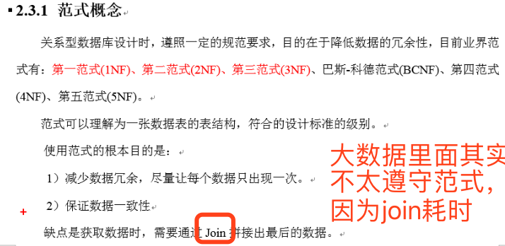

## 1, 数据库范式

### 1.1, 第一范式

* 第一范式1NF的核心原则就是：属性不可切割
* 

### 1.2, 第二范式

* 第二范式2NF的核心原则：不能存在“部分函数依赖”
* 

### 1.3, 第三范式

> 如果想要查询信息，那么很多时候就需要join获取

* 第三范式3NF的核心原则：不能存在传递函数依赖
* 

## 2, 建模

### 2.1, 关系模型建模（OLTP）

> 关系模型主要应用与OLTP系统中，为了保证数据的一致性以及避免冗余，所以大部分业务系统的表都是遵循第三范式的

### 2.2, 纬度模型建模（OLAP）

> 数据仓库中很忌讳大批量的join
>
> 维度模型主要应用于OLAP系统中，因为关系模型虽然冗余少，但是在大规模数据，跨表分析统计查询过程中，会造成多表关联，这会大大降低执行效率。
>
> 所以把相关各种表整理成两种：事实表和维度表两种。所有维度表围绕着事实表进行解释。

## 3, 雪花模型、星型模型和星座模型

>  在实际的开发中，更倾向于维度更少的星型模型

