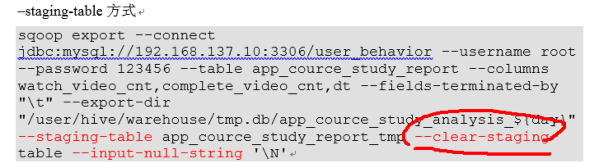

## 0, 数据库生成脚本

```

```


##  1,导入脚本：sqoop_import.sh

* **sqoop从sql数据导入hdfs**

```shell
# 下面脚本的使用
./sqoop_import.sh all 2019-08-06
```


```shell
#!/bin/bash

db_date=$2
echo $db_date
db_name=gmall

import_data() {
sqoop import \
--connect jdbc:mysql://centos01:3306/$db_name \
--username root \
--password ,. \
--target-dir /mysql/$db_name/db/$1/$db_date \
--delete-target-dir \
--fields-terminated-by '\t' \
--query "$2"' and $CONDITIONS;' \
-m 1
}

import_sku_info(){
  import_data "sku_info" "select 
id, spu_id, price, sku_name, sku_desc, weight, tm_id,
category3_id, create_time
  from sku_info where 1=1"
}

import_user_info(){
  import_data "user_info" "select 
id, name, birthday, gender, email, user_level, 
create_time 
from user_info where 1=1"
}

import_base_category1(){
  import_data "base_category1" "select 
id, name from base_category1 where 1=1"
}

import_base_category2(){
  import_data "base_category2" "select 
id, name, category1_id from base_category2 where 1=1"
}

import_base_category3(){
  import_data "base_category3" "select id, name, category2_id from base_category3 where 1=1"
}

import_order_detail(){
  import_data   "order_detail"   "select 
    od.id, 
    order_id, 
    user_id, 
    sku_id, 
    sku_name, 
    order_price, 
    sku_num, 
    o.create_time  
  from order_info o, order_detail od
  where o.id=od.order_id
  and DATE_FORMAT(create_time,'%Y-%m-%d')='$db_date'"
}

import_payment_info(){
  import_data "payment_info"   "select 
    id,  
    out_trade_no, 
    order_id, 
    user_id, 
    alipay_trade_no, 
    total_amount,  
    subject, 
    payment_type, 
    payment_time 
  from payment_info 
  where DATE_FORMAT(payment_time,'%Y-%m-%d')='$db_date'"
}

import_order_info(){
  import_data   "order_info"   "select 
    id, 
    total_amount, 
    order_status, 
    user_id, 
    payment_way, 
    out_trade_no, 
    create_time, 
    operate_time  
  from order_info 
  where (DATE_FORMAT(create_time,'%Y-%m-%d')='$db_date' or DATE_FORMAT(operate_time,'%Y-%m-%d')='$db_date')"
}

case $1 in
  "base_category1")
     import_base_category1
;;
  "base_category2")
     import_base_category2
;;
  "base_category3")
     import_base_category3
;;
  "order_info")
     import_order_info
;;
  "order_detail")
     import_order_detail
;;
  "sku_info")
     import_sku_info
;;
  "user_info")
     import_user_info
;;
  "payment_info")
     import_payment_info
;;
   "all")
   import_base_category1
   import_base_category2
   import_base_category3
   import_order_info
   import_order_detail
   import_sku_info
   import_user_info
   import_payment_info
;;
esac
```


## 2, 创hive表

```mysql
drop table if exists gmall.ods_order_info;

create external table gmall.ods_order_info (
    `id` string COMMENT '订单编号',
    `total_amount` decimal(10,2) COMMENT '订单金额',
    `order_status` string COMMENT '订单状态',
    `user_id` string COMMENT '用户id',
    `payment_way` string COMMENT '支付方式',
    `out_trade_no` string COMMENT '支付流水号',
    `create_time` string COMMENT '创建时间',
    `operate_time` string COMMENT '操作时间'
) COMMENT '订单表'
PARTITIONED BY (`dt` string)
row format delimited fields terminated by '\t'
location '/warehouse/gmall/ods/ods_order_info/';

drop table if exists gmall.ods_order_detail;
create external table gmall.ods_order_detail( 
    `id` string COMMENT '订单编号',
    `order_id` string  COMMENT '订单号', 
    `user_id` string COMMENT '用户id',
    `sku_id` string COMMENT '商品id',
    `sku_name` string COMMENT '商品名称',
    `order_price` string COMMENT '商品价格',
    `sku_num` string COMMENT '商品数量',
    `create_time` string COMMENT '创建时间'
) COMMENT '订单明细表'
PARTITIONED BY (`dt` string)
row format delimited fields terminated by '\t' 
location '/warehouse/gmall/ods/ods_order_detail/';

drop table if exists gmall.ods_sku_info;
create external table gmall.ods_sku_info( 
    `id` string COMMENT 'skuId',
    `spu_id` string  COMMENT 'spuid', 
    `price` decimal(10,2) COMMENT '价格',
    `sku_name` string COMMENT '商品名称',
    `sku_desc` string COMMENT '商品描述',
    `weight` string COMMENT '重量',
    `tm_id` string COMMENT '品牌id',
    `category3_id` string COMMENT '品类id',
    `create_time` string COMMENT '创建时间'
) COMMENT '商品表'
PARTITIONED BY (`dt` string)
row format delimited fields terminated by '\t'
location '/warehouse/gmall/ods/ods_sku_info/';

drop table if exists gmall.ods_user_info;
create external table gmall.ods_user_info( 
    `id` string COMMENT '用户id',
    `name`  string COMMENT '姓名',
    `birthday` string COMMENT '生日',
    `gender` string COMMENT '性别',
    `email` string COMMENT '邮箱',
    `user_level` string COMMENT '用户等级',
    `create_time` string COMMENT '创建时间'
) COMMENT '用户信息'
PARTITIONED BY (`dt` string)
row format delimited fields terminated by '\t'
location '/warehouse/gmall/ods/ods_user_info/';

drop table if exists gmall.ods_base_category1;
create external table gmall.ods_base_category1( 
    `id` string COMMENT 'id',
    `name`  string COMMENT '名称'
) COMMENT '商品一级分类'
PARTITIONED BY (`dt` string)
row format delimited fields terminated by '\t'
location '/warehouse/gmall/ods/ods_base_category1/';

drop table if exists gmall.ods_base_category2;
create external table gmall.ods_base_category2( 
    `id` string COMMENT ' id',
    `name` string COMMENT '名称',
    category1_id string COMMENT '一级品类id'
) COMMENT '商品二级分类'
PARTITIONED BY (`dt` string)
row format delimited fields terminated by '\t'
location '/warehouse/gmall/ods/ods_base_category2/';

drop table if exists gmall.ods_base_category3;
create external table gmall.ods_base_category3(
    `id` string COMMENT ' id',
    `name`  string COMMENT '名称',
    category2_id string COMMENT '二级品类id'
) COMMENT '商品三级分类'
PARTITIONED BY (`dt` string)
row format delimited fields terminated by '\t'
location '/warehouse/gmall/ods/ods_base_category3/';

drop table if exists gmall.ods_payment_info;
create external table gmall.ods_payment_info(
    `id` bigint COMMENT '编号',
    `out_trade_no`  string COMMENT '对外业务编号',
    `order_id`      string COMMENT '订单编号',
    `user_id` string COMMENT '用户编号',
    `alipay_trade_no` string COMMENT '支付宝交易流水编号',
    `total_amount`  decimal(16,2) COMMENT '支付金额',
    `subject` string COMMENT '交易内容',
    `payment_type`  string COMMENT '支付类型',
    `payment_time`  string COMMENT '支付时间'
     )  COMMENT '支付流水表'
PARTITIONED BY (`dt` string)
row format delimited fields terminated by '\t'
location '/warehouse/gmall/ods/ods_payment_info/';
```


## 3, 加载脚本：ods_db.sh

* **把导入hdfs的数据加载到hive表中**

```shell
# 这个是脚本的使用
./dwd_db.sh 2019-08-06
```


```shell
#!/bin/bash

APP=gmall
hive=hive

# 如果是输入的日期按照取输入日期；如果没输入日期取当前时间的前一天
if [ -n "$1" ] ;then
	do_date=$1
else 
	do_date=`date -d "-1 day" +%F`
fi

sql=" 
load data inpath '/origin_data/$APP/db/order_info/$do_date' OVERWRITE into table "$APP".ods_order_info partition(dt='$do_date');

load data inpath '/origin_data/$APP/db/order_detail/$do_date' OVERWRITE into table "$APP".ods_order_detail partition(dt='$do_date');

load data inpath '/origin_data/$APP/db/sku_info/$do_date' OVERWRITE into table "$APP".ods_sku_info partition(dt='$do_date');

load data inpath '/origin_data/$APP/db/user_info/$do_date' OVERWRITE into table "$APP".ods_user_info partition(dt='$do_date');

load data inpath '/origin_data/$APP/db/payment_info/$do_date' OVERWRITE into table "$APP".ods_payment_info partition(dt='$do_date');

load data inpath '/origin_data/$APP/db/base_category1/$do_date' OVERWRITE into table "$APP".ods_base_category1 partition(dt='$do_date');

load data inpath '/origin_data/$APP/db/base_category2/$do_date' OVERWRITE into table "$APP".ods_base_category2 partition(dt='$do_date');

load data inpath '/origin_data/$APP/db/base_category3/$do_date' OVERWRITE into table "$APP".ods_base_category3 partition(dt='$do_date'); 
"
$hive -e "$sql"

```

* 非脚本单独加载

```shell
load data inpath '/mysql/gmall/db/order_info/2019-08-06' OVERWRITE into table gmall.ods_order_info partition(dt='2019-08-06');

load data inpath '/mysql/gmall/db/order_detail/2019-08-06' OVERWRITE into table gmall.ods_order_detail partition(dt='2019-08-06');

load data inpath '/mysql/gmall/db/sku_info/2019-08-06' OVERWRITE into table gmall.ods_sku_info partition(dt='2019-08-06');

load data inpath '/mysql/gmall/db/user_info/2019-08-06' OVERWRITE into table gmall.ods_user_info partition(dt='2019-08-06');

load data inpath '/mysql/gmall/db/payment_info/2019-08-06' OVERWRITE into table gmall.ods_payment_info partition(dt='2019-08-06');

load data inpath '/mysql/gmall/db/base_category1/2019-08-06' OVERWRITE into table gmall.ods_base_category1 partition(dt='2019-08-06');

load data inpath '/mysql/gmall/db/base_category2/2019-08-06' OVERWRITE into table gmall.ods_base_category2 partition(dt='2019-08-06');

load data inpath '/mysql/gmall/db/base_category3/2019-08-06' OVERWRITE into table gmall.ods_base_category3 partition(dt='2019-08-06'); 

```


## 4, 开始分析-dwd层

* 这个应该也算是宽表的一个吧

```mysql
drop table if exists gmall.dwd_sku_info;
create external table gmall.dwd_sku_info(
    `id` string COMMENT 'skuId',
    `spu_id` string COMMENT 'spuid',
    `price` decimal(10,2) COMMENT '',
    `sku_name` string COMMENT '',
    `sku_desc` string COMMENT '',
    `weight` string COMMENT '',
    `tm_id` string COMMENT 'id',
    `category3_id` string COMMENT '1id',
    `category2_id` string COMMENT '2id',
    `category1_id` string COMMENT '3id',
    `category3_name` string COMMENT '3',
    `category2_name` string COMMENT '2',
    `category1_name` string COMMENT '1',
    `create_time` string COMMENT ''
) 
PARTITIONED BY (`dt` string)
stored as parquet
location '/warehouse/gmall/dwd/dwd_sku_info/'
tblproperties ("parquet.compression"="snappy");
```


```mysql
insert overwrite table gmall.dwd_sku_info partition(dt)
select  
    sku.id,
    sku.spu_id,
    sku.price,
    sku.sku_name,
    sku.sku_desc,
    sku.weight,
    sku.tm_id,
    sku.category3_id,
    c2.id category2_id,
    c1.id category1_id,
    c3.name category3_name,
    c2.name category2_name,
    c1.name category1_name,
    sku.create_time,
    sku.dt
from gmall.ods_sku_info sku
left join gmall.ods_base_category3 c3 on sku.category3_id=c3.id 
left join gmall.ods_base_category2 c2 on c3.category2_id=c2.id 
left join gmall.ods_base_category1 c1 on c2.category1_id=c1.id 
where sku.dt='2019-08-06'  and c2.dt='2019-08-06'
and c3.dt='2019-08-06' and c1.dt='2019-08-06'
and sku.id is not null;
```


## 5, 用户行为宽表

```mysql
drop table if exists gmall.dws_user_action;
create external table gmall.dws_user_action 
(   
    user_id          string      comment '用户 id',
    order_count     bigint      comment '下单次数 ',
    order_amount    decimal(16,2)  comment '下单金额 ',
    payment_count   bigint      comment '支付次数',
    payment_amount  decimal(16,2) comment '支付金额 ',
    comment_count   bigint      comment '评论次数'
) COMMENT '每日用户行为宽表'
PARTITIONED BY (`dt` string)
stored as parquet
location '/warehouse/gmall/dws/dws_user_action/'
tblproperties ("parquet.compression"="snappy");
```

## 重点关注一下这个：可以用left join实现，这里用union，然后group by

```mysql
with  
tmp_order as
(
    select 
        user_id, 
count(*)  order_count,
        sum(oi.total_amount) order_amount
    from dwd_order_info oi
    where date_format(oi.create_time,'yyyy-MM-dd')='2019-02-10'
    group by user_id
) ,

tmp_payment as
(
    select
        user_id, 
        sum(pi.total_amount) payment_amount, 
        count(*) payment_count 
    from dwd_payment_info pi 
    where date_format(pi.payment_time,'yyyy-MM-dd')='2019-02-10'
    group by user_id
),

tmp_comment as
(
    select
        user_id,
        count(*) comment_count
    from dwd_comment_log c
    where date_format(c.dt,'yyyy-MM-dd')='2019-02-10'
    group by user_id
)


insert overwrite table dws_user_action partition(dt='2019-02-10')
select
    user_actions.user_id,
    sum(user_actions.order_count),
    sum(user_actions.order_amount),
    sum(user_actions.payment_count),
    sum(user_actions.payment_amount),
    sum(user_actions.comment_count)
from 
(
    select
        user_id,
        order_count,
        order_amount,
        0 payment_count,
        0 payment_amount,
        0 comment_count
    from tmp_order

    union all
  
    select
        user_id,
        0,
        0,
        payment_count,
        payment_amount,
        0
    from tmp_payment

    union all
  
    select
        user_id,
        0,
        0,
        0,
        0,
        comment_count
    from tmp_comment
 ) user_actions
group by user_id;
```


## 6,导出脚本：sqoop_export.sh

⚠️注意：导出到mysql的时候，为了防止多个task部分失败，部分成功，mysql中有部分数据的情况，请参考后面的解决办法：--staging-table 先放在临时表里， 通过事务控制，只有全部task成功了之后才会放在最终的表中



* **把分析后的数据导出到mysql**

```shell
# 脚本的使用
./sqoop_export.sh ads_uv_count
```


```shell
#!/bin/bash

db_name=gmall

export_data() {
/opt/module/sqoop/bin/sqoop export \
--connect "jdbc:mysql://hadoop102:3306/${db_name}?useUnicode=true&characterEncoding=utf-8"  \
--username root \
--password 000000 \
--table $1 \
--num-mappers 1 \
--export-dir /warehouse/$db_name/ads/$1 \
--input-fields-terminated-by "\t" \
--update-mode allowinsert \
--update-key "tm_id,category1_id,stat_mn,stat_date" \
--input-null-string '\\N'    \
--input-null-non-string '\\N'
}

case $1 in
  "ads_uv_count")
     export_data "ads_uv_count"
;;
  "ads_user_action_convert_day")
     export_data "ads_user_action_convert_day"
;;
  "ads_gmv_sum_day")
     export_data "ads_gmv_sum_day"
;;
   "all")
	 export_data "ads_uv_count"
	 export_data "ads_user_action_convert_day"
     export_data "ads_gmv_sum_day"
;;
esac
```

关于导出update还是insert的问题

Ø  --update-mode：

​		updateonly   只更新，无法插入新数据

​        allowinsert   允许新增 

Ø  --update-key：允许更新的情况下，指定哪些字段匹配视为同一条数据，进行更新而不增加。多个字段用逗号分隔。

Ø  --input-null-string和--input-null-non-string：

分别表示，将字符串列和非字符串列的空串和“null”'\\N'