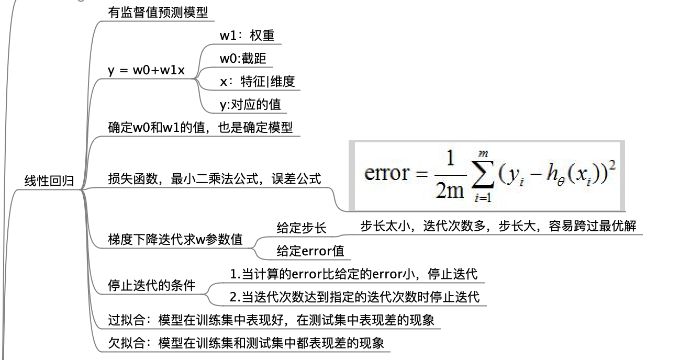
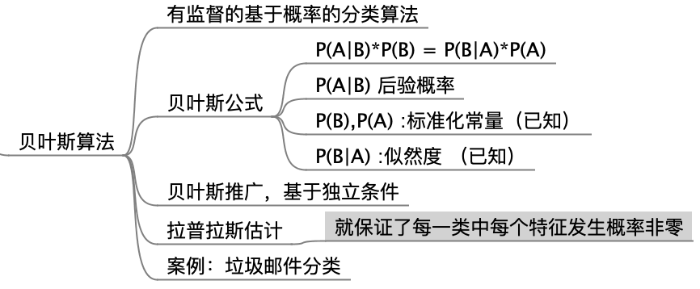
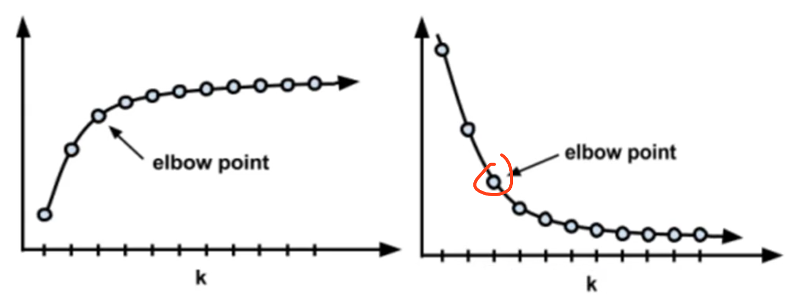

# 机器学习算法分类

## 1, 是否监督

### 1.1, 监督学习

01, 线性回归(linear regression)

* 做值预测

02, 多元线性回归(multi-linear regression)

* 做值预测

03, 逻辑回归(logistic regression)

* LBFGS

* 做分类

04, 贝叶斯算法(Bayes)

05, KNN算法(k-NearestNeighbor)


### 1.2, 无监督学习

01, KMeans算法

02, KMeans++算法


## 2, 回归还是分类

### 2.1, 值预测算法

01, 线性回归(linear regression)

02, 多元线性回归(multi-linear regression)


### 2.2, 分类算法

01, 贝叶斯算法(Bayes)

02, KNN算法(k-NearestNeighbor)

03, KMeans算法

04, KMeans++算法

05, 逻辑回归(logistic regression)

- 做分类


# 算法具体内容

## 01, 线性回归(linear regression)

* 有监督值预测模型

> 根据各个特征值和已有的结果值，通过梯度下降算法，找出符合误差要求的各个特征值的权重和截距。然后应用在未知特征值上，求出其对应的结果值。
>
> 简单来讲就是通过已知数据的x和y，然后求出y=w0 + w1X中，截距w0和权重w1的值，然后应用在未知的x中去。也就是先解方程，然后利用方程算新的值

```shell
# 过拟合：模型在训练集中表现好，在测试集中表现差的现象
# 欠拟合：模型在训练集和测试集中都表现差的现象
```





## 02, 多元线性回归(multi-linear regression)

* 有监督值预测模型

> 线性回归是求解单个x值的，多元线性回归就是求解多元一次函数
>
> y = w0+w1x1+w2x2+w3x3+....+wnxn


## 03, 贝叶斯算法(Bayes)

### 3.0, 基础知识

* 有监督分类模型

* 有监督的基于概率的分类算法
* 根据已知概率求未知概率

```shell
P(A|B) = P(B|A)*P(A) / P(B)

# 注意：A和B必须是两个独立的事件，其概率不能相互影响

# P(A|B) 后验概率又称为后验概率
# P(B),P(A) :标准化常量（已知）
# P(B|A) :似然度 （已知）
# 根据已知概率求未知概率
```


> 上面就是贝叶斯公式，B条件下A发生的概率P(A|B)，等于A条件下B发生的概率P(B|A)乘以A发生的概率P(A)，然后除以B发生的概率P(B)


在某些数据统计的时候，有可能统计出部分特征发生的概率为0。

所以这个时候需要根据拉普拉斯估计，把概率为0的统计设置成出现1次，保证了每一类中每个特征发生概率非零




### 3.1, 案例

案例：垃圾邮件分类

* 具体项目看代码


## 04, KNN算法(k-NearestNeighbor)

* 有监督分类模型

### 4.0, KNN算法步骤

```shell
# 该算法的具体步骤：
# 1.计算当前分类的样本到所有样本的距离
# 2.按照距离从小到大的排序，取出前K个
# 3.最近的K个邻居中，大多数属于哪一类，当前样本也属于哪一类
```


### 4.1, KNN算法三要素：

#### 01, K值的选择

* K不会大于20


#### 02, 距离的度量方式

```shell
# 欧式距离
也就是平方差距离

# 平方欧式距离
欧式距离的平方

# 曼哈顿距离
相比欧式距离简单的多，曼哈顿距离只要把两个点坐标的x坐标相减取绝对值，y坐标相减取绝对值，再加和 。三维，四维以此类推。

# 余弦距离
这个主要用于文字相似度的判断
也叫余弦相似度，是用向量空间中两个向量夹角的余弦值作为衡量两个个体间差异的大小的度量。如果两个向量的方向一致，即夹角接近零，那么这两个向量就越相近。要确定两个向量方向是否一致，要用到余弦定理计算向量的夹角。

# 谷本距离
谷本距离：同时考虑余弦距离和欧式距离的测度。
```


#### 03, 分类决策

少数服从多数

选取的前k个数据中，那个分类比较多，就分到哪个类上去


### 4.2, KNN算法潜在问题

```shell
# 当样本存在不均匀现象时，样本很容易分类到大容量样本中

# 解决：给距离加权，权重：距离平方的倒数, 也就是把距离乘以距离平方的倒数，这样就把近一点的数据推远，把远一点的数据拉近
```


### 4.3, KNN案例

* 具体项目看代码

相亲例子

图像识别


## 05, KMeans算法

- 无监督聚类算法
- 用于发现知识，发现数据共性

### 5.0, KMeans算法步骤

```shell
# 该算法的具体步骤：
# 1.随机找到K个中心点
# 2.计算所有点到当前K个中心点的距离，当前样本点归属于 距离中心点最近的哪个中心点的组
# 3.经过所有点计算之后，每个点都属于K个组的某一组，重新确定每个组的质心, 也就是这组聚类的中心点作为新的中心点
# 4.重复2~3步骤，直到质心不再变化或者达到一定的迭代次数 停止

# 质心：每个聚类的中心点
# 簇：每个聚类也叫一个簇
```


### 5.1, 如何选择k值

#### 01, 如果知道数据要被分为几类，k就选择几

#### 02, 不过不知道，使用肘部法选择K

* 每个类别的畸变程度是每个类别下每个样本到质心的位置距离的平方和
* 类内部成员越是紧凑，那么类别的畸变程度也就越低，类内部相似性越大。
* 当k值比较小时候， 类别畸变是很大的，然后慢慢增加k值，发现畸变会变小。当k值大小和类别符合时候，再增加k值的话，也就是再增加类别，畸变程度几乎变化就很小。这个时候k就是正确的类别数




## 06, KMeans++算法

*  KMeans算法优化，优化有中心点的初始位置
* 与KMeans一样，在开始初始化中心点时，选择下一个中心点时，离之前的中心点距离越远的点越有大概率被选中当做下一个中心点