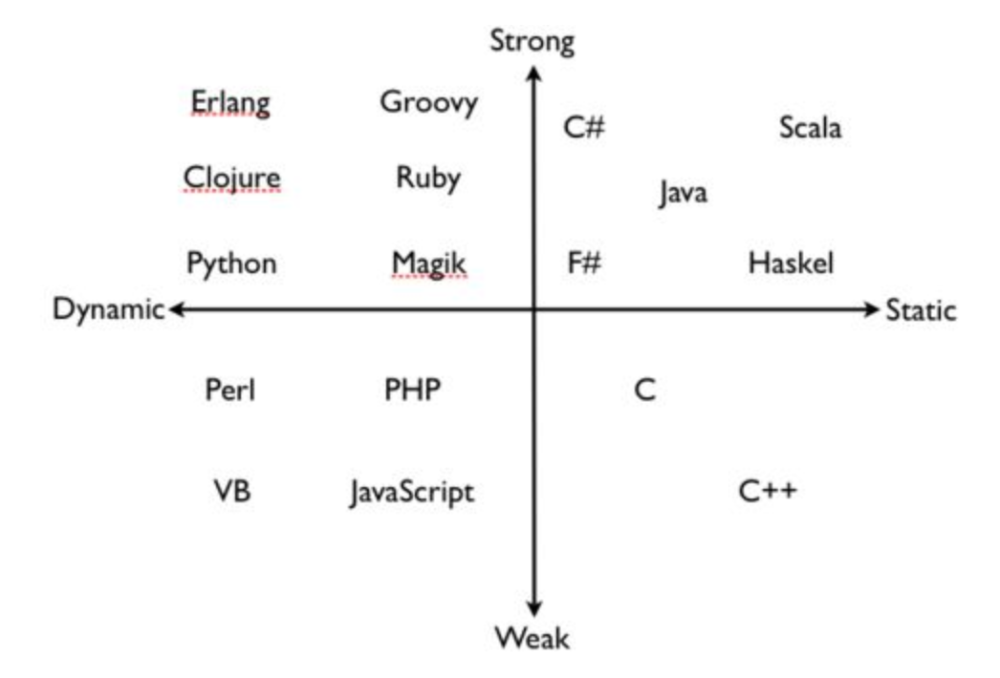

[TOC]

>  强、弱类型和动态、静态语言是编程语言的不同分类角度。
>
> 动态类型和静态类型简单的区别就是在运行时检查[动态]，还是编译期检查[静态]；
>
> 强类型与弱类型，就是不同类型进行变量赋值时，是否需要显示地（强制）进行类型转换，强类型语言需要显式类型转换，而弱类型语言不需要显式的类型转换。

> 常见的编程语言如下：比较熟知的语言中：
>
> 无类型： 汇编
> 弱类型、静态类型 ： C/C++
> 弱类型、动态类型检查： Perl/PHP
> 强类型、静态类型检查 ：Java/C#
> 强类型、动态类型检查 ：Python, Scheme
> 静态显式类型 ：Java/C
> 静态隐式类型 ：Ocaml, Haskell

