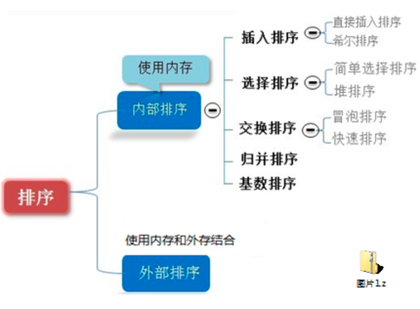
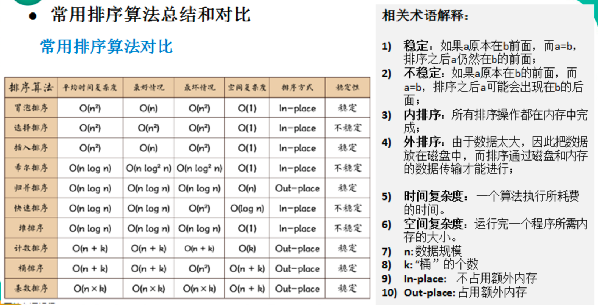
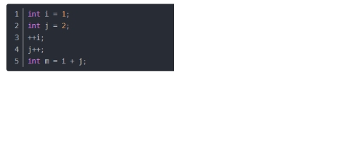
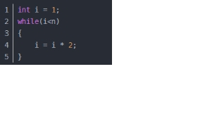
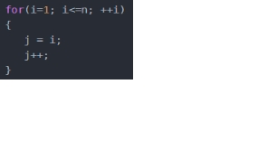
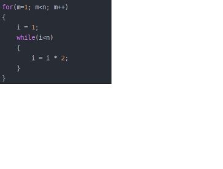
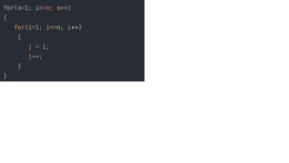
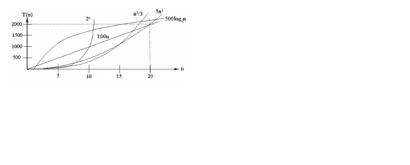

[toc]


## 2, 算法

### 2.1, 算法的基本概念


### 2.2, 八大排序算法基础

#### 2.2.1, 排序算法分类

> 内部排序和外部排序

* 内部排序：将所有的需要处理的数据都加载到内存中进行排序处理
* 外部排序：数据量大或者其他原因， 无法把数据全部加载到内存中， 需要借助外部存储进行排序






#### 2.2.2, 时间复杂度

```java
T(n)=n²+7n+6 与 T(n)=3n²+2n+2 : 时间复杂度都是：O(n²)。
  
用常数1代替运行时间中的所有加法常数  T(n)=n²+7n+6  => T(n)=n²+7n+1
修改后的运行次数函数中，只保留最高阶项  T(n)=n²+7n+1 => T(n) = n²
去除最高阶项的系数 T(n) = n² => T(n) = n² => O(n²)
```


1. 常数阶O(1)

   

2. 对数阶O(log2n)

   > 说明：在while循环里面，每次都将 i 乘以 2，乘完之后，i 距离 n 就越来越近了。假设循环x次之后，i 就大于 2 了，此时这个循环就退出了，也就是说 2 的 x 次方等于 n，那么 x = log2n也就是说当循环 log2n 次以后，这个代码就结束了。因此这个代码的时间复杂度为：O(log2n)  。 O(log2n) 的这个2 时间上是根据代码变化的，i = i * 3 ，则是 O(log3n) .

   

3. 线性阶O(n)

   > 说明：这段代码，for循环里面的代码会执行n遍，因此它消耗的时间是随着n的变化而变化的，因此这类代码都可以用O(n)来表示它的时间复杂度

   

   

   

4. 线性对数阶O(nlog2n)

   > 说明：线性对数阶O(nlogN) 其实非常容易理解，将时间复杂度为O(logn)的代码循环N遍的话，那么它的时间复杂度就是 n * O(logN)，也就是了O(nlogN)

   

5. 平方阶O(n^2)

   > 说明：平方阶O(n²) 就更容易理解了，如果把 O(n) 的代码再嵌套循环一遍，它的时间复杂度就是 O(n²)，这段代码其实就是嵌套了2层n循环，它的时间复杂度就是 O(n*n)，即  O(n²) 如果将其中一层循环的n改成m，那它的时间复杂度就变成了 O(m*n)

   

6. 立方阶O(n^3)

7. k次方阶O(n^k)

8. 指数阶O(2^n)



**说明：**
常见的算法时间复杂度由小到大依次为：Ο(1)＜Ο(log2n)＜Ο(n)＜Ο(nlog2n)＜Ο(n2)＜Ο(n3)＜ Ο(nk) ＜Ο(2n) ，随着问题规模n的不断增大，上述时间复杂度不断增大，算法的执行效率越低
从图中可见，我们应该尽可能避免使用指数阶的算法


#### 2.2.3, 平均时间复杂度和最坏时间复杂度

> 平均时间复杂度是指所有可能的输入实例均以等概率出现的情况下，该算法的运行时间。
> 最坏情况下的时间复杂度称最坏时间复杂度。一般讨论的时间复杂度均是最坏情况下的时间复杂度。 这样做的原因是：最坏情况下的时间复杂度是算法在任何输入实例上运行时间的界限，这就保证了算法的运行时间不会比最坏情况更长。
> 平均时间复杂度和最坏时间复杂度是否一致，和算法有关(如图:)。


### 2.3, 八大排序算法

#### 2.3.1.1, 冒泡算法

> 相邻的两个进行比较，如果前者比后者大，那么就把大的移动到后面。
>
> 第一轮把最大的移动到最后一位
>
> 第二位把次大的移动到倒数第二位
>
> 依次进行，直到有序(n个数最大进行n-1轮即可有序)

##### a06_01_Bubble_basic

```java
package im.bool.a06_sort_algrithm;

/**
 * #Author : ivanl001
 * #Date   : 2020/2/24 9:53 AM
 * #Desc   : 排序算法之冒泡推算过程：
 *          这个过程中有一个优化过程：如果经过一轮冒泡，顺序完全没有变动，那么后续就不需要进行了，因为这个时候顺序已经排好了
 **/
public class a06_01_Bubble_basic {
    public static void main(String[] args) {

        int[] nums = {3, 9, -1, -2, 10};

        int temp;

        System.out.println("第一次冒泡：");
        for (int i=0;i<nums.length-1;i++) {
            if (nums[i] > nums[i+1]) {
                temp = nums[i];
                nums[i] = nums[i + 1];
                nums[i+1] = temp;
            }
        }
        for (int i = 0; i < nums.length; i++) {
            System.out.print(nums[i] + ", ");
        }
        System.out.println();


        System.out.println("第二次冒泡：");
        for (int i=0;i<nums.length-1-1;i++) {
            if (nums[i] > nums[i+1]) {
                temp = nums[i];
                nums[i] = nums[i + 1];
                nums[i+1] = temp;
            }
        }
        for (int i = 0; i < nums.length; i++) {
            System.out.print(nums[i] + ", ");
        }
        System.out.println();


        System.out.println("第三次冒泡：");
        for (int i=0;i<nums.length-1-2;i++) {
            if (nums[i] > nums[i+1]) {
                temp = nums[i];
                nums[i] = nums[i + 1];
                nums[i+1] = temp;
            }
        }
        for (int i = 0; i < nums.length; i++) {
            System.out.print(nums[i] + ", ");
        }
        System.out.println();


        System.out.println("第四次冒泡");
        for (int i=0;i<nums.length-1-3;i++) {
            if (nums[i] > nums[i+1]) {
                temp = nums[i];
                nums[i] = nums[i + 1];
                nums[i+1] = temp;
            }
        }
        for (int i = 0; i < nums.length; i++) {
            System.out.print(nums[i] + ", ");
        }
        System.out.println();
    }
}
```

##### a06_02_Bubble

```java
package im.bool.a06_sort_algrithm;

import jdk.internal.org.objectweb.asm.tree.FrameNode;

import java.util.Arrays;

/**
 * #Author : ivanl001
 * #Date   : 2020/2/24 5:58 PM
 * #Desc   : 冒泡排序算法：两次循环实现
 **/
public class a06_02_Bubble {

    public static void main(String[] args) {

        /*int[] nums = {9, -2, -1, 3, 10, 100, -3, 3, 4, 20};
        bubbleSort(nums);
        for (int j = 0; j < nums.length; j++) {
            System.out.print(nums[j] + ", ");
        }
        System.out.println();*/


        int[] nums = new int[80000];
        for (int i = 0; i < 80000; i++) {
            nums[i] = (int) (Math.random() * 80000);
        }

//        System.out.println(Arrays.toString(nums));

        long startTime = System.currentTimeMillis();
        bubbleSort(nums);
        long endTime = System.currentTimeMillis();
        //9s左右
        System.out.println(endTime-startTime);
    }


    public static void  bubbleSort(int[] nums) {
        int temp;
        boolean isOrdered = false;

        //因为冒泡排序算法是两层循环，所以冒泡排序算法的时间复杂度是O(n^2)
        for (int i = 0; i < nums.length-1; i++) {
            isOrdered = true;
//            System.out.println("第" + (i+1) + "次冒泡：");
            //-------------------冒泡算法的精华代码--------------------
            for (int j = 0; j < nums.length - 1 - i; j++) {
                if (nums[j] > nums[j + 1]) {
                    temp = nums[j];
                    nums[j] = nums[j + 1];
                    nums[j + 1] = temp;
                    isOrdered = false;
                }
            }

            /*for (int j = 0; j < nums.length; j++) {
                System.out.print(nums[j] + ", ");
            }
            System.out.println();*/
            //这个地方是一个小优化。如果经过一轮，数据顺序完全没有变动
            if (isOrdered) {
                System.out.println("第" + (i+1) + "次循环");
                System.out.println("已经有序。。。");
                break;
            }
        }
    }
}
```


#### 2.3.1.2, 快速排序-冒泡算法的优化

>  快速排序思路
>
> 首先以中间一个数字为基准，把该数右侧大于该数的移至该数左侧，把该数左侧大于数的移至该数右侧。这样大于该数的数字都在右侧，小于该数的都在该数左侧。
>
> 接着再使用迭代算法， 依次对左侧的进行相同方法的移动。
>
> 接着再使用迭代算法， 依次对右侧的进行相同方法的移动。
>
> 当迭代结束，该数组数字即是有序

##### a06_09_Quick

```java
package im.bool.a06_sort_algrithm;

import java.util.Arrays;

/**
 * #Author : ivanl001
 * #Date   : 2020/2/27 7:22 PM
 * #Desc   : 快速排序法，这个是冒泡排序算法的优化。和冒泡算法属于同一排序算法
 *           快排的话， 在n值比较大的时候就比shell要好很多。
 *           如果都在8万数据的话， shell大概21ms，快排大概67ms
 *           如果是8000万数据， shell大概41s，快排只需要12s
 **/
public class a06_09_Quick {
    public static void main(String[] args) {
        /*int[] nums = {-9, 78, 0, 23, -567, 70};

        quickSort(nums, 0, nums.length - 1);
        System.out.println(Arrays.toString(nums));*/


        int[] nums = new int[80000];
        for (int i = 0; i < 80000; i++) {
            nums[i] = (int) (Math.random() * 80000);
        }

        long startTime = System.currentTimeMillis();
        quickSort(nums, 0, nums.length-1);
        long endTime = System.currentTimeMillis();
        //这里用了21ms左右， shell排序如果用前面的交换，大概5s, 插入排序1s左右， 冒泡大概9s，选择大概2s
        //所以移位法速度提升简直是非常非常大的
        System.out.println(endTime-startTime);
        //System.out.println(Arrays.toString(nums));

    }

    public static void quickSort(int[] arr, int left, int right) {
        int l = left;
        int r = right;

        int pivot = arr[(left + right) / 2];

        int temp = 0;

        while (l < r) {

            while (arr[l] < pivot) {
                l += 1;
            }
            while (arr[r] > pivot) {
                r -= 1;
            }

            if (l >= r) {
                break;
            }

            temp = arr[l];
            arr[l] = arr[r];
            arr[r] = temp;

            if (arr[l] == pivot) {
                r--;
            }
            if (arr[r] == pivot) {
                l++;
            }
        }

        if (l == r) {
            l += 1;
            r -= 1;
        }

        if (left < r) {
            quickSort(arr, left, r);
        }

        if (right > l) {
            quickSort(arr, l, right);
        }

    }
}
```


​	

#### 2.3.2, 选择排序

> 大体思路：
>
> 第一轮从数组中选取最小的数据，放在第一位。
>
> 第二轮从第一个之后的那些数中选择最小的，放在第二位
>
> 第三轮从第二个之后的那些数中选取最小的，放在第三位
>
> 直至放到倒数第二位为止。
>
> n个数字经过(n-1)轮后，即可保证有序

##### a06_03_Select_basic

```java
package im.bool.a06_sort_algrithm;

import java.util.Arrays;

/**
 * #Author : ivanl001
 * #Date   : 2020/2/24 7:57 PM
 * #Desc   : 选择排序基础: 这里是第一轮从第二个数开始，如果发现比第一个数小，先标记为最小，然后往后看，直到最后，那么把第一个数和标记的最小数互换
 *                      第二轮从第三个数开始，如果发现比第一个数小，先标记为最小，然后往后看，直到最后，那么把第二个数和标记的最小数互换
 *                      依次下去，直至最后一个数字
 **/
public class a06_03_Select_basic {
    public static void main(String[] args) {

        int[] nums = {3, 9, -1, -2, -10};

        int min = nums[0];
        int index = 0;

      	//第一轮
        min = nums[0];
        index = 0;
        for (int i = 0 + 1; i < nums.length; i++) {
            if (min > nums[i]) {
                min = nums[i];
                index = i;
            }
        }
        if (index > 0) {
            nums[index] = nums[0];
            nums[0] = min;
        }
        System.out.println(Arrays.toString(nums));


				//第二轮
        min = nums[1];
        index = 1;
        for (int i = 1 + 1; i < nums.length; i++) {
            if (min > nums[i]) {
                min = nums[i];
                index = i;
            }
        }
        if (index > 1) {
            nums[index] = nums[1];
            nums[1] = min;
        }
        System.out.println(Arrays.toString(nums));

				//第三轮
        min = nums[2];
        index = 2;
        for (int i = 2 + 1; i < nums.length; i++) {
            if (min > nums[i]) {
                min = nums[i];
                index = i;
            }
        }
        if (index > 2) {
            nums[index] = nums[2];
            nums[2] = min;
        }
        System.out.println(Arrays.toString(nums));

				//第四轮
        min = nums[3];
        index = 3;
        for (int i = 3 + 1; i < nums.length; i++) {
            if (min > nums[i]) {
                min = nums[i];
                index = i;
            }
        }
        if (index > 3) {
            nums[index] = nums[3];
            nums[3] = min;
        }
        System.out.println(Arrays.toString(nums));
    }
}
```


##### a06_04_Select

```java
package im.bool.a06_sort_algrithm;

import java.util.Arrays;

/**
 * #Author : ivanl001
 * #Date   : 2020/2/24 8:31 PM
 * #Desc   : TODO
 **/
public class a06_04_Select {
    public static void main(String[] args) {

        /*int[] nums = {3, 9, -1, -2, -10, 30, -5, 100, 30, 3, -4, 33};
        selectSort(nums);
        System.out.println(Arrays.toString(nums));*/

        int[] nums = new int[80000];
        for (int i = 0; i < 80000; i++) {
            nums[i] = (int) (Math.random() * 80000);
        }

        long startTime = System.currentTimeMillis();
        selectSort(nums);
        long endTime = System.currentTimeMillis();
        //2s左右， 比冒泡算法要快不少
        System.out.println(endTime-startTime);
        System.out.println(Arrays.toString(nums));
    }

    public static void selectSort(int[] nums) {

        int min;
        int index;

        //因为有两轮循环，所以选择排序的时间复杂度是时间复杂度是O(n^2)
        for (int i = 0; i < nums.length - 1; i++) {
//            System.out.println("iiii");
            min = nums[i];
            index = i;

            for (int j = i + 1; j < nums.length; j++) {
//                System.out.println("jjjj");
                if (min > nums[j]) {
                    min = nums[j];
                    index = j;
                }
            }

            if (index > i) {
                nums[index] = nums[i];
                nums[i] = min;
            }
        }
    }
}
```


#### 2.3.3.1, 插入排序

> 1，第一轮把第二个数和第一个比较， 如果比第一个小， 那么把第一个后移一位，然后把第二个数赋值到第一位上
> 2，第二轮把第三个数和第二个数比较，如果比第二个小，那么把第二个数后移一位，然后再和第一个数比较，如果还比第一个数小(否则把第三个数赋值到第二位上)，再把第一个数后移一位，把第三个数赋值到第一位上。
> 3，依次执行如上路基
> 4，n个数字经过(n-1)轮插入，即可保证有序
>
> 注意：插入是先在前面的数据中找到应该插入的位置，最后才会插入

##### a06_05_Insert_basic

```java
package im.bool.a06_sort_algrithm;

import java.util.Arrays;

/**
 * #Author : ivanl001
 * #Date   : 2020/2/25 9:24 AM
 * #Desc   : 插入排序算法的推导过程
 **/
public class a06_05_Insert_basic {
    public static void main(String[] args) {
        int[] nums = {3, 9, -1, -2, 10};

        //插入排序思路：
        /**
         * 1，第一轮把第二个数和第一个比较， 如果比第一个小， 那么把第一个后移一位，然后把第二个数赋值到第一位上
         * 2，第二轮把第三个数和第二个数比较，如果比第二个小，那么把第二个数后移一位，然后再和第一个数比较，如果还比第一个数小(否则把第三个数赋值到第二位上)，再把第一个数后移一位，把第三个数赋值到第一位上。
         * 3，依次执行如上路基
         * 4，n个数字经过(n-1)轮插入，即可保证有序
         */
        //即将被插入的数字
        int insertValue = nums[1];
        //这个是要找的待插入序号
        int indexToInsert = 1 - 1;
        while (indexToInsert >= 0 && insertValue < nums[indexToInsert]) {
            //如果有比待插入数据要大的， 那么就把该数据后移一位
            nums[indexToInsert + 1] = nums[indexToInsert];
            indexToInsert--;
        }
        nums[indexToInsert+1] = insertValue;
        System.out.println(indexToInsert);
        System.out.println("第一轮：" + Arrays.toString(nums));

        //即将被插入的数字
        insertValue = nums[2];
        //这个是要找的待插入序号
        indexToInsert = 2 - 1;
        while (indexToInsert >= 0 && insertValue < nums[indexToInsert]) {
            //如果有比待插入数据要大的， 那么就把该数据后移一位
            nums[indexToInsert + 1] = nums[indexToInsert];
            //因为这里先减，后循环，所以后面出了循环需要再加1加回来
            indexToInsert--;
        }
        nums[indexToInsert+1] = insertValue;
        System.out.println(indexToInsert);
        System.out.println("第二轮：" + Arrays.toString(nums));

        //即将被插入的数字
        insertValue = nums[3];
        //这个是要找的待插入序号
        indexToInsert = 3 - 1;
        while (indexToInsert >= 0 && insertValue < nums[indexToInsert]) {
            //如果有比待插入数据要大的， 那么就把该数据后移一位
            nums[indexToInsert + 1] = nums[indexToInsert];
            //因为这里先减，后循环，所以后面出了循环需要再加1加回来
            indexToInsert--;
        }
        nums[indexToInsert+1] = insertValue;
        System.out.println(indexToInsert);
        System.out.println("第三轮：" + Arrays.toString(nums));

        //即将被插入的数字
        insertValue = nums[4];
        //这个是要找的待插入序号
        indexToInsert = 4 - 1;
        while (indexToInsert >= 0 && insertValue < nums[indexToInsert]) {
            //如果有比待插入数据要大的， 那么就把该数据后移一位
            nums[indexToInsert + 1] = nums[indexToInsert];
            //因为这里先减，后循环，所以后面出了循环需要再加1加回来
            indexToInsert--;
        }
        nums[indexToInsert+1] = insertValue;
        System.out.println(indexToInsert);
        System.out.println("第四轮：" + Arrays.toString(nums));
    }
}
```


##### a06_06_Insert

```java
package im.bool.a06_sort_algrithm;

import java.util.Arrays;

/**
 * #Author : ivanl001
 * #Date   : 2020/2/25 10:11 AM
 * #Desc   : 插入排序法
 **/
public class a06_06_Insert {

    public static void main(String[] args) {
        /*int[] nums = {3, 9, -1, -2, 10, -3, 0};

        insert(nums);
        System.out.println(Arrays.toString(nums));*/

        int[] nums = new int[80000];
        for (int i = 0; i < 80000; i++) {
            nums[i] = (int) (Math.random() * 80000);
        }

        long startTime = System.currentTimeMillis();
        insert(nums);
        long endTime = System.currentTimeMillis();
        //1s左右， 冒泡大概9s，选择大概2s，还是插入排序算法速度最快。
        System.out.println(endTime-startTime);
        //System.out.println(Arrays.toString(nums));
    }

    public static void insert(int[] nums) {
        for (int i=1; i<nums.length; i++) {
            //即将被插入的数字
            int insertValue = nums[i];
            //这个是要找的待插入序号
            int indexToInsert = i - 1;
            while (indexToInsert >= 0 && insertValue < nums[indexToInsert]) {
                //如果有比待插入数据要大的， 那么就把该数据后移一位
                nums[indexToInsert + 1] = nums[indexToInsert];
                indexToInsert--;
            }
            //这个地方可以做个判断，如果相同，那本来就是在正确的位置
            if (indexToInsert + 1 != i) {
                nums[indexToInsert+1] = insertValue;
            }
            /*System.out.println(indexToInsert);
            System.out.println("第" + i + "轮：" + Arrays.toString(nums));*/
        }
    }
}
```


#### 2.3.3.2, shell(希尔)排序-插入排序的优化

> shell排序是插入排序的优化，以减少数据插入之前为了找到插入位置而可能后移次数过多的问题
>
> shell排序的时候有两种方式：
>
> 1，交换法。直接进行交换， 速度慢
>
> 2，移动法，先移动，而不是直接交换。速度快,超级快！80万只需要20ms左右。
>
> 


> 这个时间复杂度是n*logn,相对n的平方还是要小的

##### a06_08_Shell_01_exchange

```java
package im.bool.a06_sort_algrithm;

import java.util.Arrays;

/**
 * #Author : ivanl001
 * #Date   : 2020/2/25 11:55 AM
 * #Desc   : 希尔排序-插入排序的优化算法: 直接交换，其实不是很好，效率有限
 *           希尔排序的时间复杂度是nlogn,比n^2要好一些
 **/
public class a06_08_Shell_01_exchange {

    public static void main(String[] args) {

        int[] nums = {8, 9, 1, 7, 2, 3, 5, 4, 6, 0};
        shellSort(nums);

        /*int[] nums = new int[80000];
        for (int i = 0; i < 80000; i++) {
            nums[i] = (int) (Math.random() * 80000);
        }

        long startTime = System.currentTimeMillis();
        shellSort(nums);
        long endTime = System.currentTimeMillis();
        //这里用了5s左右， 插入排序1s左右， 冒泡大概9s，选择大概2s，还是插入排序算法速度最快。
        //这里本来是插入排序的优化，之所以比插入还要慢， 是因为这里直接更换，而插入是先移动，最后才替换。所以我们这里后续需要再优化一下，
        //把交换改成先移动，最后再更换
        System.out.println(endTime-startTime);*/
        System.out.println(Arrays.toString(nums));

    }


    public static void shellSort(int[] nums) {
        //插入排序的过程中，因为需要数据后移，在最差的情况下，每次数据都需要后移, 这种效率是不高的
        //所以就有了希尔排序
        int temp = 0;

        int m=0;
        for (int gap = nums.length / 2; gap > 0; gap /= 2) {
            //第一轮排序，将10个数据分成了5组
            for (int i = gap; i < nums.length; i++) {
                for (int j = i - gap; j >= 0; j -= gap) {
                    if (nums[j] > nums[j + gap]) {
                        temp = nums[j];
                        nums[j] = nums[j + gap];
                        nums[j + gap] = temp;
                    }
                }
            }
            //System.out.println("第 " + (m++) + " 轮：" + Arrays.toString(nums));
        }
    }
}
```


##### a06_08_Shell_02_move

```java
package im.bool.a06_sort_algrithm;

import sun.plugin2.ipc.windows.WindowsIPCFactory;

import java.util.Arrays;

/**
 * #Author : ivanl001
 * #Date   : 2020/2/25 11:55 AM
 * #Desc   : 希尔排序-插入排序的优化算法: 采用希尔排序移动法
 **/
public class a06_08_Shell_02_move {

    public static void main(String[] args) {

        /*int[] nums = {12, -10, 100, 8, 9, 1, 7, 2, 3, 5, 4, 6, 0};
        shellSort01(nums);
        System.out.println(Arrays.toString(nums));*/


        int[] nums = new int[80000];
        for (int i = 0; i < 80000; i++) {
            nums[i] = (int) (Math.random() * 80000);
        }

        long startTime = System.currentTimeMillis();
        shellSort01(nums);
        long endTime = System.currentTimeMillis();
        //这里用了21ms左右， shell排序如果用前面的交换，大概5s, 插入排序1s左右， 冒泡大概9s，选择大概2s
        //所以移位法速度提升简直是非常非常大的
        System.out.println(endTime-startTime);
        //System.out.println(Arrays.toString(nums));
    }


    public static void shellSort01(int[] nums) {
        //插入排序的过程中，因为需要数据后移，在最差的情况下，每次数据都需要后移, 这种效率是不高的
        //所以就有了希尔排序
        //int temp = 0;

        int m = 0;
        for (int gap = nums.length / 2; gap > 0; gap /= 2) {

            //第一轮排序，将10个数据分成了5组
            for (int i = gap; i < nums.length; i++) {

                int j = i;
                int temp = nums[j];

                //教程中这里多判断了一个条件， 个人感觉不是很必要，所以直接舍弃了
                //下面的移动过程可以参考插入算法
                while ((j - gap >= 0) && temp < nums[j - gap]) {
                    //先把小的移动到后面
                    nums[j] = nums[j - gap];
                    j -= gap;
                }
                nums[j] = temp;

            }
            //System.out.println("第 " + (m++) + " 轮：" + Arrays.toString(nums));
        }
    }
}
```


#### 2.3.4, 归并排序


##### a06_10_Merge

```java
package im.bool.a06_sort_algrithm;

import java.util.Arrays;

/**
 * #Author : ivanl001
 * #Date   : 2020/2/27 8:04 PM
 * #Desc   : 归并排序算法，这个是分治算法其中一种
 **/
public class a06_10_Merge {
    public static void main(String[] args) {
        /*int[] nums = {8, 4, 5, 7, 1, 3, 6, 2};

        int[] temp = new int[nums.length];
        mergeSort(nums, 0, nums.length - 1, temp);

        System.out.println(Arrays.toString(nums));*/

        int[] nums = new int[800000000];
        for (int i = 0; i < 800000000; i++) {
            nums[i] = (int) (Math.random() * 800000000);
        }

        long startTime = System.currentTimeMillis();
        int[] temp = new int[nums.length];
        mergeSort(nums, 0, nums.length-1, temp);
        long endTime = System.currentTimeMillis();
        //如果是8000万数据， shell大概41s，快排只需要12s
        //而merge的话大概也是12s，
        //8000万数据：
        //如果是8亿数据, 内存充足的情况下：merge: 148845 快排：136977  shell：
        //但有一点需要注意的是：merge是占用双倍内存的，如果有8亿数据，那么快排大概使用3G内存，而merge需要6G内存

        System.out.println(endTime-startTime);
        //System.out.println(Arrays.toString(nums));

    }


    public static void mergeSort(int[] nums, int left, int right, int[] temp) {
        if (left < right) {
            int mid = (left + right) / 2;
            //首先像左边递归分解
            mergeSort(nums, left, mid, temp);
            //然后向右递归分解
            mergeSort(nums, mid+1, right, temp);

            //
            merge(nums, left, mid, right, temp);
        }
    }


    /**
     *
     * @param nums 排序的数组
     * @param left 左边有序序列的初始索引
     * @param right 最右边的索引
     * @param mid  中间索引
     * @param temp 中转的一个数组
     */
    public static void merge(int[] nums, int left, int mid, int right, int[] temp) {

//        System.out.println("--------");
        int i = left;//i是会变的， left是不变的哈
        int j = mid + 1;
        int t = 0;//这个是temp当前索引

        //1，先把左右两边数据按照有序规则填充到temp数组中
        //直到左右两边有一边处理完毕
        while (i <= mid && j <= right) {
            //如果左边的数据比较大，那么把左边的数据添加到临时数据，其实这就是一个排序的过程
            if (nums[i] <= nums[j]) {
                temp[t] = nums[i];
                t += 1;
                i += 1;
            } else {
                temp[t] = nums[j];
                t += 1;
                j += 1;
            }
        }

        //2，把有剩余的一遍的数据依次全部填充到temp中取
        //说明左边的数据还有剩余，右边的已经全部赋值到了temp中相应的位置
        while (i <= mid) {
            temp[t] = nums[i];
            t += 1;
            i += 1;
        }
        //说明右边的数据还有剩余，而左边的已经全部赋值到了temp中相应的位置
        while (j <= right) {
            temp[t] = nums[j];
            t += 1;
            j += 1;
        }

        //3，将temp数组的元素拷贝到nums里面去
        //注意：并不是每次都拷贝所有的数据，
        t = 0;
        int tempLeft = left;
        while (tempLeft <= right) {
            nums[tempLeft] = temp[t];
            t += 1;
            tempLeft += 1;
        }
    }
}
```


#### 2.3.5, 基数排序

> 基数排序思想：
>
> 第一轮：根据个位数字放进0-9不同的桶中
>
> 第二轮： 在第一轮的顺序下，根据十位数放进0-9不同的桶中
>
> 第三轮：在第二轮的顺序下，根据百位数放进不同的桶中
>
> ...
>
> 直到最后一轮根据最大一位上的数字进行完毕， 则序列即可保证有序


##### a06_11_RadixSort_basic

```java
package im.bool.a06_sort_algrithm;

import java.util.Arrays;

/**
 * #Author : ivanl001
 * #Date   : 2020/2/29 9:48 AM
 * #Desc   : 基数排序：0-9个不同的桶，然后分别按照个位，十位，百位数，。。。等等你放进不同的桶中，具体看代码
 *           基数排序需要10倍额外空间，所以是空间换时间的经典案例
 **/
public class a06_11_RadixSort_basic {

    public static void main(String[] args) {
        int[] nums = {53, 3, 542, 748, 14, 214};
        radixSort(nums);

    }

    public static void radixSort(int[] nums) {

        int[][] bucket = new int[10][nums.length];
        int[] positions = new int[10];

        //第一轮， 根据每个元素的个位元素进行排序
        for (int i = 0; i < nums.length; i++) {
            //取出个位数字,然后放入对应的桶中。个位数是0，就放入到第0个桶中，个位数是5，就放入到第5个桶中
            int digitOfElement = nums[i] /1 %10;

            bucket[digitOfElement][positions[digitOfElement]] = nums[i];
            //位置数据需要进行更新。
            positions[digitOfElement]++;
        }
        //然后从桶中，依次每个桶取出数据放回到原数组中
        int index = 0;
        for (int i = 0; i < positions.length; i++) {
            if (positions[i] != 0) {
                //说明位置被加过，那么这个桶中必然是有元素的，不是空的
                for (int j = 0; j < positions[i]; j++) {
                    nums[index] = bucket[i][j];
                    index++;
                }
            }
        }
        //然后需要把位置列表全部清空
        positions = new int[10];
        System.out.println(Arrays.toString(nums));


        //第二轮， 根据每个元素的十位元素进行排序
        for (int i = 0; i < nums.length; i++) {
            //取出十位数字,然后放入对应的桶中。十位数是0，就放入到第0个桶中，个位数是5，就放入到第5个桶中
            int digitOfElement = nums[i] /10 %10;

            bucket[digitOfElement][positions[digitOfElement]] = nums[i];
            //位置数据需要进行更新。
            positions[digitOfElement]++;
        }
        //然后从桶中，依次每个桶取出数据放回到原数组中
        index = 0;
        for (int i = 0; i < positions.length; i++) {
            if (positions[i] != 0) {
                //说明位置被加过，那么这个桶中必然是有元素的，不是空的
                for (int j = 0; j < positions[i]; j++) {
                    nums[index] = bucket[i][j];
                    index++;
                }
            }
        }
        //然后需要把位置列表全部清空
        positions = new int[10];
        System.out.println(Arrays.toString(nums));


        //第二轮， 根据每个元素的十位元素进行排序
        for (int i = 0; i < nums.length; i++) {
            //取出十位数字,然后放入对应的桶中。十位数是0，就放入到第0个桶中，个位数是5，就放入到第5个桶中
            int digitOfElement = nums[i] /100 %10;

            bucket[digitOfElement][positions[digitOfElement]] = nums[i];
            //位置数据需要进行更新。
            positions[digitOfElement]++;
        }
        //然后从桶中，依次每个桶取出数据放回到原数组中
        index = 0;
        for (int i = 0; i < positions.length; i++) {
            if (positions[i] != 0) {
                //说明位置被加过，那么这个桶中必然是有元素的，不是空的
                for (int j = 0; j < positions[i]; j++) {
                    nums[index] = bucket[i][j];
                    index++;
                }
            }
        }
        //然后需要把位置列表全部清空
        positions = new int[10];
        System.out.println(Arrays.toString(nums));
    }
}
```


##### a06_12_RadixSort

```java
package im.bool.a06_sort_algrithm;

import java.util.Arrays;

/**
 * #Author : ivanl001
 * #Date   : 2020/2/29 9:48 AM
 * #Desc   : 基数排序：0-9个不同的桶，然后分别按照个位，十位，百位数，。。。等等你放进不同的桶中，具体看代码
 *           基数排序需要10倍额外空间，所以是空间换时间的经典案例
 *           如果是800万个数字，那么需要空间大概是：
 **/
public class a06_12_RadixSort {

    public static void main(String[] args) {
        /*int[] nums = {53, 3, 542, 748, 14, 214};
        radixSort(nums);*/

        int[] nums = new int[8000000];
        for (int i = 0; i < 8000000; i++) {
            nums[i] = (int) (Math.random() * 8000000);
        }

        long startTime = System.currentTimeMillis();
        int[] temp = new int[nums.length];
        radixSort(nums);
        long endTime = System.currentTimeMillis();
        //如果是8000万数据， shell大概41s，快排只需要12s
        //而merge的话大概也是12s，
        //8000万数据：
        //如果是8亿数据, 内存充足的情况下：merge: 148845 快排：136977  shell：
        //但有一点需要注意的是：merge是占用双倍内存的，如果有8亿数据，那么快排大概使用3G内存，而merge需要6G内存

        System.out.println(endTime-startTime);
        //System.out.println(Arrays.toString(nums));
    }

    public static void radixSort(int[] nums) {
        //求出最大数，转成字符串，根据其length即可知道最大为几位数
        int max = nums[0];
        for (int i = 0; i < nums.length; i++) {
            if (nums[i] > max) {
                max = nums[i];
            }
        }
        int theLength = (max + "").length();

        int[][] bucket = new int[10][nums.length];
        int[] positions = new int[10];


        //这里比较牛，n*10直接计算出来了
        for (int k = 0, n = 1; k < theLength; k++, n *= 10) {

            //第一轮， 根据每个元素的个位元素进行排序
            for (int i = 0; i < nums.length; i++) {
                //取出个位数字,然后放入对应的桶中。个位数是0，就放入到第0个桶中，个位数是5，就放入到第5个桶中
                int digitOfElement = nums[i] /n %10;

                bucket[digitOfElement][positions[digitOfElement]] = nums[i];
                //位置数据需要进行更新。
                positions[digitOfElement]++;
            }
            //然后从桶中，依次每个桶取出数据放回到原数组中
            int index = 0;
            for (int i = 0; i < positions.length; i++) {
                if (positions[i] != 0) {
                    //说明位置被加过，那么这个桶中必然是有元素的，不是空的
                    for (int j = 0; j < positions[i]; j++) {
                        nums[index] = bucket[i][j];
                        index++;
                    }
                }
            }
            //然后需要把位置列表全部清空
            positions = new int[10];
//            System.out.println(Arrays.toString(nums));
        }
    }
}
```


### 2.4, 查找算法

#### 2.4.1, 正常的顺序查找

##### a07_01_NormalSearch

```java
package im.bool.a07_search_algrithm;

/**
 * #Author : ivanl001
 * #Date   : 2020/2/29 6:06 PM
 * #Desc   : 正常的顺序查找
 **/
public class a07_01_NormalSearch {

    public static void main(String[] args) {
        int[] nums = {1, 9, 11, -1, 35, 89};

        int i = normalSearch(nums, -1);
        System.out.println(i);
    }

    public static int normalSearch(int[] nums, int value) {
        for (int i = 0; i < nums.length; i++) {
            if (nums[i] == value) {
                return i;
            }
        }
        return -1;
    }
}
```


#### 2.4.2, 二分查找算法

##### a07_02_BinarySearch

```java
package im.bool.a07_search_algrithm;

import java.util.ArrayList;
import java.util.List;

/**
 * #Author : ivanl001
 * #Date   : 2020/3/1 6:31 PM
 * #Desc   : 二分查找算法
 **/
public class a07_02_BinarySearch {

    public static void main(String[] args) {
        int[] nums = {1, 8, 10, 89, 89, 89, 89, 89, 89, 1000, 1234};

//        int i = binarySearch(nums, 0, nums.length - 1, 89);
//        System.out.println(i);

        List<Integer> integers = binarySearch01(nums, 0, nums.length - 1, 89);
        System.out.println(integers);
    }

    //如果有多个findValue在数组中，本方法就只能找出一个
    public static List<Integer> binarySearch01(int[] nums, int left, int right, int findValue) {

        //这里可以优化一下，如果小于最小数或者大于最大数，或者left > right，即可提前终止
        if (findValue > nums[nums.length - 1] || findValue < nums[0] || left > right) {
            return null;
        }

        int midIndex = (left+right)/2;
        int midValue = nums[midIndex];

        if (left > right) {
            return null;
        }

        if (midValue > findValue) {
            return binarySearch01(nums, left, midIndex-1, findValue);
        } else if (midValue < findValue) {
            return binarySearch01(nums, midIndex+1, right, findValue);
        } else{
            //如果既不大于，也不小于，那么就是等于了
            List<Integer> result = new ArrayList<Integer>();

            //然后再往左边找
            for (int i = midIndex-1; i >= left; i--) {
                if (nums[i] == findValue) {
                    result.add(i);
                } else {
                    break;
                }
            }

            //先往右边找
            for (int i = midIndex; i <= right; i++) {
                if (nums[i] == findValue) {
                    result.add(i);
                } else {
                    break;
                }
            }


            return result;
        }
    }

    //如果有多个findValue在数组中，本方法就只能找出一个
    public static int binarySearch(int[] nums, int left, int right, int findValue) {

        //这里可以优化一下，如果小于最小数或者大于最大数，或者left > right，即可提前终止
        if (findValue > nums[nums.length - 1] || findValue < nums[0] || left > right) {
            return -1;
        }

        int midIndex = (left+right)/2;
        int midValue = nums[midIndex];

        if (left > right) {
            return -1;
        }

        if (midValue > findValue) {
            return binarySearch(nums, left, midIndex-1, findValue);
        } else if (midValue < findValue) {
            return binarySearch(nums, midIndex+1, right, findValue);
        } else{
            //如果既不大于，也不小于，那么就是等于了
            return midIndex;
        }
    }
}
```


#### 2.4.3,  插值查找算法

##### a07_03_InterpolationSearch

```java
package im.bool.a07_search_algrithm;

import java.util.ArrayList;
import java.util.List;

/**
 * #Author : ivanl001
 * #Date   : 2020/3/1 7:05 PM
 * #Desc   : 插值查找算法：二分查找算法有一个问题：如果一个八万的数组，查找的数据是第一个，那么需要从中间开始计算查找。这样就会有很多无用的查找。
 **/
public class a07_03_InterpolationSearch {
    public static void main(String[] args) {

        int[] nums = {1, 2, 3, 4, 5, 6, 7, 8, 9, 10, 11, 12, 13, 14, 15};

        List<Integer> integers = interpolationSearch(nums, 0, nums.length - 1, 15);
        System.out.println(integers);

    }

    public static List<Integer> interpolationSearch(int[] nums, int left, int right, int findValue){

        System.out.println("ivanl0001");

        //这里可以优化一下，如果小于最小数或者大于最大数，或者left > right，即可提前终止
        //注意：插入排序一定要有findValue < nums[0]，findValue > nums[nums.length - 1], 要不然查询的数巨大，那么midIndex直接就过了
        if (findValue > nums[nums.length - 1] || findValue < nums[0] || left > right) {
            return null;
        }

        //插入算法和二分查找算法最根本的区别就是中间值的计算
        //int midIndex = (left+right)/2;
        int midIndex = left + (right-left)*(findValue-nums[left])/(nums[right]-nums[left]);

        int midValue = nums[midIndex];
        if (left > right) {
            return null;
        }

        if (midValue > findValue) {
            return interpolationSearch(nums, left, midIndex-1, findValue);
        } else if (midValue < findValue) {
            return interpolationSearch(nums, midIndex+1, right, findValue);
        } else {
            //如果既不大于，也不小于，那么就是等于了
            List<Integer> result = new ArrayList<>();

            //然后再往左边找
            for (int i = midIndex - 1; i >= left; i--) {
                if (nums[i] == findValue) {
                    result.add(i);
                } else {
                    break;
                }
            }

            //先往右边找
            for (int i = midIndex; i <= right; i++) {
                if (nums[i] == findValue) {
                    result.add(i);
                } else {
                    break;
                }
            }
            return result;
        }
    }
}
```


