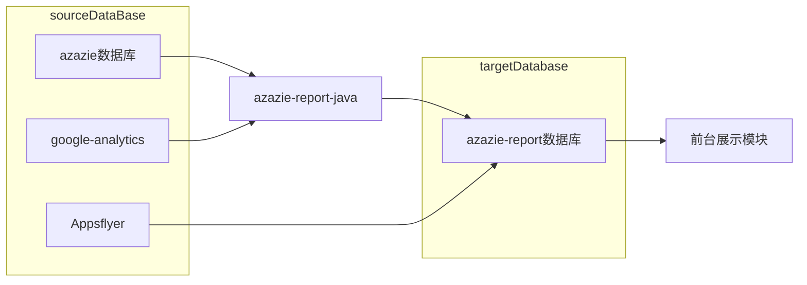

[toc]

## 1, 目前报表系统大致流程图



### 1.1, sourceDataBase板块介绍:

#### 01, azazie数据库：

* 该数据库也就是我们的业务数据库

#### 02, google analytics

* 也就是我们所谓的GA，GA中存储了几乎所有的流量数据(移动端部分流量除外)

* GA本地获取需要设置代理访问

* java设置方法大致如下:

* 如果有需要，具体的代理地址和端口可以找运维同事开

  ```java
  if ("dev".equals(profile)) {
      //说明是开发环境，本地调试，需要添加全局代理
      //注意：如果不设置全局代理，可能无法访问国外网络
      System.setProperty("socksProxyHost", "192.168.***.***");
      System.setProperty("socksProxyPort", "****");
  }
  ```

#### 03, Appsflyer

* 移动端部分流量数据存在Appsflyer中进行分析

* 该处没有api接口
* 老php中使用页面地址先登陆，然后拿到登录信息从而访问api访问，我们系统中也使用这种方式


### 1.2, azazie-report-java模块介绍

*  该项目是父子项目: report项目和azazie-opitimizer(tinker-java)项目
* report项目是我们的报表系统
* 该系统使用定时任务进行手动管理报表


### 1.3, 前台展示模块

* 展示功能模块框架基于laravel6.0开发
* RBAC模块(用户权限控制系统)使用laravel-admin扩展包实现


## 2, 目前报表系统分析

### 2.1, 目前该系统优点：

```shell
01, 结构简单

02, 适合少量报表

03，报表少的时候出表快

04，逻辑代码自己写，可以做任何处理

05，花费少
```


### 2.2, 目前该系统缺点:

```shell
01, 数据源多，使用极不规范，appsflyer没有数据接口，数据源杂乱而且无法优化

02，无法进行数据清洗

03，不适用可持续报表开发

04，数据无可用性，而且除数据库外，其他两个数据源均不可自定义聚合

05，无法解决部分数据库查询时间长的问题

06，没有移植性，不能移植到大数据系统

07，无界面，不利于后台报表系统的维护

08, 没有清晰的数据结构，数据和代码均不利于重用，基本每出一个报表有可能就需要重写一套代码
```


### 2.3, 总结

```shell
可满足目前需求

但是后续报表多可能就比较麻烦

后续需要其他实时数据或者及时数据时候不能满足需求
```


## 3, 推荐方案：BI系统

> 报表系统一般是公司BI( Business Intelligence)部门通过大数据系统制作，BI系统可以简单理解成大数据生态系统。

* 我们目前系统只是为了快速的解决目前的痛点问题给出的一个临时方案


### 3.1, 推荐方案流程图如下：

```mermaid
graph LR

  subgraph 数据源
    azazie数据库
    埋点流量日志
    系统日志
  end

  subgraph 大数据仓库系统
  	hive数据仓库
  	数据清洗
  end
  
  subgraph 离线系统
  	数据分层分析
  end
  
 subgraph 实时系统
  	实时系统
  end
  
    
 subgraph 报表数据库
  	结果数据库
 end
  
  azazie数据库 --> hive数据仓库
  埋点流量日志 --> hive数据仓库
  系统日志 --> hive数据仓库

  
  hive数据仓库 --> 数据清洗
  数据清洗 --> 数据分层分析
  数据分层分析 --> 结果数据库
  
  结果数据库 --> 前台展示模块
  

    
 subgraph 数据挖掘系统
  	数据挖掘
  	推荐模块
  end


  
  数据清洗 --> 数据挖掘
  数据挖掘 --> 推荐模块
  推荐模块 --> 业务后台
  
  数据清洗 --> 实时系统
  实时系统 --> 结果数据库
  
```

### 3.2, 推荐方案介绍：

* BI系统包括数据搜集，数据清洗，数据分析，数据挖掘以及数据结果。

* 通过搭建数据仓库，搜集数据之后构建唯一的数据源，在仓库中进行数据的清洗，清洗完成之后进行数据的分层处理，从而提高数据的可用性和及时性。

* BI系统中有成熟的页面系统，从而可以进行多则数千张报表管理和维护。

* 推荐系统，数据挖掘也只能从大数据系统开始。


