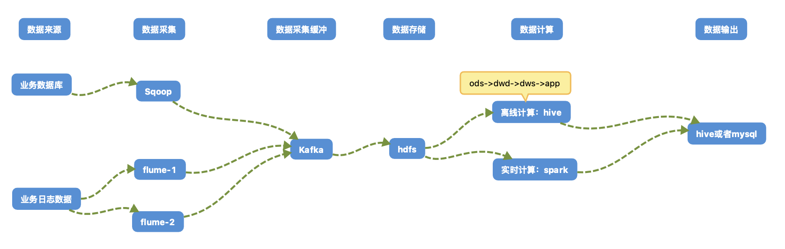

[toc]


> 着重看
>
> 5, 集群服务器选型
>
> 7, 集群服务分配规划
>
> 和最后面的查阅的资料 三部分


* 整体系统简单数仓流程图如下：


## 1, 项目需求分析

* 略过


## 2, 技术选型

### 2.1, 推荐方案：

| 模块         | 使用技术                                  |
| ------------ | ----------------------------------------- |
| 数据采集传输 | sqoop, canal , Flume，Kafka     (datax)   |
| 数据存储     | Mysql(数据库元数据)，HDFS(分布式计算存储) |
| 数据计算     | Hive，Spark(flink)                        |
| 数据输出     | Hive，mysql                               |
| 数据查询     | Presto                                    |


## 3, 系统架构图

> 注：这个一个初步的设计方案
>
> ​		具体方案实施需要和后端人员进行详细交互最后协商确定最终的解决方案
>
> ​		备用方案的流程图和推荐方案等价，替换对应模块的技术即可





## 4, 集群框架及版本选型

### 4.1, 框架选型

#### 4.1.2, CDH：(推荐度：五星)

* 优点
  * 占有国内大部分市场份额(预估60%-80%左右)
  * 免费使用
  * 不需要专业运维人员，组间兼容性不需要专业维护
* 缺点
  * 代码不开源
  * 不过对中小型的大数据需求并无任何影响


### 4.2, 具体版本型号

> 使用CDH的话，可以选择CDH2.6.2， CDH2.12.1， 这两个版本我均使用过，非常稳定，具体组件的版本均可默认，spark版本建议单独升级到2.1.0或者至少2.0以上版本

略过


## 5, 集群服务器选型

★★★★★

> 使用云主机

### 5.1, 机器成本考虑

* 物理机：
  * 以128G内存，20core-CPU，40线程，8THDD和2TSSD硬盘，戴尔品牌单台报价4W出头，还需要考虑托管服务器费用，一般物理机使用寿命5年以上
* 云主机：以阿里云为例，差不多相同配置，每年5W


## amazon服务器配置和价格

| 编号 | **实例**                       | **vCPU** | **内存 (GiB)** |
| ---- | ------------------------------ | -------- | -------------- |
| x1   | m5.xlarge                      | 4        | 16             |
| x2   | m5.2xlarge(阿里大数据最低配置) | 8        | 32             |
| x3   | m5.4xlarge                     | 16       | 64             |
|      | c5.xlarge                      | 4        | 8              |
|      |                                |          |                |
| y1   | r5.xlarge                      | 4        | 32             |
| y2   | r5.2xlarge(最低配置内存增强型) | 8        | 64             |


## 大数据初步定案

|             |                       | **vCPU** | **内存 (GiB)** |
| ----------- | --------------------- | -------- | -------------- |
| 方案1(推荐) | y2机器两台，x2机器5台 | 56       | 288            |
| 方案2       | y2机器两台，y1机器5台 | 36       | 288            |
| 方案3       | x2机器7台             | 56       | 224            |


机器压缩至5台是否可行？

测试服务器怎么搞？是否可以公司电脑搭建？


## 6, 集群规模预估设计

### 6.1, 确定集群规模

* 略


## 7, 集群服务分配规划

★★★★★

| 服务名称                  | 子服务           | m01  | m02  | s01  | s02  | s03  | s04  | s05  |
| ------------------------- | ---------------- | ---- | ---- | ---- | ---- | ---- | ---- | ---- |
| HDFS                      | NameNode         | √    | √    |      |      |      |      |      |
|                           | DataNode         |      |      | √    | √    | √    | √    | √    |
| Yarn                      | Resourcemanager  | √    | √    |      |      |      |      |      |
|                           | NodeManager      |      |      | √    | √    | √    | √    | √    |
| Zookeeper                 | Zookeeper Server |      |      | √    | √    | √    |      |      |
| Flume(采集日志)           | Flume            |      |      | √    | √    | √    |      |      |
| Kafka                     | Kafka            |      |      |      |      | √    | √    | √    |
| Flume(消费Kafka)          | Flume            |      |      |      |      |      | √    | √    |
| Hive(数据仓库)            | Hive             | √    | √    |      |      |      |      |      |
| MySQL                     | MySQL            | √    | √    |      |      |      |      |      |
| Sqoop                     | Sqoop            |      |      | √    | √    |      |      |      |
| Presto(数据提取)          | Coordinator      | √    | √    |      |      |      |      |      |
|                           | Worker           |      |      | √    | √    | √    | √    | √    |
| HBase(大批量数据实时存取) | master           | √    | √    |      |      |      |      |      |
|                           | regionServer     |      |      | √    | √    | √    | √    | √    |
| Hue                       |                  | √    | √    |      |      |      |      |      |
| spark(保险起见，前期不加) |                  |      |      |      |      |      |      |      |
|                           |                  |      |      |      |      |      |      |      |
|                           |                  |      |      |      |      |      |      |      |
| 服务数总计                |                  |      |      |      |      |      |      |      |


## 参考：

```shell
测试集群(暂无)

机器数量：
5台-10台

机器的配置：（大数据平台的瓶颈：内存）hBash权威指南 

1、内存  不低于24G 32G以上 
Zookeeper节点（2G） 
HDFS （
	NameNode  每100万个文件需要1G内存；企业级 4G-8G-12G ；
	DataNode 4G-6G）

YARN(
	ResourceManager 2G-4G 
	NodeManager 2G） 
每台机器的NameNode内存、CPU越多越好，调度任务多; MapReduce资源来源于NodeManager


2、硬盘 4TB/ 10T 越多越好 5台机器 20TB的存储


3、CPU 核数 6核以上 运行一个Map任务默认1G内存一核CPU


4、网卡：万兆 10万 100万 网线 光纤 影响数据读写和传输效率


生产集群 规模

小型集群 15-20台以下
中型集群 50台以下
大型集群 50台以上


测试
基本测试：功能测试
基准测试：性能测试 监控指标
```


```shell
1.整体规模分配

　　2台（Namenode HA，Resourcemanager HA，Hmaster HA）
　　10台（Datanode，nodemanager，journalnode，Regionserver）
　　1台（hive，sqoop，oozie，hue）
　　3台（zookeeper）

2.内存以及cpu分配
　　cpu：
　　　　32-64核
　　内存：
　　　　64-128G

3.具体分配

　　Namenode：16G
　　Resourcemanager：2G
　　Hmaster：2G
　　----------------------------------------------20G
　　
　　Datanode：1G
　　nodemanager：1G
　　journalnode:1G
　　Regionserver:16G
　　----------------------------------------------20G
　　
　　hive，sqoop，oozie，hue:1G
　　-----------------------------------------------1G
　　
　　ZK:2G
　　　　要求磁盘读写更快
　　-----------------------------------------------2G
　　
　　yarn：
　　　　）yarn.nodemanager.resource.memory-mb：8192
　　　　给定的是每个NM节点，任务运行允许分配的内存大小，工作中一般都会改大, 16*1024 或 24*1024
　　　　）yarn.nodemanager.resource.cpu-vcores：8
　　　　给定的是每个NM节点，任务运行允许分配的CPU大小，必须和memory-mb转换为GB一样的值一样，工作中一般都会改大, 16 或 24
```


```shell
基本组件：

    Zookeeper：
        分布式协作框架
            节点数目：
                测试集群：3个
                生产集群：(7个差不多)
                    小型集群：3个或者5个
                    中型集群：5个或者7个
                    大型集群：更多，奇数个
    HDFS：
        存储海量数据
    YARN：
        集群资源管理
        资源调度
    MapReduce：
        并行计算框架

集群大小：双十一模拟，峰值，宕机处理一类，11月9号
    测试集群：
        机器数量：(测试数据，每秒读取数据一类)
            5台 - 10台
        机器配置：
            内存：24G/32G以上
                8G-12G
                NameNode:2G 每台内存越多越好 MR内存来自于NN
                DataNode:6G-8G
                RS:4G
            硬盘：4T / 10T  以上
            CPU核：6核以上(i5,i7) 一个map任务默认1G 100万个文件
            网卡/网线：(数据传输读写)万兆，十万，百万
            
生产集群：(十几二十几就可以，内存128G,硬盘15T，浪潮，16核，网卡10万兆)
    小型集群：
        20台以下。
    中型集群：
        50台以下。
    大型集群：
        50台以上。
```


企业大数据平台的集群的大小与配置:

 https://blog.csdn.net/hxtxgfzs/article/details/78068796 

大数据测试机器和生产机器的配置:

 https://blog.csdn.net/qq_32649581/article/details/84998650 

Hadoop集群从180到1500，携程大数据实践之路:

 https://cloud.tencent.com/developer/article/1357138 

大数据搭建集群规模:

 https://blog.csdn.net/WYpersist/article/details/80158040 


