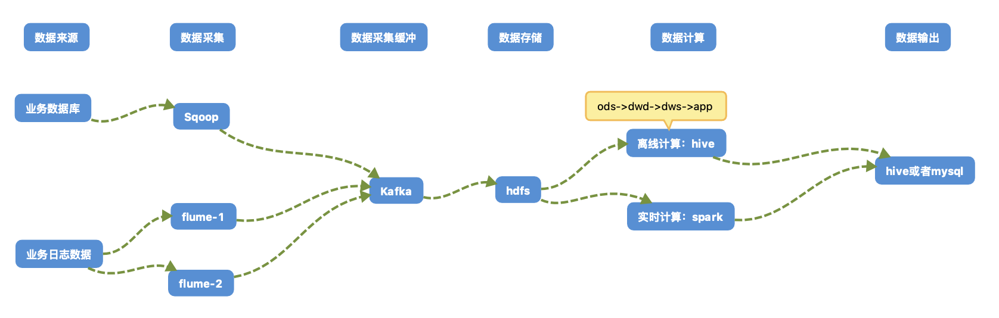

## 大数据平台之推荐系统预估设计方案


>本文内容包括如下几个章节：
>
>1, 项目需求分析
>
>2, 技术选型
>
>3, 系统架构图
>
>4, 集群框架及版本选型
>
>5, 集群服务器选型
>
>6, 集群规模预估设计
>
>7, 集群服务分配规划
>
>8, 平台的基准测试


* 整体系统流程图如下：


## 1, 项目需求分析

* 数据采集平台搭建
* 实现用户行为数据仓库和业务数据仓库的分层搭建
* 在数据仓库的基础上对数据指标进行分析
* 通过spark-ml(机器学习库)进行推荐模型训练和相似度计算


## 2, 技术选型

### 2.1, 推荐方案：

| 模块         | 使用技术                                  |
| ------------ | ----------------------------------------- |
| 数据采集传输 | Flume，Kafka，Sqoop                       |
| 数据存储     | Mysql(业务数据存储)，HDFS(分布式计算存储) |
| 数据计算     | Hive，Spark                               |
| 数据输出     | Hive，mysql                               |
| 数据查询     | Presto                                    |


### 2.2, 备用方案：

* 这个数据模块备用方案
* 根据具体业务，如果上述某个模块或者全部模块不实用，可以从如下本选中选出适合的方案

| 模块         | 使用技术              |
| ------------ | --------------------- |
| 数据采集传输 | DataX，Logstach       |
| 数据存储     | HBase，Redis，MongoDB |
| 数据计算     | Flink，Storm          |
| 数据输出     | Hive，mysql           |
| 数据查询     | Impala，Kylin         |


## 3, 系统架构图

> 注：这个一个初步的设计方案
>
> ​		具体方案实施需要和后端人员进行详细交互最后协商确定最终的解决方案
>
> ​		备用方案的流程图和推荐方案等价，替换对应模块的技术即可





## 4, 集群框架及版本选型

### 4.1, 框架选型

#### 4.1.1, Apache原生框架：(不推荐使用)

* 优点：
  * 灵活性大

* 缺点：
  * 需要专业的运维人员，运维比较复杂。
  * 组件间兼容性需要自己调研
  * 一般大厂使用，技术实力雄厚，有专业的运维人员

#### 4.1.2, CDH：(推荐度：五星)

* 优点
  * 占有国内大部分市场份额(预估60%-80%左右)
  * 免费使用
  * 不需要专业运维人员，组间兼容性不需要专业维护
* 缺点
  * 代码不开源
  * 不过对中小型的大数据需求并无任何影响

#### 4.1.3, HDP：(推荐度：三星)

* 优点：
  * 代码开源，可以进行二次开发
* 缺点
  * 没有CDH稳定
  * 国内使用较少


### 4.2, 具体版本型号

> 使用CDH的话，可以选择CDH2.6.2， CDH2.12.1， 这两个版本我均使用过，非常稳定，具体组件的版本均可默认，spark版本建议单独升级到2.1.0或者至少2.0以上版本


## 5, 集群服务器选型

> 物理机还是云主机？
>
> 根据我们公司具体情况，我推荐使用云主机

### 5.1, 机器成本考虑

* 物理机：
  * 以128G内存，20core-CPU，40线程，8THDD和2TSSD硬盘，戴尔品牌单台报价4W出头，还需要考虑托管服务器费用，一般物理机使用寿命5年以上
* 云主机：以阿里云为例，差不多相同配置，每年5W

5.2, 运维成本考虑

* 物理机：
  * 需要专业的运维人员
* 云主机：
  * 基本大部分运维工作由阿里云(或其他归属公司)完成，运维相对简单


## 6, 集群规模预估设计

### 6.1, 确定集群规模

* 我们公司的日活在10万左右

* 该方案是在日活10万用户的条件下大致判断出来的
* 注：这个只是个大概预估，具体可能还需要根据具体的进行判断分析

```shell
1, 每天日活用户10万，每人一天平均100条：10万*100 = 1000万条数据
2, 每条日志预估1K左右，每天1000万条：1000 0000 /1024/1024 = 约10G
3, 以一年到两年不扩容服务器来算：10G*720 = 7200G，也就是7.2T左右
4, 保存副本2份，7.2T*3 = 21.6T
5, 服务器至少预留20-30%，21.6/0.7 = 约30.8T
6, 所以集群大约需要30.8T的存储空间
7, 按照8T的服务器的话，大概需要3-4台左右
```

### 6.2, 考虑数仓分层

* 考虑到分层，服务器可能还需要扩容1-2倍


## 7, 集群服务分配规划

* 该规划是测试服务器规划
* 生产服务器因为数量会比较多，不知道数量的情况下，规划出来意义不大，但规划的准则和测试类似

| 服务名称           | 子服务                | 服务器01 | 服务器02 | 服务器03 |
| ------------------ | --------------------- | -------- | -------- | -------- |
| HDFS               | NameNode              | √        |          |          |
|                    | DataNode              | √        | √        | √        |
|                    | 2ndNameNode           |          |          | √        |
| Yarn               | NodeManager           | √        | √        | √        |
|                    | Resourcemanager       |          | √        |          |
| Zookeeper          | Zookeeper Server      | √        | √        | √        |
| Flume(采集日志)    | Flume                 | √        | √        |          |
| Kafka              | Kafka                 | √        | √        | √        |
| Flume（消费Kafka） | Flume                 |          |          | √        |
| Hive               | Hive                  | √        |          |          |
| MySQL              | MySQL                 | √        |          |          |
| Sqoop              | Sqoop                 | √        |          |          |
| Presto             | Coordinator           | √        |          |          |
|                    | Worker                |          | √        | √        |
| Azkaban            | AzkabanWebServer      | √        |          |          |
|                    | AzkabanExecutorServer | √        |          |          |
| Druid              | Druid                 | √        | √        | √        |
| 服务数总计         |                       | 13       | 8        | 8        |


## 8, 平台的基准测试

## 8.1, hdfs的基准测试

### 8.1.1, 测试HDFS写性能

- 在cdh中：/opt/cloudera/parcels/CDH/jars/hadoop-mapreduce-client-jobclient-2.6.0-cdh5.12.1-tests.jar
- 测试内容：向HDFS集群写10个128M的文件
- 测试完成后会发现hdfs的根目录下多了一些文件：在目录/benchmarks/TestDFSIO下面

```shell
# 原生
hadoop jar /opt/module/hadoop-2.7.2/share/hadoop/mapreduce/hadoop-mapreduce-client-jobclient-2.7.2-tests.jar TestDFSIO -write -nrFiles 10 -fileSize 128MB

# cdh中测试
hadoop jar /opt/cloudera/parcels/CDH/jars/hadoop-mapreduce-client-jobclient-2.6.0-cdh5.12.1-tests.jar TestDFSIO -write -nrFiles 10 -fileSize 128MB
```


### 8.1.2, 测试HDFS的读性能

- 和写入测试用的是同一个jar包

```shell
# cdh中测试
hadoop jar /opt/cloudera/parcels/CDH/jars/hadoop-mapreduce-client-jobclient-2.6.0-cdh5.12.1-tests.jar TestDFSIO -read -nrFiles 10 -fileSize 128MB
```


### 8.1.3, 删除刚才测试产生的数据

```shell
hadoop jar /opt/cloudera/parcels/CDH/jars/hadoop-mapreduce-client-jobclient-2.6.0-cdh5.12.1-tests.jar TestDFSIO -clean
```


### 8.2, kafka及压力测试

#### 8.2.1, 生产能力测试

```shell
# 生产能力测试命令如下：
/opt/cloudera/parcels/KAFKA/bin/kafka-producer-perf-test --topic test --record-size 100 --num-records 100000 --throughput 1000 --producer-props bootstrap.servers=centos01:9092,centos01:9092,centos01:9092
```

说明：record-size是一条信息有多大，单位是字节。num-records是总共发送多少条信息。throughput 是每秒多少条信息。

#### 8.2.2, 消费能力测试

```shell
# 消费能力测试如下
/opt/cloudera/parcels/KAFKA/bin/kafka-consumer-perf-test --broker-list  centos01:9092,centos02:9092,centos03:9092 --topic test --fetch-size 10000 --messages 10000000 --threads 1

# --fetch-size 指定每次fetch的数据的大小
# --messages 总共要消费的消息个数
```


