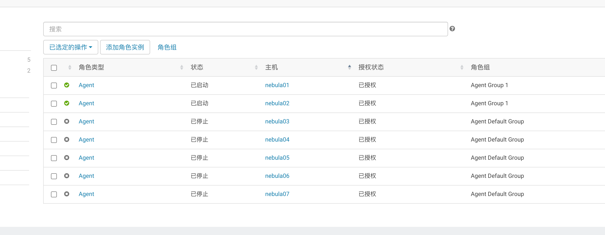

[toc]

## 1, 先关闭yanagishima-18.0

* nebula01

```shell
ps -ef | grep yanagishima
# 端口是29003
# kill -9 29003
# 关闭yanagishima的标准方法
bin/yanagishima-shutdown.sh

# 打开
nohup bin/yanagishima-start.sh >y.log 2>&1 &
```


## 2, 关闭presto

* nebula02(主/从)
* nebula03(从)
* nebula04(从)
* nebula05(从)

```shell
# 我们这里后台启动
/usr/local/presto-server/bin/launcher start
/usr/local/presto-server/bin/launcher stop
/usr/local/presto-server/bin/launcher restart

# 如果想要打印出日志信息到控制台，可以使用如下命令
/usr/local/presto-server/bin/launcher run
```


## 3, 关闭kafka-eagle

* nebula02上

```shell
# 启动命令
/usr/local/kafka-eagle/bin/ke.sh start

# 关闭命令
/usr/local/kafka-eagle/bin/ke.sh stop
```


## 4, kafka-manager关闭

* nebula03上

```shell
# 配置文件的路径最好写绝对路径，要不然可能会有问题
# 后台启动，也可以指定端口等
nohup /usr/local/kafka-manager/bin/kafka-manager -Dconfig.file=/usr/local/kafka-manager/conf/application.conf  -Dapplication.home=. -Dhttp.port=9099 &

nohup /usr/local/kafka-manager/bin/kafka-manager -Dconfig.file=/usr/local/kafka-manager/conf/application.conf  -Dapplication.home=. -Dhttp.port=9099 > /dev/null 2>&1 & 


ps -ef | grep kafka-manager

# 端口号是9802
kill -9 9820
```


## 关闭druid

* nebula02

```shell
nohup /usr/local/druid/bin/supervise  -c /usr/local/druid/conf/supervise/quickstart.conf > /data/druid/logs/log.txt 2>&1 &

/usr/local/druid/bin/service --down
```


## 关闭canal

* nebula03

```shell
# 启动canal
/usr/local/canal/bin/startup.sh

# 关闭canal
/usr/local/canal/bin/stop.sh

# 日志相关位置
less /usr/local/canal/logs/canal/canal.log
less /usr/local/canal/logs/example/example.log
```


## 5, superset关闭

* nebula02上

```shell
# 启动命令
# To start a development web server on port 8088, use -p to bind to another port
nohup /usr/local/python3.7/bin/superset run -p 8089 -h 0.0.0.0 --with-threads &


# 关闭命令
ps -ef | grep superset
# 进程号是7075
kill -9 7075
```


## 6, 关闭cm等

注意：flume启动nebula01, nebula02即可



* nebula01(主)
* nebula02(主)
* nebula03(从)
* nebula04(从)
* nebula05(从)
* nebula06(从)
* nebula07(从)

```shell
# 1，页面关闭cm
# 2，页面关闭cdh集群
# 3, 服务器上关闭相关的进程

/opt/cloudera-manager/cm-5.12.1/etc/init.d/cloudera-scm-server start
imcall.sh /opt/cloudera-manager/cm-5.12.1/etc/init.d/cloudera-scm-agent start


/opt/cloudera-manager/cm-5.12.1/log/cloudera-scm-server/cloudera-scm-server.log
/opt/cloudera-manager/cm-5.12.1/log/cloudera-scm-agent/cloudera-scm-agent.log


imcall.sh /opt/cloudera-manager/cm-5.12.1/etc/init.d/cloudera-scm-agent stop
/opt/cloudera-manager/cm-5.12.1/etc/init.d/cloudera-scm-server stop
```


```
nohup /usr/local/druid/bin/supervise  -c /usr/local/druid/conf/supervise/quickstart.conf > /data/druid/logs/log.txt 2>&1 &


/usr/local/druid/bin/service --down
```


