[TOC]


* 一些配置参考，一些问题等等

https://blog.csdn.net/u011026329/article/details/79167722


## 02, cdh的安装


a关键步骤直接截图内容表示，有些没有表示的部分随意选择即可

* 如果有图中哪些和你的不一样，说明之前的步骤应该有问题，排查一下

### 1, 选择Cloudera Express

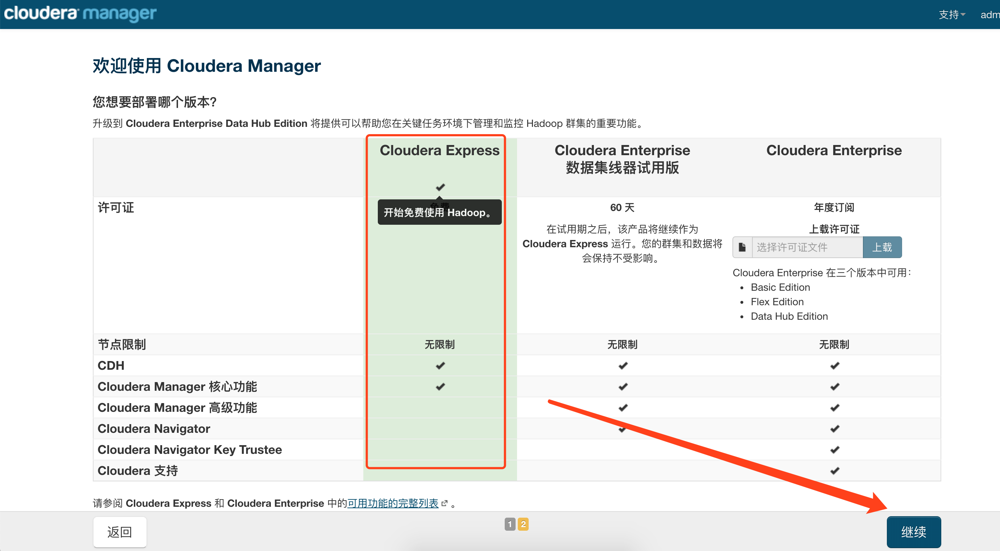


### 2, 选择当前管理的主机

这里如果不一样，说明之前的步骤应该是有问题的，先排查一下吧！

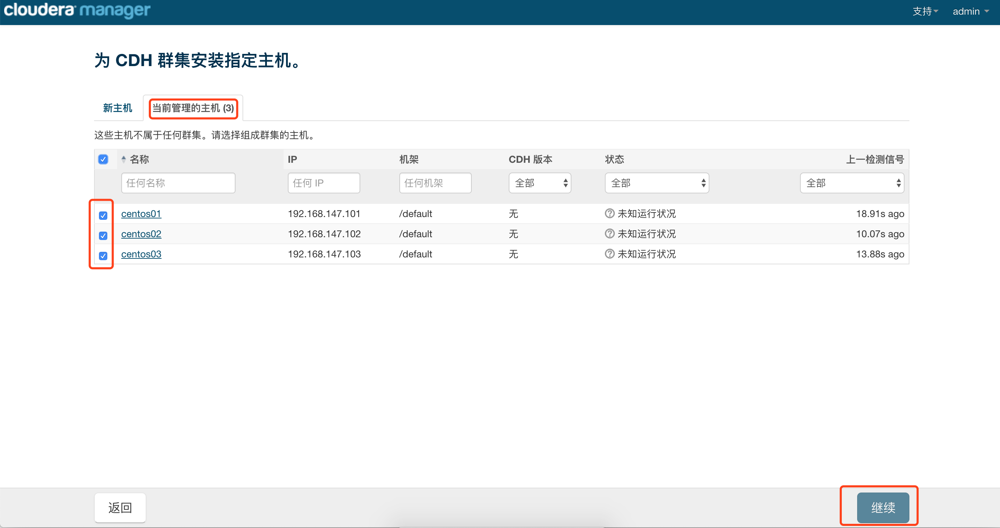


### 3, 选择之前放入到parcel-repo文件夹到parcel版本离线安装

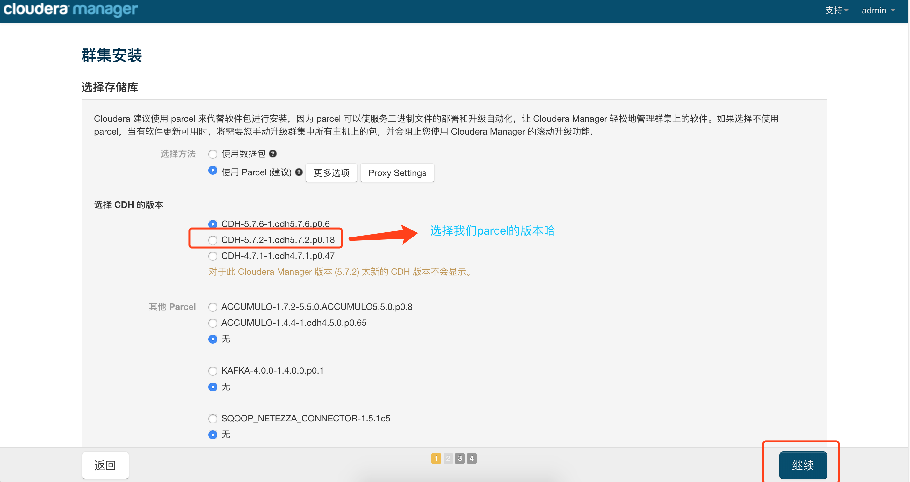


### 4, 安装进度

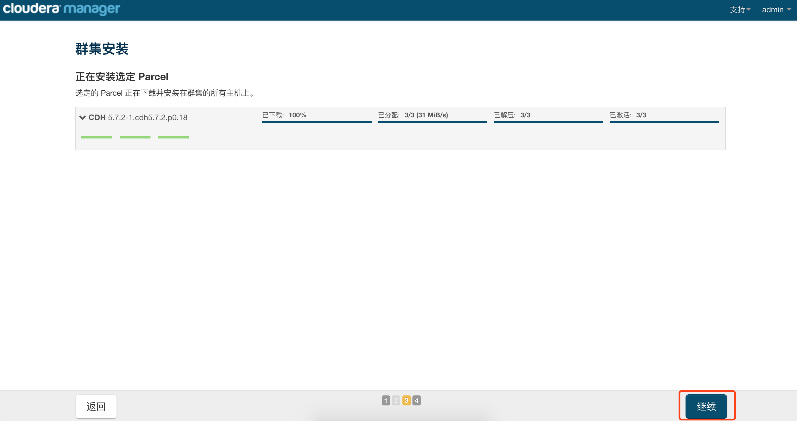


### 5, 验证检查，如果问题，按提示解决

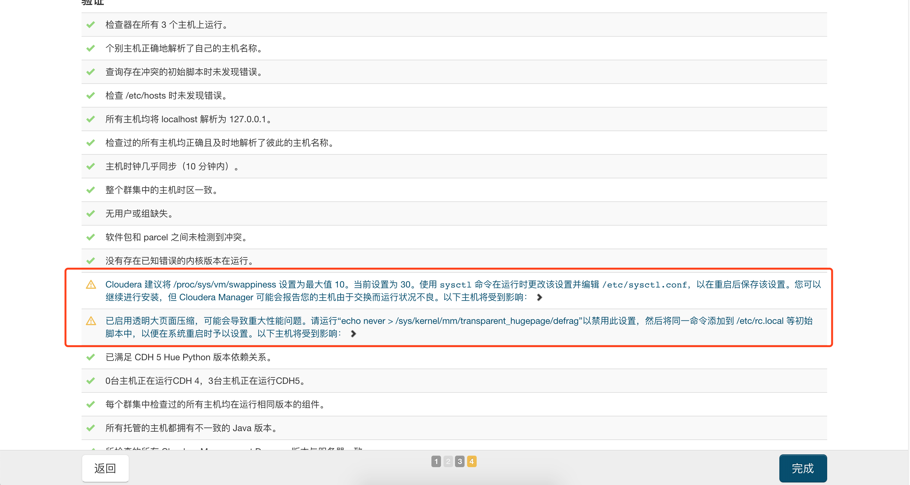


### 6, 默认有两个警告解决办法

#### 6.1, 警告1：swappiness

**Cloudera 建议将 /proc/sys/vm/swappiness 设置为最大值 10。当前设置为 30**--解决方法：

* 临时修改:

```shell
sysctl vm.swappiness=10
cat /proc/sys/vm/swappiness
```

这里我们的修改已经生效，但是如果我们重启了系统，又会变成60.

**永久修改：**

在`/etc/sysctl.conf` 文件里添加如下参数：

```shell
vm.swappiness=10
```

或者：

```shell
echo 'vm.swappiness=10'>> /etc/sysctl.conf
```


#### 6.2, 警告2：透明大页面压缩

**已启用透明大页面压缩,可能会导致重大性能问题。请运行“echo never > /sys/kerne**—解决办法：

```shell
echo never > /sys/kernel/mm/transparent_hugepage/defrag
echo never > /sys/kernel/mm/transparent_hugepage/enabled

echo 'echo never > /sys/kernel/mm/transparent_hugepage/defrag' >> /etc/rc.d/rc.local
echo 'echo never > /sys/kernel/mm/transparent_hugepage/enabled' >> /etc/rc.d/rc.local

# 注意可能需要执行如下语句，否则可能开机之后又启动了。
# 下面这个是开机启动文件，写入的内容在开机的时候会执行
chmod +x /etc/rc.d/rc.local
```


### 7, 选择CDH的组合

重新检查后没有警告了，然后继续往下走：

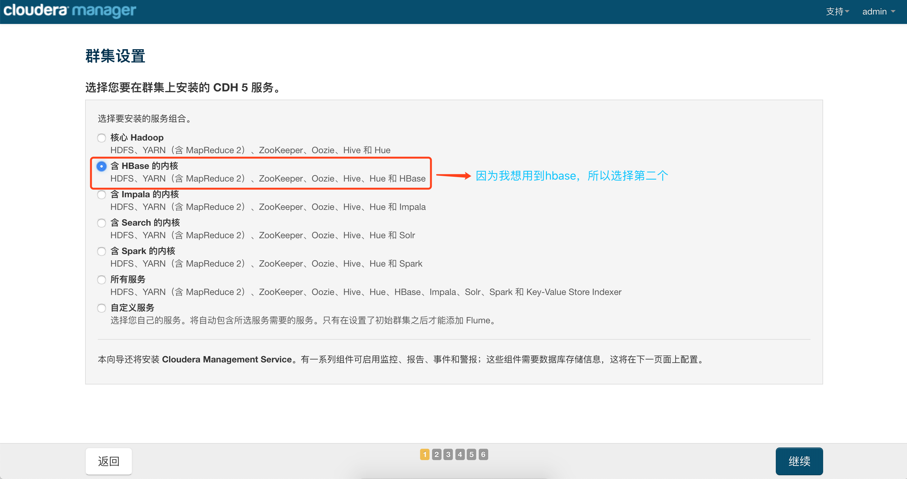


### 8, 角色分配

> 注意：Hbase Thrift Server最好选择和Hue相同服务器，如果这里不选择，后续如果需要用hue连接hbase，依然需要安装，具体看最后的警告解决部分

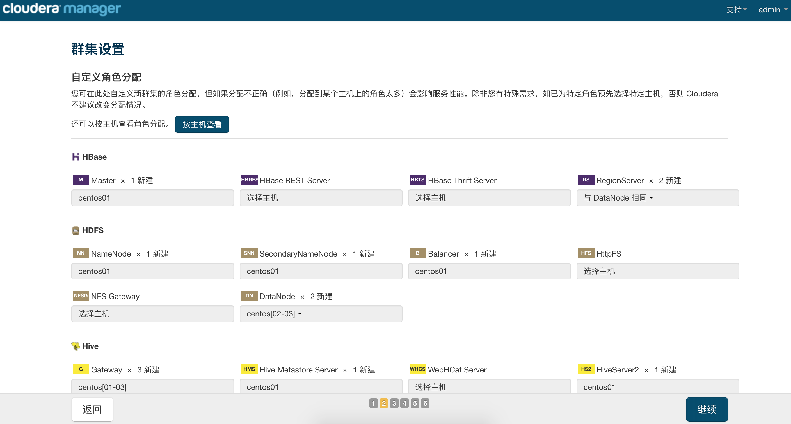


### 9, 选择zk服务器

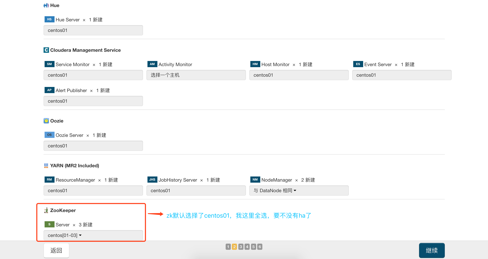


### 10, 集群hive和oozie的数据库设置

> 注意：页面中有数据库创建的链接，最好按照指定方式创建，要不后续oozie会出现问题，具体看后续错误解决部分

```sql
-- hive的创建数据库操作
create database hive default character set utf8;
grant all privileges on hive.* to 'hive'@'localhost' identified by 'hive';
grant all privileges on hive.* to 'hive'@'%' identified by 'hive';

-- hue的创建数据库操作
create database hue default character set utf8;
grant all privileges on hue.* to 'hue'@'localhost' identified by 'hue';
grant all privileges on hue.* to 'hue'@'%' identified by 'hue';

-- oozie的创建数据库操作
create database oozie default character set utf8;
grant all privileges on oozie.* to 'oozie'@'localhost' identified by 'oozie';
grant all privileges on oozie.* to 'oozie'@'%' identified by 'oozie';

-- 刷新权限
flush privileges;


-- oozie的创建数据库操作，hive也按照这种方式来，如果不这样，后续会出现我后面oozie安装失败的错误哈
-- hive用root用户创建也ok，hive不报错的，但是oozie必须要用oozie用户创建
$ mysql -u root -p
Enter password:

mysql> create database oozie default character set utf8;
Query OK, 1 row affected (0.00 sec)

mysql>  grant all privileges on oozie.* to 'oozie'@'localhost' identified by 'oozie';
Query OK, 0 rows affected (0.00 sec)

mysql>  grant all privileges on oozie.* to 'oozie'@'%' identified by 'oozie';
Query OK, 0 rows affected (0.00 sec)

mysql> exit
Bye


flush privileges;

-- 注意：这里其实不是必须的
// 注意：这里放一下，每个节点都放置一下
-- 然后需要拷贝/usr/share/java/mysql-connector-java.jar到/var/lib/oozie/目录下
```


注意：⚠️：高版本的这里需要设置hue的数据库，如果hue的数据库始终报错：

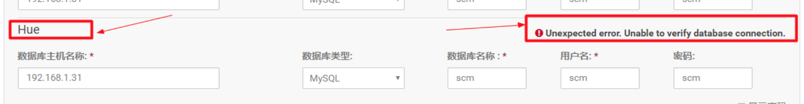

```java
Unexpected error. Unable to verify database connection
```

很有可能是java的原因，因为数据库验证是通过java命令调用jar包来执行的，我因为jdk的安装包放置到了移动硬盘，然后又放回来的原因，导致解压后没有bin目录下没有执行权，导致这里失败，搞了整整一天！！！下次如果再次遇到，需要注意！！！⚠️

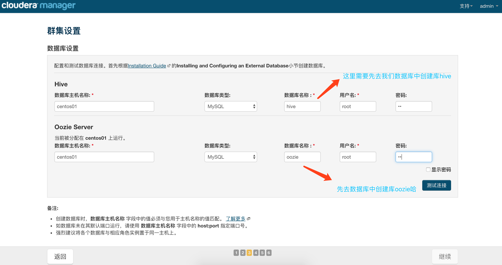


### 11, 默认配置即可

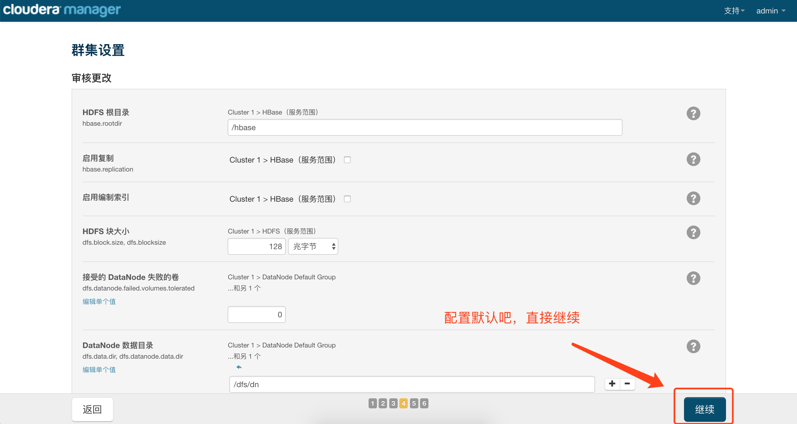


### 12, 安装进度

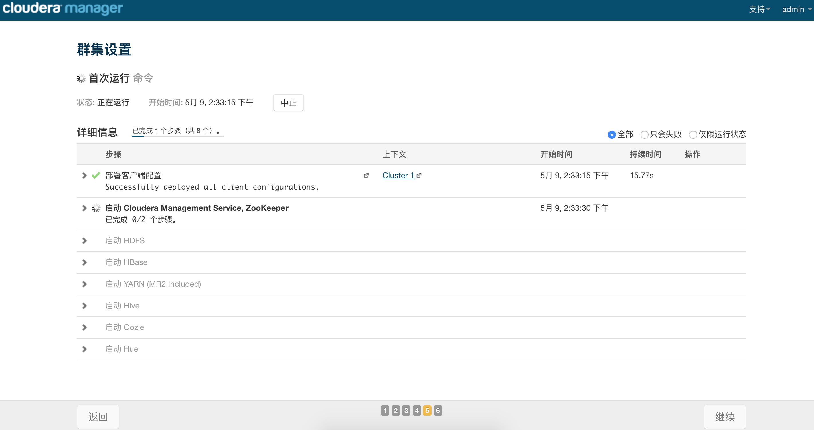


### 13, 错误解决1: oozie安装失败

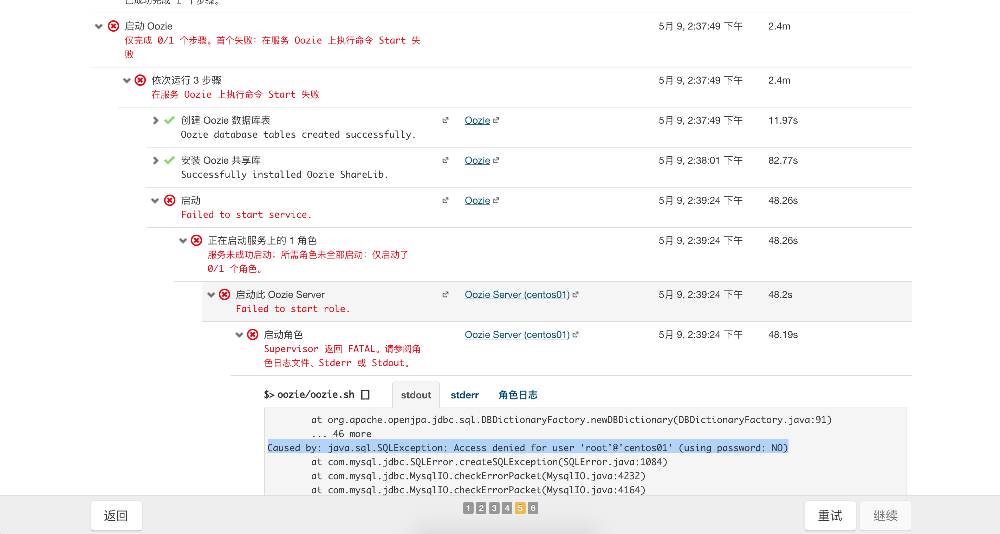


```sql

```


> 错误原因：10步中创建oozie库方式不对，具体解决步骤参看下图

出现这个问题是应为没有赋予oozie用户权限，重新回到前面的页面：

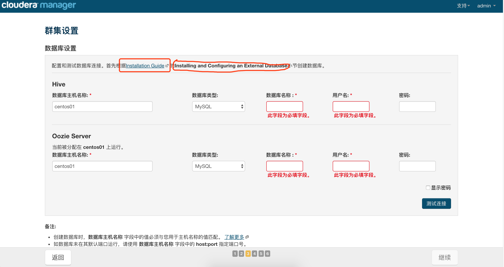

根据页面链接， 我找到了那个章节：

https://www.cloudera.com/documentation/enterprise/5-7-x/topics/install_oozie_ext_db.html#concept_dkp_xh4_hp

具体内容如下：

#### Configuring MySQL for Oozie


#### Install and Start MySQL 5.x

See [MySQL Database](https://www.cloudera.com/documentation/enterprise/5-7-x/topics/cm_ig_mysql.html#cmig_topic_5_5).


#### Create the Oozie Database and Oozie MySQL User

For example, using the MySQL mysql command-line tool:

```
$ mysql -u root -p
Enter password:

mysql> create database oozie default character set utf8;
Query OK, 1 row affected (0.00 sec)

mysql>  grant all privileges on oozie.* to 'oozie'@'localhost' identified by 'oozie';
Query OK, 0 rows affected (0.00 sec)

mysql>  grant all privileges on oozie.* to 'oozie'@'%' identified by 'oozie';
Query OK, 0 rows affected (0.00 sec)

mysql> exit
Bye
```


#### Add the MySQL JDBC Driver JAR to Oozie

Copy or symbolically link the MySQL JDBC driver JAR into one of the following directories:

- For installations that use *packages*: /var/lib/oozie/
- For installations that use *parcels*: /opt/cloudera/parcels/CDH/lib/oozie/lib/

directory.

**Note:** You must manually download the MySQL JDBC driver JAR file.


#### **翻译总结：**

* 上面的内容很清楚了，主要有两点：

  * 1， 要创建数据库，并赋予oozie用户登陆权限

    ```sql
    create database oozie default character set utf8;
    grant all privileges on oozie.* to 'oozie'@'localhost' identified by 'oozie';
    grant all privileges on oozie.* to 'oozie'@'%' identified by 'oozie';
    ```

    

  * 2，拷贝mysql的connector的jar包到oozie的目录下(其实这步不做应该也可以，好像会是自已拷贝的)

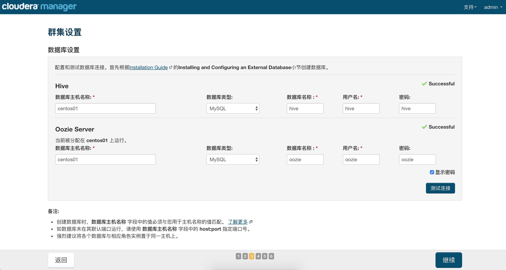


### 14, 重跑即可

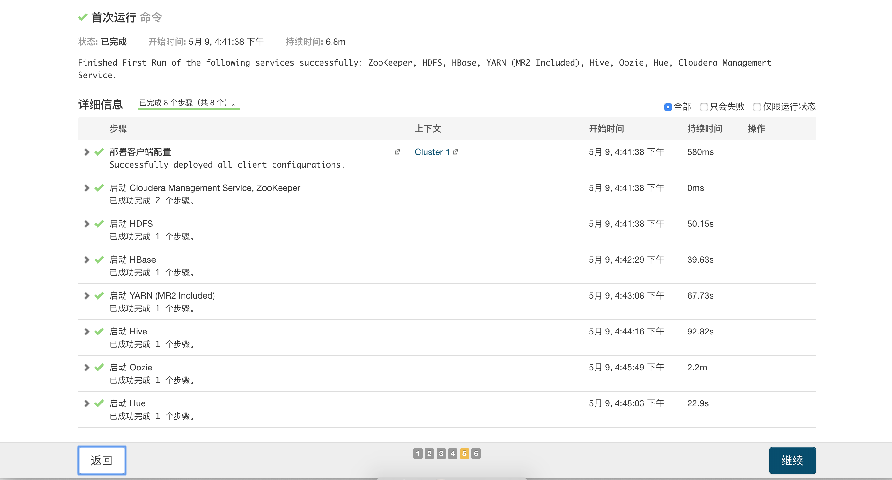


### 15，成功

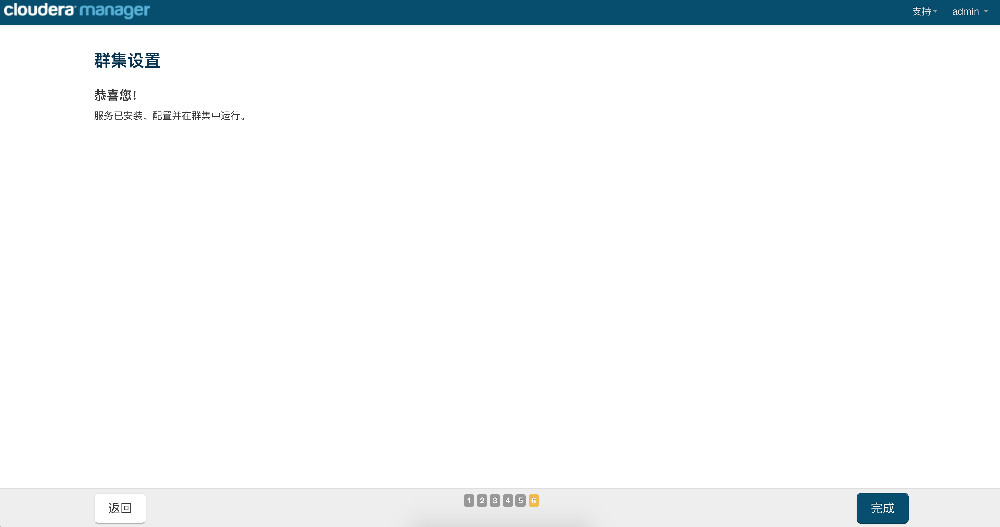


### 16，警告解决

对了，默认安装可能在hue中用不了hbase, 因为Thrift  Server没有选择服务器，会有如下警告：

#### 16.1,  Hue警告: 必须在 HBase 服务中配置 Thrift Server 角色以使用 Hue HBase Browser 应用程序。

解决办法：

给HBase添加Thrift Server角色, 为了方便, 将Thrift Server添加到Hue同一主机

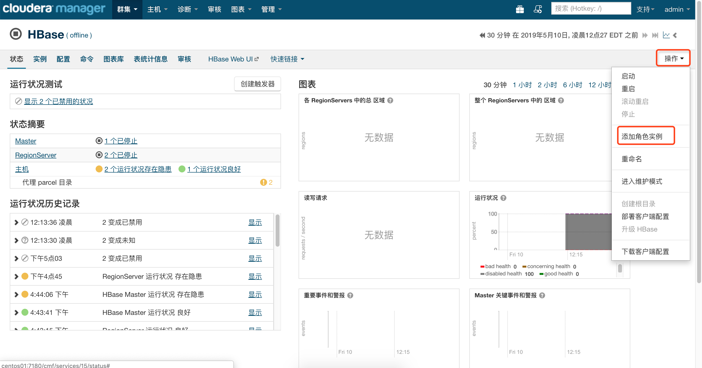

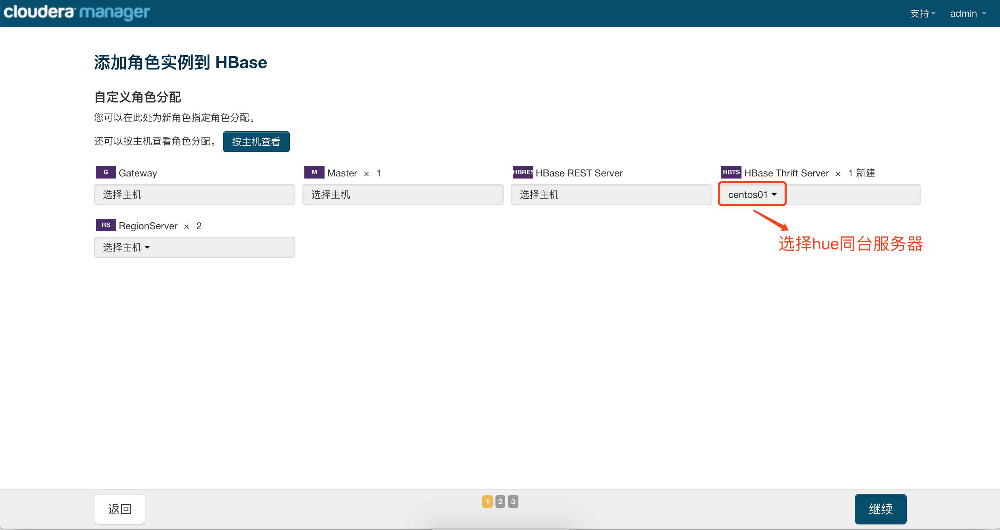

重启集群后警告会变成：在 HBase Thrift Server 属性中选择服务器以使用 Hue HBase Browser 应用程序

那么在hue的配置页面开启即可，如下图，重启！

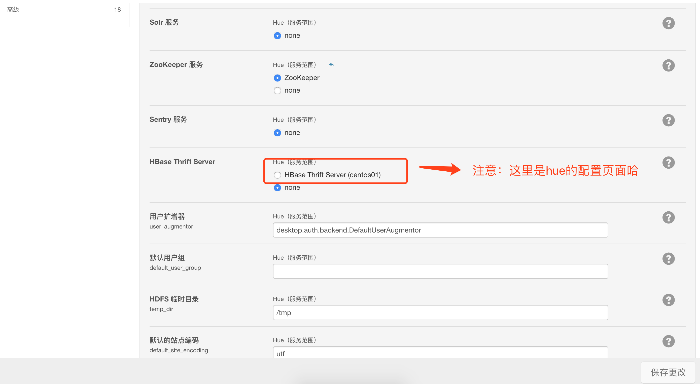


### 17, 提示

#### 如果重新安装：一定要删除ysql中的cdh库哈！


### 18, “大数据项目之电商数仓”其他配置

#### 18.1, 关闭hdfs权限检查，防止上传文件出错，不要随意关闭哈

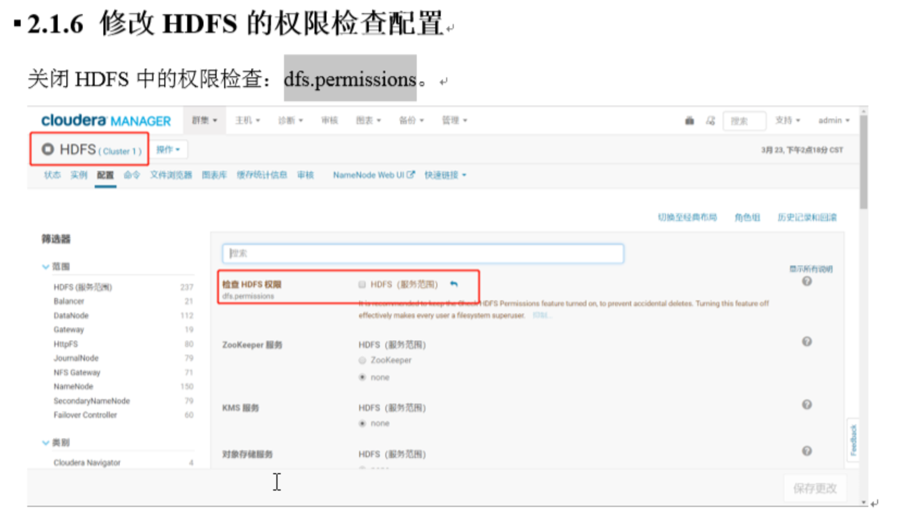

#### 18.2, 配置LZO压缩支持

* 具体参考教程或者教程中的文档

* https://www.cnblogs.com/zhzhang/p/5695027.html
* 这个是centos7上的配置地址哦
* http://archive.cloudera.com/gplextras5/parcels/5.12.1/

* 1, 首先在parcel设置中添加lzo的parcel地址
  * http://archive.cloudera.com/gplextras5/parcels/5.12.1/
  * 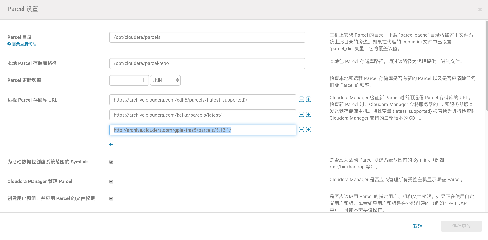
* 2, 然后在parcel里下载，分配，激活
  * 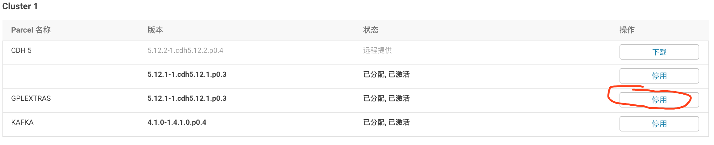
* 3, 配置hdfs支持lzo
  * io.compression.codecs
  * com.hadoop.compression.lzo.LzoCodec
  * com.hadoop.compression.lzo.LzopCodec
  * 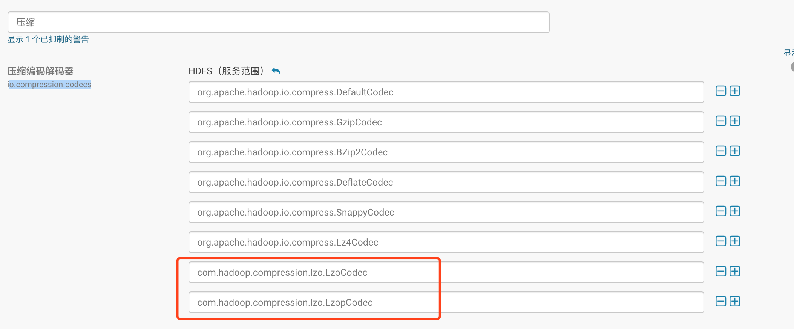
* 4, 配置yarn支持lzo
  * mapreduce.application.classpath
  * /opt/cloudera/parcels/GPLEXTRAS/lib/hadoop/lib/*
  * 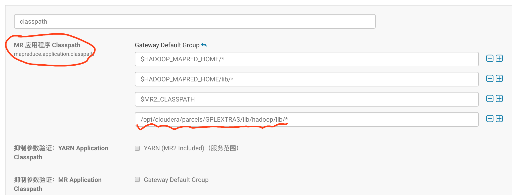
* 5, 修改MR应用程序环境变量
  * mapreduce.admin.user.env
  * /opt/cloudera/parcels/GPLEXTRAS/lib/hadoop/lib/native
  * 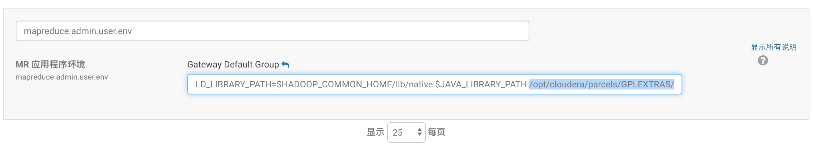