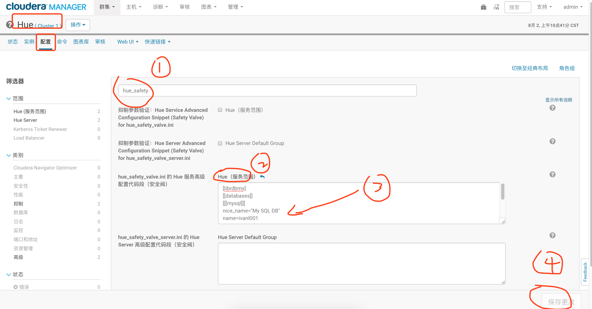

参考：

https://www.cnblogs.com/qingyunzong/p/9487952.html

https://blog.csdn.net/weixin_33693070/article/details/88437182

比较简单，直接更改hue设置，然后重启即可



* 我数据库填写hue，hue是ok的，填写root，不知道是不是密码有特殊字符，所以不行
* 最后填写hue，然后更改了hue用户的权限是可以的
* 但是⚠️注意：连接之后查询的时候总是有些问题，比如select * 有些表都不好用，所以这个功能只当是测试吧， 感觉基本没啥用

> hue_safety

```java
[librdbms]
[[databases]]
[[[report_system]]]
nice_name=report_system
name=azazie_report
engine=mysql
host=report-system.cbb0nles4v8i.us-east-1.rds.amazonaws.com  
port=3306
user=admin
password=Jde27dePlWbx32aMTr
[[[azazie]]]
nice_name=azazie
name=azazie
engine=mysql
host=azaziedbslave.cbb0nles4v8i.us-east-1.rds.amazonaws.com
port=3306
user=aztech1
password=8m4UquCBkNYn
```


然后重启即可