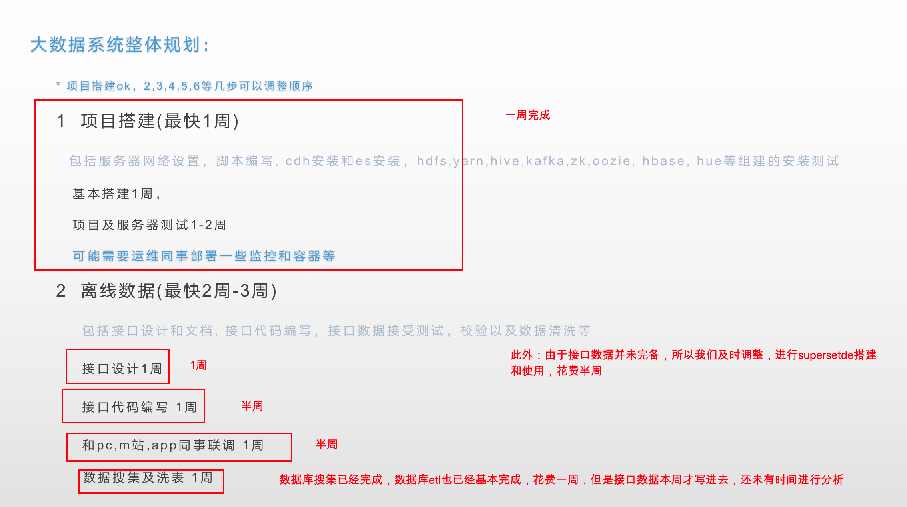
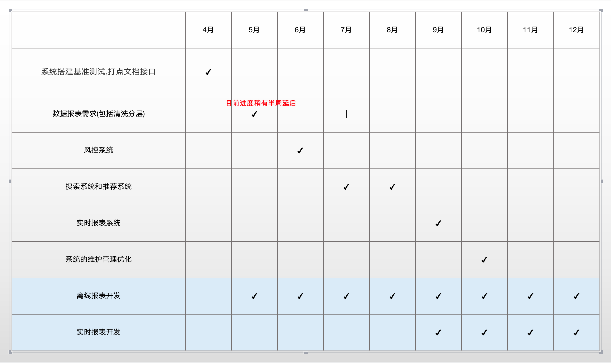
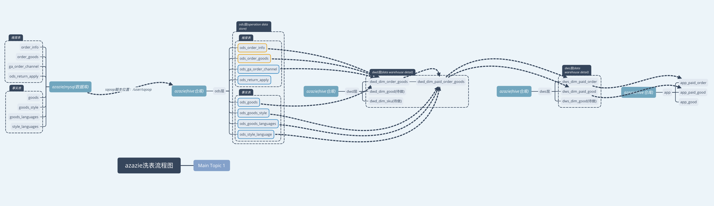

[toc]

## 1, 当前工作进度

### 1.1, 具体任务及时间花费

| 原计划任务                        | 实际花费       | -                                           |
| --------------------------------- | -------------- | ------------------------------------------- |
| 1, 项目搭建(最快1周)              | 1周            | 完成                                        |
| 2, 离线数据:接口设计(1周)         | 1周            | 完成                                        |
| 2, 离线数据:接口代码编写(1周)     | 半周           | 完成(后续改动数次)                          |
| 2, 离线数据:和pc，m和app联调(1周) | 半周           | 未完成(目前只有m站数据写入，上周五开始写的) |
| 2, 离线数据:数据搜集及洗表(1周)   | 1周半          | 数据库数据已经基本搞定，接口数据未完成      |
| superset的安装和使用              | 2天            | 这个是临时追加的，完成                      |
| bi报表系统维护和开发              | 时间不定，数天 | 老的报表开发任务                            |





### 1.2, 当前进度

> 当前进度稍微延后半周，整体进度在把控中





## 2, 第一个月工作内容详细


| 安排                              | 是否完成              | 遇到问题                                                     |
| --------------------------------- | --------------------- | ------------------------------------------------------------ |
| 1, 集群的安装和测试               | 完成                  | flume搜集多个topic(已解决)                                   |
| 2, 埋点文档的编写                 | 完成                  | 中途修改3次                                                  |
| 3, 埋点接口代码编写调试等         | 完成                  |                                                              |
| 4, 数据库数据分析及初步搜集       | 完成                  |                                                              |
| 5, 开会确认接口文档可用并及时调整 | 完成                  | 修改了3次接口文档及代码                                      |
| 6, 数据库数据搜集主要数据         | 完成                  | 后续需要根据产品需需求搜集其他必要的数据                     |
| 7, 同其他技术进行接口联调         | 初步完成(B站已经上传) | 初步完成                                                     |
|                                   | (A站数据还没有人写)   |                                                              |
| 8, 数据库数据的etl分析导出        | 完成                  |                                                              |
| 9, 接口数据分析                   | 否                    | 数据上周五进行生产环境写入，目前还未有时间进行分析，还需要至少一周时间 |
| 10, superset的安装使用            | 完成                  | 已出了部分报表，但是是我本人测试，需要让产品使用起来         |
| 11, 接口数据分析                  | 否                    | 数据刚刚写入，所以只能临时调整进行superset的安装测试和使用等 |
|                                   |                       |                                                              |


## 3, 结果效果展示

集群：

http://cdh.opsfun.com:7180/cmf/login


调度系统：

http://cdh.opsfun.com:8889/oozie/list_oozie_coordinators/x


分析查询系统：

http://cdh.opsfun.com:8889/notebook/editor?type=hive

http://cdh.opsfun.com:8089/


接口系统文档：

https://collect-test.azazie.cn/swagger-ui.html

接口文档和etl分析文档：

具体见脑图和md文档等(接口文档参考接口文档)




superset自定义维度系统(页面展示系统)：

http://nebula02:8089/superset/dashboard/5/


## 4, 目前遇到问题及建议

```shell
1, 工作比较被动，由于大家事情都很多， 所以工作对接不固定， 没有特定的人进行工作对接(是否可以)
2，琐碎的事情比较多，即需要开发新的系统，又需要维护和开发老的报表系统
3，时间太紧，有一些技术上的问题暂时无法进行最优化的选择
4, 最近网络问题一直存在，有时候比较头疼
```


## 5, 后续工作安排

```shell
1, 在1-2周内，完成接口数据的核心数据分析
2，在短期内推展supserset的使用
3，抽出一些时间进行技术的优化调整，尽量按照最优解进行技术的搭建
4，找前端进行前端开发？如果需要的话我这边需要尽快起接口了
```

