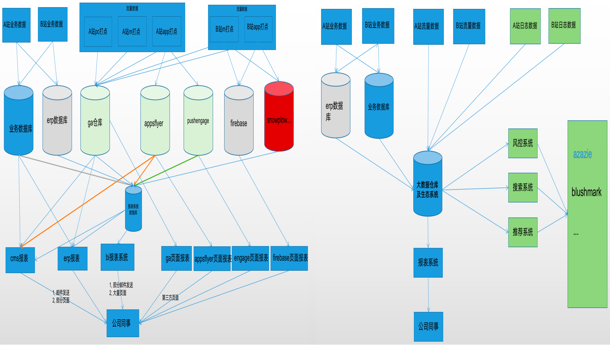

## 1, 当前工作进度

### 1.1, 具体任务及时间花费

| 原计划任务                  | 实际花费                          | -    |
| --------------------------- | --------------------------------- | ---- |
| 1, 基础数据的进一步清洗分层 | 1-2周                             |      |
| 2, 报表标准维度开发         | 报表开发时长基本一张半天到1天     |      |
|                             | 目前已做报表：                    |      |
|                             | 用户数及日活报表(上月已做)，      |      |
|                             | 留存报表，                        |      |
|                             | 新增设备及session报表(上月已做)， |      |
|                             | 订单商品报表(上月已做)，          |      |
|                             | 沉默用户报表                      |      |
|                             | 商品销量排行榜报表，              |      |
|                             | 页面转化报表，                    |      |
|                             | 所有埋点事件统计报表              |      |
|                             | 实时订单及其增长报表              |      |
|                             | 实时用户数,sessions数及其增长报表 |      |
|                             | url时长报表                       |      |
| 3, 报表指定维度汇总开发     | 报表开发时长基本一张1天到2天      |      |
|                             | 目前已做报表：                    |      |
|                             | 分布分析报表                      |      |
|                             | 商品销量点击率报表                |      |
|                             | 上新数据报表                      |      |
|                             | 品类颜色关注度报表                |      |
| 4， 风控系统调研            | 1天                               |      |
| 5,  AI组数据协助开发        | 3天                               |      |
|                             |                                   |      |
|                             |                                   |      |


### 1.2, 流程规范




### 1.3, 文档规范

00-业务术语.md

01-埋点系统标准文档.md

05-nebulas各表字段介绍.md

07-大数据平台报表相关打点规则.md

http://cdh2.opsfun.com:8089/superset/dashboard/15/

http://cdh2.opsfun.com:8089/superset/dashboard/12/


### 1.4, prd规范


## 2, 解决了哪些痛点


### 2.1, 数据可以进行准确校验，可以排查明显的错误数据


### 2.2, 可以帮助产品可视化第三方数据


## 3, 工作结果展示

### 3.1, 留存分析

http://cdh2.opsfun.com:8089/superset/dashboard/11/


### 3.2, 实时表及b站dashboard表

[http://cdh2.opsfun.com:8089/superset/dashboard/blushmark/?preselect_filters=%7B%2265%22%3A%20%7B%22__time_range%22%3A%20%22Last%20week%22%7D%2C%20%2288%22%3A%20%7B%22country%22%3A%20%5B%22US%22%5D%2C%20%22__time_range%22%3A%20%22Last%20day%22%7D%7D](http://cdh2.opsfun.com:8089/superset/dashboard/blushmark/?preselect_filters={"65"%3A {"__time_range"%3A "Last week"}%2C "88"%3A {"country"%3A ["US"]%2C "__time_range"%3A "Last day"}})


### 3.3, 文档及代码流程规范


## 4, 目前存在有哪些问题


### 4.0, 无法做好把关

```shell
之前做老bi的时候，ga数据是短板，因为各种数据完全没有维度。


现在用户行为数据做了打点，但是数据库中新增了B站数据，但是由于B站的各种不规范行为导致数据不规范，使得数据库数据又成为了新的短板。

我觉得想要整体上获取最好的解决方案，我必须要把关，把不符合规范的做法给杜绝掉。
但是目前会有一个问题：
产品的思维局限在：为啥cms能做，大数据反而做不了， 为啥逻辑可行， 但是大数据做不了？就算数据不对，但是我们先做出来，慢慢再改？为啥不能通过goods_id找到cat_id然后再进行cat_id的聚合？
所以在这种强盗逻辑下，每次我都必须妥协，最后还是要按照产品提出的逻辑进行计算.

但是这样下去就又进入恶性循环：数据不规范导致性能逻辑可读性等降低，这些又会导致需要投入大量人力时间进行纠正，但是越做越大，后续就没法从根本上修改， 然后只能一个一个打补丁，然后产品会觉得以前不是也这样做了吗， 现在为啥不可以这样做，然后又提出更不合理的需求，然后接着打补丁，最后导致项目越来越烂。

所以我觉得部分我觉得不合适的东西应该先开个审核会，不能全部由产品说了算。毕竟技术的东西他们确实不在行，应该有技术决定这个方案到底可不可行。
```


### 4.1, 部分报表开发过于急躁

> B站的数据不稳定，后续更改会频繁，感觉数据部分有浪费时间
>
> 然后B站目前数据略有混乱， 部分维度不齐，比如说goods_id无法区分项目，做出来的数据都不准确，也要做
>
> 还有部分是完全没有埋点的，最好等埋点之后数据稳定了再做比较合适


### 4.2, 一直在做报表，没有太多的时间做调研及其他的代码研发

> 自从大数据系统搭建起来之后， 慢慢的就做起来报表了， 一直没断了， 这个事情本身没啥难度，不过需要时间。所以会占用大部分时间，如果一直这样做报表， 后续的风控系统及搜索推荐系统可能没有做研发调研等。


### 4.3, superset毕竟开源，本身也有部分问题，也没有太多时间进行优化维护

> 近期发现superset默认使用sqllite进行数据存储，这样好像只能单进程， 所以导致有时候打开报错，刷新马上就好。虽然不影响使用，但是总觉得有点不够好。希望能抽取部分时间进行优化


### 4.4, A站数据迟迟不进来...


### 4.5, 实时报表已经轻微展开，不过需要进一步的进行调整